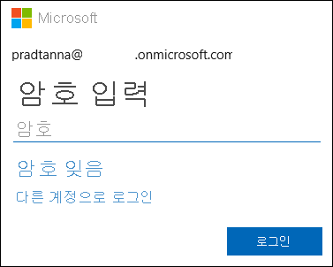

# Power BI 서비스에 로그인

[!INCLUDE[consumer-appliesto-yynn](../includes/consumer-appliesto-yynn.md)]

## Power BI 계정
Power BI에 로그인하기 전에 계정이 필요합니다. Power BI 계정을 가져오는 방법은 두 가지가 있습니다. 첫 번째는 조직이 직원을 위해 Power BI 라이선스를 구입한 경우입니다. 그리고 두 번째는 [개인이 평가판 또는 개인 라이선스에 등록](../fundamentals/service-self-service-signup-for-power-bi.md)한 경우입니다. 이 문서는 첫 번째 시나리오를 다룹니다.

## 처음으로 로그인

### 1단계: Power BI 서비스 열기
Power BI 서비스는 브라우저에서 실행됩니다. 

- 동료로부터 대시보드 또는 보고서에 대한 링크가 포함된 이메일을 받은 경우 해당 링크를 선택하여 **이 보고서 열기** 또는 **이 대시보드 열기**를 수행합니다.

        

- 또는 즐겨찾는 브라우저를 열고 **app.powerbi.com**을 입력합니다.

        

### 2단계: 이메일 주소 입력
처음 로그인하면 Microsoft는 사용자에게 이미 Microsoft 365 계정이 있는지 확인합니다. 아래 예제에서 Pradtanna는 다른 Microsoft 서비스에 대한 라이선스를 이미 보유하고 있습니다. 

암호를 입력합니다. 이것은 Microsoft 365 계정 암호입니다. Outlook, Office 같은 다른 Microsoft 제품에 사용하는 것과 동일한 이메일 및 암호입니다.  계정이 설정된 방식에 따라 이메일 또는 모바일 디바이스로 전송된 코드를 입력하라는 메시지가 표시될 수도 있습니다.   

경우에 따라 전역 관리자가 라이선스를 할당하고 이 정보가 포함된 이메일을 보냅니다. 받은 편지함에서 환영 이메일을 확인하고 지침에 따라 처음으로 로그인합니다. 로그인 시 같은 이메일 계정을 사용합니다. 
 
### 3단계: 사용 약관 검토
사용 약관을 검토하여 동의하면 확인란을 선택하고 **시작**을 선택합니다.

### 4단계: 홈 방문 페이지 검토
처음 방문 시 Power BI에서 **홈** 방문 페이지를 엽니다. **홈** 방문 페이지가 열리지 않으면 탐색 창에서 선택합니다. 

홈 방문 페이지에는 사용 권한이 있는 모든 내용이 표시됩니다. 처음에는 많은 콘텐츠가 없을 수도 있지만 동료와 함께 Power BI를 사용할 때 변경되므로 걱정하지 않아도 됩니다. 동료가 이메일을 통해 보고서를 공유한 것을 기억하나요? 이 보고서는 홈 방문 페이지의 **공유한 항목** 아래에 있습니다.

Power BI가 홈 페이지를 열지 않도록 하려면 [**주요** 대시보드 혹은 보고서](end-user-featured.md)가 대신 열리도록 설정할 수 있습니다. 

## 콘텐츠와 안전하게 상호 작용
***소비자***는 다른 사용자와 콘텐츠를 공유하고 데이터를 탐색하고 비즈니스 결정을 내리기 위해 해당 콘텐츠와 상호 작용합니다.  필터링, 슬라이스, 구독, 내보내기 및 크기 조정 시 작업이 기본 데이터 세트 또는 원래 공유 콘텐츠(대시보드 및 보고서)에 영향을 주지 않으므로 걱정하지 마세요. Power BI는 탐색하고 실험할 수 있는 안전한 공간입니다. 그렇다고 해서 변경 내용을 저장할 수 없다는 의미는 아닙니다. 하지만 이러한 변경 내용은 콘텐츠의 **사용자** 보기에만 영향을 줍니다. 그리고 단추를 클릭하기만 하면 기본 보기로 되돌릴수 있습니다.

## Power BI 서비스 로그아웃
Power BI를 닫거나 로그아웃하면 변경 내용이 저장되므로 중단한 위치를 바로 선택할 수 있습니다.

Power BI를 닫으려면 작업 중인 브라우저 탭을 닫습니다. 

 

컴퓨터를 공유하는 경우 Power BI를 닫을 때마다 로그아웃하는 것이 좋습니다.  로그아웃하려면 오른쪽 위 모서리에서 프로필 사진을 선택하고 **로그아웃**을 선택합니다.  

 

## 문제 해결 및 고려 사항
- Power BI를 개인으로 등록한 경우 등록할 때 사용한 이메일 주소로 로그인합니다.

- 일부 사용자는 둘 이상의 계정으로 Power BI를 사용합니다. 이러한 경우 로그인할 때 목록에서 계정을 선택 하라는 메시지가 표시됩니다. 

## 다음 단계
[Power BI 앱 보기](end-user-app-view.md)
