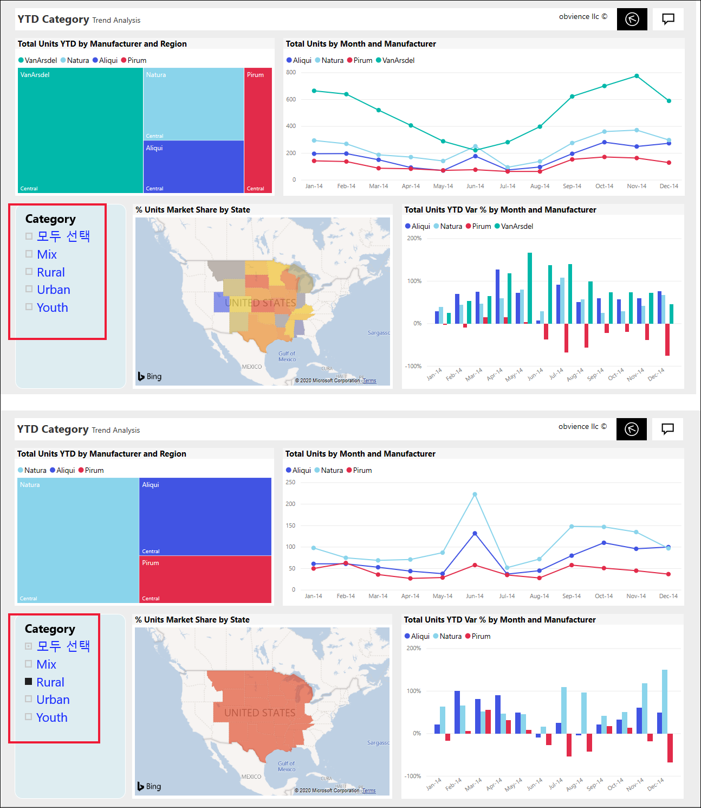
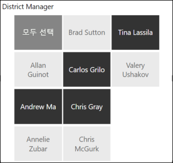
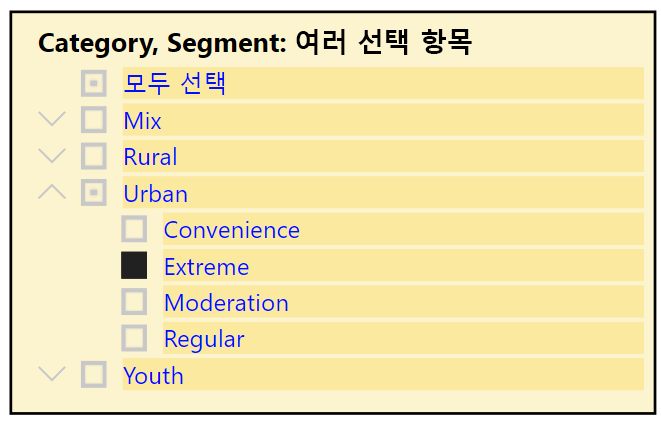
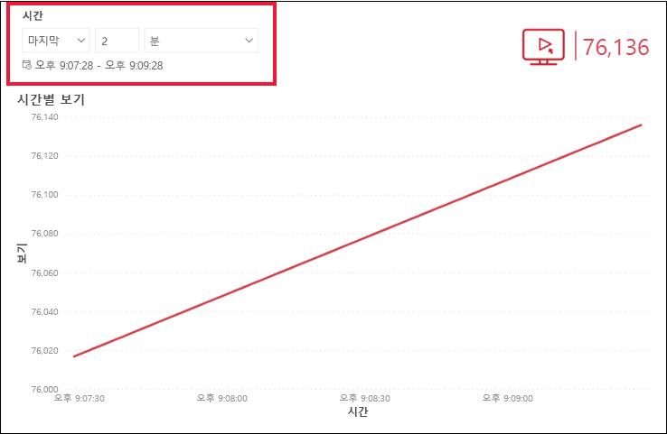
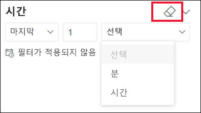

# Power BI 서비스의 슬라이서

[!INCLUDE[consumer-appliesto-ynnn](../includes/consumer-appliesto-yynn.md)]

슬라이서는 보고서 페이지의 다른 시각적 개체를 필터링하는 시각적 개체 유형입니다. Power BI 보고서를 사용하는 경우 다양한 유형의 슬라이서를 확인할 수 있습니다. 위의 이미지는 동일한 슬라이서를 표시하지만 선택 항목이 각기 다릅니다. 각 선택 항목이 페이지의 다른 시각적 개체를 어떻게 필터링하는지 확인합니다.  

## 슬라이서를 사용하는 방법
보고서를 만들 때 ‘디자이너’는 슬라이서를 추가하여 사례를 알리고 데이터 탐색 도구를 제공합니다. 

### 숫자 범위 슬라이서
 위의 숫자 범위 슬라이서는 지리, 재고 단위, 주문 날짜를 기준으로 총판매량을 살펴보는 데 도움이 됩니다. 핸들을 사용하여 범위를 선택합니다. 

### 기본 세로 확인란 슬라이서

기본 확인란 슬라이서에서 하나 이상의 확인란을 선택하여 페이지의 다른 시각적 개체에 미치는 영향을 확인합니다. 둘 이상의 확인란을 선택하려면 Ctrl 키를 누른 채 선택합니다. 보고서 ‘디자이너’가 한 번에 하나의 값만 선택할 수 있도록 슬라이서를 설정하는 경우도 있습니다.  

### 이미지 및 셰이프 슬라이서
슬라이서 옵션이 이미지 또는 셰이프인 경우 항목 선택은 확인란을 사용하는 경우와 유사합니다. 하나 이상의 이미지나 셰이프를 선택하여 슬라이서를 페이지의 다른 시각적 개체에 적용할 수 있습니다. 

    

    

### 계층 구조 슬라이서

계층 구조가 있는 슬라이서에서 갈매기형 펼침 단추를 사용하여 계층 구조를 펼치거나 접습니다. 헤더가 업데이트되어 선택 항목을 표시합니다.

### 상대 시간 슬라이서
빠른 새로 고침 시나리오가 등장하면서 더 작은 기간으로 필터링하는 기능이 매우 유용할 수 있습니다.
상대 시간 슬라이서를 사용하면 보고서의 모든 날짜 또는 시간 데이터에 시간 기반 필터를 적용할 수 있습니다. 예를 들어 상대 시간 슬라이서를 사용하여 지난 2일, 시간 또는 분 단위의 비디오 보기만 표시할 수 있습니다. 

## 슬라이서 비활성화
슬라이서를 비활성화하려면 지우개 아이콘을 선택합니다.

## 다음 단계
자세한 내용은 다음 문서를 참조하세요.

[Power BI의 시각화 유형](end-user-visualizations.md)

