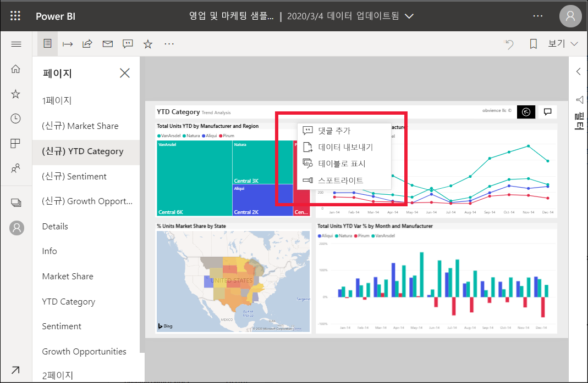
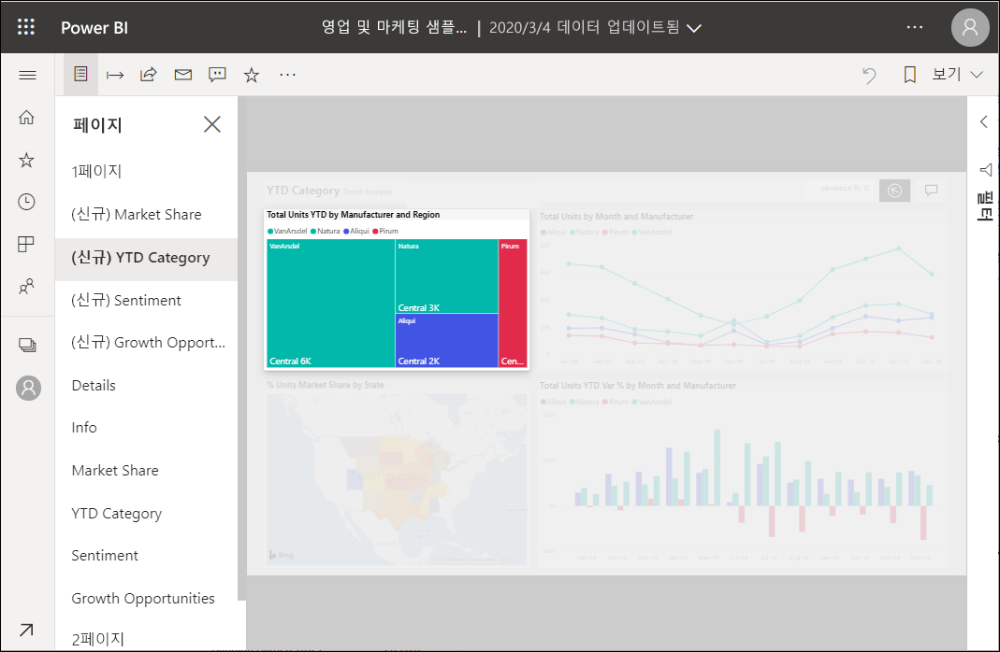

# Power BI 보고서에 스포트라이트 추가

[!INCLUDE[consumer-appliesto-yyny](../includes/consumer-appliesto-yyny.md)]

스포트라이트를 사용하면 보고서 페이지의 특정 시각적 개체에 관심을 모을 수 있습니다.  책갈피를 추가할 때 스포트라이트 모드를 선택하면 해당 모드가 책갈피에 유지됩니다.

## 스포트라이트 추가

1. Power BI 서비스에서 [보고서를 엽니다](end-user-report-open.md).

2. 보고서 페이지에서 강조 표시하려는 시각적 개체를 결정합니다. **기타 작업(...)** 드롭다운을 선택합니다.  

    

3. **스포트라이트**에 대한 옵션을 선택합니다. 선택한 시각적 개체가 강조 표시되어 페이지의 다른 모든 시각적 개체가 거의 투명하게 페이드됩니다. 

    

## 다음 단계

* [포커스 모드에서 대시보드 타일 또는 보고서 시각적 개체 표시](end-user-focus.md)

