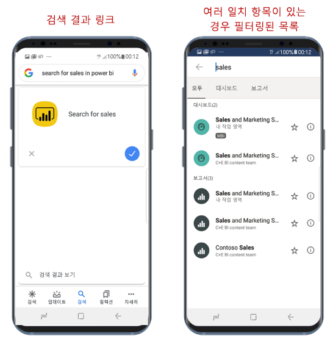

# Google Search를 사용하여 콘텐츠 찾기 및 액세스

적용 대상:

|  |  |
|:--- |:--- |
| Android 휴대폰 |Android 태블릿 |

Google Search를 사용하여 보고서 또는 대시보드를 찾아서 Power BI 모바일 앱을 곧바로 열 수 있습니다. 이때 앱을 탐색할 필요가 없습니다.

특정 항목을 열고 싶은데 어디에서 찾아야 할지 모르겠다면 Google Search를 사용하여 해당 항목을 찾을 수 있습니다.

## Google Search를 사용하여 검색

Google 검색 상자에서 power bi에서 &lt;검색 항목&gt; 검색 양식을 사용하여 검색합니다.**** 예를 들어, **power bi에서 판매 검색**을 사용합니다.

* 일치 항목이 하나만 발견된 경우 Power BI 모바일 앱이 해당 항목을 엽니다.
* 일치 항목이 둘 이상 발견된 경우 Power BI가 요청에 따라 필터링된 검색 화면을 엽니다.

## 다음 단계
* [Power BI Android 앱에서 Android 앱 바로 가기 사용](mobile-app-quick-access-shortcuts.md)
* [Power BI Mobile iOS 앱과 iOS 디바이스 검색(스포트라이트) 연결](mobile-apps-ios-search-integration.md)
* [Power BI 모바일 앱에서 즐겨찾기 만들기 및 보기](mobile-apps-favorites.md)
