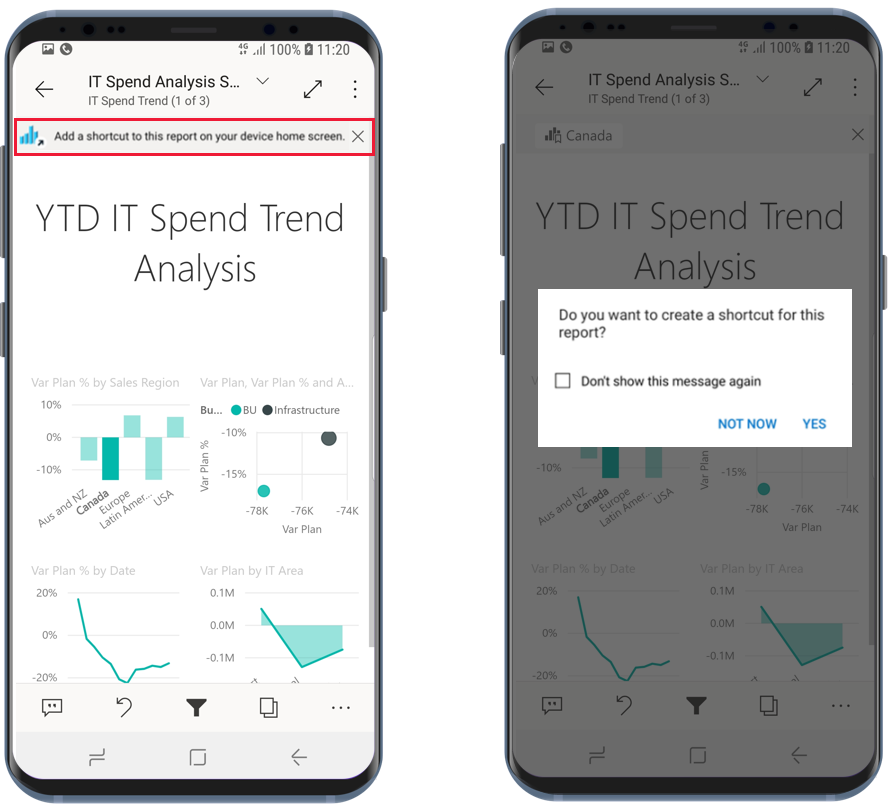

# Power BI Android 앱에서 Android 앱 바로 가기 사용

적용 대상:

|  |  |
|:--- |:--- |
| Android 휴대폰 |Android 태블릿 |

Android용 Power BI 모바일 앱은 앱을 탐색하지 않고도 필요한 보고서 또는 대시보드에 곧바로 이동할 수 있는 두 가지 쉬운 방법을 제공합니다. 하나는 **디바이스 홈 화면 바로 가기**이고, 다른 하나는 **앱 시작 관리자 바로 가기**입니다.
 * **디바이스 홈 화면 바로 가기**: 원하는 보고서 또는 대시보드의 바로 가기를 만들어서 디바이스 홈 화면에 고정할 수 있습니다. 보고서 또는 대시보드는 사용자 작업 영역에 있지 않아도 됩니다. 앱 내부의 보고서 및 대시보드의 바로 가기와 외부(B2B) 테넌트에 있는 보고서 또는 대시보드의 바로 가기도 만들 수 있습니다.
 * **앱 시작 관리자 바로 가기**: 디바이스 홈 화면의 앱 시작 관리자 아이콘을 길게 탭하여 앱 시작 관리자를 열고 자주 보는 보고서 및 대시보드로 곧바로 이동할 수 있습니다. 빠른 실행 메뉴에서는 자주 보는 3가지 항목의 바로 가기를 제공합니다. 해당 항목은 시간이 흐름에 따라 변경됩니다. Power BI 모바일 앱은 사용자가 자주 보는 항목을 추적하여 이에 따라 바로 가기를 변경합니다.

 >[!NOTE]
 >Android 앱 바로 가기는 Android 8 이상에서 사용할 수 있습니다.

## 원하는 보고서 또는 대시보드의 바로 가기 만들기

원하는 보고서 또는 대시보드의 바로 가기를 만들 수 있습니다.

1. 작업 메뉴에서 **기타 옵션...** 을 클릭하고 **바로 가기 추가**를 선택합니다.

   

   Power BI 앱에서 사용자가 특성 항목에 자주 액세스하는 것을 감지하면 해당 항목의 바로 가기를 만들 것을 제안해 줍니다. 이 과정은 두 가지 방법으로 진행됩니다.
   * 자주 보는 보고서 및 대시보드를 열면 **바로 가기 추가** 옵션이 배너에 표시됩니다.
   * 특정 보고서로 이동할 때 링크를 자주 사용하는 경우(예: 공유 메일이나 주석 등에서), 이 링크를 몇 번 사용하면 바로 가기를 만들 것인지 묻는 창이 열립니다. **예**를 클릭하면 **바로 가기 추가** 대화 상자(아래 참조)가 열리고 **나중에**를 클릭하면 액세스하려는 항목으로 이동합니다.
   
   이 두 가지 방법은 아래 이미지에 나와 있습니다.

   

 1. 항목 이름이 표시된 **바로 가기 추가** 대화 상자가 열립니다. 원하는 경우 이름을 편집할 수 있습니다. 완료되면 **추가**를 탭합니다.

    

1. 바로 가기를 추가할 것인지 확인하는 메시지가 표시됩니다. **추가**를 탭하여 디바이스 홈 화면에 바로 가기를 추가합니다.

   

   디바이스 홈 화면에 사용자가 입력한 이름으로 바로 가기 대시보드 또는 보고서 아이콘이 추가됩니다.

   

## 바로 가기 이름 편집

바로 가기 이름을 편집하려면 작업 메뉴에서 **추가 옵션...** 을 선택하고 **바로 가기 이름 편집**을 선택합니다.

 

## Power BI 모바일 앱 시작 관리자를 사용하여 자주 보는 콘텐츠에 액세스

Power BI 모바일 앱 시작 관리자를 사용하여 자주 액세스하는 항목으로 바로 이동할 수 있습니다.

앱 시작 관리자를 길게 탭하면 자주 보는 항목의 빠른 실행 메뉴가 표시됩니다. 여기서 바로 가기를 탭하면 원하는 항목이 열립니다.

원하는 바로 가기 아이콘을 디바이스 홈 화면으로 끌어서 놓으면 표시된 항목의 영구 바로 가기를 만들 수 있습니다.

## 다음 단계
* [Google Search를 사용하여 콘텐츠 찾기 및 액세스](mobile-app-find-access-google-search.md)
* iOS에서 Siri 바로 가기를 사용하려면 [Power BI Mobile iOS 앱에서 Siri 바로 가기 사용](mobile-apps-ios-siri-shortcuts.md)을 참조하세요.
* [Power BI 모바일 앱에서 즐겨찾기 만들기 및 보기](mobile-apps-favorites.md)
