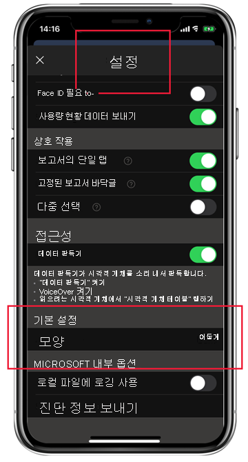

# 어둡게 모드

개별 보기 기본 설정을 수용하기 위해 iOS 및 Android용 Power BI 모바일 앱은 밝음 모드와 어둠 모드를 모두 지원합니다. 어둡게 모드는 화면 밝기를 줄여 콘텐츠를 더 쉽게 볼 수 있도록 합니다.

 어둡게 모드에서는 모든 앱 환경이 진한 배경으로 표시됩니다. 그러나 Power BI 콘텐츠는 영향을 받지 않습니다. 보고서, 대시보드 및 앱은 항상 디자이너가 의도한 대로 표시됩니다.
 
 기본적으로 Power BI 모바일 앱은 디바이스의 설정을 사용하여 표시할 화면 모양을 결정합니다. 디바이스가 어둡게 모드로 구성되어 있으면 앱이 어둡게 모드로 표시됩니다.

>[!NOTE]
>Android 디바이스의 어둠 모드에 대한 디바이스 수준 지원은 Android 10에서 공식적으로 제공됩니다. 이전 Android 버전을 실행하는 디바이스에서 Power BI 모바일 앱의 어둠 모드는 앱의 모양 설정에 따라 제어될 수 있습니다.

밝음 모드와 어둠 모드 사이를 전환하거나 디바이스 설정에서 모드를 결정하도록 하려면 **설정** 페이지로 이동한 다음 **모양** 까지 아래로 스크롤하여 탭하고 원하는 모드를 선택합니다.

