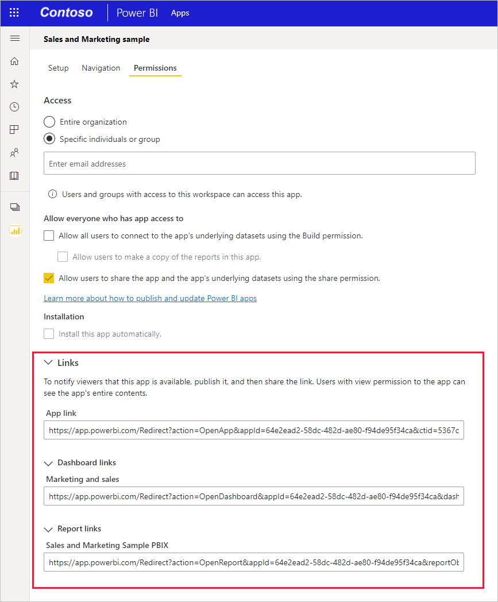

# Power BI 모바일 앱의 특정 위치에 대한 링크 만들기
링크를 사용하여 특정 보고서, 보고서 페이지, 대시보드, 타일 등의 특정 Power BI 콘텐츠에 직접 액세스할 수 있습니다.

링크를 사용하여 Power BI 모바일 앱의 콘텐츠에 액세스하는 두 가지 시나리오가 있습니다. 

* **모바일 앱 외부** 에서 Power BI를 열고 특정 콘텐츠를 방문합니다. 이는 일반적으로 다른 앱에서 Power BI 모바일 앱을 여는 통합 시나리오입니다. 
* Power BI 내에서 **이동** 하는 경우. 이는 일반적으로 Power BI에서 사용자 지정 탐색을 만들려고 할 때 수행됩니다.

이 문서는 다음 사례를 다룹니다.
* 링크를 사용하여 모바일 앱 외부에서 특정 Power BI 콘텐츠를 엽니다. 두 링크 형식이 설명되어 있습니다. 하나는 리디렉션 방법을 사용하며 Power BI가 열리는 위치와 상관없이 사용할 수 있습니다. 다른 하나는 Power BI 모바일 앱에서 직접 열리며 모바일 앱이 설치된 모바일 디바이스에서만 작동합니다.
* Power BI 내부의 링크를 사용하여 특정 Power BI 콘텐츠를 탐색합니다.

## 모바일 앱 외부에서 링크 사용
모바일 앱 외부에서 Power BI의 특정 항목에 연결하려는 경우 링크를 열 위치에 따라 다음과 같은 두 가지 옵션이 있습니다.

* 컴퓨터 브라우저에서 클릭하든 모바일 디바이스에서 클릭하든 링크가 정확히 열리도록 하려면, 클릭한 위치와 상관없이 정확히 열리는 링크를 만들 수 있습니다. 이 링크에는 이러한 스마트 동작을 사용하도록 설정하는 특수 리디렉션 구문이 있습니다.

* Power BI 모바일 앱이 설치된 모바일 디바이스에서만 링크를 열어야 하는 경우, 위 방법의 리디렉션 오버헤드를 방지하고 모바일 디바이스의 Power BI 모바일 앱에서 직접 링크를 여는 다른 링크 구문을 사용할 수 있습니다. 그러나 이 링크는 첫 번째 방법의 리디렉션 오버헤드를 방지하지만, Power BI 모바일 앱이 설치된 모바일 디바이스 외의 다른 위치에서 열리는 경우 작동하지 않습니다.

### 어디서나 작동하는 링크 만들기
이 섹션에서 설명하는 링크 형식은 클릭한 위치와 상관없이 링크가 작동하도록 하기 위해 리디렉션을 사용합니다.
* 모바일 디바이스에서 링크를 클릭하는 경우 디바이스가 Power BI 모바일 앱을 사용하여 링크를 열도록 해야 합니다. 모바일 앱이 디바이스에 설치되어 있지 않으면 사용자에게 스토어로 이동하여 다운로드하도록 제안합니다.
* PC에서 링크를 클릭하면 Power BI 웹 포털에서 관련 항목이 열립니다.

링크는 특정 접두사로 시작해야 하며 그 뒤에 쿼리 매개 변수가 와야 합니다.

https<nolink>://app.powerbi.com/Redirect? **[QUERYPARAMETERS]** </code>

> [!IMPORTANT]
> 콘텐츠가 정부, 중국 등의 특수한 데이터 센터에서 호스트되는 경우에는 **app.powerbigov.us** 또는 **app.powerbi.cn** 과 같은 적절한 Power BI 주소로 링크를 시작해야 합니다.

쿼리 매개 변수는 다음과 같습니다.

|매개 변수  | 값  | 설명 |
|---------|---------|---------|
|**action**(필수)    | OpenApp OpenReport OpenDashboard OpenTile | |
|**appId**| 36자 GUID | 앱의 일부인 보고서 또는 대시보드를 열려는 경우 지정해야 합니다. 예: **appId=baf4b16d-b5bd-4360-8a3a-51d11242c09b** |
|**groupObjectId**| 36자 GUID | 내 작업 영역에 속하지 않는 보고서 또는 대시보드를 열려는 경우 작업 영역을 지정합니다. 예: **groupObjectId=9a3841c6-74b3-46f1-85fd-bdd78f27b30e** |
| **dashboardObjectId** | 36자 GUID | 대시보드 개체 ID(action이 OpenDashboard 또는 OpenTile인 경우) 예: **dashboardObjectId=033bb049-5b68-4392-b3ef-ae9a43738a4a** |
| **reportObjectId** | 36자 GUID | 보고서 개체 ID(action이 OpenReport인 경우) 예: **reportObjectId=6114cec7-78e1-4926-88ff-0bc5338452cf** |
| **tileObjectId** | 36자 GUID | 타일 개체 ID(action이 OpenTile인 경우) 예: **tileObjectId=a845dcb8-a289-43a8-94ea-67a8c0a068f9** |
| **reportPage** | ReportSection&lt;num&gt; | 특정 보고서 페이지를 열려는 경우 페이지 이름입니다. (action이 OpenReport인 경우) 예: **reportPage=ReportSection6**  |
| **bookmarkGuid** | 36자 GUID | 책갈피가 지정된 특정 보기를 열려는 경우 책갈피 ID입니다. (action이 OpenReport인 경우) 예: **bookmarkGuid=18e8872f-6db8-4cf8-8298-3b2ab254cc7f** |
| **ctid** | 36자 GUID | 항목 조직 ID(B2B 시나리오에서 사용. 항목이 사용자 조직에 속한 것이면 생략 가능) 예: **ctid=5367c770-09d0-4110-bf6a-d760cb5ef681** |
||||

**예:**

다음 예에서는 매개 변수 값에 대한 자리 표시자가 굵게 강조 표시되어 있습니다. 실제 값을 가져오려면 Power BI 서비스로 이동하여 연결하려는 항목을 열고 항목의 URL에서 필요한 값을 추출합니다.

* **앱 열기**

    https<nolink>://app.powerbi.com/Redirect?action=OpenApp&appId= **&lt;appid-guid&gt;** &ctid= **&lt;ctid-guid&gt;**
   
* **앱의 일부인 대시보드 열기**

    https<nolink>://app.powerbi.com/Redirect?action=OpenDashboard&appId= **&lt;appid-guid&gt;** &dashboardObjectId= **&lt;dashboardid-guid&gt;** &ctid= **&lt;ctid-guid&gt;**

* **내 작업 영역 이외의 작업 영역에 속하는 보고서 열기**

    https<nolink>://app.powerbi.com/Redirect?Action=OpenReport&reportObjectId= **&lt;reportid-guid&gt;** &groupObjectId= **&lt;groupobjectid-guid&gt;** &reportPage=**ReportSection&lt;num&gt;**

### 올바른 링크 형식을 가져오는 방법

#### 앱 및 앱의 항목에 대한 링크

**앱, 그리고 특정 앱의 일부인 보고서 및 대시보드** 의 경우, 링크를 얻는 가장 쉬운 방법은 앱 작업 영역으로 이동해서 **앱 업데이트** 를 선택하는 것입니다. 그러면 “앱 게시” 환경이 열립니다. 권한 탭을 열고 링크 섹션을 확장하여 앱 및 모든 콘텐츠에 대한 링크를 확인합니다. 외부 Power BI에서 이러한 링크를 사용하여 앱 및 해당 콘텐츠에 직접 액세스할 수 있습니다.

#### 앱에 없는 항목에 대한 링크 

특정 앱의 일부가 아닌 보고서 및 대시보드의 경우, 항목의 URL에서 필요한 개체 ID를 추출해야 합니다. 이렇게 하려면 Power BI 서비스로 이동하고, 연결하려는 항목으로 이동한 다음, 브라우저의 주소 표시줄에 표시되는 URL에서 필요한 값을 확인합니다.

아래의 예에서는 연결하려는 항목의 URL에서 필요한 ID를 찾을 수 있는 위치를 보여 줍니다.

* 36자의 대시보드 개체 ID를 찾으려면 Power BI 서비스에서 연결하려는 특정 대시보드로 이동하여 아래에 표시된 위치에서 대시보드 개체 ID 및 기타 필수 ID를 찾습니다.

    https<nolink>://app.powerbi.com/groups/me/dashboards/ **&lt;dashboard-object-id&gt;** ?ctid= **&lt;org-object-id&gt;**

* 36자의 보고서 개체 ID를 찾으려면 Power BI 서비스에서 연결하려는 특정 보고서로 이동하여 아래 그림과 같이 필요한 ID를 찾습니다. 이 예에는 특정 보고서 페이지 및 특정 책갈피에 대한 참조가 포함되어 있습니다.

    https<nolink>://app.powerbi.com/groups/me/reports/ **&lt;report-object-id&gt;** /**ReportSection&lt;num&gt;** ?bookmarkGuid= **&lt;bookmark-id&gt;**

* 내 작업 영역 이외의 작업 영역에 있는 항목에 연결하려면 그룹 개체 ID를 추출해야 합니다. 이 예에서는 내 작업 영역 이외의 작업 영역에 있는 보고서를 보여 줍니다.

    https<nolink>://app.powerbi.com/groups/ **&lt;group-object-id&gt;** /reports/ **&lt;report-object-id&gt;** /**ReportSection&lt;report-section-num&gt;** ?ctid= **&lt;org-object-id&gt;**

### Power BI 모바일 앱이 설치된 디바이스에서만 열리는 링크 만들기

이 섹션에서 설명하는 링크 형식은 모든 모바일 플랫폼(iOS, Android 디바이스 및 Windows 10)에서 Power BI 모바일 앱 내의 특정 위치에 연결됩니다. 이 링크 형식을 사용하면 이전 섹션에서 설명한 방법과 관련된 리디렉션 없이 위치가 직접 열립니다. **Power BI 모바일 앱이 설치된 모바일 디바이스에서만 이 형식을 열 수 있습니다.**

이 형식의 링크는 대시보드, 타일 및 보고서를 직접 가리킬 수 있습니다. 딥 링크의 대상이 해당 형식을 결정합니다. 다른 위치로 딥 링크를 만들려면 다음 단계를 수행합니다. 

* **Power BI 모바일 앱 열기**

    모든 디바이스에서 Power BI 모바일 앱을 열려면 다음 링크를 사용합니다.

    mspbi://app/

* **특정 대시보드 열기**

    다음 링크는 특정 대시보드로 Power BI 모바일 앱을 엽니다.

    mspbi://app/OpenDashboard?DashboardObjectId= **<36-character-dashboard-id>**

    36자의 대시보드 개체 ID를 가져오려면 Power BI 서비스의 특정 대시보드로 이동하여 URL에서 추출합니다. 예를 들어 대시보드 개체 ID는 Power BI 서비스의 다음 URL에서 강조 표시됩니다.

    https<nolink>://app.powerbi.com/groups/me/dashboards/ **&lt;61b7e871-cb98-48ed-bddc-6572c921e270&gt;**

    대시보드가 내 작업 영역에 없는 경우 대시보드 ID의 앞이나 뒤에 그룹 개체 ID도 추가해야 합니다. 아래에 표시된 딥 링크에는 대시보드 개체 ID 뒤에 추가된 그룹 개체 ID 매개 변수가 있습니다.

    mspbi://app/OpenDashboard?DashboardObjectId=**e684af3a-9e7f-44ee-b679-b9a1c59b5d60**&GroupObjectId=**8cc900cc-7339-467f-8900-fec82d748248**</code>

    두 매개 변수 사이의 앰퍼샌드(&)에 유의하세요.

* **포커스에서 특정 타일에 열기**

    이 링크는 Power BI 모바일 앱에서 포커스 모드로 특정 타일을 엽니다.

    mspbi://app/OpenTile?DashboardObjectId= **<36-character-dashboard-id>** &TileObjectId= **<36-character-tile-id>**

    36자의 대시보드 및 타일 개체 ID를 찾으려면 Power BI 서비스의 특정 대시보드로 이동하여 포커스 모드에서 타일을 엽니다. 아래의 예에서는 대시보드 및 타일 ID가 강조 표시됩니다.

    https<nolink>://app.powerbi.com/groups/me/dashboards/**3784f99f-b460-4d5e-b86c-b6d8f7ec54b7**/tiles/**565f9740-5131-4648-87f2-f79c4cf9c5f5**/infocus

    이 타일을 직접 열기 위한 링크는 다음과 같습니다.

    mspbi://app/OpenTile?DashboardObjectId=3784f99f-b460-4d5e-b86c-b6d8f7ec54b7&TileObjectId=565f9740-5131-4648-87f2-f79c4cf9c5f5

    두 매개 변수 사이의 앰퍼샌드(&)에 유의하세요.

    대시보드가 내 작업 영역에 없는 경우 GroupObjectId 매개 변수를 추가합니다(예: &GroupObjectId=<36-character-group-id>).

* **특정 보고서에 열기**

    이 링크는 Power BI 모바일 앱에서 특정 보고서를 엽니다.

    mspbi://app/OpenReport?ReportObjectId= **<36-character-report-id>**

    36자의 보고서 개체 ID를 찾으려면 Power BI 서비스에서 해당 보고서로 이동합니다. Power BI 서비스의 다음 URL은 추출해야 하는 보고서 ID를 보여 줍니다.

    https<nolink>://app.powerbi.com/groups/me/reports/**df9f0e94-31df-450b-b97f-4461a7e4d300**

    보고서가 내 작업 영역에 없는 경우 보고서 ID 앞이나 뒤에 **&GroupObjectId=<36-character-group-id>** 를 추가해야 합니다. 예를 들어 이 경우 딥 링크는 다음과 같습니다.

    mspbi://app/OpenReport?ReportObjectId=**e684af3a-9e7f-44ee-b679-b9a1c59b5d60**&GroupObjectId=**8cc900cc-7339-467f-8900-fec82d748248**

    두 매개 변수 사이의 앰퍼샌드(&)에 유의하세요.

* **특정 보고서 페이지 열기**

    이 링크는 Power BI 모바일 앱에서 특정 보고서 페이지를 엽니다.

    mspbi://app/OpenReport?ReportObjectId= **<36-character-report-id>** &reportPage=**ReportSection&lt;number&gt;**

    보고서 페이지를 **ReportSection**(뒤에 숫자가 따라옴)이라고 합니다. 필요한 값을 찾으려면 Power BI 서비스에서 보고서를 열고, 특정 보고서 페이지로 이동하여, URL에서 필요한 값을 추출합니다. 예를 들어 다음 URL에서 강조 표시된 섹션은 특정 보고서 페이지를 여는 데 필요한 값을 나타냅니다.

    https<nolink>://app.powerbi.com/groups/me/reports/**df9f0e94-31df-450b-b97f-4461a7e4d300**/**ReportSection11**</code>

* **전체 화면 모드에서 열기(Windows 디바이스에만 해당)**

    Windows 디바이스의 경우 특정 보고서를 전체 화면 모드에서 열려면 **openFullScreen** 매개 변수를 추가할 수도 있습니다. 다음 예는 전체 화면 모드에서 보고서 페이지를 엽니다.

    mspbi://app/OpenReport?ReportObjectId=500217de-50f0-4af1-b345-b81027224033&**openFullScreen=true**

* **컨텍스트 추가**(선택 사항)

    문자열에 컨텍스트를 추가할 수도 있습니다. 그런 다음 사용자가 Microsoft에 문의해야 하는 경우, Microsoft는 해당 컨텍스트를 사용하여 사용자 앱과 관련된 것을 찾기 위해 데이터를 필터링할 수 있습니다. 컨텍스트를 추가하려면 **context=&lt;app-name&gt;** 매개 변수를 링크에 추가합니다.

    예를 들어 다음 예는 컨텍스트 매개 변수를 포함하는 링크를 보여 줍니다. 

    mspbi://app/OpenReport?ReportObjectId=**e684af3a-9e7f-44ee-b679-b9a1c59b5d60**&GroupObjectId=**8cc900cc-7339-467f-8900-fec82d748248**&**context=SlackDeepLink**

## Power BI 내의 링크 사용

Power BI 모바일 앱에서 Power BI 내의 링크는 Power BI 서비스에서 작업하는 것처럼 작동합니다.

보고서에 다른 Power BI 항목을 가리키는 링크를 추가하려면 브라우저 주소 표시줄에서 항목 URL을 복사하면 됩니다. [보고서에 있는 텍스트 상자에 하이퍼링크를 추가하는 방법](https://docs.microsoft.com/power-bi/service-add-hyperlink-to-text-box)을 자세히 알아보세요.

## 다음 단계
사용자 의견은 나중에 구현할 사항을 결정하는 데 도움이 됩니다. 따라서 Power BI 모바일 앱에서 참조하고자 하는 다른 기능에 대해 꼭 투표해주세요. 

* [모바일 디바이스용 Power BI 앱](mobile-apps-for-mobile-devices.md)
* Twitter에서 @MSPowerBI 팔로우
* [Power BI 커뮤니티](http://community.powerbi.com/)에서 대화에 참여
* [Power BI란?](../../power-bi-overview.md)
