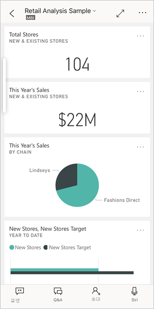

# 빠른 시작: Power BI 모바일 앱에서 대시보드 및 보고서 살펴보기
이 빠른 시작에서는 Power BI Mobile 앱을 둘러보고 샘플 대시보드와 보고서를 살펴봅니다. iOS용 Power BI 앱이 표시되지만, 다른 디바이스에서도 쉽게 작업을 수행할 수 있습니다.

적용 대상:

|  |  |  |  |
|:--- |:--- |:--- |:--- |
| iPhone | iPad | Android | Windows 10 |

>[!NOTE]
>**Windows 10 Mobile을 사용하는 휴대폰**용 Power BI 모바일 앱 지원은 2021년 3월 16일 중단될 예정입니다. [자세히 알아보기](https://go.microsoft.com/fwlink/?linkid=2121400)

대시보드는 회사의 수명 주기 및 프로세스 포털로, 비즈니스의 현재 상태를 한곳에서 모니터링할 수 있는 개요입니다. 보고서는 해당 데이터의 다양한 결과 및 인사이트를 나타내는 시각적 개체가 포함된 대화형 데이터 뷰입니다. 

## 필수 조건

* **Power BI 등록**: 아직 Power BI에 등록하지 않은 경우 시작하기 전에 [평가판에 등록합니다](https://app.powerbi.com/signupredirect?pbi_source=web).
* **디바이스용 Power BI 앱 설치**: [App Store](https://apps.apple.com/app/microsoft-power-bi/id929738808)(iOS) 또는 [Google Play](https://play.google.com/store/apps/details?id=com.microsoft.powerbim&amp;amp;clcid=0x409)(Android)에서 Power BI 모바일 앱**을 다운로드합니다.
* **소매점 분석 샘플 다운로드**: 이 빠른 시작의 첫 번째 단계는 Power BI 서비스에서 소매점 분석 샘플을 다운로드하는 것입니다. 시작하려면 Power BI 계정에 [샘플을 다운로드하는 방법을 알아봅니다](./mobile-apps-download-samples.md). 소매점 분석 샘플을 선택해야 합니다.

필수 조건을 완료하고 소매점 분석 샘플을 Power BI 계정에 다운로드했으면 이 둘러보기를 시작할 수 있습니다.

## 모바일 디바이스에서 대시보드 보기
1. 디바이스에서 Power BI 앱을 열고, 브라우저에서 Power BI 서비스에 사용한 것과 동일한 Power BI 계정 자격 증명으로 로그인합니다.
 
1. 이제 **작업 영역** 아이콘 을 탭하고 **내 작업 영역**을 선택한 다음, 소매점 분석 샘플을 탭하여 엽니다.

    
   
    모바일 디바이스의 Power BI 대시보드는 Power BI 서비스와 약간 다르게 보입니다. 모든 타일이 동일한 너비로 나타나며, 위에서 아래로 하나씩 정렬됩니다.

6. 아래로 스크롤하여 “올해 판매액, 작년 판매액” 채워진 꺾은선형 차트를 탭합니다.

    

    타일이 포커스 모드로 열립니다.

7. 포커스 모드에서 차트의 **4월**을 탭합니다. 4월 값이 차트의 맨 위에 표시됩니다.

    

8. 오른쪽 위 모서리에서 보고서 아이콘  을 탭합니다(Android 디바이스에서는 화면 맨 위에 표시될 수도 있음). 이 타일과 관련된 보고서가 가로 모드로 열립니다.

    

9. 거품형 차트에서 노란색 “040 - Juniors” 풍선을 탭합니다. 다른 차트에서 관련 값이 어떻게 강조 표시되는지 확인합니다. 

    

10. 위로 살짝 밀어 아래쪽에 도구 모음을 표시하고 **기타 옵션(...)** 을 탭합니다.

    

11. 목록 아래로 스크롤하고 **주석 달기**를 선택합니다.

    

12. 주석 달기 도구 모음에서 웃는 얼굴 아이콘을 탭한 다음, 웃는 얼굴을 추가할 보고서 페이지를 탭합니다.
 
    

13. 이제 오른쪽 위에 있는 **공유**를 탭합니다.

14. 보고서를 공유하는 방법을 선택합니다.  

    

    이 스냅샷을 조직 내부 또는 외부의 모든 사용자와 공유할 수 있습니다. 고유한 Power BI 계정이 있는 조직 내부 사용자는 소매점 분석 샘플 보고서도 열 수 있습니다.

## 리소스 정리

이 빠른 시작을 완료한 후 필요한 경우 소매점 분석 샘플 대시보드, 보고서 및 데이터 세트를 삭제할 수 있습니다.

1. Power BI 서비스([Power BI 서비스](https://app.powerbi.com))를 열고 로그인합니다.

2. 탐색 창에서 **내 작업 영역**을 선택합니다.

3. 대시보드 탭을 선택하고 휴지통을 클릭합니다.

    

    이제 보고서 탭을 클릭하고 동일한 작업을 수행합니다.

4. 이제 데이터 세트 탭을 선택하고 **기타 옵션**(...)을 클릭한 다음, **삭제**를 선택합니다. 

    

## 다음 단계

이 빠른 시작에서는 모바일 디바이스의 샘플 대시보드와 보고서를 살펴보았습니다. Power BI 서비스 작업에 대해 자세히 알아보세요. 

> [!div class="nextstepaction"]
> [빠른 시작: Power BI 서비스 살펴보기](../end-user-experience.md)

