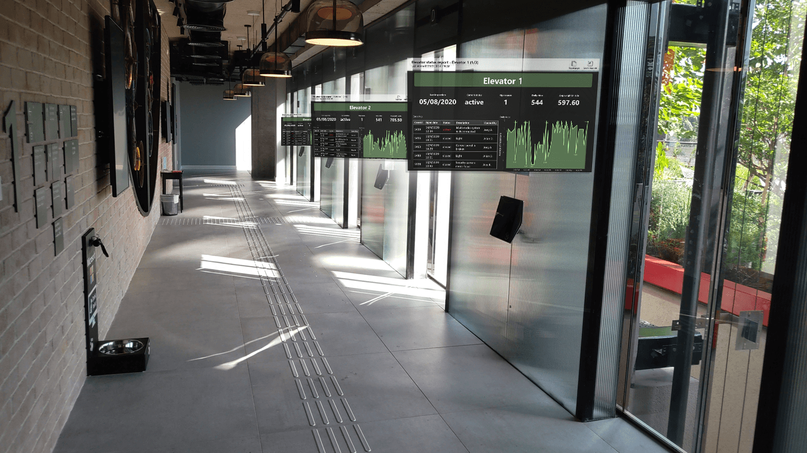

# HoloLens 2용 Power BI
HoloLens 2용 Power BI 앱은 Power BI 보고서 및 대시보드를 실제 환경과 혼합하여 실제 세계를 이동하고 필요한 경우 관련 데이터를 얻을 수 있는 몰입형 3D 핸즈프리 환경을 만듭니다.

## HoloLens 2용 Power BI 앱 다운로드 

HoloLens 2용 Power BI 앱은 [Microsoft Store](https://go.microsoft.com/fwlink/?linkid=526478)에서 다운로드할 수 있습니다.

HoloLens 2 디바이스에 앱을 설치하는 방법에 대해 [자세히 알아보세요](https://docs.microsoft.com/hololens/holographic-store-apps).

## HoloLens 2에서 Power BI 앱 열기

**시작** 메뉴를 열고 Power BI 앱을 선택합니다. 앱이 열리고 즐겨찾기에 추가한 모든 보고서와 대시보드가 가상 도구 벨트에 로드되면 여기서 보고서와 대시보드를 선택하여 볼 수 있습니다.

## HoloLens 2용 Power BI 앱 사용

HoloLens 2 손 제스처 및 시선 추적을 사용하여 Power BI 콘텐츠의 크기를 조정하고, 배치하고, 상호 작용합니다. HoloLens 2 환경의 개체와 상호 작용하는 방법에 대해 [자세히 알아보세요](https://docs.microsoft.com/hololens/hololens2-basic-usage).

### 보고서 및 대시보드에 액세스

보고서 또는 대시보드에 액세스하려면 가상 도구 벨트에서 잡아 원하는 위치에 배치합니다. 앱 창 잡기 및 배치에 대해 [자세히 알아보세요](https://docs.microsoft.com/hololens/hololens2-basic-usage#moving-holograms).

가상 도구 벨트에는 즐겨찾기로 표시된 보고서 또는 대시보드만 넣을 수 있습니다. 도구 벨트에 보고서 또는 대시보드가 없거나 보고서와 대시보드를 추가하려는 경우 [Power BI 서비스](../end-user-favorite.md) 또는 [Power BI 모바일 앱](mobile-apps-favorites.md)에서 해당 항목을 즐겨찾기로 표시하면 됩니다. 그러면 HoloLens 2의 Power BI 가상 도구 벨트에서 사용할 수 있습니다.

### 보고서 및 대시보드 크기 조정

보고서 또는 대시보드의 크기를 조정하려면 앱 창의 모퉁이에 표시되는 크기 조정 핸들을 잡고 원하는 대로 크기를 조정합니다. 앱 창 크기 조정에 대해 [자세히 알아보세요](https://docs.microsoft.com/hololens/hololens2-basic-usage#resizing-holograms).

### 보고서 및 대시보드를 공간에 배치

보고서나 대시보드를 공간에 배치하려면 제목 표시줄을 검지손가락과 엄지손가락으로 집은 다음 놓지 않고 원하는 위치로 손을 이동합니다. 원하는 위치에 도달하면 집고 있던 손가락을 뗍니다. 앱 창 이동에 대해 [자세히 알아보세요](https://docs.microsoft.com/hololens/hololens2-basic-usage#moving-holograms).

원하는 위치에 보고서나 대시보드를 배치하면 HoloLens 2 디바이스는 환경에서 해당 위치를 기억합니다. 다음에 동일한 장소를 방문하면 정확히 동일한 위치에서 배치한 항목을 찾을 수 있습니다.

### 보고서 페이지 탐색

각 보고서에는 페이지에서 페이지로 이동하기 위해 표시할 수 있는 페이지 인덱스가 있습니다. 보고서 창의 오른쪽 위 모퉁이에 있는 페이지 인덱스 단추를 선택하여 페이지 인덱스를 표시하거나 숨깁니다.

### QR 코드를 사용하여 보고서 열기

보고서의 QR 코드가 생성되어 해당 보고서에 데이터가 포함된 장비 등의 항목에 연결된 경우 해당 항목에서 QR 코드를 보기만 해도 보고서를 열 수 있습니다.

보고서 QR 코드 만들기 [자세히 알아보기](https://docs.microsoft.com/power-bi/create-reports/service-create-qr-code-for-report)

### 데이터 새로 고침

앱을 사용하는 동안 보고서와 대시보드가 업데이트되므로 앱을 사용하는 동안 Power BI의 데이터가 변경되면 보고 있는 보고서 및 대시보드에 변경 내용이 반영되어 표시됩니다.

## 다음 단계

* [HoloLens 2 둘러보기](https://docs.microsoft.com/hololens/hololens2-basic-usage)