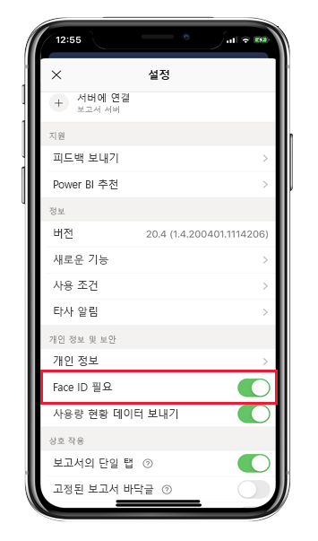
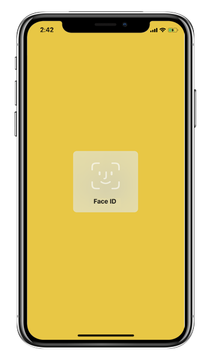
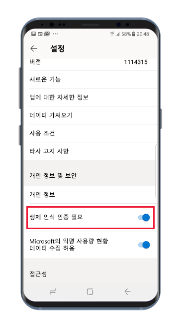
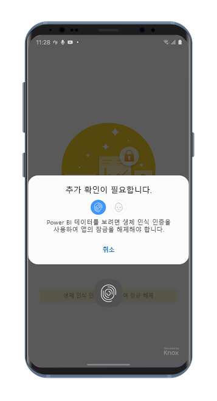

# Face ID, Touch ID, 암호 또는 생체 인식 데이터로 Power BI 앱 보호 

대부분의 경우 Power BI에서 관리되는 데이터는 기밀이므로 권한이 부여된 사용자만 보호하고 액세스해야 합니다. 

iOS 및 Android용 Power BI 앱을 사용하면 추가 ID를 구성하여 데이터를 보호할 수 있습니다. 이렇게 하면 앱이 시작되거나 전경에서 실행될 때마다 인증이 요구됩니다. iOS에서는 Face ID, Touch ID 또는 암호를 제공해야 합니다. Android에서는 생체 인식 데이터(지문 ID)를 제공해야 합니다.

적용 대상:

|  |  |  |  |
|:--- |:--- |:--- |:--- |
|iPhones |iPad |Android 휴대폰 |Android 태블릿 |

## iOS에서 Face ID, Touch ID 또는 암호 설정

iOS용 Power BI 모바일 앱에서 추가 ID를 사용하려면 **개인 정보 보호 및 보안** 아래의 앱 설정으로 이동합니다. Face ID, Touch ID 또는 암호를 설정하는 옵션이 표시됩니다. 표시되는 옵션은 디바이스에서 지원하는 기능에 따라 달라집니다.

이 설정이 켜지면 앱이 시작되거나 전경에서 실행될 때마다 앱에 액세스하려면 ID를 제공하라는 메시지가 표시됩니다.

제공하도록 요구되는 ID 유형은 디바이스에서 지원하는 기능에 따라 달라집니다. 디바이스가 Face ID를 지원하는 경우 Face ID를 사용해야 합니다. Touch ID를 지원하는 경우 Touch ID를 사용해야 합니다. 둘 다 지원되지 않으면 암호를 제공해야 합니다. 아래 이미지에서는 Face ID 인증 화면을 보여 줍니다.

## Android에서 생체 인식 데이터(지문 ID) 설정

Android용 Power BI 모바일 앱에서 추가 ID를 사용하려면 **개인 정보 보호 및 보안** 아래의 앱 설정으로 이동합니다. 생체 인식 데이터를 설정하는 옵션이 표시됩니다.

이 설정이 켜지면 앱이 시작되거나 전경에서 실행될 때마다 앱에 액세스하려면 생체 인식 데이터(지문 ID)를 제공하라는 메시지가 표시됩니다.

아래 이미지에서는 지문 인증 화면을 보여 줍니다.

>[!NOTE]
>모바일 앱의 생체 인식 인증 필요 설정을 사용하려면 먼저 Android 디바이스에서 생체 인식을 설정해야 합니다. 디바이스가 생체 인식을 지원하지 않을 경우 이 모바일 앱 설정을 사용하여 Power BI 데이터에 대한 액세스를 보호할 수 없습니다.
>
>관리자가 모바일 앱의 [보안 액세스를 원격으로 설정](#mdm-enforcement-of-secure-access-to-your-power-bi-mobile-app)한 경우 앱에 액세스하려면 디바이스에서 생체 인식을 설정해야 합니다(아직 설정하지 않은 경우). 디바이스가 생체 인식을 지원하지 않으면 원격 설정이 영향을 주지 않습니다. 모바일 앱에 대한 액세스는 보호되지 않은 상태로 유지됩니다.

## MDM 적용을 통한 Power BI 모바일 앱 보안 액세스 설정

일부 조직에는 비지니스에 중요한 데이터에 액세스하기 전에 추가 식별을 강제하는 보안 정책 및 규정 준수 요구 사항이 있습니다.

이를 지원하기 위해 관리자는 Power BI 모바일 앱을 사용하여 Microsoft Intune 및 기타 MDM(모바일 디바이스 관리) 솔루션에서 앱 구성 설정을 푸시함으로써 모바일 앱의 보안 액세스 설정을 제어할 수 있습니다. 관리자는 앱 보호 정책을 사용하여 모든 사용자 또는 사용자 그룹에 대해 이 설정을 사용하도록 설정할 수 있습니다. 자세한 내용은 [MDM을 사용하여 Power BI 모바일 앱을 원격으로 구성](mobile-app-configuration.md#data-protection-settings-ios-and-android)을 참조하세요.

## 다음 단계
* [MDM(모바일 디바이스 관리) 도구를 사용하여 Power BI 앱을 원격으로 구성](mobile-app-configuration.md)
