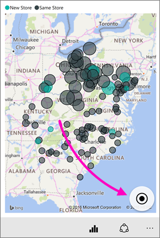

# Power BI 모바일 앱에서 타일 탐색
적용 대상:

|  |  |  |  |  |
|:--- |:--- |:--- |:--- |:--- |
| iPhone |iPad |Android 휴대폰 |Android 태블릿 |Windows 10 디바이스 |

타일은 데이터의 라이브 스냅샷이며 대시보드에 고정됩니다. 값은 데이터 변경에 따라 변경됩니다. **[Power BI 서비스에서 대시보드에 타일을 추가합니다](../end-user-tiles.md).** 

그런 다음 Power BI 모바일 앱에서 포커스 모드로 타일을 열고 상호 작용합니다. Bing 및 R에 기반한 타일을 포함하여 모든 종류의 시각적 개체로 타일을 열 수 있습니다.

## iOS 앱의 타일

1. [iOS용 모바일 앱에서 대시보드](mobile-apps-view-dashboard.md)를 엽니다.
2. 타일을 누릅니다. 타일 데이터를 쉽게 보고 탐색할 수 있는 포커스 모드로 열립니다. 포커스 모드에서는 다음 작업을 수행할 수 있습니다.
   
   꺾은선, 가로 막대 또는 열 차트를 눌러서 시각화의 특정 부분의 값을 봅니다.
   
    
   
   *예를 들어 이 꺾은선형 차트에서 선택한 값은 **금년 매출** 및 **작년 매출** 의 **8월** 값입니다.*  
   
   원형 차트에서는 원형 차트의 위에 조각의 값을 표시하려면 원형 차트의 조각을 누릅니다.  
   
   
3. 지도에서 **지도를 가운데로 이동** 아이콘 을 탭하여 사용자의 현재 위치를 가운데에 맞춥니다.

   

4. 연필 아이콘 을 탭하여 [타일에 주석을 달고](mobile-annotate-and-share-a-tile-from-the-mobile-apps.md#annotate-and-share-the-tile-report-or-visual) 공유 아이콘 을 탭하여 [다른 사용자와 공유](mobile-annotate-and-share-a-tile-from-the-mobile-apps.md#annotate-and-share-the-tile-report-or-visual)합니다.

5. [타일에 경고를 추가합니다](mobile-set-data-alerts-in-the-mobile-apps.md). 값이 대상을 초과하거나 미만인 경우 Power BI에서 알려 줍니다.

6. 경우에 따라 대시보드 작성자는 타일에 대한 링크를 추가합니다. 이렇게 하면 포커스 모드일 때 타일에 링크 아이콘  이 있습니다.
   
    
   
    링크를 누르면 다른 Power BI 대시보드나 외부 URL로 이동할 수 있습니다. [링크를 눌러](../../create-reports/service-dashboard-edit-tile.md#hyperlink) Power BI 앱 내에서 열 수 있습니다. 외부 사이트인 경우 허용할지 묻는 메시지가 표시됩니다.
   
    
   
    Power BI 앱에서 링크를 연 후 링크를 복사하고 대신 브라우저 창에서 열 수 있습니다.
7. 타일의 기반이 되는 [보고서](mobile-reports-in-the-mobile-apps.md) 를 엽니다.
8. 타일 포커스 모드에서 나오려면 타일 이름을 탭한 다음 대시보드 이름 또는 **내 작업 영역** 을 탭합니다.
   
    

## Android 휴대폰 및 태블릿용 모바일 앱의 타일
1. [Power BI 모바일 앱에서 대시보드](mobile-apps-view-dashboard.md)를 엽니다.
2. 타일을 탭하여 타일 데이터를 쉽게 보고 탐색할 수 있는 포커스 모드로 엽니다.
   
   
   
    포커스 모드에서는 다음 작업을 수행할 수 있습니다.
   
   * 차트를 눌러서 꺾은선형, 가로 막대형, 열 또는 거품 차트에서 가로 막대를 이동하거나 시각화에서 특정 지점에 대한 값을 봅니다.  
   * 연필 아이콘 을 탭하여 [타일에 주석을 달고](mobile-annotate-and-share-a-tile-from-the-mobile-apps.md#annotate-and-share-the-tile-report-or-visual) 스냅샷 공유 아이콘 을 탭하여 다른 사용자와 [공유](mobile-annotate-and-share-a-tile-from-the-mobile-apps.md#annotate-and-share-the-tile-report-or-visual)합니다.
   * 보고서 열기 아이콘 을 탭하여 모바일 앱에서 [보고서를 봅니다](mobile-reports-in-the-mobile-apps.md).
3. 경우에 따라 대시보드 작성자는 타일에 대한 링크를 추가합니다. 그러면 세로 줄임표( **...** )를 탭할 때 **링크 열기** 가 표시됩니다.
   
    
   
    링크를 누르면 다른 Power BI 대시보드나 외부 URL로 이동할 수 있습니다. [링크를 눌러](../../create-reports/service-dashboard-edit-tile.md#hyperlink) Power BI 앱 내에서 열 수 있습니다. 외부 사이트인 경우 허용할지 묻는 메시지가 표시됩니다.
   
    
   
    Power BI 앱에서 링크를 연 후 링크를 복사하고 대신 브라우저 창에서 열 수 있습니다.
4. 왼쪽 위에 있는 화살표를 눌러 타일을 닫고 대시보드로 돌아갑니다.

## Windows 10 모바일 앱의 타일

>[!NOTE]
>**Windows 10 Mobile을 사용하는 휴대폰** 용 Power BI 모바일 앱 지원은 2021년 3월 16일 중단될 예정입니다. [자세히 알아보기](/legal/powerbi/powerbi-mobile/power-bi-mobile-app-end-of-support-for-windows-phones)

1. Windows 10용 [Power BI 모바일 앱에서 대시보드](mobile-apps-view-dashboard.md)를 엽니다.
2. 타일의 세로 줄임표(...)를 탭합니다. 여기에서는 다음과 같은 작업을 할 수 있습니다. 
   
    
   
    [타일의 스냅샷을 공유](mobile-windows-10-phone-app-get-started.md)합니다.
   
    **보고서 열기** 를 탭하여 [기본 보고서를 봅니다](mobile-reports-in-the-mobile-apps.md).
   
    링크가 포함된 경우 [링크를 엽니다](../../create-reports/service-dashboard-edit-tile.md#hyperlink). 링크를 누르면 Power BI 대시보드나 외부 URL로 이동할 수 있습니다.
3. **타일 확장** 을 탭합니다. 타일 데이터를 쉽게 보고 탐색할 수 있는 포커스 모드로 열립니다. 이 모드에서는 다음 작업을 수행할 수 있습니다.
   
   원형 차트를 회전시켜서 조각의 값을 원형 차트 위쪽에 표시합니다.  
   
   
   
   차트를 눌러서 꺾은선형, 가로 막대형, 열 또는 거품 차트에서 가로 막대를 이동하거나 시각화에서 특정 지점에 대한 값을 봅니다.  
   
   
   
   *이 막대형 차트에서 **Decor** 바에 대한 값은 차트의 위쪽에 표시됩니다.*
   
   **프레젠테이션 모드로 전환** 아이콘 을 탭하여 탐색 및 메뉴 모음이 없는 프레젠테이션 모드로 타일을 엽니다.
   
   > [!NOTE]
   > Windows 10용 Power BI 모바일 앱에서 [프레젠테이션 모드로 대시보드와 보고서를 볼 수](mobile-windows-10-app-presentation-mode.md)도 있습니다.
   > 
   > 
   
   지도에서 **지도를 가운데로 이동** 아이콘 을 탭하여 사용자의 현재 위치를 가운데에 맞춥니다.
   
   
   
   스냅샷 공유 아이콘 을 탭하여 다른 사람과 [타일을 공유](mobile-windows-10-phone-app-get-started.md)합니다.   
   
   보고서 열기 아이콘 을 탭하여 타일의 기반이 되는 [보고서를 봅니다](mobile-reports-in-the-mobile-apps.md). 
4. 뒤로 화살표 또는 뒤로 단추를 탭하여 타일을 닫고 대시보드로 돌아갑니다.

## 다음 단계
* [Power BI란?](../../fundamentals/power-bi-overview.md)
* 질문이 있으신가요? [Power BI 커뮤니티에 질문합니다.](https://community.powerbi.com/)