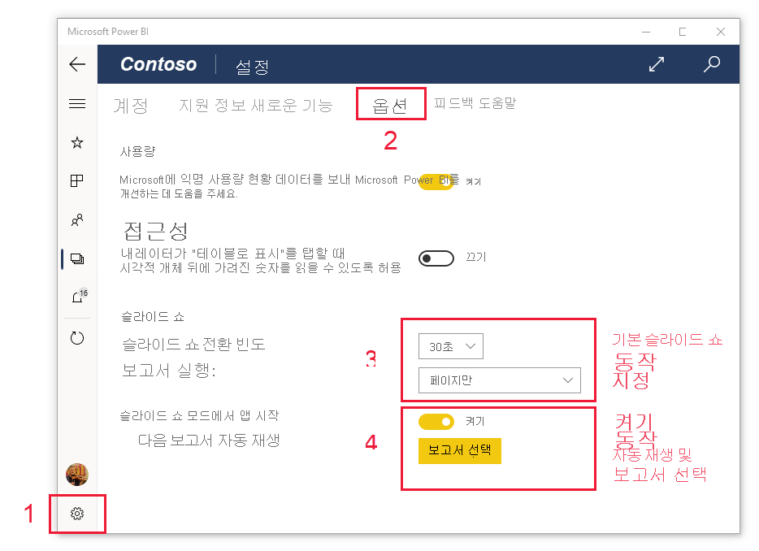

# Surface Hub 및 Windows 10 디바이스에서 프레젠테이션 모드로 보고서 및 대시보드 보기
프레젠테이션 모드를 사용하여 Windows 10 디바이스 및 Surface Hub에서 보고서와 대시보드를 전체 화면으로 표시할 수 있습니다. 프레젠테이션 모드는 모임이나 회의 또는 사무실의 전용 프로젝터에서 Power BI를 표시하거나 작은 화면 공간을 최대화하는 데 유용합니다.

프레젠테이션 모드:
* 모든 "chrome"(예: 탐색 및 메뉴 모음)이 사라져 보고서의 데이터에 더 쉽게 집중할 수 있습니다.
* 데이터와 상호 작용하고 프레젠테이션을 제어할 수 있는 작업 도구 모음을 사용할 수 있습니다.
* 페이지 간, 책갈피 간 또는 페이지와 책갈피 간에 자동 순환하는 슬라이드 쇼를 재생할 수 있습니다.

>[!NOTE]
>**Windows 10 Mobile을 사용하는 휴대폰**용 Power BI 모바일 앱 지원은 2021년 3월 16일 중단될 예정입니다. [자세히 알아보기](https://go.microsoft.com/fwlink/?linkid=2121400)

## 프레젠테이션 모드 사용
Power BI 모바일 앱에서 **전체 화면** 아이콘을 탭하여 전체 화면 모드로 이동합니다.
 chrome 앱이 사라지고 작업 도구 모음이 화면 아래쪽 또는 오른쪽과 왼쪽에 표시됩니다(화면 크기에 따라 다름).

도구 모음에서 탭하여 수행할 수 있는 작업은 다음과 같습니다.

|||
|-|-|
||이전 페이지로 **돌아갑니다**. 아이콘을 길게 탭하면 이동 경로 창이 열려 보고서나 대시보드가 있는 폴더로 이동할 수 있습니다.|
||프레젠테이션에서 보고서의 다른 페이지로 **페이지를 전환**합니다.|
||**책갈피를 적용**하여 해당 책갈피가 캡처하는 데이터의 특정 보기를 표시합니다. 개인 책갈피와 보고서 책갈피를 모두 적용할 수 있습니다.|
||Surface 펜으로 보고서 페이지에 그리거나 주석을 달 때 **잉크 색을 선택**합니다.|
||보고서 페이지에 그리거나 주석을 달기 위해 Surface 펜으로 만든 **잉크 표시를 지웁니다**.          |
||**기본 보기로 초기화**하고 프레젠테이션 중에 수행된 필터, 슬라이서 또는 기타 데이터 보기 변경 내용을 지웁니다.|
||프레젠테이션 보기의 이미지를 동료와 **공유**합니다. 이 이미지에는 프레젠테이션 중에 Surface 펜으로 작성된 주석이 포함됩니다.|
||보고서를 **새로 고칩니다**.|
||**슬라이드 쇼를 재생**하여 작업 모음을 숨기고 슬라이드 쇼를 시작합니다. 선택기를 사용하여 페이지 간, 책갈피 간 또는 페이지와 책갈피 간 자동 순환을 선택할 수 있습니다. 기본적으로 슬라이드 쇼는 30초마다 페이지 간 자동 순환합니다. 이러한 설정은 [**설정 > 옵션**](#slideshow-settings)에서 변경할 수 있습니다. 슬라이드 쇼에 대한 [자세한 내용](#slideshows)을 참조하세요.|
||프레젠테이션 모드를 **종료**합니다.|
||Power BI에서 다른 아티팩트를 **검색**합니다.|

도구 모음을 도킹 해제하고 끌어 화면 어디에나 놓을 수 있습니다. 이는 보고서의 특정 영역에 집중하고 그 옆에 사용할 수 있는 도구를 배치하려는 대형 화면에 유용합니다. 도구 모음 위에 손가락을 놓고 보고서 캔버스로 살짝 밀면 됩니다.

## 슬라이드 쇼

슬라이드 쇼를 재생하여 프레젠테이션을 자동으로 순환할 수 있습니다. 페이지나 책갈피 또는 페이지와 책갈피를 순환하도록 슬라이드 쇼를 설정할 수 있습니다.

작업 도구 모음에서 **재생** 단추를 선택하면 슬라이드 쇼가 시작됩니다. 슬라이드 쇼를 일시 중지하거나 재생 중인 항목(페이지나 책갈피 또는 페이지 및 책갈피)을 변경할 수 있는 컨트롤러가 나타납니다.

 컨트롤러는 현재 표시된 보기(페이지 또는 책갈피 및 페이지)의 이름을 표시합니다. 위의 이미지에서는 **Sales**라는 보고서에서 현재 **Sales Performance** 페이지의 **Asia Pacific** 책갈피를 보고 있습니다.

### 슬라이드 쇼 설정

기본적으로 슬라이드 쇼는 30초마다 한 페이지의 속도로 페이지를 순환합니다. 아래 그림과 같이 **설정 > 옵션**으로 이동하여 이러한 기본 설정을 변경할 수 있습니다.

## 다음 단계
* [Power BI 서비스에서 전체 화면 모드로 대시보드 및 보고서 표시](../end-user-focus.md)
* 궁금한 점이 더 있나요? [Power BI 커뮤니티에 질문합니다.](https://community.powerbi.com/)
