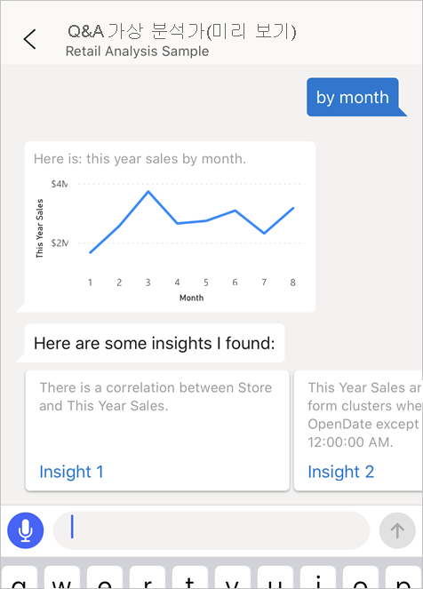
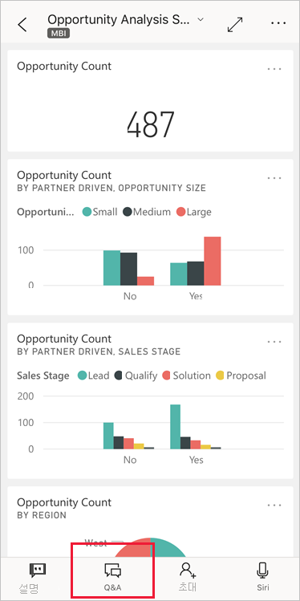

# 자습서:  Power BI iOS 앱의 질문 및 답변 가상 분석가를 통해 데이터에 대해 질문하기

데이터에 대해 가장 쉽게 알 수 있는 방법은 고유한 단어로 질문하는 것입니다. 이 자습서에서는 iPad 또는 iPhone의 Microsoft Power BI 모바일 앱에서 질문 및 답변 가상 분석가를 사용하여 샘플 데이터에 대해 질문하고 추천 인사이트를 봅니다. 

적용 대상:

|  |  |
|:--- |:--- |
| iPhone |iPad |

질문 및 답변 가상 분석가는 [Power BI 서비스](https://powerbi.com)에서 기본 질문 및 답변 데이터에 액세스하는 대화형 BI 환경입니다. 이 환경이 데이터 인사이트를 제안하면 사용자가 자신만의 질문을 입력하거나 말할 수 있습니다.

이 자습서에서는 다음을 수행합니다.

> [!div class="checklist"]
> * iOS용 Power BI 모바일 앱 설치
> * Power BI 샘플 대시보드 및 보고서 다운로드
> * 모바일 앱에서 제안하는 추천 인사이트 확인

## 필수 조건

* **Power BI 등록**: 아직 Power BI에 등록하지 않은 경우 시작하기 전에 [평가판에 등록합니다](https://app.powerbi.com/signupredirect?pbi_source=web).
* **iOS용 Power BI 앱 설치**: Apple App Store에서 iPad, iPhone 또는 iPod Touch로 [iOS 앱을 다운로드](https://apps.apple.com/app/microsoft-power-bi/id929738808)합니다. iOS용 Power BI 앱을 지원하는 버전은 다음과 같습니다.
  * iOS 11 이상이 설치된 iPad
  * iOS 11 이상이 설치된 iPhone 5 이상 
  * iOS 11 이상이 설치된 iPod Touch
* **샘플 데이터 다운로드**: 첫 번째 단계는 Power BI 서비스에 **기회 분석 샘플** 을 다운로드하는 것입니다. 이 작업을 수행하는 방법에 대한 지침은 [Power BI 서비스에서 내 작업 영역으로 샘플 다운로드](./mobile-apps-download-samples.md)를 참조하세요.

필수 조건을 완료하고 샘플 데이터를 다운로드했으면 iOS 디바이스에서 샘플을 볼 수 있습니다.

## 추천 정보 사용
1. iPhone 또는 iPad에서 Power BI 앱을 열고, 브라우저에서 Power BI 서비스에 사용한 것과 동일한 Power BI 계정 자격 증명으로 로그인합니다.

2. 홈페이지 탐색 모음에서 **작업 영역** 아이콘을 탭합니다.

    

3. 작업 영역 페이지가 열리면 **내 작업 영역**, **기회 분석 샘플** 대시보드를 차례로 탭하여 엽니다.

3. 기회 분석 샘플 대시보드에서 작업 메뉴의 질문 및 답변 가상 분석가 아이콘을 탭합니다.

    

    질문 및 답변 가상 분석가에서 시작하기 위한 몇 가지 제안을 제공합니다.

    

3. **featured insights** 를 탭합니다.

4. 질문 및 답변 가상 분석가에서 몇 가지 정보를 제안합니다. 오른쪽으로 스크롤하고 **insight 2** 를 탭합니다.

    

   질문 및 답변 가상 분석가에서 insight 2를 표시합니다.

    

5. 차트를 탭하여 포커스 모드에서 엽니다.

    

6. 왼쪽 위 모서리에 있는 화살표를 눌러 질문 및 답변 가상 분석가 환경으로 돌아갑니다.

## 리소스 정리

자습서를 마치면 기회 분석 샘플 대시보드, 보고서 및 데이터 세트를 삭제할 수 있습니다.

1. Power BI 서비스([Power BI 서비스](https://app.powerbi.com))를 열고 로그인합니다.

2. 탐색 창에서 **내 작업 영역** 을 선택합니다.

3. 대시보드 탭을 클릭한 다음, 기회 분석 샘플 줄에서 휴지통을 클릭합니다.

    

    이제 보고서 탭을 선택하고 동일한 작업을 수행합니다.

4. 이제 데이터 세트 탭을 선택하고 **기타 옵션**(...)을 클릭한 다음, **삭제** 를 선택합니다.

    

## 다음 단계

iOS용 Power BI 모바일 앱에서 질문 및 답변 가상 지원을 사용해 보았습니다. Power BI 서비스에서 질문 및 답변에 대해 자세히 알아보세요.
> [!div class="nextstepaction"]
> [Power BI 서비스에서 Q&A](../end-user-q-and-a.md)