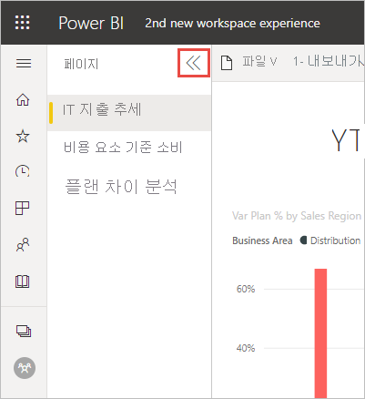

# Power BI 서비스의 ‘새 디자인’

Power BI 서비스(app.powerbi.com)의 디자인이 보고서를 더욱 편리하게 보고 조작할 수 있도록 변경되었습니다. 새 디자인은 더 간단하고 다른 친숙한 Microsoft 제품과 비슷하게 빌드되었습니다. Power BI 서비스 전체를 밝은 색 테마로 전환하고 아이콘을 업데이트하여 보고서 내용을 주요 포커스 지점으로 만들었습니다. 

**Power BI Desktop** 의 새 디자인에 대한 정보를 찾고 있나요? [Power BI Desktop에서 업데이트된 리본 사용](../create-reports/desktop-ribbon.md)을 참조하세요.

다음은 새 디자인에서 변경된 내용의 개요입니다. 자세한 내용은 번호를 매긴 섹션을 참조하세요.

특정 작업을 찾으십니까? [‘새 디자인’: 작업이 어디로 이동했나요?](service-new-look-where-actions.md)를 참조하세요.

## 1. 세로 페이지 목록 
읽기용 보기에서 보고서 페이지 이름이 세로 창의 목록에 나열됩니다. Word 및 PowerPoint의 탐색과 비슷하게 눈에 띄게 표시됩니다. 보고서 영역의 나머지 부분을 늘리거나 줄일 수 있습니다. 세로 창의 크기를 조정하거나 이중 화살표를 선택하여 함께 축소합니다.

보고서에 대한 편집 권한이 있는 경우 보고서 편집용 보기에서처럼 페이지 이름이 아래쪽에 오도록 설정할 수 있습니다. 자세한 내용은 “Power BI 보고서의 설정 변경” 문서에서 [페이지 창 설정](../create-reports/power-bi-report-settings.md#set-the-pages-pane)을 참조하세요.

## 2. 간소화된 작업 모음 

위쪽의 업데이트된 작업 모음에는 보고서 소비자와 가장 관련된 명령이 전면 중앙에 표시됩니다. 내보내기, 공유, Teams에서 채팅 및 구독을 더 쉽게 수행할 수 있습니다. 

## 3. 보고서 명령 위치

이전 디자인에서 제거된 기능은 없습니다. 기타 고급 명령을 보려면 **추가 옵션(...)** 을 선택합니다. [‘새 디자인’: 작업이 어디로 이동했나요?](service-new-look-where-actions.md)를 참조하세요.

## 4. 새 필터 환경

기본적으로 새 디자인에는 보고서에 대한 새 필터 창이 표시됩니다. 시각적 개체에 대한 필터 아이콘을 마우스로 가리키면 시각적 개체에 영향을 주는 모든 필터와 슬라이서가 표시됩니다.

## 보고서 정보 보기 

위쪽 배너에서 마지막 새로 고침 날짜, 연락처 정보 등의 세부 정보를 빠르게 확인합니다.  보고서에 대한 추가 정보를 보려면 메뉴를 엽니다. 보고서 소유자에게 메일을 보낼 수도 있습니다.

## 보고서 편집 모드는 변경되지 않음 

작성 환경은 Desktop의 환경과 유사하도록 유지되었습니다. 새 디자인 변경 내용은 읽기용 보기에만 적용됩니다.

## 대시보드 ‘새 디자인’ 환경 

대시보드도 간소화된 작업 모음을 포함합니다. 일관된 환경을 위해 보고서 및 앱과 유사하지만 기능적인 차이는 있습니다. 다음은 대시보드의 작업 연습입니다.
 

## 다음 단계

- [Power BI Desktop에서 업데이트된 리본 사용](../create-reports/desktop-ribbon.md)
- [작업 영역 '새 디자인' 옵트인](../collaborate-share/service-workspaces-new-look.md)
- [소비자용 Power BI](end-user-consumer.md)
