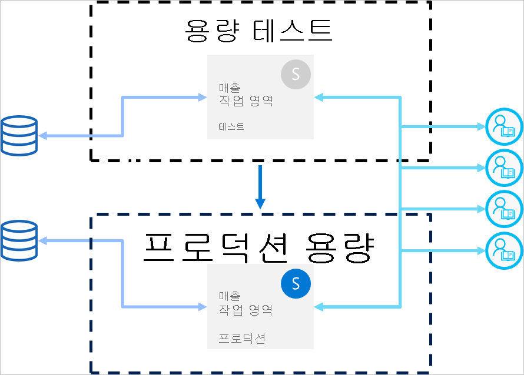

# 배포 파이프라인 모범 사례

이 문서에서는 콘텐츠를 수명 주기 전체에서 관리하는 BI 작성자를 위한 지침을 제공합니다. 여기서는 배포 파이프라인을 BI 콘텐츠 수명 주기 관리 도구로 활용하는 방법을 집중적으로 설명합니다.

이 문서는 4개 섹션으로 구분되어 있습니다.

* **콘텐츠 준비** - 수명 주기 관리를 위해 콘텐츠를 준비합니다.

* **개발** - 배포 파이프라인 개발 단계에서 콘텐츠를 만드는 최선의 방법을 알아봅니다.

* **테스트** - 배포 파이프라인 테스트 단계를 사용하여 환경을 테스트하는 방법을 이해합니다.

* **프로덕션** - 콘텐츠를 제공할 때 배포 파이프라인 프로덕션 단계를 활용합니다.

## 콘텐츠 준비

수명 주기 전체에서 지속적 관리를 위해 콘텐츠를 준비합니다. 다음 작업을 수행하기 전에 이 섹션의 정보를 검토해야 합니다.

* 콘텐츠를 프로덕션으로 릴리스

* 특정 작업 영역에 대한 배포 파이프라인 사용을 시작

* 작업을 게시

### 각 작업 영역을 전체 분석 패키지로 취급

이상적으로 작업 영역에는 조직의 한 가지 측면(예: 부서, 비즈니스 유닛, 프로젝트 또는 산업)에 대한 전체 보기가 포함되어야 합니다. 이렇게 하면 다양한 사용자의 사용 권한을 보다 쉽게 관리할 수 있으며 전체 작업 영역에 대한 콘텐츠 릴리스를 계획된 일정에 따라 제어할 수 있습니다.  

조직 전체에서 사용되는 [중앙 데이터 세트](../connect-data/service-datasets-across-workspaces.md)를 사용하는 경우 두 가지 유형의 작업 영역을 만드는 것이 좋습니다.

* **모델링 및 데이터 작업 영역** - 이러한 작업 영역에는 모든 중앙 데이터 세트가 포함됩니다.

* **보고 작업 영역** - 이러한 작업 영역에는 모든 종속 보고서 및 대시보드가 포함됩니다.

### 권한 모델 계획

배포 파이프라인은 고유한 [권한](deployment-pipelines-process.md#permissions)이 있는 Power BI 개체입니다. 또한 파이프라인에는 고유한 권한이 있는 작업 영역이 포함됩니다.

안전하고 쉬운 워크플로를 구현하려면 파이프라인의 각 부분에 액세스할 수 있는 사용자를 계획합니다. 몇 가지 고려할 사항이 있습니다.

* 파이프라인 액세스 권한이 있는 사용자는 누구인가요?

* 파이프라인 액세스 권한이 있는 사용자가 각 단계에서 수행할 수 있는 작업은 무엇인가요?

* 테스트 단계에서 콘텐츠를 검토하는 사람은 누구인가요?

* 테스트 단계 검토자가 파이프라인에 액세스할 수 있어야 하나요?

* 프로덕션 단계에 대한 배포를 감독하는 사람은 누구인가요?

* 어떤 작업 영역을 할당하나요?

* 어떤 단계에 작업 영역을 할당하나요?

* 할당하는 작업 영역의 권한을 변경해야 하나요?

### 각 단계를 서로 다른 데이터베이스에 연결

프로덕션 데이터베이스는 항상 안정적이고 사용 가능해야 합니다. 이 데이터베이스를 개발 또는 테스트 데이터 세트에 대해 BI 작성자가 생성한 쿼리로 오버로드하지 않는 것이 좋습니다. 개발 및 테스트를 위한 별도의 데이터베이스를 빌드합니다. 이렇게 하면 프로덕션 데이터가 보호되고 프로덕션 데이터의 전체 볼륨으로 개발 데이터베이스를 오버로드하지 않으므로 작업 속도가 느려질 염려가 없습니다.

>[!NOTE]
>조직에서 [공유 중앙 데이터 세트](../connect-data/service-datasets-share.md)를 사용하는 경우 이 권장 사항을 건너뛸 수 있습니다.

### 모델에 매개 변수 사용

Power BI 서비스에서는 데이터 세트 데이터 원본을 편집할 수 없기 때문에 정적 연결 문자열을 사용하는 대신 [매개 변수](/power-query/power-query-query-parameters)를 사용하여 인스턴스 이름 및 데이터베이스 이름과 같은 연결 정보를 저장하는 것이 좋습니다. 이렇게 하면 이후 단계에서 Power BI 서비스 웹 포털을 통해 또는 [API를 사용하여](/rest/api/power-bi/datasets/updateparametersingroup) 연결을 관리할 수 있습니다.

배포 파이프라인에서 매개 변수 규칙을 구성하여 개발, 테스트 및 프로덕션 단계에 특정 값을 설정할 수 있습니다.

연결 문자열에 매개 변수를 사용하지 않는 경우 지정된 데이터 세트에 대한 연결 문자열을 지정하는 데이터 원본 규칙을 정의할 수 있습니다. 그러나 배포 파이프라인에서 이것이 모든 데이터 원본에 대해 지원되지는 않습니다. 데이터 원본에 대한 규칙을 구성할 수 있는지 확인하려면 [데이터 세트 규칙 제한 사항](deployment-pipelines-get-started.md#dataset-rule-limitations)을 참조하세요.

매개 변수에는 쿼리, 필터 및 보고서에 표시되는 텍스트를 변경하는 등의 추가 용도가 있습니다.

## 개발

이 섹션에서는 배포 파이프라인 개발 단계를 사용하는 방법에 대한 지침을 제공합니다.

### Power BI Desktop을 사용하여 보고서 및 데이터 세트 편집

Power BI Desktop을 로컬 개발 환경으로 볼 수 있습니다. Power BI Desktop을 사용하여 보고서 및 데이터 세트에 대한 업데이트를 시도, 탐색 및 검토할 수 있습니다. 작업이 완료되면 개발 단계에 새 버전을 업로드할 수 있습니다. 다음과 같은 이유로 데스크톱에서 Power BI 서비스가 아니라 .pbix 파일을 편집하는 것이 좋습니다.

* 모든 변경 내용이 동일한 도구에서 수행되는 경우 동일한 .pbix 파일에서 동료 작성자와 공동 작업을 수행하기가 더 쉽습니다.

 * 온라인 변경을 수행하고 .pbix 파일을 다운로드한 다음 다시 업로드하면 보고서 및 데이터 세트 중복이 생성됩니다.

* 버전 제어를 사용하여 .pbix 파일을 최신 상태로 유지할 수 있습니다.

### .pbix 파일 버전 제어

보고서 및 데이터 세트의 버전 기록을 관리하려면 [Power BI와 OneDrive 간 자동 동기화](../connect-data/service-connect-to-files-in-app-workspace-onedrive-for-business.md)를 사용합니다. 그러면 파일이 항상 최신 버전으로 업데이트됩니다. 또한 필요한 경우 이전 버전을 검색할 수 있습니다.

>[!NOTE]
>배포 파이프라인 개발 단계에서는 .pbix 파일에만 OneDrive(또는 다른 리포지토리)와의 자동 동기화를 사용합니다. 배포 파이프라인 테스트 및 프로덕션 단계에서는 .pbix 파일을 동기화하지 않습니다. 그럴 경우 파이프라인 전체에서 콘텐츠를 배포하는 데 문제가 발생합니다.

### 모델링 개발과 보고서 및 대시보드 개발을 분리

엔터프라이즈 규모 배포의 경우 데이터 세트 개발과 보고서 및 대시보드 개발을 분리하는 것이 좋습니다. 보고서 또는 데이터 세트에 대한 변경 내용만 승격하려면 배포 파이프라인 선택적 배포 옵션을 사용합니다.  

이 방법은 데이터 세트 및 보고서에 대한 별도의 .pbix 파일을 만들어 Power BI Desktop에서 시작해야 합니다. 예를 들어, 데이터 세트 .pbix 파일을 만들고 개발 단계로 업로드할 수 있습니다. 나중에 보고서 작성자가 보고서에 대해서만 새 .pbix를 만들고 라이브 연결을 사용하여 [게시된 데이터 세트에 연결](../connect-data/service-datasets-discover-across-workspaces.md)할 수 있습니다. 이 기법을 사용하면 다양한 작성자가 모델링 및 시각화에 대해 개별적으로 작업을 수행하고 독립적으로 프로덕션에 배포할 수 있습니다.

[공유 데이터 세트](../connect-data/service-datasets-share.md)를 사용하여 작업 영역 전체에서 이 방법을 사용할 수도 있습니다.

### XMLA 읽기/쓰기 기능을 사용하여 모델 관리

모델링 개발을 보고서 및 대시보드 개발과 분리하면 원본 제어, diff 변경 내용 병합, 자동화된 프로세스와 같은 고급 기능을 사용할 수 있습니다. 개발 단계에서 이러한 변경 작업을 수행해야 완성된 콘텐츠를 테스트 및 프로덕션 단계에 배포할 수 있습니다. 이렇게 하면 변경 내용이 프로덕션 단계에 배포되기 전에 다른 종속 항목과 함께 통합 프로세스를 거칠 수 있습니다.

XMLA 읽기/쓰기 기능을 사용하여 외부 작업 영역에서 [공유 데이터 세트](../connect-data/service-datasets-share.md)를 관리하여 모델링 개발과 시각화를 분리할 수 있습니다. 공유 데이터 세트는 여러 파이프라인에서 관리되는 다양한 작업 영역의 여러 보고서에 연결할 수 있습니다.

## 테스트

이 섹션에서는 배포 파이프라인 테스트 단계를 사용하는 방법에 대한 지침을 제공합니다.

### 프로덕션 환경 시뮬레이션

새 보고서 또는 대시보드가 제대로 보이는지 확인하는 것 외에도 최종 사용자 관점에서 이들의 성능을 확인하는 것도 중요합니다. 배포 파이프라인 테스트 단계를 사용하면 테스트 목적으로 실제 프로덕션 환경을 시뮬레이션할 수 있습니다.

테스트 환경에서 다음 세 가지 요소가 충족되는지 확인합니다.

* 데이터 볼륨

* 사용 볼륨

* 프로덕션 환경과 비슷한 용량

테스트할 때 프로덕션 단계와 동일한 용량을 사용할 수 있습니다. 그러나 이렇게 하면 부하 테스트 중에 프로덕션이 불안정해질 수 있습니다. 프로덕션이 불안정해지는 것을 방지하려면 리소스에서 프로덕션 용량과 비슷한 다른 용량을 테스트용으로 사용합니다. 추가 비용을 방지하기 위해 [Azure A 용량](../developer/embedded/azure-pbie-create-capacity.md)을 사용하여 테스트 시간에 대해서만 비용을 지불할 수 있습니다.

### 실제 데이터 원본에 데이터 세트 규칙 사용

테스트 단계를 사용하여 실제 데이터 사용량을 시뮬레이트하는 경우 개발 및 테스트 데이터 원본을 분리하는 것이 좋습니다. 개발 데이터베이스는 비교적 작아야 하며 테스트 데이터베이스는 프로덕션 데이터베이스와 최대한 근사해야 합니다. [데이터 원본 규칙](deployment-pipelines-get-started.md#step-4---create-dataset-rules)을 사용하여 테스트 단계에서 데이터 원본을 전환합니다.

데이터 원본에서 가져오는 데이터의 양을 제어하는 것은 테스트 단계에서 프로덕션 데이터 원본을 사용하는 경우에 유용합니다. 이렇게 하려면 Power BI Desktop의 데이터 원본 쿼리에 매개 변수를 추가합니다. 매개 변수 규칙을 사용하여 가져온 데이터의 양을 제어하거나 매개 변수의 값을 편집합니다.
용량을 오버로드하지 않으려는 경우에도 이 방법을 사용할 수 있습니다.

### 성능 측정

프로덕션 단계를 시뮬레이트하는 경우 [보고서 로드 및 상호 작용을 확인](../guidance/monitor-report-performance.md)하고 변경한 내용이 영향을 미치는지 조사합니다.

또한 프로덕션으로 전환하기 전에 극단 부하를 발견할 수 있도록 [용량에 대한 부하를 모니터링](../admin/service-admin-premium-monitor-capacity.md)해야 합니다.  

>[!NOTE]
>프로덕션 단계에 업데이트를 배포한 후에는 용량 부하를 다시 모니터링하는 것이 좋습니다.

### 관련 항목 확인

관련 항목은 데이터 세트 또는 보고서의 변경으로 영향을 받을 수 있습니다. 테스트하는 동안 변경 내용이 업데이트된 항목에 종속될 수 있는 기존 항목의 성능에 영향을 주거나 손상시키지 않는지 확인합니다.

작업 영역 [계보 보기](../collaborate-share/service-data-lineage.md)를 사용하여 관련 항목을 쉽게 찾을 수 있습니다.

### 앱 테스트

앱을 통해 최종 사용자에게 콘텐츠를 배포하는 경우 프로덕션 환경에서 앱의 새 버전을 검토합니다. 각 배포 파이프라인 단계에 자체 작업 영역이 있으므로 개발 및 테스트 단계를 위해 손쉽게 앱을 게시하고 업데이트할 수 있습니다. 이렇게 하면 최종 사용자 관점에서 앱을 테스트할 수 있습니다.

>[!IMPORTANT]
>배포 프로세스에는 앱 콘텐츠 또는 설정 업데이트가 포함되지 않습니다. 콘텐츠 또는 설정에 변경 내용을 적용하려면 필요한 파이프라인 단계에서 수동으로 앱을 업데이트해야 합니다.

## 생산

이 섹션에서는 배포 파이프라인 프로덕션 단계에 대한 지침을 제공합니다.

### 프로덕션 환경에 배포할 수 있는 사용자 관리

프로덕션에 대한 배포는 신중하게 처리해야 하므로 특정 사용자만 이 중요한 작업을 관리하도록 하는 것이 좋습니다. 그러나 특정 작업 영역의 모든 BI 작성자가 파이프라인에 액세스할 수 있도록 하려는 경우가 있습니다. 프로덕션 [작업 영역 권한](deployment-pipelines-process.md#permissions)을 사용하여 이를 관리할 수 있습니다.  

단계 간에 콘텐츠를 배포하려면 사용자가 두 단계 모두에서 구성원 또는 관리자 권한을 보유해야 합니다. 프로덕션에 배포할 사용자에게만 프로덕션 작업 영역 권한이 있어야 합니다. 다른 사용자에게는 프로덕션 작업 영역 참가자 또는 뷰어 역할이 있을 수 있습니다. 이러한 사용자는 파이프라인 내에서 콘텐츠를 볼 수는 있지만 배포할 수는 없습니다.

또한 콘텐츠 작성 프로세스에 참여하는 사용자에게만 파이프라인 권한을 사용하도록 설정하여 파이프라인 액세스를 제한해야 합니다.

### 프로덕션 단계 가용성을 보장하는 규칙 설정

[데이터 세트 규칙](deployment-pipelines-get-started.md#step-4---create-dataset-rules)은 프로덕션 데이터가 항상 연결되어 있고 사용 가능하도록 보장하는 강력한 방법입니다. 데이터 세트 규칙이 적용되면 배포는 최종 사용자가 방해 없이 관련 정보를 볼 수 있다는 확신 하에 실행될 수 있습니다.

데이터 세트에 정의된 데이터 원본 및 매개 변수에 대한 프로덕션 데이터 세트 규칙을 설정해야 합니다.

### 프로덕션 앱 업데이트

파이프라인 내 배포는 작업 영역 콘텐츠를 업데이트하지만 연결된 앱은 자동으로 업데이트하지 않습니다. 콘텐츠 배포를 위해 앱을 사용하는 경우 프로덕션에 배포한 후 앱을 업데이트하여 최종 사용자가 즉시 최신 버전을 사용할 수 있도록 해야 합니다.  

### 콘텐츠에 대한 빠른 수정

프로덕션 환경에 빠른 수정이 필요한 버그가 있는 경우에는 새 .pbix 버전을 프로덕션 단계에 직접 업로드하거나 Power BI 서비스에서 온라인으로 변경하지 않는 것이 좋습니다. 해당 단계에 이미 콘텐츠가 있는 경우에는 테스트 및 개발 단계에 대한 이전 단계 배포가 가능하지 않습니다. 또한 먼저 테스트하지 않고 픽스를 배포하는 것은 좋지 않은 방법입니다. 따라서 이 문제를 처리하는 올바른 방법은 개발 단계에서 픽스를 구현하고 나머지 배포 파이프라인 단계를 거치는 것입니다. 이렇게 하면 프로덕션 환경에 배포하기 전에 픽스가 유효한지 확인할 수 있습니다. 파이프라인을 통해 배포하는 데 몇 분 밖에 걸리지 않습니다.

## 다음 단계

>[!div class="nextstepaction"]
>[배포 파이프라인 소개](deployment-pipelines-overview.md)

>[!div class="nextstepaction"]
>[배포 파이프라인 시작](deployment-pipelines-get-started.md)

>[!div class="nextstepaction"]
>[배포 파이프라인 프로세스 이해](deployment-pipelines-process.md)

>[!div class="nextstepaction"]
>[배포 파이프라인 문제 해결](deployment-pipelines-troubleshooting.md)