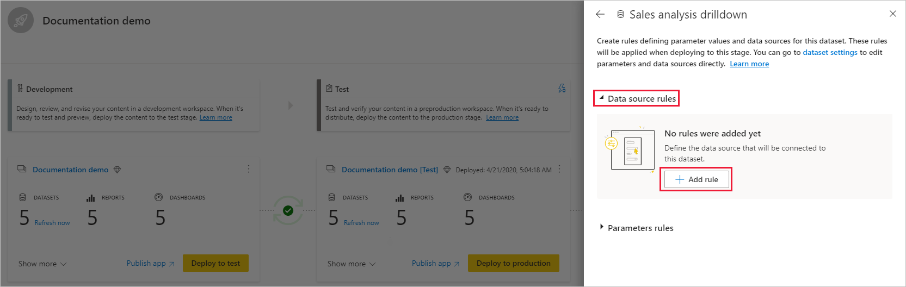

# 배포 파이프라인 시작(미리 보기)

이 문서에서는 배포 파이프라인을 사용하는 데 필요한 기본 설정을 안내합니다.

## 배포 파이프라인 액세스

다음 조건이 충족되는 경우 배포 파이프라인 기능에 액세스할 수 있습니다.

* Power BI [Pro 사용자](../admin/service-admin-purchasing-power-bi-pro.md)입니다.

* 프리미엄 용량을 보유한 조직에 속해 있습니다.

* [새 작업 영역 환경](../collaborate-share/service-create-the-new-workspaces.md)의 관리자입니다.

>[!NOTE]
> 또한 이전에 파이프라인을 만들었거나 파이프라인이 공유된 경우에도 배포 파이프라인 단추를 볼 수 있습니다.

## 1단계 - 배포 파이프라인 만들기

배포 파이프라인을 만들려면 다음을 수행합니다.

1. Power BI 서비스의 탐색 창에서 **배포 파이프라인**을 선택하고 **파이프라인 만들기**를 클릭합니다.

2. ‘배포 파이프라인 만들기’ 대화 상자에서 파이프라인의 이름 및 설명을 입력하고 **만들기**를 클릭합니다.

파이프라인이 생성되면 다른 사용자와 공유하거나 삭제할 수 있습니다. 다른 사용자와 파이프라인을 공유하는 경우 파이프라인을 공유하는 사용자에게 [파이프라인 액세스 권한](deployment-pipelines-process.md#user-with-pipeline-access)이 제공됩니다. 파이프라인 액세스 권한이 있는 사용자는 파이프라인을 보고, 공유하고, 편집하고, 삭제할 수 있습니다.

## 2단계 - 배포 파이프라인에 작업 영역 할당

파이프라인을 만든 후에는 파이프라인에 관리하려는 콘텐츠를 추가해야 합니다. 파이프라인 단계에 작업 영역을 할당하여 파이프라인에 콘텐츠를 추가합니다. 모든 단계에 작업 영역을 할당할 수 있습니다. 

배포 파이프라인에 작업 영역 하나를 할당할 수 있습니다. 배포 파이프라인은 파이프라인의 다른 단계에서 사용할 작업 영역 콘텐츠의 복제본을 만듭니다.

배포 파이프라인에서 작업 영역을 할당하려면 다음 단계를 수행합니다.

1. 새로 만든 배포 파이프라인에서 **작업 영역**할당을 클릭합니다.

2. ‘작업 영역 선택’ 드롭다운 메뉴에서 파이프라인에 할당할 작업 영역을 선택합니다.

3. 작업 영역을 할당하려는 단계를 선택합니다.

### 작업 영역 할당 제한 사항

* 작업 영역이 [새 작업 영역 환경](../collaborate-share/service-create-the-new-workspaces.md)이어야 합니다.

* 작업 영역의 관리자여야 합니다.

* 작업 영역이 다른 파이프라인에 할당되지 않았습니다.

* 작업 영역이  [프리미엄 용량](../admin/service-premium-what-is.md)에 있어야 합니다.

* [Power BI 샘플](../create-reports/sample-datasets.md)이 포함된 작업 영역은 파이프라인 단계에 할당할 수 없습니다.

>[!NOTE]
>배포 파이프라인과 함께 사용할 수 있는 작업 영역만 선택할 수 있는 작업 영역 목록에 표시됩니다.

## 3단계 - 빈 단계에 배포

원본 작업 영역의 구성원 또는 관리자인 모든 [Pro 사용자](../admin/service-admin-purchasing-power-bi-pro.md)는 빈 단계(콘텐츠가 포함되지 않은 단계)에 콘텐츠를 배포할 수 있습니다. 배포가 완료되려면 작업 영역이 용량에 있어야 합니다.

빈 단계에 콘텐츠를 배포하는 경우 항목 간의 관계가 유지됩니다. 예를 들어 원본 단계에서 데이터 세트에 바인딩된 보고서는 해당 데이터 세트와 함께 복제되고 복제본은 대상 작업 영역에서 유사하게 바인딩됩니다.

배포가 완료되면 데이터 세트를 새로 고칩니다. 자세한 내용은 [빈 단계에 콘텐츠 배포](deployment-pipelines-process.md#deploying-content-to-an-empty-stage)를 참조하세요.

### 모든 콘텐츠 배포

배포할 단계를 선택하고 배포 단추를 클릭합니다. 배포 프로세스가 대상 단계에서 중복 작업 영역을 만듭니다. 이 작업 영역에는 현재 단계의 기존 콘텐츠가 모두 포함됩니다.

### 선택적 배포

특정 항목만 배포하려면 **자세히 표시** 링크를 클릭하고 배포하려는 항목을 선택합니다. 배포 단추를 클릭하면 선택한 항목만 다음 단계에 배포됩니다.

대시보드, 보고서 및 데이터 세트는 서로 관련되어 있고 종속성이 있으므로 관련 항목 선택 단추를 사용하여 해당 항목이 종속된 모든 항목을 확인할 수 있습니다. 예를 들어 보고서를 다음 단계에 배포하려는 경우 관련 항목 선택 단추를 클릭하면 보고서가 연결된 데이터 세트가 표시되므로 두 항목을 모두 한 번에 배포하고 보고서가 중단되지 않습니다.

>[!NOTE]
> * 보고서 또는 대시보드는 이들이 종속된 항목이 대상 단계에 존재하지 않는 경우 다음 단계에 배포할 수 없습니다.
> * 데이터 세트 없이 보고서 또는 대시보드를 배포하도록 선택하면 예기치 않은 결과가 발생할 수 있습니다. 이 문제는 대상 단계에서 데이터 세트가 변경되어 더 이상 원본 단계의 데이터 세트와 동일하지 않을 때 발생할 수 있습니다.

### 이전 단계 배포

이전 단계에 배포하도록 선택할 수 있습니다. 예를 들어 기존 작업 영역을 프로덕션 단계에 할당한 다음, 먼저 테스트 단계에 배포하고 그런 다음에 개발 단계에 배포하는 시나리오입니다.

이전 단계 배포는 이전 단계에 콘텐츠가 없는 경우에만 가능합니다. 이전 단계에 배포할 때는 특정 항목을 선택할 수 없습니다. 해당 단계의 모든 콘텐츠가 배포됩니다.

## 4단계 - 데이터 세트 규칙 만들기

배포 파이프라인에서 작업하는 경우 각 단계마다 구성이 다를 수 있습니다. 예를 들어 각 단계에 서로 다른 데이터베이스 또는 쿼리 매개 변수가 있을 수 있습니다. 개발 단계는 데이터베이스에서 샘플 데이터를 쿼리하지만 테스트 및 프로덕션 단계는 전체 데이터베이스를 쿼리할 수 있습니다.

파이프라인 단계 간에 콘텐츠를 배포하는 경우 데이터 세트 규칙을 구성하면 일부 설정을 그대로 유지하면서 콘텐츠를 변경할 수 있습니다.

데이터 세트 규칙은 각 데이터 세트에서 데이터 원본 및 매개 변수에 정의됩니다. 특정 데이터 세트에 대한 데이터 원본 또는 매개 변수의 값을 결정합니다. 예를 들어 프로덕션 단계의 데이터 세트가 프로덕션 데이터베이스를 가리키도록 하려면 이에 대한 규칙을 정의할 수 있습니다. 규칙은 적절한 데이터 세트 아래에 있는 프로덕션 단계에서 정의됩니다. 규칙을 정의하면 테스트에서 프로덕션으로 배포된 콘텐츠는 데이터 세트 규칙에 정의된 값을 상속하며, 규칙이 변경되지 않고 유효한 경우 항상 적용됩니다.

>[!NOTE]
> 데이터 세트 규칙은 원본 및 대상 데이터 원본의 형식이 같을 때만 작동합니다.

### 데이터 세트 규칙 만들기

1. 데이터 세트 규칙을 만들려는 파이프라인 단계에서 **배포 설정**를 클릭합니다.

    

2. 배포 설정 창에서 규칙을 만들 데이터 세트를 선택합니다.

    

3. 만들려는 규칙의 유형을 선택하고 목록을 확장 한 다음 **규칙 추가**를 클릭합니다.

     

### 데이터 세트 규칙 유형

다음과 같은 두 가지 유형의 규칙을 만들 수 있습니다.

* **데이터 원본 규칙** 원본 파이프라인 단계의 데이터 세트에서 데이터 원본 목록을 가져옵니다. 데이터 원본 목록에서 바꿀 데이터 원본을 선택합니다. 다음 방법 중 하나를 사용하여 원본 단계에서 바꿀 값을 하나 선택합니다.

    1. 목록에서 선택합니다.

    2. **기타**를 클릭하고 새 데이터 원본을 수동으로 추가합니다. 동일한 형식의 데이터 원본으로만 변경할 수 있습니다.

* **매개 변수 규칙** 매개 변수 목록에서 매개 변수를 선택합니다. 현재 값이 표시됩니다. 값을 각 배포 후 적용하려는 값으로 편집합니다.

### 데이터 세트 규칙 제한 사항

* 데이터 세트 규칙을 만들려면 데이터 세트 소유자여야 합니다.

* 개발 단계에서는 데이터 세트 규칙을 만들 수 없습니다.

* 항목이 제거 또는 삭제되면 해당 규칙도 삭제됩니다. 이러한 규칙은 복원할 수 없습니다.

* 규칙에 정의된 데이터 원본 또는 매개 변수가 원본 데이터 세트에서 변경되거나 제거되면 규칙이 유효하지 않게 되고 배포가 실패합니다.

* 데이터 원본 규칙은 다음 데이터 원본에 대해서만 정의할 수 있습니다.
    * Azure Analysis Services
    * SSAS(SQL Server Analysis Services)
    * Azure SQL Server
    * 데이터베이스 가져오기
    * Odata 피드
    * Oracle
    * SapHana (직접 쿼리 모드가 아닌 가져오기 모드에서만 지원됨)
    * SharePoint
    * Teradata

    다른 데이터 원본의 경우에는 [매개 변수를 사용하여 데이터 원본을 구성](deployment-pipelines-best-practices.md#use-parameters-in-your-model)하는 것이 좋습니다.

## 5단계 - 한 단계에서 다른 단계로 콘텐츠 배포

콘텐츠를 한 파이프라인 단계에 배포했으면 이를 다음 단계에 배포할 수 있습니다. 다른 단계에 콘텐츠를 배포하는 작업은 일반적으로 파이프라인에서 일부 작업을 수행한 후에 진행됩니다. 예를 들어 개발 단계에서 콘텐츠를 변경하거나 테스트 단계에서 콘텐츠를 테스트하는 등의 작업입니다. 단계 간에 콘텐츠를 이동하는 일반적인 워크플로는 개발 단계에서 테스트 단계로, 그런 다음 테스트 단계에서 프로덕션 단계로의 이동입니다. 이 프로세스에 대한 자세한 내용은 [기존 작업 영역에 콘텐츠 배포](deployment-pipelines-process.md#deploy-content-to-an-existing-workspace) 섹션에서 확인할 수 있습니다.

배포 파이프라인의 다음 단계에 콘텐츠를 배포하려면 단계의 아래쪽에서 배포 단추를 클릭합니다.

테스트 및 프로덕션 단계 카드를 검토할 때 마지막 배포 시간을 확인할 수 있습니다. 이는 콘텐츠가 단계에 배포된 마지막 시간을 나타냅니다.

배포 시간은 단계가 마지막으로 업데이트된 시점을 설정하는 데 유용합니다. 테스트 및 프로덕션 배포 간의 시간을 추적하려는 경우에도 유용할 수 있습니다.

## 단계 비교

두 개의 순차 단계에 콘텐츠가 포함된 경우 콘텐츠 항목 메타데이터를 기준으로 콘텐츠가 비교됩니다. 이러한 비교에는 단계 간 데이터 또는 새로 고침 시간 비교가 포함되지 않습니다.

 

두 순차 단계 간의 차이점을 시각적으로 신속하게 파악할 수 있도록 비교 아이콘 표시기가 그 사이에 표시됩니다. 비교 표시기에는 두 가지 상태가 있습니다.

* **녹색 표시기** – 두 단계의 각 콘텐츠 항목에 대한 메타데이터가 동일합니다.

* **주황색 표시기** - 다음 조건 중 하나가 충족되는 경우 나타납니다.
    * 각 단계의 콘텐츠 항목 중 일부가 변경되었거나 업데이트되었습니다(메타데이터가 다름).
    * 단계 간에 항목 수가 다릅니다.

두 개의 순차 단계가 동일하지 않은 경우에는 **비교** 링크가 주황색 비교 아이콘 아래에 표시됩니다. 이 링크를 클릭하면 비교 보기에서 두 단계의 콘텐츠 항목 목록이 열립니다. 비교 보기를 사용하면 각 파이프라인 단계에서 항목의 변경 내용 또는 차이점을 추적할 수 있습니다. 변경된 항목에는 다음 레이블 중 하나가 지정됩니다.

* **새 항목** – 원본 단계의 새 항목입니다. 이것은 대상 단계에는 없는 항목입니다. 배포 후 이 항목은 대상 단계에 복제됩니다.

* **다름** – 원본 및 대상 단계 모두에 존재하고 마지막 배포 후 변경된 버전 중 하나인 항목입니다. 배포 후 원본 단계의 항목은 변경이 적용된 위치에 관계없이 대상 단계에서 항목을 덮어씁니다.

* **누락** - 이 레이블은 항목이 대상 단계에는 있지만 원본 단계에는 없음을 나타냅니다.

    >[!NOTE]
    >배포는 ‘누락’ 항목에 영향을 주지 않습니다.

 

## 콘텐츠 재정의

원본 단계에서 콘텐츠를 변경한 후 배포하면 대상 단계에 있는 변경된 콘텐츠가 덮어쓰여집니다. ‘배포’를 클릭하면 덮어쓰여질 항목 수를 나열하는 경고가 표시됩니다.

[배포 프로세스 이해](deployment-pipelines-process.md)에서 [다음 단계에 복사되는 항목](deployment-pipelines-process.md#deployed-items)과 [복사되지 않는 항목](deployment-pipelines-process.md#unsupported-items)에 대한 자세한 내용을 확인할 수 있습니다.

## 다음 단계

>[!div class="nextstepaction"]
>[배포 파이프라인 소개](deployment-pipelines-overview.md)

>[!div class="nextstepaction"]
>[배포 파이프라인 프로세스 이해](deployment-pipelines-process.md)

>[!div class="nextstepaction"]
>[배포 파이프라인 문제 해결](deployment-pipelines-troubleshooting.md)

>[!div class="nextstepaction"]
>[배포 파이프라인 모범 사례](deployment-pipelines-best-practices.md)
