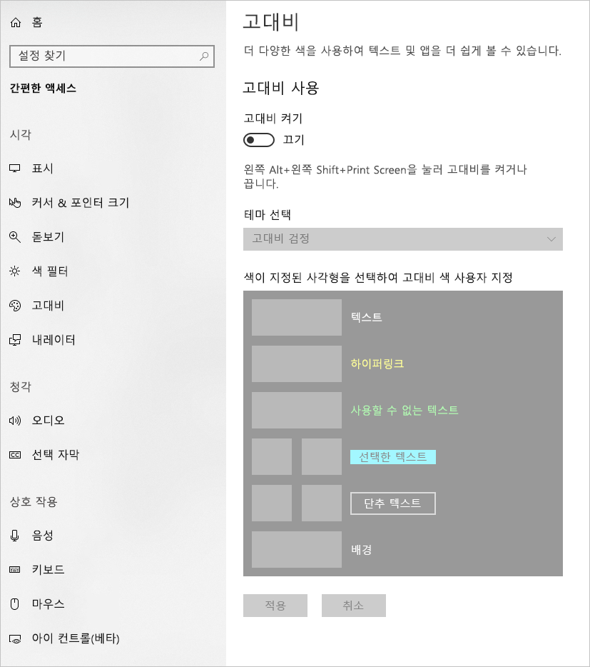
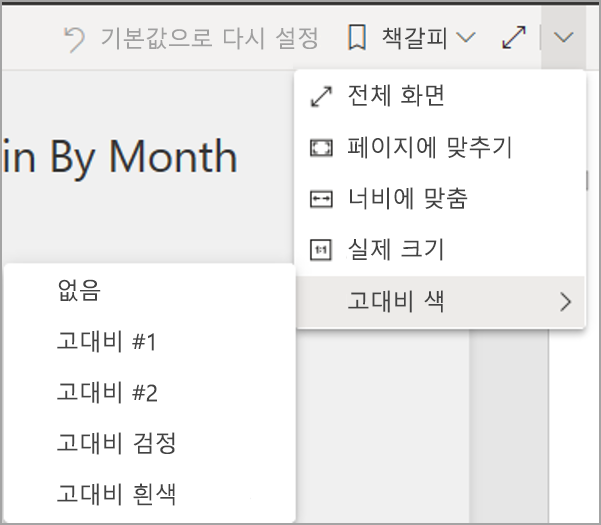
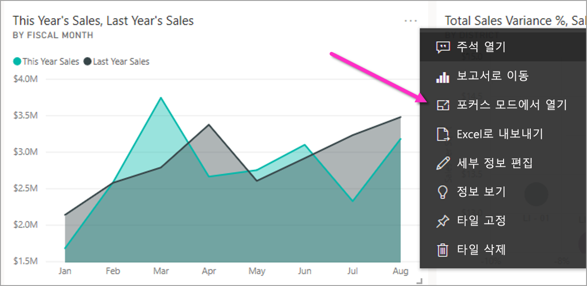
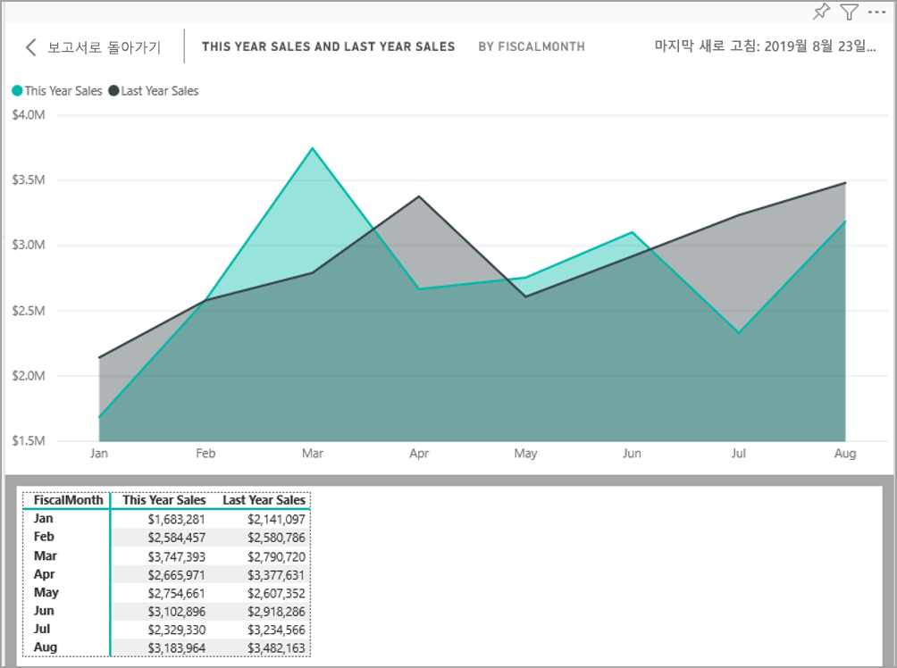
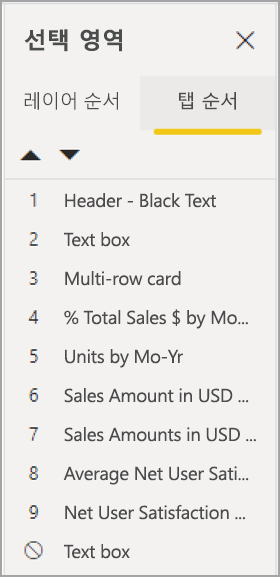
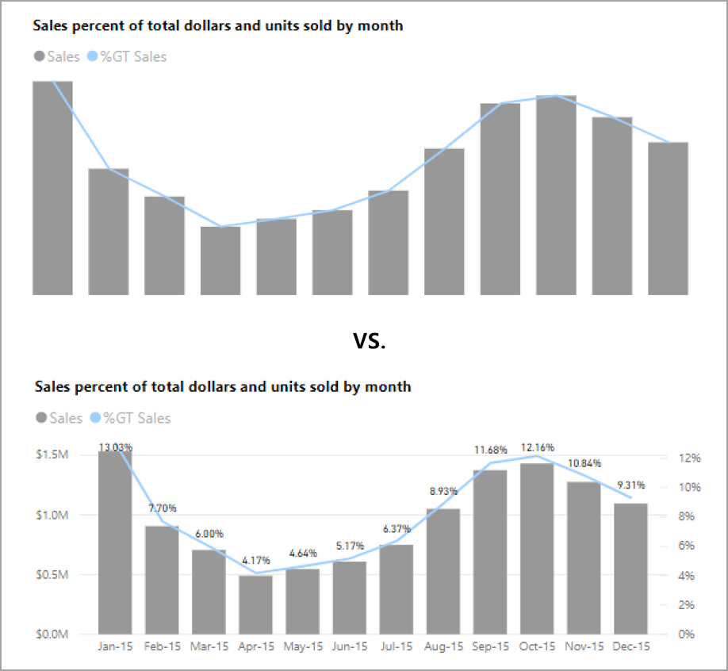
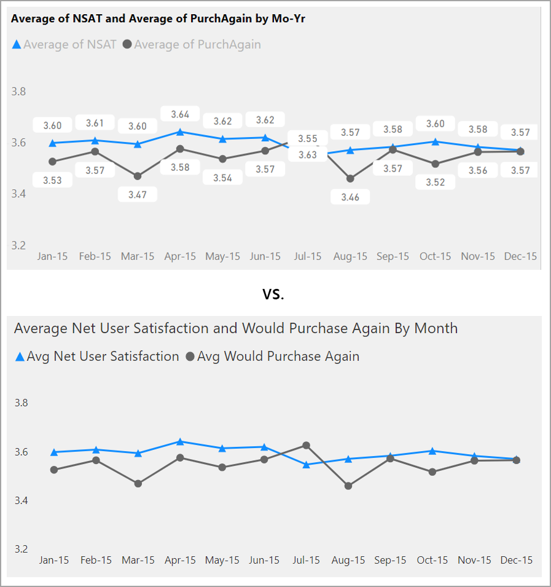
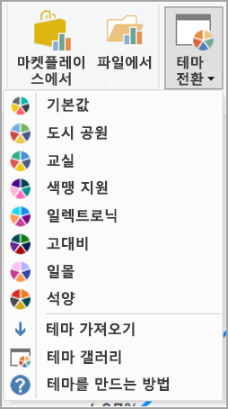

# 접근성을 지원하는 Power BI 보고서 디자인
접근성을 지원하는 동시에 매력적인 보고서를 디자인하고 만들 수 있습니다. 대상 그룹과 관계없이 보고서를 작성할 때는 항상, 특별한 디자인에 맞게 조정하지 않고도 최대한 많은 사람이 사용할 수 있도록 보고서를 만들어야 합니다.

이 문서에서는 Power BI에서 접근성 있는 보고서를 만들기 위한 접근성 기능과 도구를 설명합니다.

일반적으로 Power BI를 화면 판독기와 함께 사용할 때는 스캔 모드 또는 찾아보기 모드를 끄는 것이 좋습니다.

화면 판독기를 사용하여 보고서를 작성하는 프로세스를 개선하기 위해 상황에 맞는 메뉴를 사용할 수 있습니다. 메뉴를 통해 필드를 **필드** 목록의 위 또는 아래로 이동할 수 있습니다. **범례** 또는 **값**과 같은 다른 위치로 필드를 이동할 수도 있습니다.

## 접근성 기능 유형

Power BI에서는 접근성 있는 보고서를 만드는 기능을 제공하지만, 보고서 작성자가 해당 기능을 보고서에 통합해야 합니다. 이 문서에서는 다음 세 가지 범주의 접근성 기능을 설명합니다.

* 기본 제공 접근성 기능(구성 필요 없음)
* 기본 제공 접근성 기능(구성 필요)
* 기타 팁과 고려 사항

다음 섹션에서는 이러한 각 범주를 설명합니다.

## 기본 제공 접근성 기능

Power BI 제품에는 보고서 작성자가 구성할 필요가 없는 기본 제공 접근성 기능이 있습니다. 해당 기능은 다음과 같습니다.

* 키보드 탐색
* 화면 읽기 프로그램 호환성
* 고대비 색 보기
* 포커스 모드
* 데이터 테이블 표시

보고서 사용 환경을 개선하는 기능도 있습니다. 이러한 기능을 설명하는 문서는 이 문서의 끝에 있는 [다음 단계](#next-steps) 섹션에서 확인할 수 있습니다.

각 기본 제공 접근성 기능을 차례로 살펴봅시다. 

### 키보드 탐색

보고서 작성자는 소비자가 키보드를 사용하여 보고서를 살펴볼 수 있는지 걱정하지 않아도 됩니다. Power BI 시각적 개체는 모두 키보드 탐색이 가능하며, 보고서 사용자가 시각적 개체의 데이터 요소를 단계별로 진행하고, 페이지 탭 간에 전환하며, 교차 강조 표시, 필터링, 조각화 등의 대화형 기능에 액세스할 수 있습니다.

보고서 사용자가 보고서를 탐색하면 포커스가 표시되어 보고서에서 사용자 위치를 나타냅니다. 사용 중인 브라우저에 따라 포커스 모드가 다르게 나타날 수도 있습니다.

자주 사용하는 바로 가기 키에 액세스하려면 *?* 키를 눌러 바로 가기 키 대화 상자를 표시할 수 있습니다. 자세히 알아보려면 이 문서의 끝에 있는 [다음 단계](#next-steps) 섹션에서 접근성 있는 사용 환경 및 바로 가기 키에 대한 문서를 참조하세요.

### 화면 읽기 프로그램 호환성

일반적으로 키보드 탐색 기능이 있는 Power BI의 모든 개체는 화면 읽기 프로그램과도 호환됩니다. 보고서 사용자가 시각적 개체로 이동하면 화면 읽기 프로그램은 제목, 시각적 개체 유형, 대체 텍스트(설정된 경우)를 소리 내어 읽습니다.

### 고대비 색 보기

Power BI에는 보고서의 고대비 지원 기능이 있습니다. Windows에서 고대비 모드를 사용하는 경우, Power BI Desktop은 Windows에서 사용 중인 고대비 테마를 자동으로 검색하고 해당 설정을 보고서에 적용합니다. 이러한 고대비 색은 Power BI 서비스나 다른 곳에 게시될 때도 보고서와 함께 이동합니다.

또한 Power BI 서비스는 Windows용으로 선택된 고대비 설정을 검색하려고 하지만, 얼마나 효과적이고 정확한지는 Power BI 서비스에 사용되는 브라우저에 따라 다릅니다. Power BI 서비스에서 테마를 수동으로 설정하려면 오른쪽 위에 있는  **> 고대비 색**을 선택한 다음, 보고서에 적용할 테마를 선택할 수 있습니다.

### 포커스 모드
보고서 사용자가 대시보드에서 시각적 개체를 보고 있는 경우 시각적 개체의 상황에 맞는 메뉴로 이동한 다음, **포커스 모드에서 열기**를 선택하면 시각적 개체를 펼쳐 화면을 더 채울 수 있습니다.

### 데이터 테이블 표시
보고서 사용자는 **Alt+Shift+F11**을 눌러 시각적 개체의 데이터를 표 형식으로 볼 수도 있습니다. 이 테이블은 시각적 개체의 상황에 맞는 메뉴에서 **데이터 표시**를 누른 경우와 유사하지만, 화면 읽기 프로그램이 적용됩니다.

## 구성이 필요한 기본 제공 접근성 기능

Power BI 제품에는 보고서 작성자의 구성이 필요한 기본 제공 접근성 기능이 있습니다.  해당 기능은 다음과 같습니다.

* 대체 텍스트
* 탭 순서
* 제목 및 레이블
* 표식
* 보고서 테마

## 대체 텍스트

대체 텍스트(대체 텍스트 설명)는 화면 읽기 프로그램 사용자에게 보고서 페이지의 시각적 개체와 이미지의 모양 및 기능을 설명하는 데 사용됩니다. 보고서 작성자는 보고서에 대한 의미 있는 정보를 전달하는 대체 텍스트를 모든 개체에 추가해야 합니다. 대체 텍스트를 제공하면 보고서 사용자가 시각적 개체, 이미지, 셰이프 또는 텍스트 상자를 볼 수 없더라도 시각적 개체로 전달하려는 내용을 잘 파악할 수 있습니다. 시각적 개체, 셰이프 등의 개체를 선택하고 **시각화** 창에서 **서식** 섹션을 선택한 다음, **일반**을 펼치고 아래로 스크롤해서 **대체 텍스트** 텍스트 상자에 입력하면 Power BI Desktop 보고서의 모든 개체에 대체 텍스트를 제공할 수 있습니다. **대체 텍스트** 텍스트 상자에는 250자까지 입력할 수 있습니다.

대체 텍스트에는 시각적 개체를 통해 보고서 소비자에게 전달하려는 인사이트에 관한 정보가 포함되어야 합니다. 화면 읽기 프로그램이 시각적 개체의 제목과 유형을 소리 내어 읽어주므로 설명만 입력하면 됩니다. 다음 시각적 개체의 대체 텍스트 예제는 다음과 같습니다. *‘판매된 제품 색상별 순 사용자 만족도이며, 제품 클래스별로 자세히 분석되었습니다.’*

Power BI의 데이터는 동적이므로 인사이트나 특정 데이터 요소를 소리 내어 읽는 기능을 정적 대체 텍스트에 넣는 것은 최선의 선택이 아닐 수 있습니다. 동적 대체 텍스트를 사용하려는 경우 대체 텍스트의 조건부 서식을 설명하는 다음 섹션을 참조하세요.

### 대체 텍스트의 조건부 서식

Power BI를 매력적이게 하는 한 가지 기능은 해당 데이터가 동적이라는 것입니다. DAX 측정값과 조건부 서식을 사용하여 동적 대체 텍스트를 만들 수 있습니다. 그러면 화면 읽기 프로그램에서 보고서 사용자가 보고 있는 데이터와 관련된 값을 소리 내어 읽을 수 있습니다.

### 탭 순서
탭 순서를 설정하면 키보드 사용자가 보고서 시각적 개체를 시각적으로 처리하는 방식과 일치하는 순서로 보고서를 탐색하는 데 도움이 됩니다. 보고서에 장식 셰이프와 이미지를 포함하는 경우 탭 순서에서 제거해야 합니다. 

탭 순서를 설정하려면 리본에서 **보기** 탭을 선택한 다음, **선택 창** 단추를 선택하여 선택 창을 표시합니다.

**선택 창**에서 **탭 순서**를 선택하면 보고서의 현재 탭 순서가 표시됩니다. 개체를 선택하고 위쪽 및 아래쪽 화살표 단추를 사용하여 계층 구조에서 개체를 이동하거나, 마우스를 사용하여 개체를 선택하고 목록에서 원하는 위치로 끌어올 수 있습니다. 개체 옆의 숫자를 클릭하면 탭 순서에서 해당 개체가 숨겨집니다.

### 제목 및 레이블
시각적 개체 및 보고서 페이지 제목은 보고서 사용자를 안내하는 중요한 접근성 기능입니다. 보고서 제목에 머리글자어나 전문 용어를 사용하지 않는 것이 좋습니다. 새 사용자나 조직 외부의 사용자에게 보고서를 공유하는 경우 용어 또는 머리글자어의 의미를 알 수 없습니다. 다음 이미지는 제목에 머리글자어가 있는 시각적 개체(왼쪽)와 보다 명확한 시각적 개체 제목(오른쪽)을 보여 줍니다.

시각적 개체 내의 제목, 축 레이블, 범례 값 및 데이터 레이블을 읽고 이해하기 쉽게 만듭니다. 다음 이미지를 비교해 보세요. 첫 번째 이미지에는 데이터 개수나 설명이 거의 없고, 두 번째 이미지에는 많습니다.

데이터 레이블을 사용할 경우 시각적 개체의 각 계열에 대해 레이블을 켜거나 끌 수 있으며, 계열 위나 아래에 배치할 수도 있습니다. Power BI는 데이터 레이블을 줄 위나 아래에 배치하려고 하지만, 명확하지 않은 경우도 있습니다. 다음 시각적 개체에서는 데이터 레이블이 불규칙적이며 읽기가 어렵습니다.

데이터 레이블을 계열 위나 아래에 배치하면, 선이 여러 개인 꺾은선형 차트를 사용하는 경우에 특히 도움이 될 수 있습니다. 몇 가지 사항을 조정한 후에 이제 데이터 레이블의 모양이 훨씬 개선되었습니다.

### 표식

정보를 전달하는 유일한 방법으로 색(기능 조건부 서식 포함)을 사용하지 않는 것이 가장 좋습니다. 대신, 표식을 사용하여 다양한 계열을 전달할 수 있습니다.

선, 영역 및 콤보 시각적 개체뿐만 아니라 분산형 및 거품형 시각적 개체에도 표식을 켜고 각 선에 다른 표식 모양을 사용할 수 있습니다.

표식을 켜려면 다음 이미지와 같이 시각화 창에서 서식 섹션을 선택하고 **셰이프** 섹션을 펼친 다음, 아래로 스크롤해서 **표식 표시** 토글을 찾아 **켜기**로 설정합니다. 

**계열 사용자 지정**을 사용하여 해당 셰이프 섹션의 드롭다운 상자에서 각 선(또는 영역 차트를 사용하는 경우 영역)의 이름을 선택합니다. 그러면 드롭다운 아래에서, 선택한 선에 사용된 표식의 다양한 부분(셰이프, 색, 크기 등)을 조정할 수 있습니다.

보고서 작성자는 데이터 레이블과 표식을 켜는 것이 좋지만, 모든 시각적 개체에 대해 모두 켜면 혼잡해져서 보고서의 접근성이 저하될 수 있습니다. 다음 이미지에서는 데이터 레이블과 표식이 모두 켜져 있는 시각적 개체와 데이터 레이블이 꺼져 있는 파악하기 쉬운 버전을 비교할 수 있습니다.

시각적 개체나 보고서의 사용량이 너무 많은지 여부가 확실하지 않은 경우 [정밀 테스트](https://chrome.google.com/webstore/detail/the-squint-test/gppnipfbappicilfniaimcnagbpfflpg)를 수행하여 테스트합니다.  데이터 요소보다 데이터 레이블에 눈길이 간다면 데이터 레이블을 끕니다.

### 테마, 대비 및 색맹에 편리한 색

보고서에서 텍스트와 배경색 간에 충분한 대비가 되는지 확인해야 합니다. WCAG 2.1 성공 조건 1.4.3에서는 텍스트와 배경색의 대비 비율이 4.5:1 이상이 되어야 한다고 설명합니다. [색 대비 분석기](https://developer.paciellogroup.com/resources/contrastanalyser/), [WebAIM](https://webaim.org/resources/contrastchecker/), [접근성 있는 색](https://accessible-colors.com/) 등의 여러 도구를 사용하여 보고서 색을 확인할 수 있습니다.

또한 일부 보고서 뷰어는 색맹일 수 있음을 고려해야 합니다. [Coblis](https://www.color-blindness.com/coblis-color-blindness-simulator/), [Vischeck](https://www.vischeck.com/vischeck/vischeckImage.php) 등의 도구는 다양한 색 결함이 있는 보고서 뷰어에 표시되는 모양을 시뮬레이트합니다.  보고서에서 더 적은 색이나 단색 색상표를 사용하면 접근성 없는 보고서가 생성되는 경우를 줄일 수 있습니다.

특정 색 조합은 색맹 사용자가 구분하는 것이 특히 어렵습니다. 해당 조합은 다음과 같습니다. 

* 녹색과 빨강
* 녹색과 갈색
* 파랑과 자주
* 녹색과 파랑
* 연한 녹색과 노랑
* 파랑과 회색
* 녹색과 회색
* 녹색과 검정

이러한 색은 차트나 동일한 보고서 페이지에서 함께 사용하지 않는 것이 좋습니다. Power BI에는 보고서의 접근성을 높이는 데 도움이 되는 몇 가지 기본 제공 테마가 있지만, 이 문서에서 제안하는 추가 도구를 사용하여 보고서를 확인하는 것이 가장 좋습니다.

## 팁과 고려 사항
이 섹션에서는 접근성을 고려하여 보고서를 만들 때 유의해야 하는 몇 가지 지침, 팁 및 고려 사항을 제공합니다.

### 대상 그룹이 원하는 사항 이해

보고서를 만드는 작업은 반복적인 프로세스입니다. 시각적 개체를 페이지에 배치하기 전에 일부 보고서 사용자와 대화하여 보고서에서 가져오려는 정보 및 보고서를 표시하려는 방법을 보다 명확하게 파악합니다.  

이 프로세스에는 접근성 기본 제공이 포함되어야 합니다. 보고서 사용자가 원하는 사항이 작성자의 비전과 다른 경우도 있습니다. 보고서의 초기 초안을 준비한 후 보고서 사용자에게 보여 주고 더 많은 피드백을 수집합니다. 보고서 작성자는 피드백 수집을 통해 불만족한 보고서 사용자의 이후 변경 요청을 줄일 수 있습니다.

### 보고서를 간단하고 일관성 있게 유지

보고서를 최대한 간단하게 유지합니다. 단일 시각적 개체에 너무 많은 내용을 포함하는 경우가 많습니다. 대체로 여러 개의 시각적 개체로 분리하면 더 간단해지고 이해하기 쉽습니다. 다양한 데이터 패싯을 표시하고 필터나 시각적 개체 상호 작용을 사용하여 풍부한 환경을 만드는 경우, 여러 개의 시각적 개체를 사용하는 것이 좋습니다. 이와 동시에 페이지의 시각적 개체 수를 최소한으로 유지합니다. 불필요한 중복성과 페이지 혼잡을 방지합니다. 두 개의 시각적 개체에서 동일한 내용을 표시할 필요는 없습니다. 보고서 사용자가 너무 많은 시각적 개체에서 제공되는 모든 정보에 압도되거나, 주의 지속 시간이 제한되고 주의가 분산될 수 있습니다. 이렇게 하면 보고서를 더 쉽게 사용할 수 있을 뿐만 아니라 페이지에 시각적 개체가 너무 많을 경우 보고서의 성능이 느려질 수 있습니다.

보고서의 시각적 개체 요소에 동일한 글꼴 색과 스타일을 사용하여 보고서를 일관성 있게 유지합니다. 데이터 레이블 및 축 제목과 마찬가지로 모든 시각적 개체 제목에 동일한 글꼴 크기를 사용합니다. 여러 보고서 페이지에서 슬라이서를 사용하는 경우 보고서의 모든 페이지에서 동일한 위치에 유지합니다.

### 저시력 테스트

저시력 사용자에게 보고서가 표시되는 모양을 신속하게 테스트하는 방법은 화면 또는 모바일 디바이스의 밝기를 줄이는 것입니다.  정밀 테스트를 수행하는 데 사용할 수 있는 브라우저 추가 기능이 있습니다.

## 보고서 접근성 검사 목록

Power BI는 접근성 도구와 기능뿐 아니라 보고서를 만들 때 사용할 수 있는 다음과 같은 검사 목록을 제공합니다. 이 검사 목록은 보고서를 게시하기 전에 보고서에 접근성이 있고 가장 큰 대상 그룹이 사용할 수 있는지를 확인하는 데 도움이 됩니다. 

### 모든 시각적 개체

* 제목, 축 레이블 및 데이터 레이블 텍스트와 배경 간의 색 대비가 4.5:1 이상인지 확인합니다.
* 정보를 전달하는 유일한 방법으로 색을 사용하지 않는 것이 좋습니다. 텍스트 또는 아이콘을 사용하여 색을 보완하거나 바꿉니다.
* 불필요한 전문 용어나 머리글자어를 바꿉니다.
* 페이지에서 장식이 아닌 모든 시각적 개체에 **대체 텍스트**가 추가되었는지 확인합니다.
* 색맹 사용자도 보고서 페이지를 사용할 수 있는지 확인합니다.

### 슬라이서
* 보고서 페이지에 여러 슬라이서로 이루어진 컬렉션이 있는 경우, 모든 페이지의 디자인에 일관성이 있는지 확인합니다. 최대한 동일한 글꼴, 색, 공간 위치를 사용합니다.

### 텍스트 상자
* 글꼴과 배경 간의 색 대비가 4.5:1 이상인지 확인합니다.
* 화면 읽기 프로그램에서 읽을 수 있도록 **대체 텍스트** 상자에 텍스트 내용을 넣어야 합니다.

### 시각적 개체 상호 작용
* 상호 작용을 통해서만 키 정보에 액세스할 수 있나요? 그렇다면 시각적 개체를 다시 정렬하여 사전 필터링을 통해 중요한 결론이 보다 명확하게 표시되도록 합니다.
* 탐색에 책갈피를 사용하고 있나요? 키보드를 사용해서 보고서를 탐색하여 환경이 키보드 전용 사용자에게 적합한지 확인합니다.

### 정렬 순서
* 페이지에서 각 시각적 개체의 정렬 순서를 의도적으로 설정했나요? 액세스 가능한 **데이터 표시** 테이블에는 시각적 개체에 설정한 정렬 순서로 데이터가 표시됩니다.

### 도구 설명
* 중요한 정보를 전달하는 데 도구 설명을 사용하지 않는 것이 좋습니다. 운동 장애가 있는 사용자와 마우스를 사용하지 않는 사용자는 액세스하기 어렵습니다.
* 도구 설명을 차트에 보조 정보로 추가합니다. 각 시각적 개체의 액세스 가능한 **데이터 표시** 테이블에 포함됩니다.

### 비디오
* 페이지를 렌더링할 때 자동으로 시작되는 동영상을 방지합니다.
* 동영상에 캡션이 있는지 확인하거나 대본을 제공합니다.

### 오디오
* 페이지를 렌더링할 때 자동으로 시작되는 오디오를 방지합니다.
* 오디오 대본을 제공합니다.

### 도형
* 화면 읽기 프로그램에서 알리지 않도록 모든 장식 셰이프가 탭 순서에서 숨김으로 표시되었는지 확인합니다.
* 주의가 분산될 정도로 장식 셰이프를 너무 많이 사용하지 않는 것이 좋습니다.
* 셰이프를 사용하여 데이터 요소를 소리 내어 읽는 경우 **대체 텍스트**를 사용하여 소리 내어 읽는 항목을 설명합니다.

### 이미지
* 이미지를 사용하여 데이터 요소를 소리 내어 읽는 경우 **대체 텍스트**를 사용하여 소리 내어 읽는 항목을 설명합니다.
* 화면 읽기 프로그램에서 알리지 않도록 모든 장식 이미지가 탭 순서에서 숨김으로 표시되었는지 확인합니다.
* 주의가 분산될 정도로 장식 이미지를 너무 많이 사용하지 않는 것이 좋습니다.

### Power BI 시각적 개체
* Power BI 시각적 개체의 액세스 가능한 **데이터 표시** 테이블을 확인합니다. 표시되는 정보가 충분하지 않으면 다른 시각적 개체를 찾습니다.
* ‘재생 축’ 사용자 지정 시각적 개체를 사용하는 경우 자동 재생되지 않는지 확인합니다.  사용자가 재생/일시 중지 단추를 눌러 값 변경을 시작/중지해야 한다는 사실을 명확하게 표시합니다.

### 페이지의 전체 시각적 개체
* 탭 순서를 설정하고 모든 장식 항목의 탭 순서를 끕니다(항목을 숨김으로 표시).

## 고려 사항 및 제한 사항
접근성 기능에 대한 몇 가지 알려진 문제와 제한 사항이 있습니다. 해당 문제와 제한 사항에 대한 설명은 다음 목록에 나와 있습니다.

* **Power BI Desktop**에서 화면 판독기를 사용하는 경우 **Power BI Desktop**에서 파일을 열기 전에 화면 판독기를 여는 것이 가장 좋습니다.

## 다음 단계

Power BI 접근성에 대한 문서 컬렉션은 다음과 같습니다.

* [Power BI의 접근성 개요](desktop-accessibility-overview.md) 
* [접근성 도구를 사용하여 Power BI 보고서 사용](desktop-accessibility-consuming-tools.md)
* [접근성 도구를 사용하여 Power BI 보고서 만들기](desktop-accessibility-creating-tools.md)
* [Power BI 보고서의 접근성 바로 가기 키](desktop-accessibility-keyboard-shortcuts.md)
* [보고서 접근성 검사 목록](#report-accessibility-checklist)
