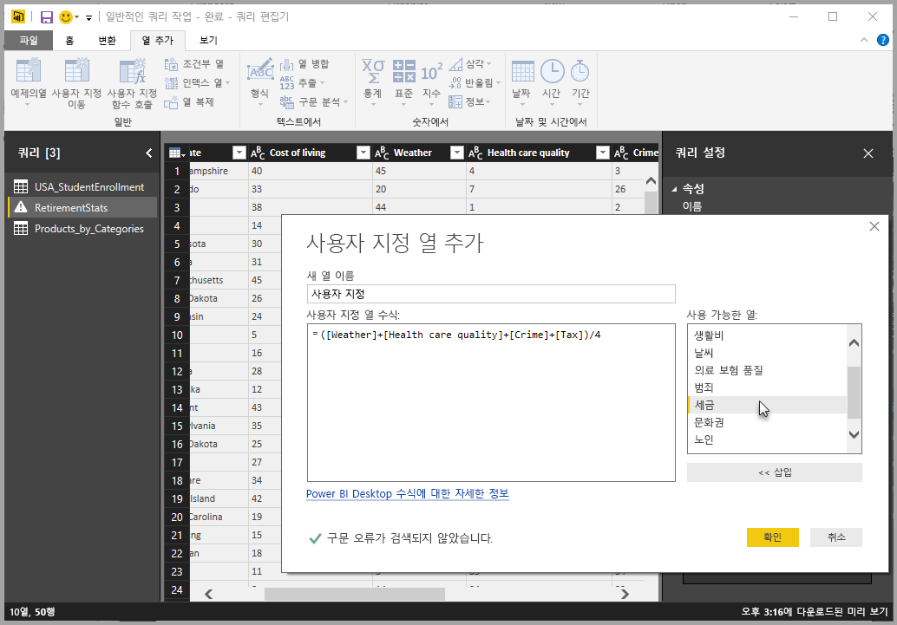
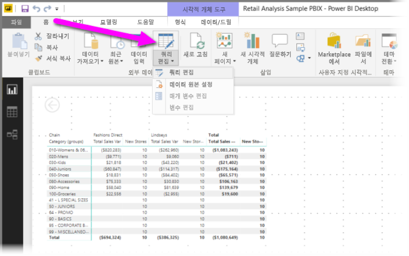
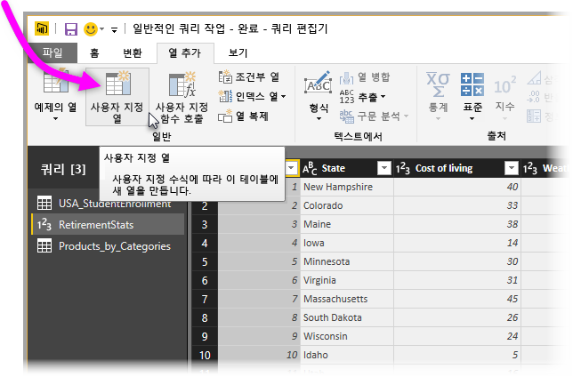
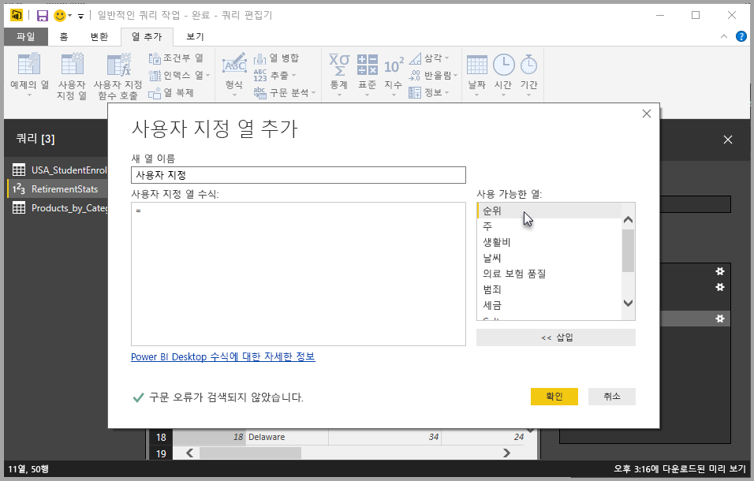
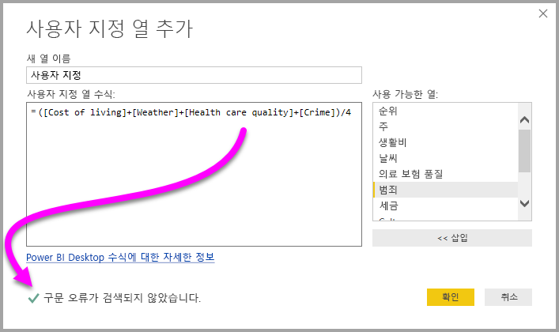
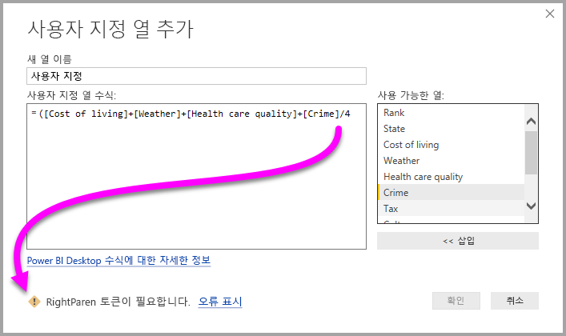
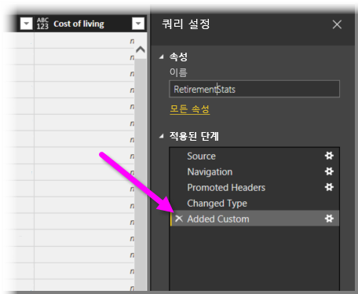
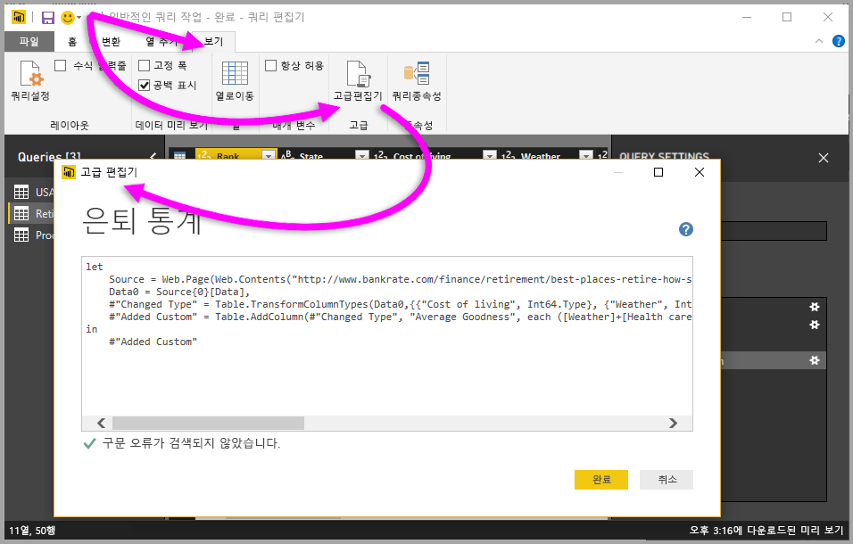

# Power BI Desktop에서 사용자 지정 열 추가

Power BI Desktop에서 쿼리 편집기를 사용하여 새 사용자 지정 데이터 열을 모델에 쉽게 추가할 수 있습니다. 쿼리 편집기를 사용하면 사용자 지정 열을 만들고 이름을 바꾸어 사용자 지정 열을 정의하는 [PowerQuery M 수식 쿼리](/powerquery-m/quick-tour-of-the-power-query-m-formula-language)를 만들 수 있습니다. PowerQuery M 수식 쿼리에는 [포괄적인 함수 참조 콘텐츠 집합](/powerquery-m/power-query-m-function-reference)이 있습니다. 

쿼리 편집기에서 사용자 지정 열을 만들면, Power BI Desktop에서 쿼리의 **쿼리 설정** 에 **적용된 단계** 로 추가합니다. 사용자 지정 열은 언제든지 변경, 이동 또는 수정할 수 있습니다.

## 쿼리 편집기를 사용하여 사용자 지정 열 추가

사용자 지정 열을 만들려면 다음 단계를 수행합니다.

1. Power BI Desktop을 시작하고 일부 데이터를 로드합니다.

2. 리본의 **홈** 탭에서 **쿼리 편집** 을 선택한 다음, 메뉴에서 **쿼리 편집** 을 선택합니다.

   

   **쿼리 편집기** 창이 표시됩니다. 

2. 리본의 **열 추가** 탭에서 **사용자 지정 열** 을 선택합니다.

   

   **사용자 지정 열 추가** 창이 나타납니다.

## 사용자 지정 열 추가 창

**사용자 지정 열 추가** 창에는 다음과 같은 기능이 있습니다. 
- 오른쪽 **사용 가능한 열** 목록에 있는 사용 가능한 열 목록

- **새 열 이름** 상자에 있는 사용자 지정 열의 초기 이름. 이 열의 이름은 바꿀 수 있습니다.

- [사용자 지정 열 수식](/powerquery-m/power-query-m-function-reference) 상자에 있는 **PowerQuery M 수식 쿼리**. 이러한 쿼리는 새 사용자 지정 열이 정의되는 수식을 작성하여 만듭니다. 

   

## 사용자 지정 열의 수식 만들기

1. 오른쪽 **사용 가능한 열** 목록에서 열을 선택한 다음, 목록 아래에 있는 **삽입** 을 선택하여 사용자 지정 열 수식에 추가합니다. 목록에서 열을 두 번 클릭하여 추가할 수도 있습니다.

2. 수식을 입력하고 열을 작성하면서 **사용자 지정 열 추가** 창의 맨 아래에 있는 표시기를 확인합니다. 

   오류가 없으면 녹색 확인 표시와 *‘구문 오류가 검색되지 않았습니다.’* 라는 메시지가 표시됩니다.

   

   구문 오류가 있으면 수식에서 오류가 발생한 위치의 링크와 함께 노란색 경고 아이콘이 표시됩니다.

   

3. **확인** 을 선택합니다. 

   Power BI Desktop에서 사용자 지정 열을 모델에 추가하고 **쿼리 설정** 의 쿼리 **적용된 단계** 목록에 **추가된 사용자 지정** 단계를 추가합니다.

   

4. 사용자 지정 열을 수정하려면 **적용된 단계** 목록에서 **추가된 사용자 지정** 단계를 두 번 클릭합니다. 

   만든 사용자 지정 열 수식이 포함된 **사용자 지정 열 추가** 창이 나타납니다.

## 고급 편집기를 사용하여 사용자 지정 열 만들기

쿼리를 만든 후에 **고급 편집기** 를 사용하여 쿼리 단계를 수정할 수도 있습니다. 이렇게 하려면 다음 단계를 수행하세요.

1. **쿼리 편집기** 창에서 리본의 **보기** 탭을 선택합니다. 

2. **고급 편집기** 를 선택합니다.

   쿼리에 대한 모든 권한을 제공하는 **고급 편집기** 페이지가 나타납니다. 

   

   
## 다음 단계

- 쿼리 편집기에 제공한 예제를 기준으로 열을 만드는 등 다른 방법으로 사용자 지정 열을 만들 수 있습니다. 자세한 내용은 [Power BI Desktop에서 예제의 열 추가](desktop-add-column-from-example.md)를 참조하세요.

- 파워 쿼리 M 참조 정보는 [파워 쿼리 M 함수 참조](/powerquery-m/power-query-m-function-reference)를 참조하세요.