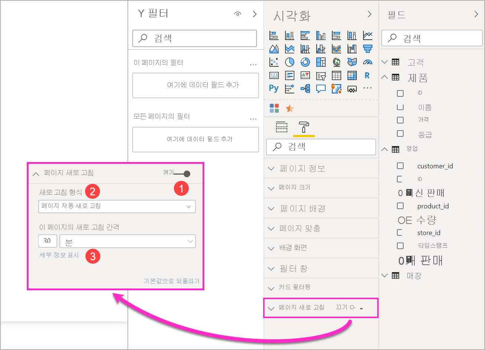
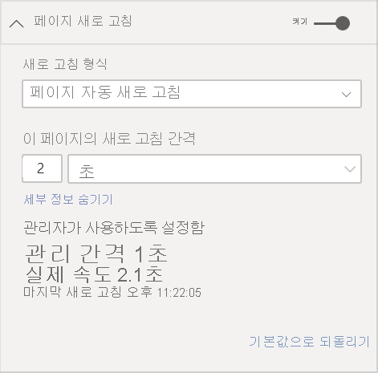
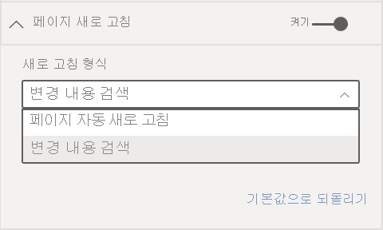
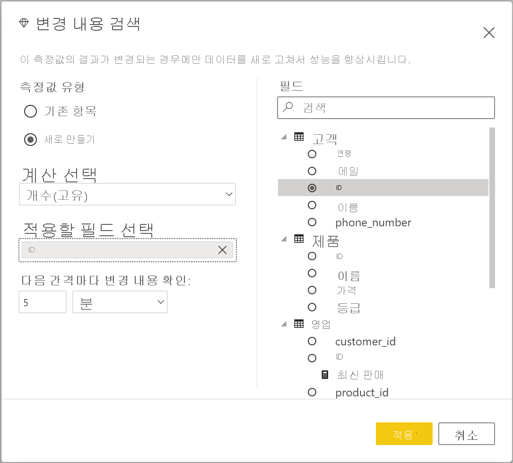
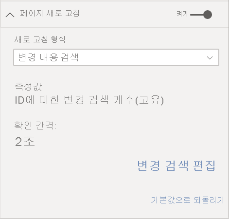
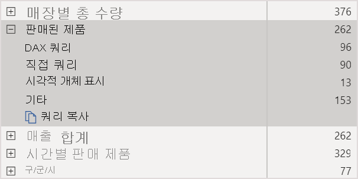
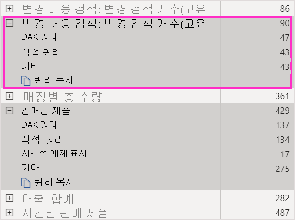
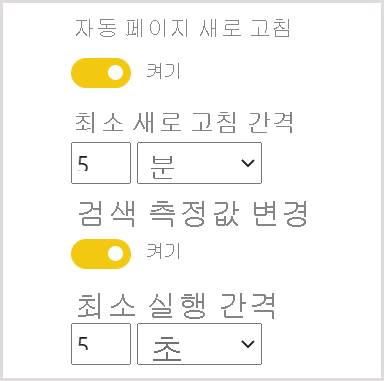

# Power BI에서의 자동 페이지 새로 고침

중요한 이벤트를 모니터링할 때 원본 데이터가 업데이트되는 즉시 데이터를 새로 고쳐야 합니다. 예를 들어, 제조업계에서는 컴퓨터가 제대로 작동하지 않거나 거의 그런 상황인 경우를 파악하는 것은 매우 중요합니다. 소셜 미디어 감정 같은 신호를 모니터링하는 경우 갑작스런 변화가 일어날 때 이를 알고 싶을 것입니다.

Power BI의 자동 페이지 새로 고침을 사용하면 활성 보고서 페이지에서 [DirectQuery 원본](../connect-data/desktop-directquery-about.md)에 대해, 미리 정의된 주기로 새 데이터를 쿼리할 수 있습니다.

## 새로 고침 유형

자동 페이지 새로 고침을 사용하는 경우 두 가지 새로 고침 유형(고정 간격 및 변경 내용 검색)을 사용할 수 있습니다.

### 고정 간격

이 새로 고침 유형을 사용하면 1초 또는 5분과 같은 일정한 간격을 기반으로 보고서 페이지의 모든 시각적 개체를 업데이트할 수 있습니다. 특정 간격에 도달하면 해당 페이지의 모든 시각적 개체가 데이터 원본에 업데이트 쿼리를 보내고 그에 따라 업데이트됩니다.

### 변경 내용 검색

이 새로 고침 유형을 사용하면 특정 새로 고침 간격 대신 데이터의 변경 내용 검색을 기반으로 페이지의 시각적 개체를 새로 고칠 수 있습니다. 특히 이 측정값은 [DirectQuery 원본](../connect-data/desktop-directquery-about.md)에 대한 변경 내용을 폴링합니다. 측정값을 정의하는 것 외에도 Power BI Desktop에서 변경 내용을 확인하는 빈도를 선택해야 합니다. 서비스에 게시하는 경우 이 새로 고침 유형은 프리미엄 용량의 일부인 작업 영역에서만 지원됩니다.

## Power BI Desktop에서 자동 페이지 새로 고침을 사용하여 보고서 작성

자동 페이지 새로 고침은 [DirectQuery 원본](../connect-data/desktop-directquery-about.md)에 대해서만 사용할 수 있으므로 DirectQuery 데이터 원본에 연결된 경우에만 사용할 수 있습니다. 이 제한은 두 가지 자동 페이지 새로 고침 형식에 모두 적용됩니다.

Power BI Desktop에서 자동 페이지 새로 고침을 사용하려면 자동 페이지 새로 고침을 사용하도록 설정할 보고서 페이지를 선택합니다. **시각화** 창에서 **서식** 단추(페인트 롤러)를 선택하고 창 아래쪽 근처에서 **페이지 새로 고침** 섹션을 찾습니다.

1. 페이지 새로 고침을 설정하거나 해제합니다.
2. 새로 고침 형식
3. 입력 및 정보(새로 고침 유형에 따라 다름)

[DirectQuery 원본](../connect-data/desktop-directquery-about.md)에 연결된 경우에만 **페이지 새로 고침** 카드를 사용할 수 있습니다. 자동 페이지 새로 고침을 사용하도록 설정하려면 토글이 설정 위치에 있어야 합니다. 필요한 입력 및 정보는 선택한 새로 고침 유형에 따라 달라집니다.

### 고정 간격 설정

**자동 페이지 새로 고침** 을 새로 고침 형식으로 선택하는 경우 원하는 새로 고침 간격을 제공해야 합니다. 기본값은 30분입니다. (최소 새로 고침 간격은 1초입니다.) 설정한 간격에 따라 보고서가 새로 고침을 시작합니다.

세부 정보 표시를 클릭하면 Power BI는 다음에 대한 추가 정보를 제공합니다.

- 관리자가 기능을 사용하도록 설정했는지 여부(Power BI 계정에 로그인한 경우에만)
- 관리자가 허용하는 최소 간격(Power BI 계정에 로그인한 경우에만).
- 실제 새로 고침 빈도(일반적으로 선택한 간격 보다 김)
- 마지막 새로 고침 시간

### 변경 내용 검색 설정

새로 고침 유형으로 **변경 내용 검색** 을 선택하면 **변경 검색 추가** 에 대한 링크가 표시됩니다. 리본의 모델링 탭에서 **변경 내용 검색** 창에 액세스할 수도 있습니다. 그런 다음 **페이지 새로 고침** 섹션에서 **변경 내용 검색** 아이콘을 클릭합니다. 마지막으로, 마우스 오른쪽 단추를 클릭하여 값 웰에서 임의의 값 옆에 있는 드롭다운 화살표를 선택하고 메뉴에서 **변경 내용 검색** 을 선택합니다.

창이 열리면 **측정값 유형** 옵션이 표시되는데, 여기서 기존 측정값을 선택하거나 처음부터 새로 만들 수 있습니다. 기존 측정값을 선택하는 경우 필드 목록에서 원하는 측정값을 선택 하거나 **기존 측정값 선택** 섹션으로 끌어다 놓기만 하면 됩니다. 새 측정값을 만들 경우 count, count distinct, minimum, maximum 및 sum 중에서 측정값의 **계산을 선택** 할 수 있습니다. 예를 들어 count distinct를 사용하여 고객 ID를 계산하고 새 고객이 목록에 추가된 경우에만 새로 고칠 수 있습니다. 측정값을 선택한 후에는 Power BI가 **변경 내용을 확인** 하는 빈도를 정의해야 합니다. 이는 Power BI에서 측정값을 계산하고 변경 내용을 폴링하는 빈도에 대한 간격입니다. 적용을 클릭하면 변경 내용 검색 아이콘이 포함된 새 측정값이 필드 목록에 나타납니다.

그런 다음 페이지 새로 고침 섹션으로 돌아가면 변경 내용 검색에 사용되는 측정값 및 참조를 위해 정의된 간격에 대한 정보를 볼 수 있습니다.

> [!NOTE]
> 모델당 하나의 변경 내용 검색 측정값만 허용됩니다.

## 새로 고침 간격 확인

자동 페이지 새로 고침을 사용하도록 설정된 경우 Power BI Desktop은 계속 DirectQuery 원본에 쿼리를 보냅니다. 쿼리가 전송된 후 데이터가 반환될 때까지 지연이 있습니다. 따라서 새로 고침 간격이 짧은 경우 쿼리가 구성된 간격 내에 쿼리된 데이터를 성공적으로 반환하는지 확인해야 합니다. 데이터가 간격 내에 반환되지 않는 경우 시각적 개체는 구성된 것보다 덜 자주 업데이트됩니다.

이러한 고려 사항은 두 가지 새로 고침 유형인 고정 간격 및 변경 내용 검색에 모두 적용됩니다. 주요 차이점은 변경 내용 검색의 경우 고정 간격에서 원본으로 돌아가는 쿼리가 하나뿐이고, 변경 내용 검색 측정값이 변경된 경우에만 시각적 개체 새로 고침이 트리거된다는 것입니다.

모범 사례를 들자면 새로 고침 간격이 예상되는 새 데이터 도착률과 일치해야 합니다.

* 새 데이터가 20분마다 원본에 도착한다면 새로 고침 간격은 20분 미만일 수 없습니다.
* 1초마다 새 데이터가 도착하면 간격을 1초로 설정합니다.

1초와 같이 짧은 새로 고침 간격의 경우 다음과 같은 요인을 고려해야 합니다.

- DirectQuery 데이터 원본의 유형
- 쿼리에서 발생하는 부하
- 용량의 데이터 센터와 보고서 읽기 권한자까지의 거리

고정 간격 새로 고침 유형의 경우 Power BI Desktop의 [성능 분석기](desktop-performance-analyzer.md)와 페이지 새로 고침 섹션의 세부 정보 표시 메뉴를 사용하여 반환 시간을 예측할 수 있습니다. 성능 분석기를 사용하면 각 시각적 쿼리가 원본에서 결과와 함께 다시 돌아올 수 있는 충분한 시간이 있는지 확인할 수 있습니다. 또한 시간이 걸린 위치를 확인할 수 있습니다. 성능 분석기의 결과를 기반으로, 데이터 원본을 조정할 수 있습니다. 또는 보고서의 다른 시각적 개체 및 측정값으로 실험할 수 있습니다.

다음 이미지는 성능 분석기에서 DirectQuery 원본의 결과를 보여 줍니다.

이 데이터 원본의 몇 가지 다른 특징을 고려해봅니다.

- 데이터는 2초마다 도착합니다.
- 성능 분석기는 최대 쿼리 + 표시 시간을 약 4.9초(4,688밀리초)로 표시합니다.
- 데이터 원본은 초당 약 1,000개의 동시 쿼리를 처리하도록 구성되었습니다.
- 약 10명의 사용자가 동시에 보고서를 볼 것으로 예상됩니다.

따라서 다음 수식이 얻어집니다.

- **5개의 시각적 개체 x 10명의 사용자 = 약 50개의 쿼리**

이 계산 결과는 데이터 원본에서 지원할 수 있는 것보다 훨씬 많은 부하를 보여 줍니다. 데이터가 2초 속도로 도착하므로, 새로 고침 빈도도 그러해야 합니다. 하지만 쿼리는 완료하는 데 약 5초 정도 걸리므로 5초 이상으로 설정해야 합니다.

또한 이 결과는 보고서를 서비스에 게시하는 경우 달라질 수 있습니다. 이러한 차이는 보고서가 클라우드에서 호스트되는 Azure Analysis Services 인스턴스를 사용하기 때문에 발생합니다. 그에 따라 새로 고침 빈도를 조정해야 할 수 있습니다.

쿼리 및 새로 고침 타이밍을 고려하기 위해, Power BI는 나머지 모든 새로 고침 쿼리가 완료될 때만 다음 새로 고침 쿼리를 실행합니다. 따라서 새로 고침 간격이 쿼리가 처리되는 데 걸리는 시간보다 짧은 경우에도, 나머지 쿼리가 완료된 이후에만 Power BI가 다시 새로 고쳐집니다.

변경 내용 검색 새로 고침 유형의 경우에도 이러한 고려 사항이 적용 됩니다. 또한 [성능 분석기](desktop-performance-analyzer.md)는 보고서의 시각적 개체와 일치하지 않는 경우에도 변경 내용 검색 측정값 쿼리의 결과를 표시합니다. 앞에서 설명한 것과 동일한 지침에 따라 이 특별한 유형의 측정값 문제를 해결할 수 있도록 이 기능을 제공했습니다. 이 새로 고침 유형의 주요 차이점은 모든 시각적 개체의 모든 쿼리가 아닌 하나의 쿼리만 데이터 원본으로 이동한다는 것입니다. 여러 사용자가 보고서를 보고 있는 경우에도 마찬가지입니다.

앞에서 설명한 것과 동일한 시나리오에서:

- **5개의 시각적 개체에 대한 1개의 변경 내용 검색 측정값 쿼리는 보는 사용자가 몇 명이든 하나의 쿼리만 생성**

- **5개의 시각적 개체 x 10명의 사용자 = 약 50개 쿼리라는 전과 동일한 시나리오를 가정하고 변경 내용 검색 측정값이 업데이트를 트리거하는 경우**

요약하면 변경 내용 검색을 사용하는 경우 변경 내용이 검색될 때까지 하나의 쿼리만 데이터 원본으로 전송됩니다. 이 경우 고정 간격 새로 고침 유형에 사용되는 동일한 논리가 같은 수의 쿼리를 생성하는 모든 사용자에 대한 모든 시각적 개체 업데이트에도 적용됩니다. 이 방법은 장기 실행에서 좀 더 효율적입니다.

이제 용량 관리자로서 성능 문제를 잠재적으로 감지하고 진단할 수 있는 방법을 살펴보겠습니다. 성능 및 문제 해결에 대한 추가 질문과 대답은 이 문서의 뒷부분에 나오는 [질문과 대답](#frequently-asked-questions) 섹션에서 확인할 수도 있습니다.

## Power BI 서비스의 자동 페이지 새로 고침

데이터 원본이 [DirectQuery](../connect-data/desktop-directquery-about.md)인 경우 Power BI 서비스에 게시된 보고서에 대해서도 자동 페이지 새로 고침을 설정할 수 있습니다.

Power BI 서비스의 보고서에 대해 자동 페이지 새로 고침을 구성하려는 경우 단계는 Power BI Desktop과 비슷합니다. Power BI 서비스에서 구성된 경우 자동 페이지 새로 고침은 [포함된 Power BI](../developer/embedded/embedding.md) 콘텐츠도 지원합니다. 이 그림은 Power BI 서비스에 대한 **페이지 새로 고침** 구성을 보여 줍니다.

1. 페이지 새로 고침을 설정하거나 해제합니다.
2. 새로 고침 형식
3. 입력 및 정보(새로 고침 유형에 따라 다름)

> [!NOTE]
> Power BI Desktop에서 자동 페이지 새로 고침 사용 보고서를 서비스에 게시할 때, 데이터 세트 설정 메뉴에서 DirectQuery 데이터 원본에 대한 자격 증명을 제공해야 합니다. 보고서를 보는 사용자가 자신의 ID로 이 데이터 원본에 액세스하여 원본에 설정된 모든 보안을 준수하도록 자격 증명을 설정할 수 있습니다. 변경 내용 검색 측정값의 경우 항상 작성자의 자격 증명을 사용하여 평가됩니다.

### 페이지 새로 고침 간격

Power BI 서비스에서 허용되는 페이지 새로 고침 유형 및 간격은 보고서 작업 영역 유형의 영향을 받습니다. 이는 다음과 같은 시나리오에 적용됩니다.

* 자동 페이지 새로 고침을 사용하도록 설정된 작업 영역에 보고서 게시
* 작업 영역에 이미 있는 페이지 새로 고침 간격 편집
* 서비스에서 직접 보고서 만들기

Power BI Desktop에는 새로 고침 간격에 대한 제한이 없으며, 새로 고침 간격은 1초 단위의 빈도로 설정할 수 있습니다. 하지만 보고서가 Power BI 서비스에 게시되는 경우에는 특정 제한 사항이 적용됩니다. 이에 대해서는 다음 섹션에서 설명합니다.

### 새로 고침 간격에 대한 제한 사항

Power BI 서비스에서 자동 페이지 새로 고침에 대한 제한은 보고서가 게시되는 작업 영역, 프리미엄 서비스 사용 여부, 프리미엄 용량 관리자 설정에 따라 적용됩니다.

이러한 제한의 작동 방식을 명확하게 설명하기 위해 용량 및 작업 영역에 대한 몇 가지 배경부터 살펴보겠습니다.

용량은 중요한 Power BI 개념입니다. Power BI 콘텐츠를 호스트하고 전달하는 데 사용되는 리소스(스토리지, 프로세서 및 메모리) 집합을 나타냅니다. 용량은 공유 또는 전용입니다. 공유 용량은 다른 Microsoft 고객과 공유됩니다. 전용 용량은 전적으로 단일 고객에게 커밋됩니다. 전용 용량에 대한 소개는 [프리미엄 용량 관리](../admin/service-premium-capacity-manage.md)를 참조하세요.

공유 용량에서는 워크로드가 다른 고객과 공유된 계산 리소스에서 실행됩니다. 용량이 리소스를 공유해야 하므로, 최대 모델 크기(1GB) 및 최대 일일 새로 고침 빈도(하루 8회) 설정과 같은 공정한 실행을 보장하기 위해 제한 사항이 적용됩니다.

Power BI 작업 영역은 용량 내에 상주하며 보안, 협업 및 배포 컨테이너를 나타냅니다. 각 Power BI 사용자는 **내 작업 영역** 이라는 개인 작업 영역을 갖습니다. 협업 및 배포를 사용할 수 있도록 추가 작업 영역을 만들 수 있습니다. 이들을 작업 영역이라고 합니다. 기본적으로 개인 작업 영역을 포함한 작업 영역은 공유 용량에서 생성됩니다.

다음은 두 가지 작업 영역 시나리오에 대한 일부 세부 정보입니다.

**공유 작업 영역** . 일반 작업 영역(프리미엄 용량의 일부가 아닌 작업 영역)의 경우, 자동 페이지 새로 고침의 최소 간격은 30분입니다(가장 낮은 간격 허용). 공유 용량에서는 변경 내용 검색 새로 고침 유형을 사용할 수 없습니다.

**프리미엄 작업 영역** . 프리미엄 작업 영역에서 자동 페이지 새로 고침 가용성(고정 간격 및 변경 내용 검색 모두)은 프리미엄 관리자가 Power BI Premium 용량에 대해 설정한 워크로드 설정에 따라 달라집니다. 자동 페이지 새로 고침을 설정할 수 있는 기능에 영향을 줄 수 있는 두 개의 변수가 있습니다.

 - **기능 설정/해제** . 용량 관리자가 기능을 해제한 경우, 게시된 보고서에서 어떤 유형의 페이지 새로 고침도 설정할 수 없습니다. 고정 간격 및 변경 내용 검색은 개별적으로 설정 및 해제할 수 있습니다.

 - **최소 새로 고침 간격** . 고정 간격으로 자동 페이지 새로 고침을 사용하도록 설정하는 경우 용량 관리자는 최소 새로 고침 간격을 설정해야 합니다(기본값은 5 분). 간격이 최소값보다 낮을 경우, Power BI 서비스가 용량 관리자가 설정한 최소 간격을 준수하기 위해 간격을 재정의합니다.

 - **최소 실행 간격** . 변경 내용 검색을 사용하도록 설정하는 경우 용량 관리자는 최소 실행 간격을 설정해야 합니다(기본값은 5 초). 간격이 최소값보다 낮을 경우, Power BI 서비스가 용량 관리자가 설정한 최소 간격을 준수하기 위해 간격을 재정의합니다.

다음 표에 이 기능을 사용할 수 있는 위치와 각 용량 유형 및 [스토리지 모드](../connect-data/service-dataset-modes-understand.md)에 대한 제한 사항이 자세히 설명되어 있습니다.

| 스토리지 모드 | 전용 용량 | 공유 용량 |
| --- | --- | --- |
| DirectQuery | **FI 지원** : 예  **CD 지원** : 예  **최소** : 1초  **관리자 재정의** : 예 | **FI 지원** : 예  **CD 지원** : 아니요  **최소** : 30분  **관리자 재정의** : 아니요 |
| 가져오기 | **FI 지원** : 아니요  **CD 지원** : 아니요  **최소** : 해당 없음  **관리자 재정의** : 해당 없음 | **FI 지원** : 아니요  **CD 지원** : 아니요  **최소** : 해당 없음  **관리자 재정의** : 해당 없음 |
| 혼합 모드(DirectQuery + 기타 데이터 원본) | **FI 지원** : 예  **CD 지원** : 예  **최소** : 1초  **관리자 재정의** : 예 | **FI 지원** : 예  **CD 지원** : 아니요  **최소** : 30분  **관리자 재정의** : 아니요 |
| 라이브 연결 AS | **FI 지원** : 아니요  **CD 지원** : 아니요  **최소** : 해당 없음  **관리자 재정의** : 해당 없음 | **FI 지원** : 아니요  **CD 지원** : 아니요  **최소** : 해당 없음  **관리자 재정의** : 해당 없음 |
| 라이브 연결 PBI | **FI 지원** : 아니요  **CD 지원** : 아니요  **최소** : 해당 없음  **관리자 재정의** : 해당 없음 | **FI 지원** : 아니요  **CD 지원** : 아니요  **최소** : 해당 없음  **관리자 재정의** : 해당 없음 |

*표의 범례:*
1. *FI: 고정 간격*
2. *CD: 변경 내용 검색*

> [!WARNING]
> 데이터 세트에서 사용하도록 설정되면 변경 내용 검색 측정이 DirectQuery 데이터 원본에 대한 연결을 열어 측정값을 계산하고 변경 내용을 폴링합니다. 이 연결은 Power BI가 이미 만든 낮은 우선 순위 새로 고침 연결과는 다릅니다.

## 고려 사항 및 제한 사항

Power BI Desktop 또는 Power BI 서비스에서, 자동 페이지 새로 고침을 사용할 때 염두에 두어야 할 몇 가지 사항이 있습니다.

* 가져오기, LiveConnect 및 푸시 스토리지 모드는 자동 페이지 새로 고침에서 지원되지 않습니다.  
* DirectQuery 데이터 원본이 적어도 하나 이상 있는 복합 모델은 지원됩니다.
* Power BI Desktop에는 새로 고침 간격에 대한 제한이 없습니다. 고정 간격 및 변경 내용 검색 새로 고침 유형 모두에 대해 1초 단위의 빈도로 간격을 설정할 수 있습니다. 보고서가 Power BI 서비스에 게시되는 경우에는 [앞서](#restrictions-on-refresh-intervals) 설명한 대로 특정 제한 사항이 적용됩니다.
* 데이터 세트당 변경 내용 검색 측정값을 하나만 사용할 수 있습니다.
* Power BI 테넌트에서는 변경 내용 검색 측정값이 있는 모델을 최대 10개까지만 사용할 수 있습니다.

### 성능 진단

자동 페이지 새로 고침은 시나리오를 모니터링하고 빠른 변경 데이터를 탐색하는 데 유용합니다. 그러나, 때때로 이로 인해 용량 또는 데이터 원본에 과도한 부하가 발생할 수 있습니다.

데이터 원본에 대한 과도한 부하를 방지하기 위해 Power BI에는 다음과 같은 보호 기능이 있습니다.

- 모든 자동 페이지 새로 고침 쿼리는 대화형 쿼리(예: 페이지 로드 및 교차 필터링 시각적 개체)가 우선 적용되도록 더 낮은 우선 순위로 실행됩니다.
- 다음 새로 고침 주기 전에 쿼리가 완료되지 않은 경우, Power BI는 이전 쿼리가 완료될 때까지 새로운 새로 고침 쿼리를 실행하지 않습니다. 예를 들어, 새로 고침 간격이 1초이고 쿼리가 평균 4초 걸리는 경우 Power BI는 실제로 4초마다 쿼리를 실행합니다.

그래도 성능 병목 현상이 발생할 수 있는 두 가지 영역이 있습니다.

1. **용량** . 이 쿼리는 먼저 보고서 시각화에서 원본 쿼리에 생성된 DAX 쿼리를 접고 평가하는 프리미엄 용량에 도달합니다.
2. **DirectQuery 데이터 원본** . 그러면 이전 단계에서 번역된 쿼리가 원본을 대상으로 실행됩니다. 이 원본은 SQL Server 인스턴스, SAP Hana 원본 등입니다.

관리자가 사용할 수 있는 [Premium Capacity Metrics 앱](../admin/service-admin-premium-monitor-capacity.md)을 사용하여 낮은 우선 순위 쿼리에서 사용되고 있는 용량이 어느 정도인지 시각화할 수 있습니다.

낮은 우선 순위 쿼리는 자동 페이지 새로 고침 쿼리 및 모델 새로 고침 쿼리로 구성됩니다. 현재 자동 페이지 새로 고침의 부하와 모델 새로 고침 쿼리의 부하를 구분할 수 있는 방법은 없습니다.

다음은 낮은 우선 순위 쿼리로 인해 용량이 오버로드되는 경우에 취할 수 있는 몇 가지 작업입니다.

- 더 큰 프리미엄 SKU를 요청합니다.
- 보고서 소유자에게 새로 고침 간격을 낮추도록 요청합니다.
- 용량 관리자 포털에서 다음을 수행할 수 있습니다.
   - 해당 용량에 대한 자동 페이지 새로 고침을 해제합니다.
   - 해당 용량의 모든 보고서에 영향을 주는 최소 새로 고침 간격을 올립니다.

### 질문과 대답

**저는 보고서 작성자입니다. Power BI Desktop에서 보고서 새로 고침 간격을 1초로 정의했는데, 게시 후에 서비스에서 보고서가 새로 고쳐지지 않습니다.**

* 페이지에 대해 자동 페이지 새로 고침이 설정되어 있는지 확인하세요. 이 설정은 페이지마다 지정되므로, 새로 고치려는 보고서의 각 페이지에 대해 설정되어 있는지 확인해야 합니다.
* 프리미엄 용량이 연결된 작업 영역에 업로드 했는지 여부를 확인합니다. 그렇게 하지 않은 경우 새로 고침 간격이 고정 간격에서 30분으로 잠기므로 변경 내용 검색에 사용할 수 없습니다.
* 보고서가 프리미엄 작업 영역에 있는 경우 연결된 용량에서 이 기능을 사용하도록 설정되어 있는지 관리자에게 문의하세요. 또한 용량의 최소 새로 고침 간격이 보고서의 간격보다 짧거나 같은지 확인합니다. 이는 고정 간격 및 변경 내용 검색에 대해 개별적으로 적용됩니다.

**저는 용량 관리자입니다. 자동 페이지 새로 고침 간격에 대한 설정을 변경했지만 변경 내용이 반영되지 않습니다. 다시 말해서, 보고서가 변경된 설정이 아닌 빈도로 계속 새로 고쳐지거나, 자동 페이지 새로 고침을 켰는데도 새로 고쳐지지 않고 있습니다.**

* 용량 관리자 UI에서 적용된 자동 페이지 새로 고침 설정 변경이 보고서에 전파되는 데는 최대 5분까지 소요됩니다.
* 용량에 대해서 자동 페이지 새로 고침을 켜야 할 뿐만 아니라, 이 기능을 설정하려는 보고서의 각 페이지에 대해서도 이 기능을 켜야 합니다.
* 두 새로 고침 유형은 개별적으로 관리되므로 사용하려는 새로 고침 유형이 설정되어 있는지 확인해야 합니다.

**보고서가 혼합 모드에서 작동하고 있습니다. (혼합 모드는 보고서에 DirectQuery 연결 및 가져오기 데이터 원본이 있음을 의미합니다.) 일부 시각적 개체가 새로 고쳐지지 않습니다.**

- 시각적 개체가 가져오기 테이블을 참조하는 경우에 이런 동작이 예상됩니다. 가져오기에는 자동 페이지 새로 고침이 지원되지 않습니다.
- 이 섹션의 첫 번째 질문을 참조하세요.

**서비스에서 보고서의 새로 고침이 잘 실행되고 있었는데 갑자기 중지되었습니다.**

* 페이지 새로 고침을 시도하여 저절로 문제가 해결되는지 확인하세요.
* 용량 관리자에게 문의하세요. 관리자가 이 기능을 해제했거나 최소 새로 고침 간격을 높였을 수 있습니다. (이 섹션의 두 번째 질문을 참조하세요.)

**저는 보고서 작성자입니다. 시각적 개체가 지정한 속도로 새로 고쳐지지 않습니다. 더 느린 빈도로 새로 고쳐집니다.**

* 쿼리를 실행하는 데 시간이 더 오래 걸리는 경우 새로 고침 간격이 지연됩니다. 자동 페이지 새로 고침은 새 쿼리를 실행하기 전에 모든 쿼리가 완료될 때까지 기다립니다.
* 용량 관리자가 귀하가 보고서에 대해 설정한 것보다 더 높은 최소 새로 고침 간격을 설정했을 수 있습니다. 용량 관리자에게 최소 새로 고침 간격을 낮춰 달라고 요청하세요.

**자동 페이지 새로 고침 쿼리는 캐시에서 서비스되나요?**

* 아니요. 모든 자동 페이지 새로 고침 쿼리는 캐시된 데이터를 무시합니다.

**내 변경 내용 검색 측정값이 업데이트를 트리거하지 않습니다.**

* 변경 내용 검색이 페이지에 대해 설정되어 있는지 확인합니다. 이 설정은 페이지마다 지정되므로, 새로 고치려는 보고서의 각 페이지에 대해 설정되어 있는지 확인해야 합니다.
* 프리미엄 용량이 연결된 작업 영역에 업로드 했는지 여부를 확인합니다. 그렇게 하지 않은 경우 변경 내용 검색이 작동하지 않습니다.
* 보고서가 프리미엄 작업 영역에 있는 경우 연결된 용량에서 이 기능을 사용하도록 설정되어 있는지 관리자에게 문의하세요. 또한 용량의 최소 실행 간격이 보고서의 간격보다 짧거나 같은지 확인합니다.
* 앞서 언급한 모든 항목을 확인했다면, Power BI Desktop 또는 편집 모드에서 측정값이 변경되고 있는지 확인합니다. 이렇게 하려면 캔버스로 끌어다 놓고 값이 변경되는지 확인합니다. 변경되지 않으면, 데이터 원본 변경에 대한 폴링에 측정값이 적합하지 않을 수 있습니다.

## 다음 단계

자세한 내용은 다음 문서를 참조하세요.

* [Power BI의 DirectQuery 사용](../connect-data/desktop-directquery-about.md)
* [Power BI Desktop에서 복합 모델 사용](../transform-model/desktop-composite-models.md)
* [성능 분석기를 사용하여 보고서 요소 성능 검사](desktop-performance-analyzer.md)
* [Power BI Premium 용량 배포 및 관리](../guidance/whitepaper-powerbi-premium-deployment.md)
* [Power BI Desktop의 데이터 원본](../connect-data/desktop-data-sources.md)
* [Power BI Desktop에서 데이터 셰이핑 및 결합](../connect-data/desktop-shape-and-combine-data.md)
* [Power BI Desktop에서 Excel 통합 문서에 연결](../connect-data/desktop-connect-excel.md)   
* [Power BI Desktop에 데이터 직접 연결](../connect-data/desktop-enter-data-directly-into-desktop.md)   
