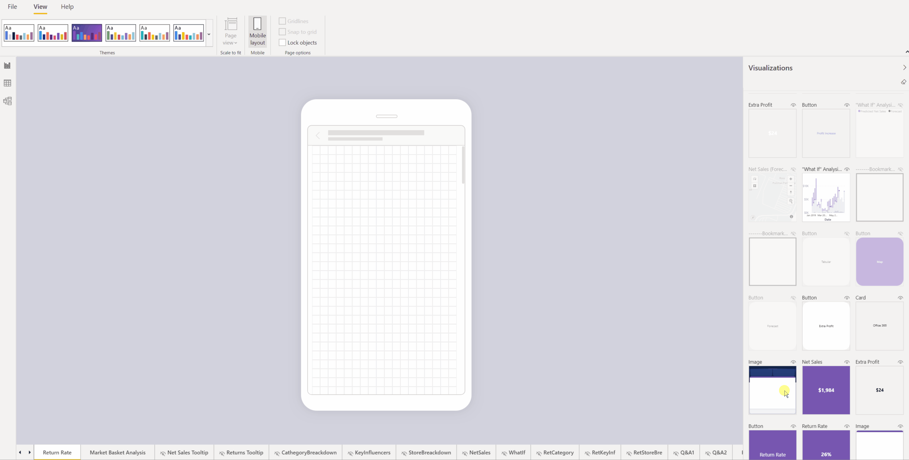
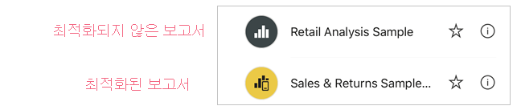
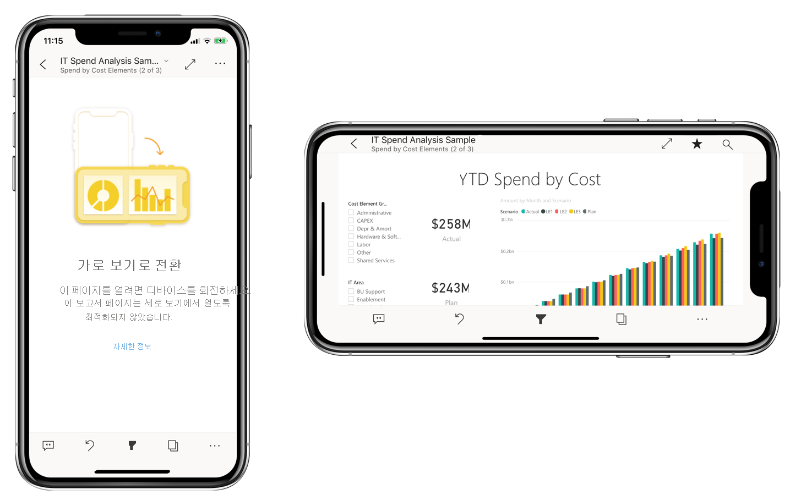

# 모바일 앱에 맞게 Power BI 보고서 최적화
모바일 사용자는 Power BI 보고서 페이지를 가로 방향으로 볼 수 있습니다. 하지만 보고서 작성자는 모바일 디바이스에 최적화되고 세로 방향으로 표시되는 추가 보기를 만들 수 있습니다. Power BI Desktop과 Power BI 서비스에서 모두 사용할 수 있는 이 디자인 옵션을 통해 작성자는 이동 중인 모바일 사용자에게 적합한 시각적 개체를 선택하고 다시 정렬할 수 있습니다.

.

Power BI는 모바일에 최적화된 보고서 버전을 만드는 데 도움이 되는 다양한 기능을 제공합니다.
* 시각적 개체를 휴대폰 에뮬레이터 캔버스로 끌어서 놓는 방법으로 모바일에 최적화된 보고서를 만들 수 있는 모바일 레이아웃 보기입니다.
* 작은 모바일 화면에서 사용할 수 있도록 최적화할 수 있는 시각적 개체와 슬라이서입니다.

이러한 기능을 통해 모바일에 최적화된 멋진 대화형 보고서를 디자인하고 빌드할 수 있습니다.

## 보고서 페이지의 모바일에 최적화된 세로 버전 만들기

첫 번째 단계는 일반 웹 보기에서 보고서를 디자인하고 만드는 것입니다. 보고서를 만들었으면 휴대폰 및 태블릿에 맞게 최적화할 수 있습니다.

모바일에 최적화된 보기를 만들려면 모바일 레이아웃 보기를 엽니다.
   * Power BI Desktop에서 **보기** 리본을 선택하고 **모바일 레이아웃**을 선택합니다.
   * Power BI 서비스에서 **추가 옵션(...) > 보고서 편집 > 모바일 레이아웃**을 선택합니다.

   휴대폰처럼 스크롤할 수 있는 캔버스와 원본 보고서 페이지에 있는 모든 시각적 개체를 나열 하는 **시각화** 창이 표시됩니다.

   .

* 쉽게 식별할 수 있도록 **시각화** 창의 각 시각적 개체는 이름이 함께 표시됩니다.
* 각 시각적 개체에는 가시성 표시기도 있습니다. 시각적 개체의 가시성 표시기는 웹 보고서 뷰의 현재 상태에서 시각적 개체의 가시성 상태에 따라 변합니다. 가시성 표시기는 책갈피 작업 시 유용합니다.

## 모바일 레이아웃 캔버스에 시각적 개체 추가
모바일 레이아웃에 시각적 개체를 추가하려면 **시각화** 창에서 휴대폰 캔버스로 시각적 개체를 끕니다. 시각적 개체를 캔버스로 끌면 그리드에 맞춰집니다. 또는 시각화 창에서 시각적 개체를 두 번 클릭 하면 시각적 개체가 캔버스에 추가됩니다.

웹 보고서 페이지 시각적 개체의 일부 또는 전부를 모바일에 최적화된 보고서 페이지에 추가할 수 있습니다. 각 시각적 개체는 한 번만 추가할 수 있으며, 모든 시각적 개체를 포함할 필요는 없습니다.

>[!NOTE]
> 숨겨진 시각적 개체를 캔버스에 끌어서 놓을 수 있습니다. 이런 시각적 개체는 현재 웹 보고서 보기에서 가시성 상태가 변경되지 않는 한 배치는 되지만 표시되지는 않습니다.

시각적 개체들을 계층화하면 책갈피를 사용하여 대화형 보고서를 만들거나 이미지 위에 시각적 개체를 겹쳐 멋진 보고서를 빌드할 수 있습니다.

시각적 개체를 캔버스에 배치한 후에는 시각적 개체를 선택할 때 시각적 개체의 가장자리 주위에 표시되는 핸들을 끌어 크기를 조정할 수 있습니다. 크기를 조정하는 동안 시각적 개체의 가로 세로 비율을 유지하려면 크기 조정 핸들을 끄는 동안 **Shift** 키를 누릅니다.

아래 이미지는 **시각화** 창에서 캔버스로 시각적 개체를 끌어서 놓는 방법뿐만 아니라 일부 시각적 개체 크기를 조정하고 오버레이하는 방법도 보여 줍니다.

   

휴대폰용 보고서 그리드는 다양한 크기의 휴대폰에 맞게 크기가 조정되므로 보고서가 크고 작은 휴대폰 화면에서 모두 보기 좋게 표시됩니다.

## 모바일 레이아웃 캔버스에서 시각적 개체 제거
모바일 레이아웃에서 시각적 개체를 제거하려면 휴대폰 캔버스에서 시각적 개체의 오른쪽 위 모서리에 있는 **X**를 클릭하거나 시각적 개체를 선택하고 **Delete**를 누릅니다.

**시각화** 창에서 지우개를 클릭하면 캔버스에서 모든 시각화를 제거할 수 있습니다.

모바일 레이아웃 캔버스에서 시각적 개체를 제거하면 캔버스에서만 시각적 개체가 제거됩니다. 시각적 개체는 시각화 창에 계속 표시되며 원래 보고서는 영향을 받지 않습니다.

## 모바일에 최적화된 보고서에서 사용할 시각적 개체 및 슬라이서 구성

### 시각적 개체

기본적으로 많은 시각적 개체, 특히 차트형 시각적 개체는 응답성이 뛰어납니다.  즉, 화면 크기와 관계없이 최대 데이터양과 인사이트를 표시하도록 동적으로 변경됩니다.

Power BI는 시각적 요소의 크기가 변경될 때 데이터를 최우선으로 고려합니다. 예를 들어 시각적 개체의 크기가 작아져도 정보가 효과적으로 표시되도록 자동으로 안쪽 여백을 제거하고 시각적 요소의 맨 위로 범례를 이동합니다.

 
어떤 이유로 응답성을 끄려는 경우 시각적 개체 형식 설정의 **일반** 섹션에서 이 작업을 수행할 수 있습니다.

### 슬라이서

슬라이서는 보고서 데이터의 캔버스 상 필터링을 제공합니다. 일반 보고서 작성 모드에서 슬라이서를 디자인할 때 모바일에 최적화된 보고서에서 더 유용하도록 슬라이서 설정을 일부 수정할 수 있습니다.
* 보고서를 읽는 사람이 한 항목만 선택할 수 있는지 여러 항목을 선택할 수 있는지 결정할 수 있습니다.
* 슬라이서는 세로 방향, 가로 방향 또는 반응형으로 만들 수 있습니다(반응형 슬라이서는 가로 방향이어야 합니다).

슬라이서를 반응형으로 설정하는 경우 크기와 셰이프를 변경함에 따라 더 많거나 적은 옵션이 표시됩니다. 길게, 짧게, 넓게 또는 좁게 적용할 수 있습니다. 충분히 작게 만드는 경우 보고서 페이지에 필터 아이콘만 표시됩니다.

 
[반응형 슬라이서 만들기](power-bi-slicer-filter-responsive.md)에 대해 자세히 알아보세요.

## 모바일에 최적화된 보고서 게시
모바일에 최적화된 보고서 버전을 게시하려면 [Power BI Desktop에서 기본 보고서를 Power BI 서비스에 게시](desktop-upload-desktop-files.md)합니다. 이렇게 하면 모바일에 최적화된 버전이 동시에 게시됩니다.

## 휴대폰 또는 태블릿에서 최적화된 보고서와 최적화되지 않은 보고서 보기

Power BI 모바일 앱에서 모바일에 최적화된 보고서는 특수 아이콘으로 표시됩니다.

휴대폰에서 앱은 보고서가 모바일에 최적화되어 있는지 여부를 자동으로 검색합니다.
* 모바일에 최적화된 보고서가 있다면 앱은 자동으로 모바일에 최적화된 모드에서 보고서를 엽니다.
* 모바일에 최적화된 보고서가 없다면 보고서는 최적화되지 않은 가로 보기로 열립니다.

휴대폰을 가로 방향으로 들고 있으면 보고서 최적화 여부와 관계없이 보고서는 최적화되지 않은 보기에서 원래 보고서 레이아웃으로 열립니다.

일부 페이지만 최적화한 경우 최적화되지 않은 페이지가 나오면 가로 보기로 전환하라는 메시지가 독자에게 표시됩니다. 휴대폰 또는 태블릿을 옆으로 돌리면 가로 모드로 페이지를 볼 수 있습니다. [세로 모드에 최적화된 Power BI 보고서와 상호 작용하는 방법에 대해 자세히 알아보세요](../consumer/mobile/mobile-apps-view-phone-report.md).

## 모바일에 최적화된 레이아웃을 만들 때 고려 사항
* 페이지가 여럿인 보고서는 모든 페이지를 최적화하거나 일부 페이지만 최적화할 수 있습니다.
* 보고서 페이지의 배경색을 정의했다면 모바일에 최적화된 보고서는 동일한 배경색을 갖게 됩니다.
* 모바일에 최적화된 보고서만 서식 설정을 수정할 수는 없습니다. 서식 지정은 마스터 레이아웃과 모바일 레이아웃 간에 일관됩니다. 예를 들어 글꼴 크기는 동일합니다.
* 서식 지정, 데이터 세트, 필터 또는 기타 특성을 변경하는 것과 같이 시각적 개체를 변경하려면 웹 보고서 작성 모드로 돌아갑니다.

## 다음 단계
* [Power BI에서 대시보드 휴대폰 보기 만들기](service-create-dashboard-mobile-phone-view.md)
* [휴대폰에 대해 최적화된 Power BI 보고서 보기](../consumer/mobile/mobile-apps-view-phone-report.md)
* [보고서 및 대시보드 만들기에 대한 Power BI 설명서](https://docs.microsoft.com/power-bi/create-reports/).
* 궁금한 점이 더 있나요? [Power BI 커뮤니티에 질문합니다](https://community.powerbi.com/).