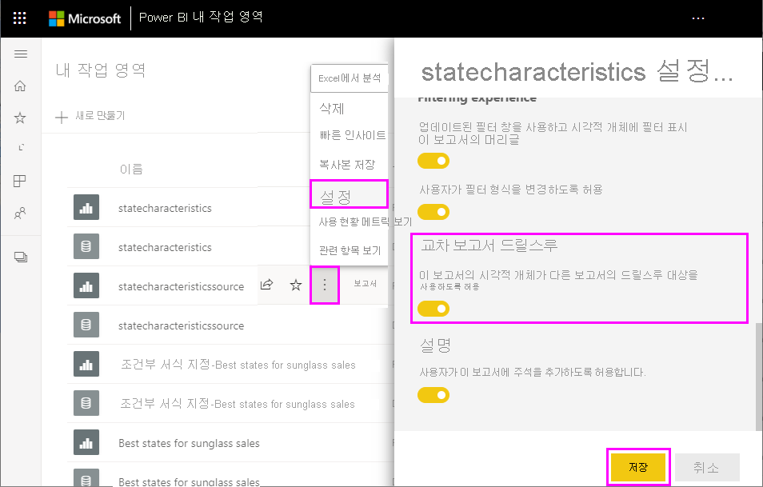

# Power BI에서 교차 보고서 드릴스루 사용

Power BI *교차 보고서 드릴스루* 기능을 사용하면 같은 Power BI 서비스 작업 영역 또는 앱 안에서 상황별로 한 보고서에서 다른 보고서로 이동할 수 있습니다. 교차 보고서 드릴스루를 사용하여 관련된 콘텐츠가 있는 두 개 이상의 보고서를 연결하고 교차 보고서 연결에 따라 필터 컨텍스트를 전달할 수 있습니다. 

교차 보고서 드릴스루를 시작하려면 *원본 보고서*의 *원본 시각적 개체*에서 데이터 요소를 선택한 다음 상황에 맞는 메뉴에서 교차 보고서 **드릴스루** 대상을 선택합니다. 

드릴스루 작업은 *대상 보고서*의 *대상 페이지*를 엽니다. 

이 문서에서는 Power BI 보고서에 대한 교차 보고서 드릴스루를 설정하고 사용하는 방법을 보여줍니다.

> [!NOTE]
> 개별적으로 공유된 [공유한 항목 보고서](../collaborate-share/service-share-dashboards.md#share-a-dashboard-or-report)는 교차 보고서 드릴스루와 함께 사용할 수 없습니다. 교차 보고서 드릴스루를 사용하려면 자신이 멤버인 작업 영역에서 보고서에 액세스해야 합니다.

## 교차 보고서 드릴스루 사용

교차 보고서 드릴스루를 사용하도록 설정하는 첫 번째 단계는 원본 및 대상 보고서에 대한 데이터 모델의 유효성을 검사하는 것입니다. 각 보고서의 스키마가 동일할 필요는 없지만 전달하려는 필드는 두 데이터 모델에 모두 존재해야 합니다. 필드 이름과 해당 필드가 속한 테이블의 이름은 동일해야 합니다. 문자열은 일치해야 하며 대/소문자를 구분합니다.

예를 들어 **미국** 테이블 내에서 **주** 필드에 대한 필터를 전달하려는 경우 두 모델 모두 **미국 주** 테이블이 있어야 하고 해당 테이블에 **주** 필드가 있어야 합니다. 그렇지 않은 경우, 기본 모델에서 필드 이름 또는 테이블 이름을 업데이트해야 합니다. 교차 보고서 드릴스루의 경우는 필드의 표시 이름을 간단히 업데이트할 수 없습니다.

모델의 유효성을 검사한 후에는 원본 보고서에서 교차 보고서 드릴스루를 사용하도록 설정합니다. 

1. Power BI Desktop에서 **파일** > **옵션 및 설정** > **옵션**으로 이동합니다. 
1. **옵션** 창의 왼쪽 탐색에서 **현재 파일** 섹션의 맨 아래에 있는 **보고서 설정**을 선택합니다. 
1. 오른쪽 아래의 **교차 보고서 드릴스루**에서 **이 보고서의 시각적 개체가 다른 보고서의 드릴스루 대상을 사용하도록 허용**을 선택합니다. 
1. **확인**을 선택합니다. 
   
   

Power BI 서비스에서 교차 보고서 드릴스루를 사용하도록 설정할 수도 있습니다.
1. Power BI 서비스에서 대상 및 원본 보고서가 포함된 작업 영역을 선택합니다.
1. 작업 영역 목록의 원본 보고서 이름 옆에 있는 **기타 옵션** 기호를 선택한 다음 **설정**을 선택합니다. 
1. **설정** 창 하단 쪽에 있는 **교차 보고서 드릴스루**에서 **이 보고서의 시각적 개체가 다른 보고서의 드릴스루 대상을 사용하도록 허용**을 선택하고 **저장**을 선택합니다.
   
   

## 교차 보고서 드릴스루 대상 설정

교차 보고서 드릴스루의 대상 페이지를 설정하는 것은 보고서 내에서 드릴스루를 설정하는 것과 비슷합니다. 대상 페이지에서 드릴스루를 사용하도록 설정하면 다른 시각적 개체가 드릴스루용으로 설정된 페이지를 대상으로 지정할 수 있습니다. 단일 보고서 내에서 드릴스루를 만들려면 [Power BI Desktop에서 드릴스루 사용](desktop-drillthrough.md)을 참조하세요.

Power BI Desktop 또는 Power BI 서비스에서 교차 보고서 드릴스루의 대상을 설정할 수 있습니다. 
1. 대상 파일을 편집하고, 대상 보고서의 대상 페이지에서 **시각화** 창의 **필드** 섹션을 선택합니다. 
1. **드릴스루**에서 **교차 보고서** 설정/해제를 **켜기**로 설정합니다. 
1. 드릴스루 대상으로 사용할 필드를 **여기에 드릴스루 필드 추가**에 끌어옵니다. 각 필드에 대해 필드를 범주로 사용하거나 측정값으로 요약할 때 드릴스루를 허용할지 선택합니다. 
1. 시각적 개체에 대해 **모든 필터를 유지**할 것인지 선택합니다. 소스 시각적 개체에 적용된 필터를 대상 시각적 개체에 전달하지 않으려면 **끄기**를 선택합니다.
   
   
   
1. 페이지를 교차 보고서 드릴스루 전용으로 사용하는 경우에는 캔버스에 자동으로 추가된 **뒤로** 단추를 삭제합니다. **뒤로** 단추는 보고서 내에서 탐색하는 경우에만 작동합니다. 
1. 대상 페이지를 구성한 후 Power BI 서비스를 사용하는 경우 보고서 페이지를 저장해야 하고, Power BI Desktop을 사용하는 경우 저장한 후 보고서를 게시해야 합니다.

이제 끝났습니다! 보고서가 교차 보고서 드릴스루를 수행할 준비가 되었습니다. 

## 교차 보고서 드릴스루 사용

교차 보고서 드릴스루를 사용하려면 Power BI 서비스에서 원본 보고서를 선택한 다음, 대상 페이지를 설정할 때 지정한 방식으로 드릴스루 필드를 사용하는 시각적 개체를 선택합니다. 데이터 요소를 마우스 오른쪽 단추로 클릭하여 시각적 개체 상황에 맞는 메뉴를 열고 **드릴스루**를 선택한 다음 드릴스루 대상을 선택합니다. 교차 보고서 드릴스루 대상은 **페이지 이름[보고서 이름]** 으로 서식이 지정됩니다.

대상을 만들 때 설정한 것처럼 대상 교차 보고서 드릴스루 페이지에 결과가 표시됩니다. 결과는 드릴스루 설정에 따라 필터링됩니다.

> [!IMPORTANT]
> Power BI는 교차 보고서 드릴스루 대상을 캐시합니다. 변경을 수행한 후에 드릴스루 대상이 예상대로 표시되지 않으면 브라우저를 새로 고쳐야 합니다. 

대상 페이지를 설정할 때 **모든 필터 유지**를 **켜기**로 설정하면 원본 시각적 개체의 필터 컨텍스트는 다음을 포함할 수 있습니다. 

- 원본 시각적 개체에 영향을 주는 보고서, 페이지 및 시각적 수준 필터 
- 원본 시각적 개체에 영향을 주는 교차 필터 및 교차 강조 표시 
- 페이지의 슬라이서 및 동기화 슬라이서
- URL 매개 변수

드릴스루의 대상 보고서를 방문하면 Power BI는 문자열이 필드 이름 및 테이블 이름과 정확하게 일치하는 필드에 대해서만 필터를 적용합니다. 

Power BI는 대상 보고서에서 고정 필터를 적용하지 않지만 기본 개인 책갈피가 있는 경우 기본 책갈피를 적용합니다. 예를 들어, 기본 개인 책갈피가 *Country = US*에 대한 보고서 수준 필터를 포함하는 경우 Power BI는 원본 시각적 개체의 필터 컨텍스트를 적용하기 전에 해당 필터를 적용합니다. 

교차 보고서 드릴스루의 경우 Power BI는 필터 컨텍스트를 대상 보고서의 표준 페이지로 전달합니다. 도구 설명 페이지가 도구 설명을 호출하는 원본 시각적 개체를 기준으로 필터링되기 때문에 Power BI는 도구 설명 페이지에 대한 필터 컨텍스트를 전달하지 않습니다.

교차 보고서 드릴스루 동작 후 원본 보고서로 돌아가려면 브라우저의 **뒤로** 단추를 사용합니다. 

## 다음 단계

다음 문서에도 관심이 있을 수 있습니다.

- [Power BI의 슬라이서](../visuals/power-bi-visualization-slicers.md)
- [Power BI Desktop에서 드릴스루 사용](desktop-drillthrough.md)
