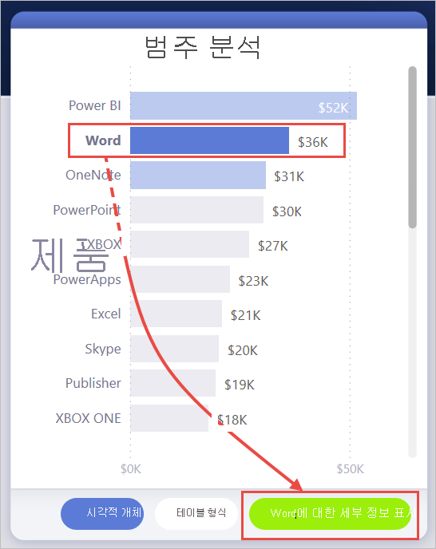
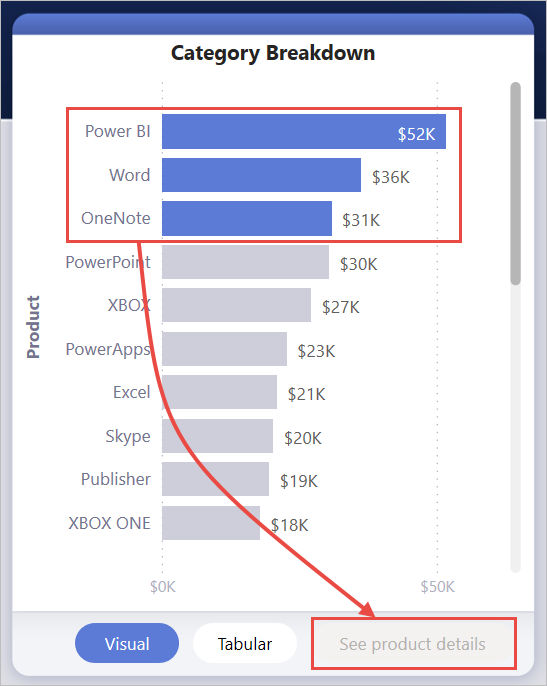

# <a name="create-a-drill-through-button-in-power-bi"></a>Power BI에서 드릴스루 단추 만들기

Power BI에서 단추를 만들 때 **드릴스루** 작업을 선택할 수 있습니다. 이 작업 유형은 특정 컨텍스트로 필터링된 세부 정보를 가져오기 위해 포커스가 있는 페이지로 드릴스루하는 단추를 만듭니다.

드릴스루 단추는 보고서에서 중요한 드릴스루 시나리오의 검색 기능을 개선하려는 경우에 유용할 수 있습니다.

이 예제에서는 사용자가 차트에서 Word 막대를 선택한 후 **자세한 정보 표시** 단추가 사용하도록 설정됩니다.


**자세한 정보 표시** 단추를 선택하면 시장 바구니 분석 페이지로 드릴스루됩니다. 왼쪽의 시각적 개체에서 볼 수 있듯이 드릴스루 페이지는 이제 Word에 맞게 필터링됩니다.


## <a name="set-up-a-drill-through-button"></a>드릴스루 단추 설정

드릴스루 단추를 설정하려면 먼저 보고서 내에서 [유효한 드릴스루 페이지를 설정](desktop-drillthrough.md)해야 합니다. 그런 다음, **드릴스루**를 작업 유형으로 사용하는 단추를 만들고 드릴스루 페이지를 **대상**으로 선택해야 합니다.

드릴스루 단추에는 두 가지 상태(드릴스루 사용 및 사용 안 함)가 있기 때문에 두 개의 도구 설명 옵션이 표시됩니다.


도구 설명 상자를 비워 두면 Power BI가 자동으로 도구 설명을 생성합니다. 해당 도구 설명은 대상 및 드릴스루 필드를 기반으로 합니다.

단추를 사용할 수 없는 경우 자동 생성된 도구 설명의 예는 다음과 같습니다.

“시장 바구니 분석(대상 페이지)으로 드릴스루하려면 제품(드릴스루 필드)의 단일 데이터 요소를 선택합니다.”


단추를 사용할 수 있는 경우 자동 생성된 도구 설명의 예는 다음과 같습니다.

“시장 바구니 분석(대상 페이지)으로 드릴스루하려면 클릭합니다.”


그러나 사용자 지정 도구 설명을 제공하기 위해 항상 정적 문자열을 입력할 수 있습니다. 도구 설명의 조건부 서식은 아직 지원되지 않습니다.

조건부 서식을 사용하여 선택한 필드 값에 따라 단추 텍스트를 변경할 수 있습니다. 이렇게 하려면 DAX 함수 SELECTEDVALUE를 기반으로 원하는 문자열을 출력하는 측정값을 만들어야 합니다.

단일 제품 값을 선택하지 않은 경우 “제품 세부 정보 표시”를 출력하는 예제 측정값은 다음과 같습니다. 선택한 경우에는 “[선택한 제품]의 세부 정보 표시”를 출력합니다.

```
String_for_button = If(SELECTEDVALUE('Product'[Product], 0) == 0), "See product details", "See details for " & SELECTEDVALUE('Product'[Product]))
```

이 측정값을 만든 후에는 단추 텍스트에 대한 **조건부 서식** 옵션을 선택합니다.


그런 다음, 단추 텍스트용으로 만든 측정값을 선택합니다.


단일 제품이 선택된 경우 단추 텍스트가 다음과 같이 표시됩니다.

“Word에 대한 세부 정보 표시”



제품이 선택되지 않거나 둘 이상의 제품이 선택된 경우에는 단추를 사용할 수 없으며 단추 텍스트가 다음과 같이 표시됩니다.

“제품 세부 정보 표시”



## <a name="pass-filter-context"></a>필터 컨텍스트 전달

단추는 일반 드릴스루처럼 작동하므로 드릴스루 필드를 포함하는 시각적 개체를 교차 필터링하여 추가 필드에 대한 필터를 전달할 수도 있습니다. 예를 들어 **Ctrl** + **클릭** 및 교차 필터링을 사용하면 선택 영역이 드릴스루 필드인 제품을 포함하는 시각적 개체를 교차 필터링하기 때문에 매장에 대한 여러 필터를 드릴스루 페이지에 전달할 수 있습니다.


드릴스루 단추를 선택하면 대상 페이지로 전달되는 매장 및 제품에 대한 필터가 둘 다 표시됩니다.


### <a name="ambiguous-filter-context"></a>모호한 필터 컨텍스트

드릴스루 단추는 단일 시각적 개체와 연결되지 않으므로 선택 영역이 모호한 경우 단추를 사용할 수 없습니다.

이 예제에서는 두 시각적 개체에 모두 제품에 대한 단일 선택 영역이 포함되므로 단추를 사용할 수 없습니다. 어떤 시각적 개체의 어떤 데이터 요소가 드릴스루 작업을 연결할지에 대한 모호성이 있습니다.


## <a name="limitations"></a>제한 사항

- 이 단추는 단일 단추를 사용하는 여러 대상을 허용하지 않습니다.
- 이 단추는 동일한 보고서 내에서만 드릴스루를 지원합니다. 즉, 보고서 간 드릴스루를 지원하지 않습니다.
- 단추의 사용 안 함 상태 서식은 보고서 테마의 색 클래스에 연결됩니다. [색 클래스](desktop-report-themes.md#setting-structural-colors)에 대해 자세히 알아보세요.
- 드릴스루 작업은 모든 기본 제공 시각적 개체에서 작동하며 AppSource에서 가져온 ‘일부’ 시각적 개체에서 작동합니다. 그러나 AppSource에서 가져온 ‘모든’ 시각적 개체에서 작동한다는 보장은 없습니다.

## <a name="next-steps"></a>다음 단계
단추와 유사하거나 상호 작용하는 기능에 대한 자세한 내용은 다음 아티클을 살펴보겠습니다.

* [단추 만들기](desktop-buttons.md)
* [Power BI 보고서에서 드릴스루 사용](desktop-drillthrough.md)
* [책갈피를 사용하여 Power BI에서 정보 공유 및 스토리 빌드](desktop-bookmarks.md)

