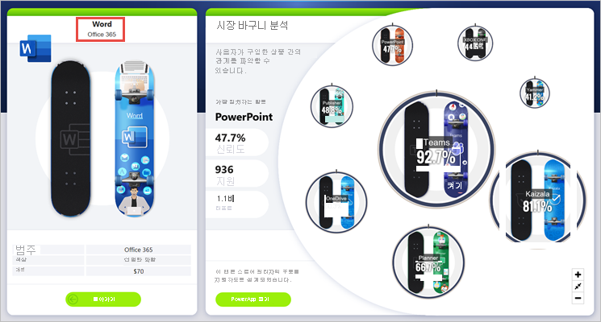

# <a name="create-a-drill-through-button-in-power-bi"></a>Power BI에서 드릴스루 단추 만들기

Power BI에서 특정 컨텍스트로 필터링된 세부 정보를 사용하여 페이지로 드릴스루하는 단추인 드릴스루 단추를 만들 수 있습니다.

보고서에서 드릴스루하는 한 가지 방법은 시각적 개체를 마우스 오른쪽 단추로 클릭하는 것입니다. 드릴스루 작업을 보다 명확하게 하려는 경우 대신 드릴스루 단추를 만들 수 있습니다. 이 단추를 사용하여 보고서에서 중요한 드릴스루 시나리오의 검색 기능을 향상시킬 수 있습니다. 단추의 모양과 동작을 대부분 조건부로 결정할 수 있습니다. 예를 들어 특정 조건이 충족되는 경우 단추에 다른 텍스트를 표시할 수 있습니다. 세부 정보를 계속 읽어 보세요. 

이 예제에서는 사용자가 차트에서 Word 막대를 선택한 후 **세부 정보 보기** 단추가 활성화됩니다.


**세부 정보 보기** 단추를 선택하면 시장 바구니 분석 페이지로 드릴스루됩니다. 왼쪽의 시각적 개체에서 볼 수 있듯이 드릴스루 페이지는 이제 Word에 맞게 필터링됩니다.



## <a name="set-up-a-drill-through-button"></a>드릴스루 단추 설정

드릴스루 단추를 설정하려면 먼저 보고서 내에서 [유효한 드릴스루 페이지를 설정](desktop-drillthrough.md)해야 합니다. 그런 다음, **드릴스루**를 작업 유형으로 사용하는 단추를 만들고 드릴스루 페이지를 **대상**으로 선택해야 합니다.

드릴스루 단추에는 활성 및 비활성의 두 개의 상태가 있으므로 두 개의 도구 설명 옵션이 표시됩니다.


도구 설명 상자를 비워 두면 Power BI가 자동으로 도구 설명을 생성합니다. 해당 도구 설명은 대상 및 드릴스루 필드를 기반으로 합니다.

단추를 사용할 수 없는 경우 자동 생성된 도구 설명의 예는 다음과 같습니다.

“시장 바구니 분석[대상 페이지]으로 드릴스루하려면 제품[드릴스루 필드]에서 단일 데이터 요소를 선택합니다.”


단추를 사용할 수 있는 경우 자동 생성된 도구 설명의 예는 다음과 같습니다.

“시장 바구니 분석[대상 페이지]으로 드릴스루하려면 클릭합니다.”


그러나 사용자 지정 도구 설명을 제공하기 위해 항상 정적 문자열을 입력할 수 있습니다. [도구 설명에 조건부 서식](#set-formatting-for-tooltips-conditionally)을 적용할 수도 있습니다.

## <a name="pass-filter-context"></a>필터 컨텍스트 전달

단추는 일반적인 드릴스루와 같이 작동합니다. 드릴스루 필드를 포함하는 시각적 개체를 교차 필터링하여 추가 필드에 필터를 전달할 수 있습니다. 예를 들어 **Ctrl** + **클릭** 및 교차 필터링을 사용하면 선택 영역이 드릴스루 필드인 제품을 포함하는 시각적 개체를 교차 필터링하기 때문에 매장에 대한 여러 필터를 드릴스루 페이지에 전달할 수 있습니다.


드릴스루 단추를 선택하면 대상 페이지로 전달되는 매장 및 제품에 대한 필터가 둘 다 표시됩니다.


### <a name="ambiguous-filter-context"></a>모호한 필터 컨텍스트

드릴스루 단추는 단일 시각적 개체와 연결되지 않으므로 선택 영역이 모호한 경우 단추를 사용할 수 없습니다.

이 예제에서는 두 시각적 개체에 모두 제품에 대한 단일 선택 영역이 포함되므로 단추를 사용할 수 없습니다. 어떤 시각적 개체의 어떤 데이터 요소가 드릴스루 작업을 연결할지에 대한 모호성이 있습니다.


## <a name="customize-formatting-for-disabled-buttons"></a>비활성화된 단추 서식 사용자 지정
드릴스루 단추의 비활성 상태에 대한 서식 옵션을 사용자 지정할 수 있습니다.


:::image type="content" source="media/desktop-drill-through-buttons/drill-through-customize-disabled-button.png" alt-text="비활성화된 단추 서식 사용자 지정":::
 
이러한 서식 옵션은 다음과 같습니다.
- **단추 텍스트 컨트롤**: 텍스트, 색, 안쪽 여백, 맞춤, 크기 및 글꼴 패밀리

    :::image type="content" source="media/desktop-drill-through-buttons/drill-through-disabled-button-text.png" alt-text="비활성화된 단추 텍스트 서식 지정":::

- **단추 채우기 컨트롤**: 색, 투명도 및 새 채우기 이미지(다음 섹션에서 자세히 설명)

    :::image type="content" source="media/desktop-drill-through-buttons/drill-through-disabled-button-fill.png" alt-text="비활성화된 단추 채우기":::

- **아이콘 컨트롤**: 모양, 안쪽 여백, 맞춤, 선 색, 투명도 및 가중치

    :::image type="content" source="media/desktop-drill-through-buttons/drill-through-disabled-button-icon.png" alt-text="비활성화된 단추 아이콘":::

- **윤곽선 컨트롤**: 색, 투명도, 두께, 둥근 가장자리

     :::image type="content" source="media/desktop-drill-through-buttons/drill-through-disabled-button-outline.png" alt-text="비활성화된 단추 윤곽선":::

## <a name="set-formatting-for-button-text-conditionally"></a>조건부로 단추 텍스트 서식 설정
조건부 서식을 사용하여 선택한 필드 값에 따라 단추 텍스트를 변경할 수 있습니다. 이렇게 하려면 DAX 함수 SELECTEDVALUE를 기반으로 원하는 문자열을 출력하는 측정값을 만들어야 합니다.

단일 제품 값을 선택하지 않은 경우 “제품 세부 정보 표시”를 출력하는 예제 측정값은 다음과 같습니다. 선택한 경우에는 “[선택한 제품]의 세부 정보 표시”를 출력합니다.

```dax
String_for_button = If(SELECTEDVALUE('Product'[Product], 0) == 0, "See product details", "See details for " & SELECTEDVALUE('Product'[Product]))
```

이 측정값을 만든 후에는 단추 텍스트에 대한 **조건부 서식** 옵션을 선택합니다.


그런 다음, 단추 텍스트용으로 만든 측정값을 선택합니다.


단일 제품이 선택된 경우 단추 텍스트가 다음과 같이 표시됩니다.

“Word에 대한 세부 정보 표시”


제품이 선택되지 않았거나 둘 이상의 제품이 선택된 경우에는 단추가 비활성화됩니다. 단추 텍스트는 다음과 같이 표시됩니다.

“제품 세부 정보 표시”


## <a name="set-formatting-for-tooltips-conditionally"></a>조건부로 도구 설명 서식 설정

활성 또는 비활성 상태에서 드릴스루 단추에 대한 도구 설명의 서식을 조건부로 지정할 수 있습니다. 조건부 서식을 사용하여 동적으로 드릴스루 대상을 설정한 경우 최종 사용자의 선택에 따라 단추 상태에 대한 도구 설명을 더 자세히 표시해야 할 수 있습니다. 몇 가지 예제는 다음과 같습니다.

- 사용자 지정 측정값을 사용하여 상황별로 비활성 상태 도구 설명을 설정할 수 있습니다. 예를 들어 사용자가 단일 제품 및 단일 매장을 선택해야 시장 분석 페이지로 드릴스루할 수 있도록 하려면 다음 논리를 사용하여 측정값을 만들 수 있습니다.

    사용자가 단일 제품 또는 단일 매장 중 하나를 선택하지 않은 경우 측정값은 다음을 반환합니다. “단일 제품을 선택한 후 Ctrl을 누른 상태에서 클릭하여 단일 매장도 선택하세요.”

    사용자가 단일 제품을 선택했지만 단일 매장을 선택하지 않은 경우 측정값은 다음을 반환합니다. “단일 매장도 선택하려면 Ctrl을 누른 상태에서 클릭하세요.”

- 마찬가지로, 활성 상태 도구 설명을 사용자의 선택에 맞게 설정할 수 있습니다. 예를 들어 사용자가 드릴스루 페이지를 필터링할 제품 및 매장을 알 수 있도록 하려는 경우 다음을 반환하는 측정값을 만들 수 있습니다.

    “[매장 이름] 매장의 [제품 이름] 제품 판매량에 대한 자세한 내용을 보려면 클릭하여 [드릴스루 페이지 이름]으로 드릴스루하세요.”


## <a name="set-the-drill-through-destination-conditionally"></a>조건부로 드릴스루 대상 설정

조건부 서식을 사용하여 측정값의 출력에 따라 드릴스루 대상을 설정할 수 있습니다.

단추 드릴스루 대상을 조건부로 설정할 수 있는 몇 가지 시나리오는 다음과 같습니다.

- **여러 조건을 충족한 경우에만** 특정 페이지로 드릴스루할 수 있도록 하고 싶습니다. 그렇지 않으면 단추를 사용할 수 없습니다.

    예를 들어 사용자가 단일 제품 및 단일 매장을 선택해야 시장 세부 정보 페이지로 드릴스루할 수 있도록 할 수 있습니다. 그렇지 않으면 단추를 사용할 수 없습니다.

    :::image type="content" source="media/desktop-drill-through-buttons/drill-through-select-product-store.png" alt-text="제품 및 매장 선택":::
 
- 사용자 선택에 따라 단추가 **여러 드릴스루 대상을 지원**하게 하려고 합니다.

    예를 들어 사용자가 드릴스루할 수 있는 여러 대상(시장 세부 정보 및 매장 세부 정보)이 있다고 가정합니다. 드릴스루할 특정 대상을 선택해야 해당 드릴스루 대상에 대해 단추가 활성화되도록 할 수 있습니다.

    :::image type="content" source="media/desktop-drill-through-buttons/drill-through-select-product-destination.png" alt-text="제품 및 대상 선택":::
 
- 또한 여러 드릴스루 대상과 단추를 비활성화하는 특정 조건을 모두 지원하는 흥미로운 **하이브리드 시나리오**도 있을 수 있습니다. 계속 읽으면서 이 세 가지 옵션에 대한 자세한 내용을 알아보세요.

### <a name="disable-the-button-until-multiple-conditions-are-met"></a>여러 조건이 충족될 때까지 단추를 비활성화

첫 번째로 추가 조건이 충족될 때까지 단추를 비활성 상태로 유지하려는 경우를 살펴보겠습니다. 조건이 충족되지 않은 경우 빈 문자열(“”)을 출력하는 기본 DAX 측정값을 만들어야 합니다. 이 측정값은 조건이 충족되면 드릴스루 대상 페이지의 이름을 출력합니다.

다음은 사용자가 제품에서 매장 세부 정보 페이지로 드릴스루하려면 먼저 매장을 선택해야 하는 DAX 측정값 예제입니다.

```dax
Destination logic = If(SELECTEDVALUE(Store[Store], “”)==””, “”, “Store details”)
```

측정값을 만들었으면 단추의 **대상** 옆에 있는 조건부 서식(fx) 단추를 선택합니다.

:::image type="content" source="media/desktop-drill-through-buttons/drill-through-select-formula.png" alt-text="조건부 서식 단추 선택":::
 
마지막 단계로, 방금 만든 DAX 측정값을 대상에 대한 필드 값으로 선택합니다.

:::image type="content" source="media/desktop-drill-through-buttons/drill-through-based-formula.png" alt-text="필드 기반 대상"::: 

이제는 단일 제품을 선택해도 단추가 사용할 수 없는 것으로 나타납니다. 측정값이 단일 매장을 선택하도록 요구하기 때문입니다.

:::image type="content" source="media/desktop-drill-through-buttons/drill-through-button-disabled.png" alt-text="드릴스루 단추 비활성화됨":::

### <a name="support-multiple-destinations"></a>여러 대상 지원
 
여러 대상을 지원하려는 다른 일반적인 경우에는 드릴스루 대상의 이름을 사용하여 단일 열 테이블을 만드는 것으로 시작합니다.

:::image type="content" source="media/desktop-drill-through-buttons/drill-through-create-table.png" alt-text="테이블 만들기":::

Power BI는 정확한 문자열 일치를 사용하여 드릴스루 대상을 설정하므로 입력한 값이 드릴스루 페이지 이름과 정확하게 일치하는지 재차 확인하세요.

테이블을 만든 후에는 단일 선택 슬라이서로 페이지에 추가합니다.

:::image type="content" source="media/desktop-drill-through-buttons/drill-through-slicer.png" alt-text="드릴스루 슬라이서":::
 
세로 공간이 더 필요한 경우 슬라이서를 드롭다운으로 변환합니다. 슬라이서 헤더를 제거하고 제목이 옆에 있는 텍스트 상자를 추가합니다.

:::image type="content" source="media/desktop-drill-through-buttons/drill-through-drop-down-slicer.png" alt-text="헤더가 없는 드릴스루 슬라이서":::
 
또는 목록 슬라이서를 세로 방향에서 가로 방향으로 변경합니다.

:::image type="content" source="media/desktop-drill-through-buttons/drill-through-horizontal-slicer.png" alt-text="가로 슬라이서":::

드릴스루 동작에 대한 대상 입력으로 단추의 **대상** 옆에 있는 조건부 서식(fx) 단추를 선택합니다.

:::image type="content" source="media/desktop-drill-through-buttons/drill-through-select-formula.png" alt-text="조건부 서식 단추 선택":::
 
앞서 만든 열의 이름을 선택합니다(이 경우 **대상 선택**).

:::image type="content" source="media/desktop-drill-through-buttons/drill-through-select-destination.png" alt-text="대상 선택":::
 
이제 제품 및 매장을 선택하는 경우에만 드릴스루 단추가 활성화됨을 확인할 수 있습니다.

:::image type="content" source="media/desktop-drill-through-buttons/drill-through-select-product-destination.png" alt-text="제품 및 대상 선택":::
 
### <a name="hybrid-of-the-two-scenarios"></a>두 시나리오의 혼합

두 시나리오를 혼합하여 사용하려면 DAX 측정값을 만들고 참조하여 대상 선택에 대한 논리를 추가할 수 있습니다.

다음은 사용자가 제품에서 다른 드릴스루 페이지로 드릴스루하려면 먼저 매장을 선택해야 하는 DAX 측정값 예제입니다.

```dax
Destination logic = If(SELECTEDVALUE(Store[Store], “”)==””, “”, SELECTEDVALUE(‘Table'[Select a destination]))
```

그런 다음, 방금 만든 DAX 측정값을 대상에 대한 필드 값으로 선택합니다.
이 예제에서는 사용자가 제품, 매장 및 대상 페이지를 선택해야 드릴스루 단추를 사용할 수 있습니다.

:::image type="content" source="media/desktop-drill-through-buttons/drill-through-product-store-destination.png" alt-text="제품, 매장 및 대상 선택":::

## <a name="limitations"></a>제한 사항

- 이 단추는 단일 단추를 사용하는 여러 대상을 허용하지 않습니다.
- 이 단추는 동일한 보고서 내에서만 드릴스루를 지원합니다. 즉, 보고서 간 드릴스루를 지원하지 않습니다.
- 단추의 사용 안 함 상태 서식은 보고서 테마의 색 클래스에 연결됩니다. [색 클래스](desktop-report-themes.md#setting-structural-colors)에 대해 자세히 알아보세요.
- 드릴스루 작업은 모든 기본 제공 시각적 개체에서 작동하며 AppSource에서 가져온 ‘일부’ 시각적 개체에서 작동합니다. 그러나 AppSource에서 가져온 ‘모든’ 시각적 개체에서 작동한다는 보장은 없습니다.

## <a name="next-steps"></a>다음 단계
단추와 유사하거나 상호 작용하는 기능에 대한 자세한 내용은 다음 아티클을 살펴보겠습니다.

* [단추 만들기](desktop-buttons.md)
* [Power BI 보고서에서 드릴스루 사용](desktop-drillthrough.md)
* [책갈피를 사용하여 Power BI에서 정보 공유 및 스토리 빌드](desktop-bookmarks.md)

