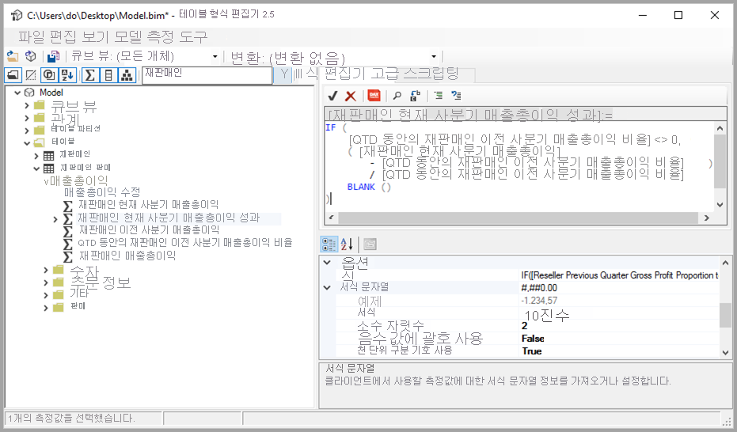
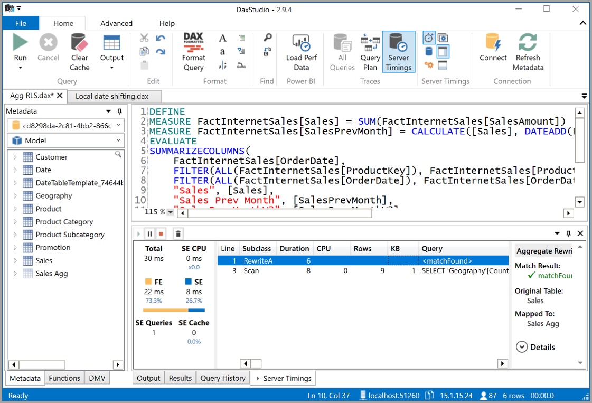

# <a name="using-external-tools-in-power-bi-desktop-preview"></a>Power BI Desktop에서 외부 도구 사용(미리 보기)

Power BI Desktop 2020년 7월 릴리스부터 외부 도구를 사용하여 Power BI Desktop에 추가 기능 및 값을 제공할 수 있습니다. 외부 도구를 지원하므로 DAX 쿼리/식 최적화 및 제작, ALM(애플리케이션 수명 주기 관리)과 같은 BI 전문가용 Analysis Services를 위한 다양한 커뮤니티 도구를 활용할 수 있습니다.

Power BI Desktop의 **외부 도구** 리본에는 머신에 설치되고 Power BI Desktop에 등록된 외부 도구에 대한 단추가 포함되어 있습니다. Power BI Desktop에서 시작되는 외부 도구는 Power BI Desktop의 일부로 작동하는 Analysis Services 엔진에 자동으로 연결되어 사용자에게 원활한 환경을 제공합니다.


주요 외부 도구에는 설치 위치의 링크와 함께 다음이 포함됩니다. 각 외부 도구는 해당 도구 작성자가 지원합니다.

* [테이블 형식 편집기](https://tabulareditor.com/)
* [DAX Studio](https://daxstudio.org)
* [ALM 도구 키트](http://alm-toolkit.com)


다음 섹션에서는 외부 도구에서 지원되는 작업, Power BI Desktop에 포함된 추천 도구 목록, 추가 도구를 등록하는 방법에 대한 지침을 설명합니다.

## <a name="supported-write-operations"></a>지원되는 쓰기 작업

외부 도구는 Power BI Desktop 데이터 세트(Analysis Services 모델)에 연결하여 다음 개체를 편집할 수 있습니다. PBIT(Power BI Desktop 템플릿) 파일 편집은 지원되지 않습니다.

* 계산 [측정값](/analysis-services/tabular-models/measures-ssas-tabular)
* 복잡한 모델에서 계산을 재사용하기 위한 [계산 그룹](/analysis-services/tabular-models/calculation-groups)
* 데이터 세트 메타데이터의 포커스가 있는 비즈니스 도메인별 보기를 정의하기 위한 [큐브 뷰](/analysis-services/tabular-models/perspectives-ssas-tabular)

외부 도구를 사용하여 메타데이터 번역을 관리할 수 있지만, 이 미리 보기 버전에서는 지원되지 않습니다. 현재 사용자의 로캘이 번역된 로캘인 경우 현재 버전의 Power BI Desktop에서는 필드 목록에서 개체 편집 기능이 제대로 작동하지 않습니다. 

모든 [테이블 형식 개체 모델](/analysis-services/tom/introduction-to-the-tabular-object-model-tom-in-analysis-services-amo) 데이터 세트 메타데이터는 읽기 전용으로 액세스할 수 있지만 [테이블 형식 개체 모델](/analysis-services/tom/introduction-to-the-tabular-object-model-tom-in-analysis-services-amo) 문서에 설명된 목록에 포함되지 않은 개체는 아직 Power BI Desktop Analysis Services 인스턴스에서 편집할 수 없습니다.


## <a name="featured-external-tools"></a>추천 외부 도구

Power BI Desktop에서 작동하는 오픈 소스 커뮤니티 도구는 다음과 같습니다. 관련 도구는 해당 도구 작성자가 지원합니다. 각 도구의 개별 설치 관리자가 설치 시 Power BI Desktop에 도구를 등록합니다.

* 테이블 형식 편집기
* DAX Studio
* ALM 도구 키트

각 도구를 차례로 살펴보겠습니다.

### <a name="tabular-editor"></a>테이블 형식 편집기

다음 링크에서 [테이블 형식 편집기](https://tabulareditor.com/)를 설치할 수 있습니다. [테이블 형식 편집기 웹 사이트](https://tabulareditor.com/)

테이블 형식 편집기를 사용하면 BI 전문가가 직관적이고 간단한 편집기에서 테이블 형식 모델을 쉽게 작성, 유지 및 관리할 수 있습니다. 계층 구조 보기에는 다중 선택 속성 편집 및 DAX 구문 강조 표시를 지원하는 표시 폴더로 구성된 테이블 형식 모델의 모든 개체가 표시됩니다.



테이블 형식 편집기의 소스 코드는 다음 GitHub 리포지토리에서 확인할 수 있습니다. [GitHub의 테이블 형식 편집기](https://github.com/otykier/TabularEditor)

테이블 형식 편집기의 기본 도구 작성자는 [Daniel Otykier](https://www.linkedin.com/in/daniel-otykier-2231876)입니다.


### <a name="dax-studio"></a>DAX Studio

다음 링크에서 [DAX Studio](https://daxstudio.org)를 설치할 수 있습니다. [DAX Studio 웹 사이트](https://daxstudio.org)

DAX Studio는 DAX 제작, 진단, 성능 조정 및 분석을 위한 완벽한 도구로 알려져 있습니다. 기능에는 개체 검색, 통합 추적, 세부 통계를 포함하는 쿼리 실행 분석, DAX 구문 강조 표시 및 서식 지정이 포함됩니다. 다음 이미지는 Dax Studio 화면을 보여 줍니다. 



Dax Studio의 소스 코드는 다음 GitHub 리포지토리에서 확인할 수 있습니다. [GitHub의 DAX Studio](https://github.com/DaxStudio/DaxStudio)

DAX Studio의 기본 도구 작성자는 [Darren Gosbell](https://www.linkedin.com/in/darrengosbell)입니다.

### <a name="alm-toolkit"></a>ALM 도구 키트

다음 링크에서 [ALM 도구 키트](http://alm-toolkit.com)를 설치할 수 있습니다. [ALM 도구 키트 웹 사이트](http://alm-toolkit.com)

ALM 도구 키트는 Power BI 데이터 세트용 스키마 비교 도구로, ALM(애플리케이션 수명 주기 관리) 시나리오에 사용됩니다. ALM 도구 키트를 사용하여 환경 간에 간단한 배포를 수행하고 증분 새로 고침 기록 데이터를 유지할 수 있습니다. ALM 도구 키트를 사용하면 메타데이터 파일, 분기 및 리포지토리를 비교하고 병합할 수 있습니다. 또한 공통 정의를 여러 데이터 세트에 다시 사용할 수 있습니다.


ALM 도구 키트의 소스 코드는 다음 GitHub 리포지토리에서 확인할 수 있습니다. [GitHub의 ALM 도구 키트](https://github.com/microsoft/analysis-services)

ALM 도구 키트의 기본 도구 작성자는 [Christian Wade](https://www.linkedin.com/in/christianwade1)입니다.


## <a name="how-to-register-external-tools"></a>외부 도구를 등록하는 방법

Power BI Desktop을 사용하여 다른 외부 도구를 등록하려면 다음 내용을 포함하는 JSON 파일을 만듭니다.

```json
{
    "name": "<tool name>",
    "description": "<tool description>",
    "path": "<tool executable path>",
    "arguments": "<optional command line arguments>",
    "iconData": "image/png;base64,<encoded png icon data>"
}
```

다음 목록에서는 JSON 파일의 요소 목록에 관해 설명합니다.
 
* **name:** Power BI Desktop 내의 외부 도구 리본에서 단추 캡션으로 표시되는 도구의 이름을 제공합니다.
* **description:** (선택 사항) Power BI Desktop 내에서 외부 도구 리본 단추에 대한 도구 설명으로 표시되는 설명을 입력합니다.
* **path:** 도구 실행 파일의 정규화된 경로를 제공합니다.
* **arguments:** (선택 사항) 도구 실행 파일을 시작하는 데 사용되는 명령줄 인수의 문자열을 제공합니다. 다음 자리 표시자 중 하나를 사용할 수 있습니다.
    * **%server%:** 가져온/DirectQuery 데이터 모델을 위한 Analysis Services 테이블 형식의 로컬 인스턴스에 대한 서버 이름 및 포트 번호로 바꿉니다.
    * **%database%:** 가져온/DirectQuery 데이터 모델을 위한 Analysis Services 테이블 형식의 로컬 인스턴스에 호스트된 모델에 대한 데이터베이스 이름으로 바꿉니다.
* **iconData:** Power BI Desktop 내의 외부 도구 리본에서 단추 아이콘으로 렌더링될 이미지 데이터를 제공합니다. "data:" 접두사가 없는 데이터 URI의 구문에 따라 문자열의 서식을 지정해야 합니다.
 
파일 이름을 `"<tool name>.pbitool.json"`으로 지정하고 파일을 다음 폴더에 저장합니다.

* `%commonprogramfiles%\Microsoft Shared\Power BI Desktop\External Tools`

64비트 환경의 경우 다음 폴더에 파일을 저장합니다.

* **Program Files (x86)\Common Files\Microsoft Shared\Power BI Desktop\External Tools**

지정된 위치에서 확장명이 **.pbitool.json** 인 파일은 시작할 때 Power BI Desktop에서 로드됩니다.

## <a name="disabling-external-tools-using-the-registry"></a>레지스트리를 사용하여 외부 도구를 사용하지 않도록 설정

**그룹 정책** 을 사용하거나 레지스트리를 편집하여 외부 도구를 사용하지 않도록 설정할 수 있습니다. 해당 작업은 **사용자 지정 시각적 개체** 를 사용하지 않도록 설정하는 프로세스와 비슷합니다.

* 레지스트리 키: *Software\Policies\Microsoft\Power BI Desktop\\*

* 레지스트리 값: *EnableExternalTools*

값이 1(10진수)이면 Power BI에서 외부 도구를 사용할 수 있습니다(기본값).

값이 0(10진수)이면 Power BI에서 외부 도구를 사용할 수 없습니다.


## <a name="next-steps"></a>다음 단계

다음 문서에도 관심이 있을 수 있습니다.

* [Power BI 보고서에서 보고서 간 드릴스루 사용](desktop-cross-report-drill-through.md)
* [Power BI Desktop에서 슬라이서 사용](../visuals/power-bi-visualization-slicers.md)