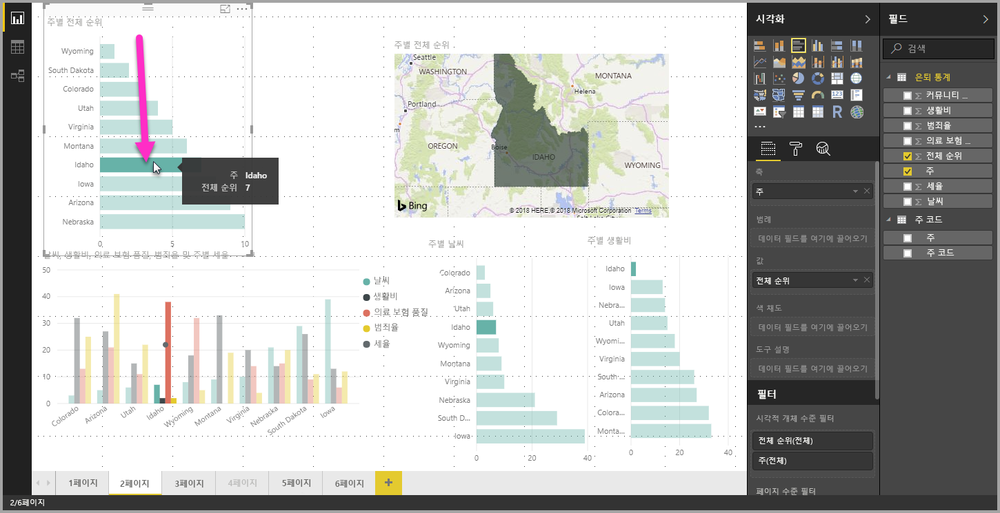
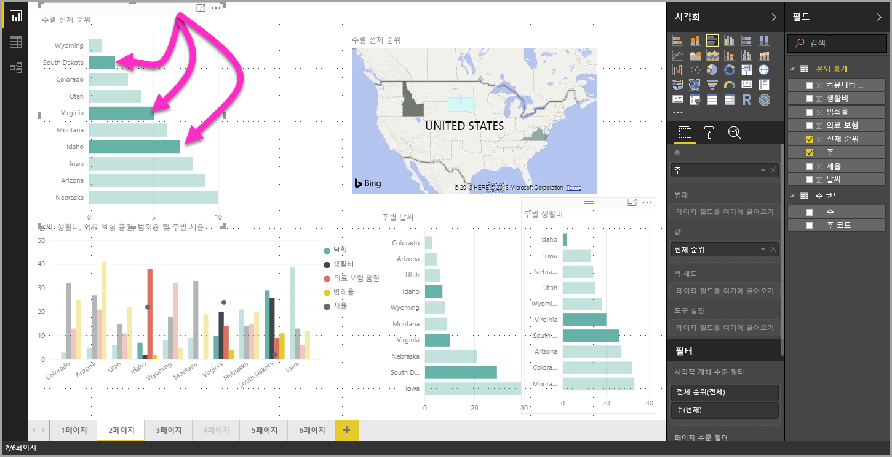

# Power BI Desktop의 데이터 요소, 데이터 포인트 및 시각적 개체 다중 선택

Power BI Desktop을 사용하여 하나의 시각적 개체에서 여러 데이터 요소를 선택하거나, 시각적 개체에서 여러 데이터 요소를 선택하거나, 보고서에서 여러 시각적 개체를 선택할 수 있습니다. 다음 섹션에서는 각각에 대해 차례로 설명합니다.

## 여러 데이터 요소 선택

Power BI Desktop에서 시각적 개체의 데이터 요소를 클릭하여 제공된 시각적 개체의 데이터 요소를 강조 표시할 수 있습니다. 예를 들어 중요한 막대 또는 차트 요소가 있는데 보고서 페이지의 다른 시각적 개체가 선택 영역을 기준으로 데이터를 강조 표시하도록 하려면 한 시각적 개체의 데이터 요소를 클릭하고 페이지에서 다른 시각적 개체에 반영된 결과를 확인하면 됩니다. 이는 기본 또는 단일 선택 강조 표시입니다. 다음 이미지는 기본 강조 표시를 보여줍니다. 

다중 선택을 사용하여 이제 **Power BI Desktop** 보고서 페이지에서 데이터 요소를 두 개 이상 선택할 수 있으며, 해당 페이지의 시각적 개체에서 결과를 강조 표시할 수 있습니다. 이는 “Idaho **and** Virginia에 대한 결과 강조 표시”처럼 **and** 문 또는 기능과 동일합니다. 시각적 개체의 데이터 요소를 다중 선택하려면 **CTRL+클릭** 을 사용하여 여러 데이터 요소를 선택합니다. 다음 이미지는 선택된 **여러 데이터 요소** 를 보여줍니다.

간단한 기능처럼 보이지만, 보고서를 작성하고 공유하고 상호 작용할 때 모든 종류의 기회를 제공합니다. 

## 사각형 선택을 사용하여 여러 요소 선택(미리 보기)

종종 *lasso 선택* 이라고도 하는 사각형 선택을 사용하여 시각적 개체에서 여러 데이터 요소를 선택하거나 보고서에서 여러 시각적 개체를 선택할 수 있습니다. 

### 캔버스에서 여러 시각적 개체 선택

사각형 lasso를 만들려면 캔버스를 클릭하고 끌어서 여러 시각적 개체 및 기타 보고서 요소를 선택합니다. lasso 내에 완전히 캡슐화된 모든 시각적 개체가 선택됩니다. *Ctrl* 또는 *Shift* 키를 누르면(Ctrl + 개별 시각적 개체를 클릭하여 다중 선택) 추가 lassoing이 현재 다중 선택에 시각적 개체 선택을 추가합니다. 

시각적 개체가 이미 선택되어 lassoed된 경우 *Ctrl* 또는 *Shift* 를 사용하여 해당 선택을 해제합니다. lasso는 그룹 내에서 단일 시각적 개체를 선택하는 것이 아니라 전체 그룹을 캡슐화하여 그룹을 선택할 수 있습니다.

캔버스는 사각형 lasso 선택 영역으로 자동 스크롤되지 않습니다. 

### 시각적 개체에서 여러 데이터 요소 선택

동일한 사각형 lasso 단계를 사용하여 시각적 개체 내에서 여러 데이터 요소를 선택할 수 있습니다. *Ctrl* 키를 누른 채 시각적 개체 내에서 클릭하고 끌어서 여러 데이터 요소를 선택합니다. 마우스 단추를 놓으면 선택 사각형과 겹치는 모든 요소가 선택되고 이전의 모든 lasso 선택 영역도 유지됩니다. lasso를 선택하는 동안 *Ctrl* 을 사용하여 이전에 선택한 요소를 통합하는 영역을 선택하는 경우 해당 데이터 요소가 선택 취소(해제)됩니다. lasso를 사용하는 경우에도 동일한 효과가 있으며 각 요소를 개별적으로 *Ctrl* 클릭합니다. 

lasso 선택을 수행하는 동안 *Shift* 키를 사용하면 이전 선택 영역이 유지되고 이미 선택된 데이터 요소는 선택된 상태로 유지됩니다. 따라서 lasso 선택을 수행하는 동안 *Shift* 를 사용하면 선택 영역에서 데이터 요소를 전환하는 대신 선택 영역에 데이터 요소만 추가합니다.

키보드 키를 누르지 않고 플롯 영역의 빈 공간을 클릭하여 현재 선택 영역을 지울 수 있습니다.

이 기능에 대한 자세한 내용은 [이 기능 릴리스에 대한 블로그 게시물](https://powerbi.microsoft.com/blog/power-bi-desktop-august-2020-feature-summary/#_Data_point)을 참조하세요.

시각적 개체 내에서 데이터 요소를 여러 개 선택하기 위한 몇 가지 제한 사항 및 고려 사항은 다음과 같습니다.

* 선, 영역, 분산형 차트, 트리맵, 지도에서 올가미 선택 도구 지원
* 한 번에 선택할 수 있는 최대 데이터 요소 수는 300개입니다.
* Power BI 서비스에서 보고서를 볼 때 보고서를 저장하고 게시하면 lasso 선택 기능이 활성화된 경우에만 사각형 선택이 활성화됩니다.

## 다음 단계

다음 문서에도 관심이 있을 수 있습니다.

* [Power BI Desktop 보고서에서 눈금선 및 눈금에 맞춤 사용](desktop-gridlines-snap-to-grid.md)
* [Power BI 보고서에서 필터 정보 및 강조 표시](power-bi-reports-filters-and-highlighting.md)

