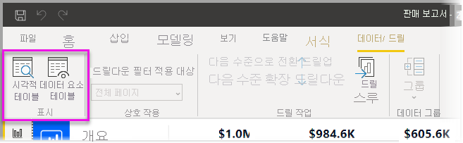
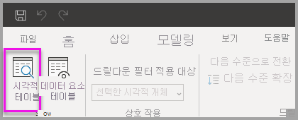
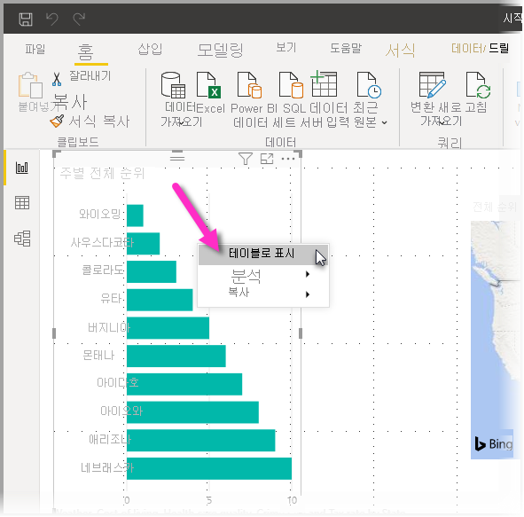
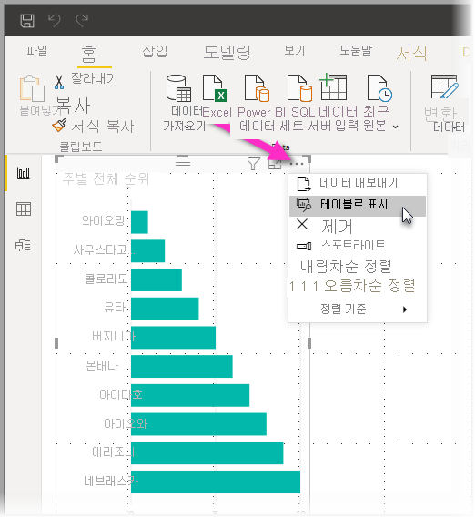
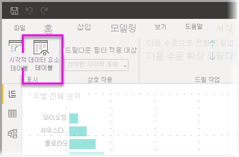
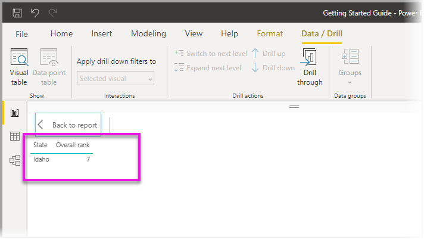

# Power BI Desktop에서 시각적 개체 테이블 및 데이터 요소 테이블 사용
**Power BI Desktop**에서는 시각화의 세부 정보로 드릴하고 선택한 시각적 개체에 대한 기본 데이터 또는 개별 데이터 레코드의 텍스트 표현을 볼 수 있습니다. 이러한 기능을 때로는 ‘클릭 광고’, ‘드릴스루’ 또는 ‘드릴스루 세부 정보’라고 합니다.  

**시각적 개체 테이블**을 사용하여 시각적 개체의 데이터를 테이블로 보거나 **데이터 요소 테이블**을 사용하여 단일 데이터 요소를 계산하는 데 사용되는 데이터 테이블을 볼 수 있습니다. 

>[!IMPORTANT]
>**시각적 개체 테이블** 및 **데이터 요소 테이블**은 다음 시각화 유형만 지원합니다.
>  - 가로 막대형 차트
>  - 세로 막대형 차트
>  - 도넛형 차트
>  - 등치 지역도
>  - 깔때기형
>  - 맵
>  - 원형 차트
>  - 트리맵

## Power BI Desktop에서 시각적 개체 테이블 사용

**시각적 개체 테이블**에는 시각화를 구성하는 데이터가 표시됩니다. 시각적 개체가 선택되면 **시각적 개체 테이블**이 리본의 **표시** 섹션에서 **데이터/드릴** 탭에 표시됩니다.

시각화를 마우스 오른쪽 단추로 클릭하고 표시되는 메뉴에서 **데이터 표시**를 선택하거나 시각화의 오른쪽 위에 있는 **추가 옵션**(...)을 선택한 다음, **테이블로 표시**를 선택하여 데이터를 볼 수도 있습니다.

&nbsp;&nbsp;

> [!NOTE]
> 마우스 오른쪽 단추 클릭 메뉴를 사용하려면 시각적 개체에서 데이터 요소 위로 마우스를 가져가야 합니다.

**시각적 개체 테이블** 또는 **데이터 요소 테이블**을 선택하면 Power BI Desktop 캔버스에 데이터의 시각적 개체와 텍스트 표현이 모두 표시됩니다. ‘가로 보기’에서 시각적 개체는 캔버스의 위쪽 절반에 표시되고, 데이터는 아래쪽 절반에 표시됩니다. 

캔버스의 오른쪽 위에 있는 아이콘을 선택하여 가로 보기와 ‘세로 보기’ 간에 토글할 수 있습니다.

보고서로 돌아가려면 캔버스의 왼쪽 위에 있는 **< 보고서로 돌아가기**를 선택합니다.

## Power BI Desktop에서 데이터 요소 테이블 사용

시각화에서 하나의 데이터 레코드에 포커스를 맞추고 그 뒤의 데이터로 드릴할 수도 있습니다. **데이터 요소 테이블**을 사용하려면 시각화를 선택하고, 리본의 **시각적 개체 도구** 섹션에 있는 **데이터/드릴** 탭에서 **데이터 요소 테이블**을 선택한 다음, 시각화에서 데이터 요소 또는 행을 선택합니다. 

> [!NOTE]
> 리본의 **데이터 요소 테이블** 단추가 비활성화되고 회색으로 표시되는 경우 선택한 시각화에서 **데이터 요소 테이블**을 지원하지 않음을 의미합니다.

데이터 요소를 마우스 오른쪽 단추로 클릭하고 표시되는 메뉴에서 **데이터 요소 테이블**을 선택할 수도 있습니다.

데이터 요소에 대해 **데이터 요소 테이블**을 선택하면 Power BI Desktop 캔버스에 선택된 요소와 연결된 모든 데이터가 표시됩니다. 

보고서로 돌아가려면 캔버스의 왼쪽 위에 있는 **< 보고서로 돌아가기**를 선택합니다.

> [!NOTE]
>**데이터 요소 테이블**에는 다음과 같은 제한 사항이 있습니다.
> - **데이터 요소 테이블** 보기에서 데이터를 변경하고 다시 보고서에 저장할 수 없습니다.
> - 시각적 개체에서 계산된 측정값을 사용하는 경우 **데이터 요소 테이블**을 사용할 수 없습니다.
> - 라이브 MD(다차원) 모델에 연결된 경우 **데이터 요소 테이블**을 사용할 수 없습니다.

## 다음 단계
**Power BI Desktop**에는 모든 종류의 보고서 서식 및 데이터 관리 기능이 있습니다. 몇 가지 예를 보려면 다음 리소스를 확인하세요.

* [Power BI Desktop에서 그룹화 및 범주화 사용](desktop-grouping-and-binning.md)
* [Power BI Desktop 보고서에서 눈금선, 눈금에 맞춤, z-순서, 맞춤 및 균등 맞춤 사용](desktop-gridlines-snap-to-grid.md)

