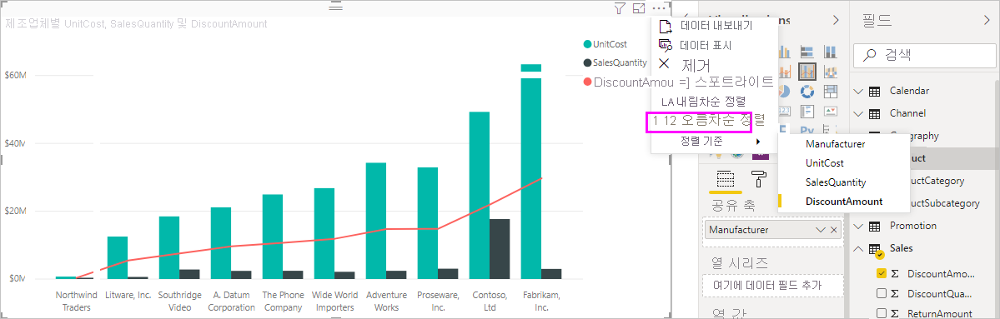

# Power BI Desktop의 열 기준 정렬
Power BI Desktop과 Power BI 서비스에서는 다양한 데이터 필드로 정렬하여 시각적 개체의 모양을 변경할 수 있습니다. 시각적 개체의 정렬 방법을 변경하여 전달하려는 정보를 강조 표시하고 해당 추세(또는 강조점)에 시각적 효과를 반영했는지 확인할 수 있습니다.

숫자 데이터(예: 판매 수치) 또는 텍스트 데이터(예: 주 이름) 중 어떤 데이터를 사용하든지 시각화를 정렬하고 모양으로 만들 수 있습니다. Power BI는 여러 가지 정렬 방법과 간편한 메뉴를 제공합니다. 시각적 개체를 정렬하려면 **추가 옵션**(...) 메뉴를 선택하고, **정렬 기준**을 선택한 다음, 정렬할 필드를 선택합니다.

## 정렬 예제
더 구체적인 예제를 사용하고 Power BI Desktop에서 어떻게 작동하는지 살펴보겠습니다.

다음과 같은 시각화는 제조업체 이름별로 비용, 수량 및 금액을 보여줍니다. 추가로 정렬하기 전에 시각화 모양은 다음과 같습니다.

시각적 개체는 현재 **SalesQuantity** 열을 기준으로 정렬됩니다. 오름차순 막대의 색을 범례에 대응하여 정렬 열을 확인할 수 있지만 더 좋은 방법은 줄임표(...)를 선택하여 액세스하는 **추가 옵션** 메뉴입니다.

정렬 선택은 다음과 같습니다.

* 현재 정렬 필드는 **SalesQuantity**이며, 앞에 노란색 막대가 있고 **SalesQuantity**가 굵게 표시됩니다. 

* 현재 정렬 방향은 오름차순이며 앞에 노란색 막대가 있고 **오름차순 정렬**이 굵게 표시됩니다.

다음 두 섹션에서 정렬 필드 및 정렬 방향을 살펴보겠습니다.

## 정렬에 사용할 열 선택
**추가 옵션** 메뉴에서 **정렬 기준 SalesQuantity** 앞에 노란색 막대는 시각적 개체가 **SalesQuantity** 열로 정렬되었음을 나타냅니다. 다른 열을 기준으로 정렬하는 방법도 간단합니다. 줄임표(...)를 선택하여 **추가 옵션** 메뉴를 표시하고, **정렬 기준**을 선택한 다음, 다른 열을 선택합니다.

다음 이미지에서는 정렬하려는 기준 열로 **DiscountAmount**를 선택합니다. 이 열은 시각적 개체에서 막대가 아닌 한 개의 선으로 나타납니다. 

시각적 개체가 어떻게 변경되었는지 확인합니다. 이제 값은 가장 높은 **DiscountAmount** 값인 Fabrikam Inc.에서 가장 작은 값인 Northwind Traders로 정렬됩니다. 

그러나 내림차순 대신 오름차순으로 정렬하려고 한다면 어떨까요? 다음 섹션에서는 이 작업이 얼마나 쉬운지 보여 줍니다.

## 정렬 순서 선택
이전 이미지의 **추가 옵션** 메뉴를 자세히 살펴보면 **내림차순 정렬** 앞에 노란색 막대가 있고 해당 메뉴가 굵게 표시된 것을 알 수 있습니다.

**내림차순 정렬**을 선택하면 시각적 개체가 선택한 열을 기준으로 가장 큰 값에서 가장 작은 값으로 정렬되는 것을 의미합니다. 이러한 동작을 변경하려는 경우 문제가 되지 않습니다. **오름차순 정렬**을 선택하면 선택된 열의 정렬 순서가 가장 작은 값에서 가장 큰 값으로 변경됩니다.

**DiscountAmount**의 순서를 변경한 후에도 동일한 시각적 개체입니다. 이제 Northwind Traders가 나열된 첫 번째 제조업체이고 Fabrikam Inc.가 앞과 반대로 마지막입니다.

정렬 기준으로 시각적 개체에 포함된 어떤 열이든 사용할 수 있습니다. 정렬할 기준 열로 **SalesQuantity**를 간편하게 선택하여 가장 판매량이 높은 제조업체를 첫 번째로 표시해도 시각적 개체에 있는 다른 열은 해당 제조업체에 적용되므로 그대로 유지됩니다. 다음 설정을 통해 시각적 개체를 살펴보겠습니다.

## 열 기준 정렬 단추를 사용하여 정렬
**모델링** 리본에 있는 **열 기준 정렬** 단추를 사용하여 데이터를 정렬하는 다른 방법이 있습니다.

이 정렬 방법을 사용하려면 먼저 **필드** 창에서 열(필드)을 선택한 다음, **모델링** > **열 기준 정렬**을 선택하여 시각적 개체를 정렬해야 합니다. 열을 선택하지 않으면 **열 기준 정렬** 단추가 비활성화됩니다.

일반적인 예제를 살펴보겠습니다. 연도의 월별 데이터가 있고 시간 순서대로 정렬하고자 합니다. 다음 단계는 방법을 알아봅니다.

1. 시각적 개체는 선택되어 있으나 **필드** 창에서 선택된 열이 없습니다. **열 기준 정렬** 단추가 비활성화(회색으로 표시)되어 있습니다.
   
   

2. **필드** 창에서 정렬하려는 열을 선택하면 **열 기준 정렬** 단추가 활성화됩니다.
   
   
3. 이제 선택한 시각적 개체로 기본값 **MonthName** 대신 **MonthOfYear**를 선택할 수 있습니다. 시각적 개체가 원하는 순서인 연도의 월별로 정렬됩니다.
   
   

<!---
This functionality is no longer active. Jan 2020

## Getting back to default column for sorting
You can sort by any column you'd like, but there may be times when you want the visual to return to its default sorting column. No problem. For a visual that has a sort column selected, open the **More options** menu and select that column again, and the visualization returns to its default sort column.

For example, here's our previous chart:

When we go back to the menu and select **SalesQuantity** again, the visual defaults to being ordered alphabetically by **Manufacturer**, as shown in the following image.

With so many options for sorting your visuals, creating just the chart or image you want is easy.
--->

## 다음 단계

다음 문서에도 관심이 있을 수 있습니다.

* [Power BI Desktop에서 교차 보고서 드릴스루 사용](desktop-cross-report-drill-through.md)
* [Power BI의 슬라이서](../visuals/power-bi-visualization-slicers.md)
