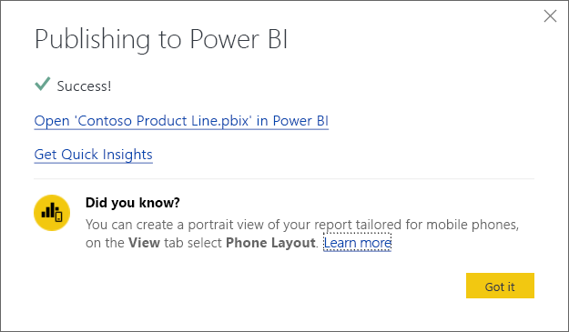
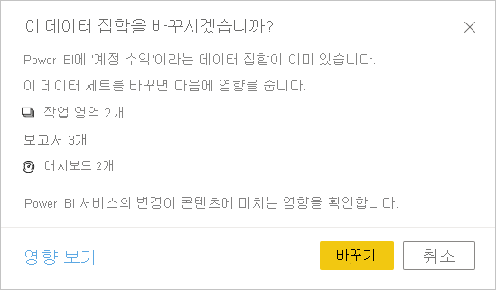

# Power BI Desktop에서 데이터 세트 및 보고서 게시
Power BI Desktop 파일을 Power BI 서비스에 게시하면 모델의 데이터가 Power BI 작업 영역에 게시됩니다. **보고서** 보기에서 만든 모든 보고서의 경우에도 마찬가지입니다. 작업 영역 탐색기에서 동일한 이름의 새 데이터 세트와 모든 보고서를 볼 수 있습니다.

Power BI Desktop에서 게시하는 것은 Power BI의 **데이터 가져오기** 를 사용하여 연결하고 Power BI Desktop 파일을 업로드하는 것과 동일한 효과를 가집니다.

> [!NOTE]
> Power BI 보고서에서 변경한 내용은 원래 Power BI Desktop 파일에 다시 저장되지 않습니다. 여기에는 보고서에서 시각화를 추가, 삭제 또는 변경하는 경우도 포함됩니다.

## Power BI Desktop 데이터 세트 및 보고서를 게시하려면
1. Power BI Desktop에서 **파일** \> **게시** \> **Power BI에 게시** 를 선택하거나 리본에서 **게시** 를 선택합니다.  

   

2. 아직 로그인하지 않았다면 Power BI에 로그인합니다.
3. 대상을 선택합니다. 2020년 9월 릴리스부터 사용 가능한 작업 영역 목록을 검색하여 게시할 작업 영역을 찾을 수 있습니다. 검색 상자를 사용하여 작업 영역을 필터링할 수 있습니다. 작업 영역을 선택한 다음 **선택** 단추를 클릭하여 게시합니다.

   

게시가 완료되면 보고서 링크가 표시됩니다. 링크를 선택하여 Power BI 사이트에서 보고서를 엽니다.

## Power BI Desktop에서 게시된 데이터 세트의 다시 게시 또는 대체
Power BI Desktop 파일을 게시할 때 Power BI Desktop에서 만든 데이터 세트 및 모든 보고서가 Power BI 사이트에 업로드됩니다. Power BI Desktop 파일을 다시 게시할 때는 Power BI 사이트의 데이터 세트가 Power BI Desktop 파일에서 업데이트된 데이터 세트로 대체됩니다.

매우 단순하지만 몇 가지 알아둘 프로세스가 있습니다.

* Power BI Desktop 파일과 이름이 같은 두 개 이상의 Power BI의 데이터 세트가 있을 경우 게시에 실패할 수 있습니다. Power BI에 동일한 이름의 데이터 세트가 하나뿐인지 확인하세요. 파일의 이름을 변경하고 파일과 동일한 이름의 새 데이터 세트를 게시, 생성할 수도 있습니다.
* 열 또는 측정값의 이름을 변경하거나 삭제하는 경우, Power BI에서 해당 필드에 갖고 있던 모든 시각화가 손상될 수 있습니다. 
* Power BI는 기존 열 형식의 일부 변경을 무시합니다. 예를 들어, 열 형식을 0.25%에서 25%로 변경한 경우입니다.
* Power BI의 기존 데이터 세트에 대해 구성된 새로 고침 일정이 있다고 가정합니다. 파일에 새 데이터 원본을 추가한 후 다시 게시하는 경우, 다음 예약된 새로 고침 전에 해당 데이터 원본에 로그인해야 합니다.
* Power BI Desktop에서 게시된 데이터 세트를 다시 게시하고 새로 고침 일정을 정의한 경우 다시 게시하는 즉시 데이터 세트 새로 고침이 시작됩니다.
* 데이터 세트를 변경한 후 다시 게시하면 변경 내용의 영향을 받을 수 있는 작업 영역, 보고서 및 대시보드 수를 보여 주고 현재 게시된 데이터 세트를 수정 내용으로 바꿀 것인지를 확인하는 메시지가 표시됩니다. 해당 메시지는 Power BI 서비스의 전체 데이터 세트 영향 분석 링크도 제공합니다. 여기서 자세한 정보를 확인하고 조치를 취하여 변경 위험을 완화할 수 있습니다.

   

   [데이터 세트 영향 분석에 대해 자세히 알아보세요](../collaborate-share/service-dataset-impact-analysis.md).

> [!NOTE]
> Power BI 보고서의 일부 데이터 연결에는 Power BI 서비스 가져온 데이터 세트의 데이터 대신 데이터에 대한 링크가 들어 있을 수 있습니다. 예를 들어 DirectQuery 연결은 데이터 자체를 가져오는 대신 업데이트나 상호 작용이 발생하면 데이터에 연결됩니다. 보고서의 연결된 데이터 원본이 온-프레미스인 경우 Power BI에서 액세스하기 위한 게이트웨이가 필요할 수 있습니다. 자세한 내용은 [온-프레미스 데이터 게이트웨이란?](../connect-data/service-gateway-onprem.md)을 참조하세요.
> 

## 다음 단계

Power BI Desktop으로 모든 종류의 작업을 수행할 수 있습니다. 해당 기능에 대한 자세한 내용은 다음 리소스를 확인하세요.

* [Power BI Desktop이란?](../fundamentals/desktop-what-is-desktop.md)
* [Power BI Desktop을 사용한 쿼리 개요](../transform-model/desktop-query-overview.md)
* [Power BI Desktop의 데이터 형식](../connect-data/desktop-data-types.md)
* [자습서: Power BI Desktop에서 데이터 셰이핑 및 결합](../connect-data/desktop-shape-and-combine-data.md)
* [Power BI Desktop의 일반적인 쿼리 작업](../transform-model/desktop-common-query-tasks.md)
