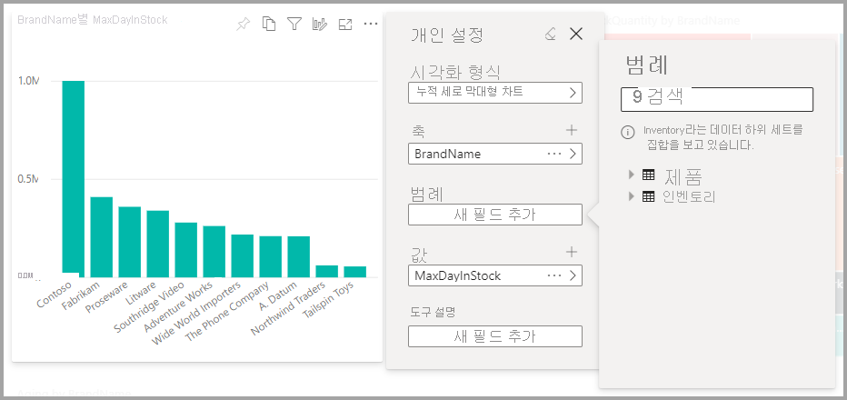
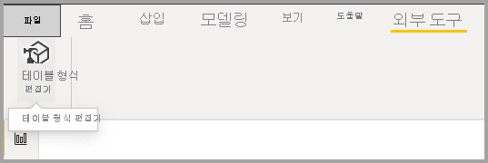
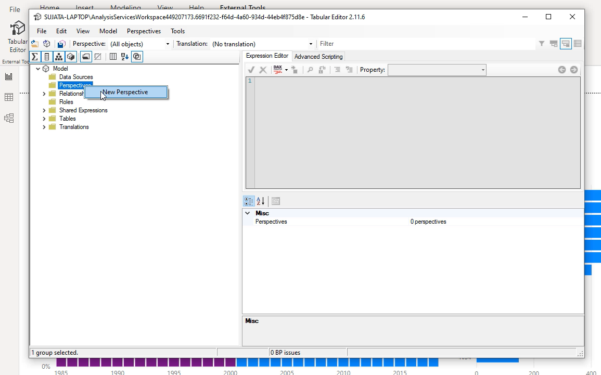
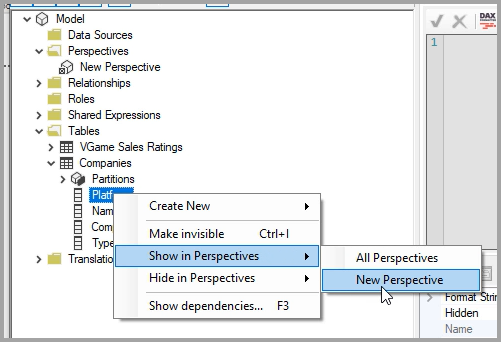
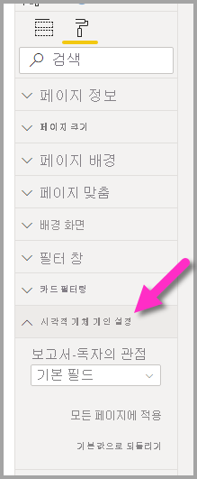
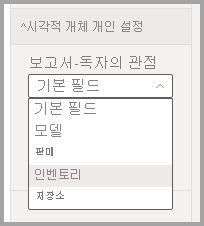
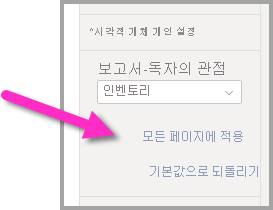

# 사용자가 보고서에서 시각적 개체를 개인 설정할 수 있습니다.

[!INCLUDE [applies-to](../includes/applies-to.md)] [!INCLUDE [yes-desktop](../includes/yes-desktop.md)] [!INCLUDE [yes-service](../includes/yes-service.md)]

광범위한 대상 그룹과 보고서를 공유하는 경우 일부 사용자는 특정 시각적 개체를 약간 다르게 보고 싶어 할 수 있습니다. 축에 있는 항목을 교환하거나, 시각적 개체 유형을 변경하거나, 도구 설명에 항목을 추가하려고 합니다. 모든 사용자의 요구 사항을 충족하는 하나의 시각적 개체를 만드는 것은 어렵습니다. 이 새로운 기능을 사용하면 비즈니스 사용자가 보고서 읽기용 보기에서 시각적 개체를 탐색하고 개인 설정할 수 있습니다. 시각적 개체를 원하는 방식으로 조정하고, 책갈피로 저장하여 다시 돌아올 수 있습니다. 보고서에 대한 편집 권한이 필요 없거나, 변경하기 위해 보고서 작성자에게 다시 돌아갈 필요가 없습니다.

:::image type="content" source="media/power-bi-personalize-visuals/power-bi-personalize-visual.png" alt-text="시각적 개체 개인 설정":::
 
## 보고서 사용자가 변경할 수 있는 내용

이 기능을 사용하면 비즈니스 사용자가 Power BI 보고서에서 시각적 개체를 임시로 탐색하여 추가 인사이트를 얻을 수 있습니다. 사용자로서 이 기능을 사용하는 방법을 알아보려면 [보고서에서 시각적 개체 개인 설정](../consumer/end-user-personalize-visuals.md)을 참조하세요. 이 기능은 보고서 읽기 권한자가 기본 탐색 시나리오를 사용하도록 허용하려는 보고서 작성자에게 적합합니다. 보고서 읽기 권한자는 다음과 같은 수정 작업을 수행할 수 있습니다.

- 시각화 유형 변경
- 측정값 또는 차원 교환
- 범례 추가 또는 제거
- 두 개 이상의 측정값 비교
- 집계 변경 등

이 기능을 통해 새로운 탐색 기능을 사용할 수 있습니다. 사용자가 변경 내용을 캡처하고 공유하는 방법도 포함되어 있습니다.

- 변경 내용 캡처
- 변경 내용 공유
- 보고서의 모든 변경 내용 다시 설정
- 시각적 개체의 모든 변경 내용 다시 설정
- 최근 변경 내용 지우기

## 더 집중된 뷰를 위해 큐브 뷰 사용

시각적 개체 개인 설정의 경우 더 집중된 뷰를 제공하는 모델의 하위 집합을 선택하려면 **큐브 뷰** 를 사용할 수 있습니다. 하위 집합을 선택하면 큰 데이터 모델을 사용하여 작업할 때 유용할 수 있습니다. 관리가 용이한 필드의 하위 집합에 집중할 수 있고, 대규모 모델에 있는 전체 필드 모음으로 보고서를 읽는 사용자에게 부담을 주지 않을 수 있습니다. 

큐브 뷰로 작업할 때 다음 사항을 고려해야 합니다.

* 큐브 뷰는 보안 수단이 아니라 더 나은 최종 사용자 환경을 제공하기 위한 도구입니다. 큐브 뷰에 대한 모든 보안은 기본 모델에서 상속됩니다.

* 테이블 형식 모델과 다차원 모델에서 모두 큐브 뷰가 지원됩니다. 그러나 다차원 모델의 큐브 뷰에서는 보고서에 대한 기본 큐브와 동일하게만 큐브 뷰를 설정할 수 있습니다.

* 모델에서 큐브 뷰를 삭제하기 전에 시각적 개체 개인 설정 환경에서 큐브 뷰가 사용되고 있지 않은지 확인해야 합니다. 

큐브 뷰를 사용하려면 보고서에 대해 시각적 개체 개인 설정을 사용하도록 설정해야 합니다. 또한 시각적 개체 개인 설정 환경에서 최종 사용자가 상호 작용할 차원과 측정값을 포함하는 큐브 뷰를 하나 이상 만들어야 합니다.

큐브 뷰를 만들려면 다음 위치에서 다운로드할 수 있는 [테이블 형식 편집기](https://tabulareditor.com/)를 사용합니다. 테이블 형식 편집기 다운로드

**테이블 형식 편집기** 를 설치한 후에는 다음 그림에 나와 있는 것처럼 **Power BI Desktop** 에서 보고서를 열고 리본의 **외부 도구** 탭에서 **테이블 형식 편집기** 를 시작합니다.

테이블 형식 편집기에서 **큐브 뷰** 폴더를 마우스 오른쪽 단추로 클릭하여 새 큐브 뷰를 만듭니다.

텍스트를 두 번 클릭하여 큐브 뷰의 이름을 바꿀 수 있습니다.

그런 다음 테이블 형식 편집기에서 **테이블** 폴더를 열고 큐브 뷰에 표시할 필드를 마우스 오른쪽 단추로 클릭하여 큐브 뷰에 필드를 추가합니다.

큐브 뷰에 추가하려는 각 필드에 대해 이 프로세스를 반복합니다. 큐브 뷰에 중복된 필드를 추가할 수 없으므로 큐브 뷰에 이미 추가된 모든 필드에 대해서는 추가하는 옵션을 사용할 수 없습니다.

원하는 필드를 모두 추가한 후에는 테이블 형식 편집기와 Power BI Desktop 모두에서 설정을 저장해야 합니다.

새 큐브 뷰를 모델에 저장하고 Power BI Desktop 보고서를 저장했으면 페이지에 대한 **형식** 창으로 이동합니다. 이 창에는 **시각적 개체 개인 설정** 에 대한 새 섹션이 표시됩니다.

*보고서-독자 큐브 뷰* 에 대한 선택은 초기에 *기본 필드* 로 설정되어 있습니다. 드롭다운 화살표를 선택하면 전에 만든 다른 큐브 뷰가 표시됩니다.

보고서 페이지에 대해 큐브 뷰를 설정하면 해당 페이지의 시각적 개체 개인 설정 환경이 선택한 큐브 뷰로 필터링됩니다. **모든 페이지에 적용** 을 선택하면 보고서의 모든 기존 페이지에 큐브 뷰 설정을 적용할 수 있습니다.

## 보고서에서 개인 설정 사용

Power BI Desktop 또는 Power BI 서비스에서 기능을 사용하도록 설정할 수 있습니다. 포함된 보고서에서도 설정할 수 있습니다.

### Power BI Desktop

Power BI Desktop에서 이 기능을 사용하도록 설정하려면 **파일** > **옵션 및 설정** > **옵션** > **현재 파일** > **보고서 설정** 으로 이동합니다. **시각적 개체 개인 설정** 이 설정되어 있는지 확인합니다.

:::image type="content" source="media/power-bi-personalize-visuals/personalize-report-setting-desktop.png" alt-text="보고서에서 개인 설정 사용":::

### Power BI 서비스에서 다음을 수행합니다.

대신 Power BI 서비스 기능을 사용하도록 설정하려면 보고서의 **설정** 으로 이동합니다.

:::image type="content" source="media/power-bi-personalize-visuals/power-bi-report-service-settings-personalize-visual.png" alt-text="Power BI 서비스의 보고서 설정":::

**시각적 개체 개인 설정** > **저장** 을 설정합니다.

:::image type="content" source="media/power-bi-personalize-visuals/personalize-report-setting-service.png" alt-text="서비스에서 시각적 개체 개인 설정 사용":::

## 페이지 또는 시각적 수준에서 기능 설정 또는 해제

지정된 보고서에 대해 시각적 개체 개인 설정을 활성화하면 기본적으로 해당 보고서의 모든 시각적 개체를 개인 설정할 수 있습니다. 모든 시각적 개체를 개인 설정하지 않으려면 페이지 또는 시각적 개체별로 설정을 켜거나 끌 수 있습니다.

### 페이지당

페이지 탭 선택 > **시각화** 창에서 **서식** 을 선택합니다.

:::image type="content" source="media/power-bi-personalize-visuals/personalize-page-level-setting.png" alt-text="페이지의 시각적 개체 개인 설정을 선택합니다.":::
 
**시각적 개체 개인 설정** >  을 **사용** 또는 **해제** 로 밉니다.

### 시각적 개체당

시각적 개체를 선택하고 > **시각화** 창에서 **서식** 을 선택한 다음 > **시각적 개체 헤더** 를 확장합니다.

:::image type="content" source="media/power-bi-personalize-visuals/power-bi-format-visual-header-personalize.png" alt-text="시각적 개체 헤더 선택":::
 
**시각적 개체 개인 설정** >  을 **사용** 또는 **해제** 로 밉니다.

:::image type="content" source="media/power-bi-personalize-visuals/power-bi-format-visual-personalize-on-off.png" alt-text="시각적 개체 개인 설정 사용 또는 해제로 밀기":::

## 제한 사항

현재 이 기능에는 몇 가지 주의 사항이 있습니다.

- 이 기능은 웹에 게시하는 데 지원되지 않습니다.
- 사용자 탐색은 자동으로 유지되지 않습니다. 변경 내용을 캡처하려면 개인 책갈피로 보기를 저장해야 합니다.
- 이 기능은 iOS/Android 태블릿용 Power BI 모바일 앱 및 Power BI Windows 앱에서 지원됩니다. 휴대폰용 Power BI 모바일 앱에서는 지원되지 않습니다. 그러나 Power BI 서비스 중에 개인 책갈피에 저장한 시각적 개체 변경 내용은 전부 모든 Power BI 모바일 앱에서 적용됩니다.

## 다음 단계

[보고서에서 시각적 개체 개인 설정](../consumer/end-user-personalize-visuals.md).     

새 시각적 개체 개인 설정 환경을 사용해보세요. [Power BI Ideas 사이트](https://ideas.powerbi.com/forums/265200-power-bi)에서 이 기능에 대한 피드백을 제공하고 기능을 계속 개선할 방법을 알려주세요. 

궁금한 점이 더 있나요? [Power BI 커뮤니티를 이용하세요.](https://community.powerbi.com/)
