# <a name="design-filters-in-power-bi-reports"></a>Power BI 보고서에서 필터 디자인

[!INCLUDE [applies-to](../includes/applies-to.md)] [!INCLUDE [yes-desktop](../includes/yes-desktop.md)] [!INCLUDE [yes-service](../includes/yes-service.md)]

새 필터 환경에서는 보고서 필터 디자인 및 기능을 다양하게 제어할 수 있습니다. 필터 창을 보고서의 나머지 부분과 비슷한 모양으로 서식 지정할 수 있습니다. 필터를 잠그거나 숨길 수도 있습니다. 보고서를 디자인할 때 더 이상 시각화 창에서 이전 필터 창이 표시되지 않습니다. 단일 필터 창에서 모든 필터 편집 및 형식화를 수행합니다. 

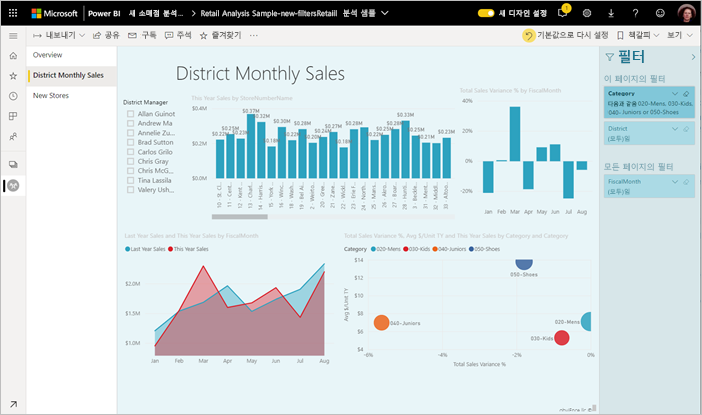

보고서 디자이너는 새 필터 창에서 다음과 같은 작업을 수행할 수 있습니다.

- 필터링할 필드를 추가하고 제거합니다. 
- 필터 상태를 변경합니다.
- 보고서의 일부로 느낄 수 있도록 필터 창에 서식을 지정하고 사용자 지정합니다.
- 소비자가 보고서를 열 때 기본적으로 [필터] 창이 열려 있는지 또는 축소되어 있는지 여부를 정의합니다.
- 보고서 소비자에게 표시하지 않으려는 전체 필터 창 또는 특정 필터를 숨깁니다.
- 필터 창의 표시 여부, 열린 상태 및 축소된 상태를 제어하고 책갈피를 지정합니다.
- 소비자가 편집할 수 없도록 필터를 잠급니다.

보고서를 읽을 때 사용자는 시각적 개체를 마우스로 가리켜 해당 시각적 개체에 영향을 주는 모든 필터 또는 슬라이서의 읽기 전용 목록을 볼 수 있습니다.

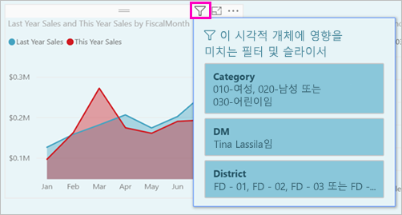

## <a name="turn-on-new-filters-in-existing-reports"></a>기존 보고서에서 새 필터 설정 

새 보고서의 경우 새 필터 환경이 기본적으로 설정되어 있습니다. Power BI Desktop 또는 Power BI 서비스에서 기존 보고서에 대해 새 환경을 사용하도록 설정할 수 있습니다.

### <a name="turn-on-new-filters-for-an-existing-report-in-power-bi-desktop"></a>Power BI Desktop에서 기존 보고서에 대해 새 필터 켜기

1. 기존 보고서의 Power BI Desktop에서 **파일** > **옵션 및 설정** > **옵션**을 선택합니다.
2. 탐색 창의 **현재 파일**에서 **보고서 설정**을 선택합니다.
3. **필터링 환경**에서 **업데이트된 필터 창을 사용하고 이 보고서의 시각적 개체 머리글에 필터 표시**를 선택합니다.

### <a name="turn-on-new-filters-for-an-existing-report-in-the-service"></a>서비스에서 기존 보고서에 대해 새 필터 켜기

**새 디자인**을 Power BI 서비스 에서 설정하면, 새 필터 환경이 자동으로 켜집니다. [Power BI 서비스의 새 디자인](../consumer/service-new-look.md)에 대해 자세히 알아보세요.

새 디자인을 설정하지 않은 경우에도 다음 단계에 따라 새 필터 환경을 계속 볼 수 있습니다.

1. Power BI 서비스에서 작업 영역의 콘텐츠 목록을 엽니다.
2. 사용하려는 보고서를 찾고 **추가 옵션(...)** 을 선택한 다음, 해당 보고서의 **설정**을 선택합니다.

    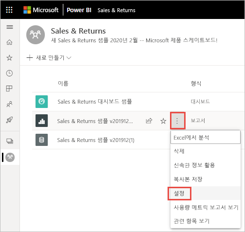

3. **필터링 환경**에서 **업데이트된 필터 창을 사용하고 이 보고서의 시각적 개체 머리글에 필터 표시**를 선택합니다.

    

## <a name="view-filters-for-a-visual-in-reading-mode"></a>읽기 모드에 시각적 개체의 필터 보기

읽기 모드에서 시각적 개체의 필터 아이콘 위로 마우스를 올려놓으면 해당 시각적 개체에 영향을 주는 모든 필터, 슬라이서 등이 포함된 팝업 필터 목록이 표시됩니다. 팝업 필터 목록의 서식은 필터 창 서식과 동일합니다. 


다음은 이 보기에서 표시하는 필터 유형입니다. 
- 기본 필터
- 슬라이서
- 교차 강조 표시 
- 교차 필터링
- 고급 필터
- 상위 N 필터
- 상대 날짜 필터
- 슬라이서 동기화
- 포함/제외 필터
- URL을 통해 전달된 필터

## <a name="build-the-filters-pane"></a>필터 창 빌드

새 필터 창을 사용하도록 설정하면 현재 보고서 설정에 따라 기본적으로 서식이 지정된 보고서 페이지의 오른쪽에 새 필터 창이 표시됩니다. 필터 창에서 포함할 필터를 구성하고 기존 필터를 업데이트합니다. 보고서를 게시하면 필터 창이 보고서 소비자에게 동일하게 표시됩니다. 

1. 기본적으로 보고서 소비자는 필터 창을 볼 수 있습니다. 사용자가 볼 수 없도록 하려면 **필터** 옆의 눈에 보이는 아이콘을 선택합니다.

    

2. 필터 창 빌드를 시작하려면 관심 있는 필드를 시각적 개체, 페이지 또는 보고서 수준 필터로서 필터 창으로 끌어옵니다.

보고서 캔버스에 시각적 개체를 추가할 때 Power BI는 시각적 개체에서 각 필드에 대한 필터를 필터 창에 자동으로 추가합니다. 

## <a name="hide-the-filters-pane-while-editing"></a>편집하는 동안 필터 창 숨기기

Power BI Desktop에는 미리 보기로 제공되는 새 리본이 있습니다. **보기** 탭에서 **필터** 토글 단추를 사용하여 필터 창을 표시하거나 숨길 수 있습니다. 이 기능은 필터 창을 사용하지 않고 화면에 추가 공간이 필요한 경우에 유용합니다. 이 추가 기능은 책갈피 및 선택 창과 같이 열고 닫을 수 있는 다른 창에 맞춰서 필터 창을 정렬합니다. 

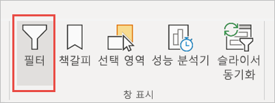

이 설정은 Power BI Desktop의 필터 창만 숨깁니다. 최종 사용자에게 필터 창을 숨기려면 대신 **필터** 옆에 있는 **눈 모양** 아이콘을 선택합니다.

 

## <a name="lock-or-hide-filters"></a>필터 잠그기 또는 숨기기

개별 필터 카드를 잠그거나 숨길 수 있습니다. 필터를 잠그면 보고서 소비자가 필터를 볼 수 있지만 변경할 수는 없습니다. 필터를 숨기면 볼 수도 없습니다. 일반적으로 필터 카드 숨기기는 null 또는 예기치 않은 값을 제외하는 데이터 정리 필터를 숨겨야 하는 경우에 유용합니다. 

- 필터 창에서 필터 카드의 **필터 잠금** 또는 **필터 숨기기** 아이콘을 선택하거나 선택 취소합니다.

   

필터 창에서 이러한 설정을 켜거나 끄면 보고서에 반영된 변경 내용이 표시됩니다. 숨겨진 필터는 시각적 개체의 팝업 필터 목록에 표시되지 않습니다.

보고서 책갈피를 사용하여 이동하도록 필터 창 상태를 구성할 수도 있습니다. 창의 열기, 닫기 및 표시 여부 상태에 모두 책갈피를 지정할 수 있습니다.
 
## <a name="format-the-filters-pane"></a>필터 창 서식 지정

필터 환경에서는 보고서의 모양과 느낌과 일치하도록 필터 창에 서식을 지정할 수 있습니다. 보고서의 각 페이지에 대해 필터 창 서식을 다르게 지정할 수도 있습니다. 다음은 서식을 지정할 수 있는 요소입니다. 

- 배경색
- 배경 투명도
- 테두리 설정 또는 해제
- 테두리 색
- 제목 및 머리글 글꼴, 색 및 텍스트 크기

적용됨(설정됨) 또는 사용 가능(해제됨)에 따라 필터 카드에 대해 이러한 요소의 서식을 지정할 수도 있습니다. 

- 배경색
- 배경 투명도
- 테두리: 설정 또는 해제
- 테두리 색
- 글꼴, 색 및 텍스트 크기
- 입력 상자 색

### <a name="format-the-filters-pane-and-cards"></a>필터 창 및 카드의 서식 지정

1. 보고서에서 보고서 자체를 클릭하거나 배경(‘배경 화면’)을 클릭하고 **시각화** 창에서 **서식**을 선택합니다. 
    보고서 페이지, 배경 화면, 필터 창 및 필터 카드에 서식을 지정하는 옵션이 표시됩니다.

1. **필터 창**을 확장하여 배경, 아이콘 및 왼쪽 테두리의 색을 설정하여 보고서 페이지를 보완합니다.

    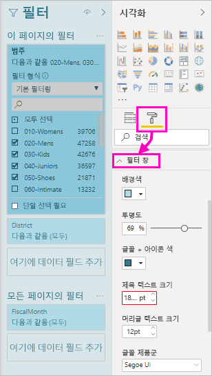

1. **필터 카드**를 확장하여 **사용 가능** 및 **적용됨** 색과 테두리를 설정합니다. 사용 가능한 카드와 적용된 카드의 색을 다르게 만들면 적용되는 필터가 명확해집니다. 
  
    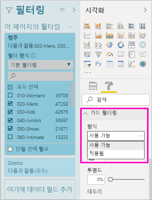

## <a name="theming-for-filters-pane"></a>필터 창에 대한 테마 설정
이제 필터 창의 기본 설정을 테마 파일로 수정할 수 있습니다. 시작하는 데 활용할 샘플 테마 코드 조각은 다음과 같습니다.

 
```
"outspacePane": [{ 

"backgroundColor": {"solid": {"color": "#0000ff"}}, 

"foregroundColor": {"solid": {"color": "#00ff00"}}, 

"transparency": 50, 

"titleSize": 35, 

"headerSize": 8, 

"fontFamily": "Georgia", 

"border": true, 

"borderColor": {"solid": {"color": "#ff0000"}} 

}], 

"filterCard": [ 

{ 

"$id": "Applied", 

"transparency": 0, 

"backgroundColor": {"solid": {"color": "#ff0000"}}, 

"foregroundColor": {"solid": {"color": "#45f442"}}, 

"textSize": 30, 

"fontFamily": "Arial", 

"border": true, 

"borderColor": {"solid": {"color": "#ffffff"}}, 

"inputBoxColor": {"solid": {"color": "#C8C8C8"}} 

}, 

{ 

"$id": "Available", 

"transparency": 40, 

"backgroundColor": {"solid": {"color": "#00ff00"}}, 

"foregroundColor": {"solid": {"color": "#ffffff"}}, 

"textSize": 10, 

"fontFamily": "Times New Roman", 

"border": true, 

"borderColor": {"solid": {"color": "#123456"}}, 

"inputBoxColor": {"solid": {"color": "#777777"}} 

}] 
```

## <a name="sort-the-filters-pane"></a>필터 창 정렬

필터 창에서 사용자 지정 정렬 기능을 사용할 수 있습니다. 보고서를 만들 때 필터를 끌어서 놓아 임의의 순서로 다시 정렬할 수 있습니다.


기본 정렬 순서는 필터의 사전순입니다. 사용자 지정 정렬 모드를 시작하려면 임의의 필터를 새 위치로 끌어 놓습니다. 적용되는 수준 내에서만 필터를 정렬할 수 있습니다. 예를 들어 시각적 개체 수준, 페이지 수준 또는 보고서 수준의 필터입니다.

## <a name="improved-filters-pane-accessibility"></a>개선된 필터 창 접근성

필터 창의 키보드 탐색이 개선되었습니다. 필터 창의 모든 부분을 탭으로 이동하고 키보드의 컨텍스트 키나 Shift+F10을 사용하여 상황에 맞는 메뉴를 열 수 있습니다.

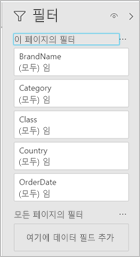

## <a name="rename-filters"></a>필터 이름 바꾸기
필터 창을 편집하는 경우 제목을 두 번 클릭하여 편집할 수 있습니다. 최종 사용자에게 보다 적합하도록 필터 카드를 업데이트하려면 이름 바꾸기가 유용합니다. 필터 카드의 이름을 바꾸면 필드 목록에 있는 필드의 표시 이름이 바뀌지 ‘않습니다’. 필터 카드에 사용된 표시 이름만 변경합니다.

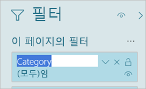

## <a name="filters-pane-search"></a>필터 창 검색

필터 창 검색 기능을 사용하면 제목으로 필터 카드 전체를 검색할 수 있습니다. 이 기능은 필터 창에 다양한 필터 카드가 있고 관심 있는 필터 카드를 찾는 데 도움이 필요한 경우에 유용합니다.

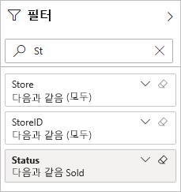

필터 창의 다른 요소에 서식을 지정하는 것처럼 검색 상자에 서식을 지정할 수도 있습니다.

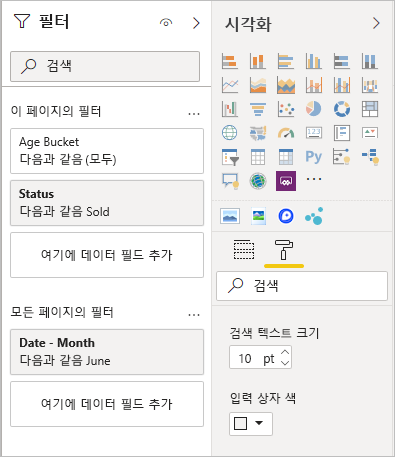

이 필터 창 검색 기능은 기본적으로 켜지지만, 옵션 대화 상자의 보고서 설정에서 **필터 창 검색 사용**을 선택하여 켜거나 끄도록 선택할 수도 있습니다.

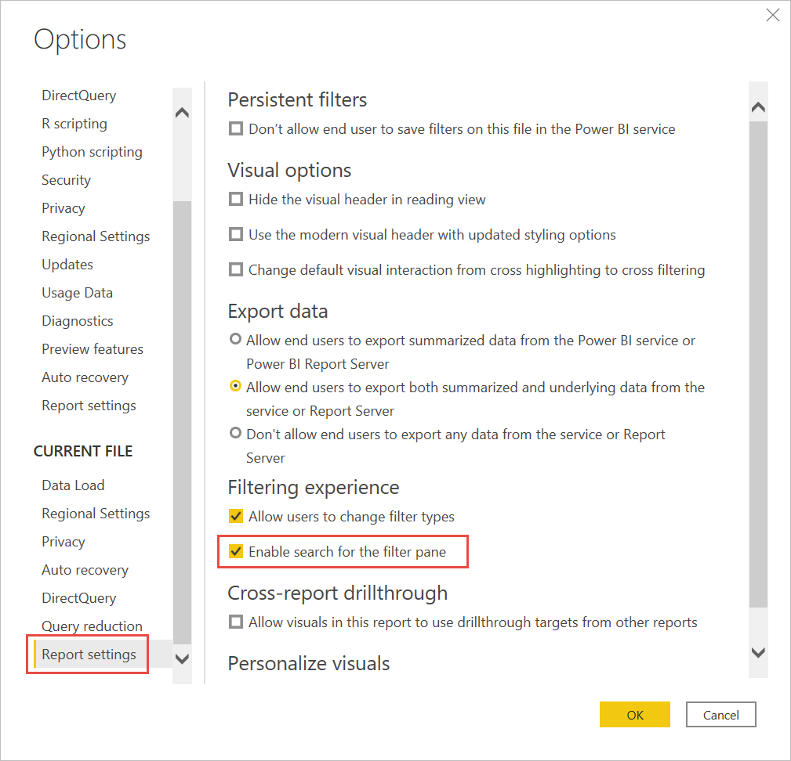

## <a name="restrict-changes-to-filter-type"></a>변경을 필터 유형으로 제한

보고서 설정의 **필터링 환경** 섹션에는 사용자가 필터 유형을 변경할 수 있는지 여부를 제어하는 옵션이 있습니다.


## <a name="apply-filters-button-preview"></a>필터 적용 단추(미리 보기)

필터 창에 단일 **적용** 단추를 추가할 수 있습니다. 그러면 사용자 및 최종 사용자가 모든 필터 수정을 한 번에 적용할 수 있습니다. 이 단추는 필터 변경 내용 적용을 지연시키려는 경우에 유용할 수 있습니다. 보고서 또는 시각적 개체에 모든 필터 변경 내용을 적용할 준비가 되면 한 번만 기다리면 됩니다.

:::image type="content" source="media/power-bi-report-filter/apply-filter-button.png" alt-text="필터 적용 단추":::

### <a name="turn-on-apply"></a>적용 설정

이 기능을 보고서 수준에서 설정할 수 있습니다. 그러나 이 기능은 기본적으로 해제되어 있습니다.

1. **파일** > **옵션 및 설정** > **옵션** > **쿼리 감소**로 이동합니다.

1. **한 번에 변경 내용을 적용하려면 필터 창에 단일 적용 단추를 추가합니다.** 를 선택합니다.

    :::image type="content" source="media/power-bi-report-filter/turn-on-apply-filter-button.png" alt-text="필터 적용 단추 설정":::

### <a name="format-the-apply-button"></a>적용 단추 서식 지정

단추의 **적용** 텍스트에 대해 일부 서식을 제어할 수 있습니다. **서식** 창의 **필터 창** 섹션에서 다음 옵션을 설정합니다.

- **글꼴 및 아이콘 색** - 텍스트 색을 제어합니다.
- **머리글 텍스트 크기** - 텍스트 크기를 제어합니다.
- **글꼴 패밀리** - 글꼴을 제어합니다.

    :::image type="content" source="media/power-bi-report-filter/format-apply-filter.gif" alt-text="필터 적용 단추 텍스트 서식 지정":::

## <a name="considerations-and-limitations"></a>고려 사항 및 제한 사항

[웹에 게시]에는 [필터] 창이 표시되지 않습니다. 보고서를 웹에 게시하려는 경우 필터링을 위한 슬라이서를 추가하는 것이 좋습니다.

## <a name="next-steps"></a>다음 단계

- [보고서 필터를 사용하는 방법](../consumer/end-user-report-filter.md)
- [필터 및 보고서에서 강조 표시](power-bi-reports-filters-and-highlighting.md)
- [Power BI의 다양한 종류의 필터](power-bi-report-filter-types.md)

궁금한 점이 더 있나요? [Power BI 커뮤니티를 이용하세요.](https://community.powerbi.com/)
