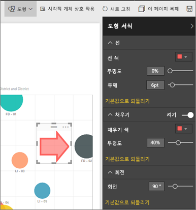

# Power BI 보고서에 텍스트 상자 및 셰이프 추가
Power BI 서비스 및 Power BI Desktop을 사용하여 보고서에 텍스트 상자 및 셰이프를 추가할 수 있습니다. 두 경우 모두 보고서에 대한 편집 권한이 있어야 합니다. Power BI 서비스에서 보고서가 사용자와 공유된 경우에는 편집 권한이 없습니다. 

Power BI Desktop을 사용하여 [보고서에 정적 이미지를 추가](/learn/modules/visuals-in-power-bi/12-formatting)하는 과정을 시청한 다음, 아래 단계에 따라 대신 Power BI 서비스를 직접 사용해 보세요.
> 
> <iframe width="560" height="315" src="https://www.youtube.com/embed/_3q6VEBhGew" frameborder="0" allowfullscreen></iframe>
> 

## 보고서에 텍스트 상자 추가
1. 편집용 보기에서 보고서를 엽니다.

2. 보고서 캔버스의 빈 영역에 커서를 두고 상단 메뉴에서 **텍스트 상자** 를 선택합니다.
   
   
3. 텍스트 상자에 텍스트를 입력하고 필요에 따라 글꼴 서식, 색 및 텍스트 맞춤을 설정합니다. 
   
   
4. 텍스트 상자를 배치하려면 위쪽에 회색 영역을 선택하고 끕니다. 텍스트 상자의 크기를 조정하려면 개요 핸들을 선택하여 끕니다. 
   
   

5. 텍스트 상자를 선택한 채로 **시각화** 창에서 서식 지정을 추가합니다. 이 예제에서는 배경 및 테두리에 서식을 지정했습니다. 텍스트 상자의 정확한 크기와 위치를 생성할 수도 있습니다.  

   

6. 텍스트 상자를 닫으려면 보고서 캔버스에서 빈 공간을 선택합니다. 

7. 고정 아이콘   을 선택하여 텍스트 상자를 대시보드에 고정합니다. 

## 보고서에 셰이프 추가
1. 보고서 캔버스에서 아무 곳이나 커서를 두고 **셰이프** 를 선택합니다.
   
   
2. 드롭다운 목록에서 셰이프를 선택하여 보고서 캔버스에 추가합니다. 이 예제에서는 화살표를 추가하여 총 판매 분산이 가장 큰 거품을 주목합니다. 
   
   **도형 서식** 창에서 셰이프를 사용자 지정합니다. 이 예제에서는 90도 회전된 진한 빨간색 테두리가 있는 빨간색 화살표를 만들었습니다.
   
   
3. 셰이프를 배치하려면 위쪽에 회색 영역을 선택하고 끕니다. 셰이프의 크기를 조정하려면 개요 핸들을 선택하여 끕니다. 텍스트 상자에서 셰이프의 정확한 크기와 위치를 생성할 수도 있습니다.

   > [!NOTE]
   > [라이브 페이지를 고정](service-dashboard-pin-live-tile-from-report.md)할 때 시각적 개체 중 하나를 제외하고는, 셰이프를 대시보드에 고정할 수 없습니다. 
   > 
   > 

## 다음 단계

다음 문서에도 관심이 있을 수 있습니다.

* [텍스트 상자에 하이퍼링크 추가](service-add-hyperlink-to-text-box.md)
* [Power BI 서비스의 디자이너를 위한 기본 개념](../fundamentals/service-basic-concepts.md)
* [Power BI 보고서에서 셰이프, 이미지 및 아이콘을 사용하여 분석을 향상하기 위한 팁](../guidance/report-tips-shapes-images-icons.md)
* 궁금한 점이 더 있나요? [Power BI 커뮤니티를 이용하세요.](https://community.powerbi.com/)
