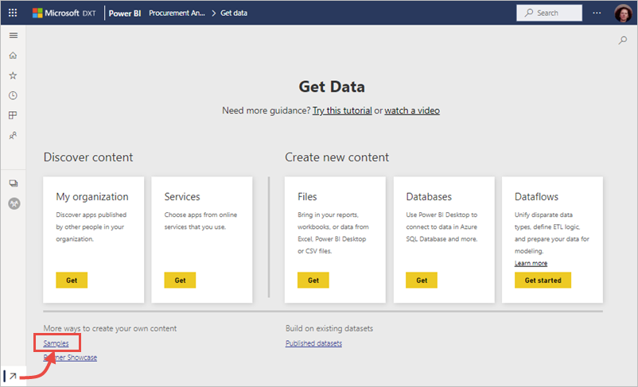
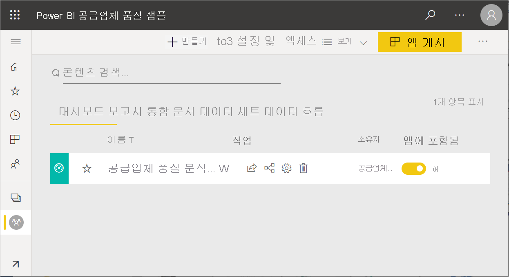

# Power BI용 샘플 가져오기
Power BI를 처음 접하고, 사용해 보고 싶지만 데이터가 없는 경우가 있습니다.  또는 Power BI 기능 중 일부를 보여 주는 보고서를 확인하기를 원할 수 있습니다. Microsoft가 도와 드립니다.

Power BI는 다양한 용도의 다양한 샘플을 제공합니다. 
- 데이터 스토리 갤러리에서 보거나, Power BI Desktop에서 열고 탐색하거나, Power BI 서비스로 업로드할 수 있는 **[Power BI 보고서](#sales--returns-sample-pbix-file)(.pbix 파일)** .
- AppSource에서 다운로드하거나 Power BI 서비스에서 바로 다운로드하는 **[샘플 앱](#sample-app-from-appsource)** . 앱에는 대시보드, 보고서 및 데이터 세트가 포함됩니다. 이를 수정하여 동료에게 배포할 수 있습니다.
- Power BI 서비스에서 대시보드, 보고서 및 데이터 세트를 포함하는 *콘텐츠 팩* 으로 제공하는 **[8개 기본 제공 샘플](#eight-original-samples)** . 이들 샘플은 Power BI 서비스에서 바로 설치합니다. 기본 제공 샘플은 Power BI 보고서(.pbix) 및 Excel 통합 문서(.xlsx)로도 제공됩니다.
- 데이터 모델 및 파워 뷰 시트를 포함하는 기본 제공 샘플의 **[Excel 통합 문서](#download-sample-excel-files)** 버전. Excel에서 데이터 모델을 탐색하거나 편집할 수 있으며 Excel 통합 문서를 Power BI 보고서의 데이터 원본으로 사용할 수 있습니다. 이 통합 문서를 Excel 파일로 업로드하고 Excel 시각적 개체와 피벗 테이블을 Power BI 보고서에 표시할 수도 있습니다. 
- Excel 파일에서 다운로드할 수 있는 간단한 플랫 테이블인 **[재무 데이터 샘플 통합 문서](sample-financial-download.md)** . 통합 문서에는 가상 제품의 익명화된 데이터와 세그먼트 및 국가/지역별 판매량이 들어 있습니다. Power BI 보고서용 기본 데이터 원본으로 유용하게 활용할 수 있습니다.

온라인 설명서에서는 자습서 및 예제에 동일한 샘플을 사용하므로 그대로 따라할 수 있습니다.

## 판매 및 반품 샘플 .pbix 파일

:::image type="content" source="media/sample-datasets/sales-returns-sample-pbix.png" alt-text="판매 및 반품 샘플 .pbix 파일":::

*판매 및 반품 샘플 보고서*

Power BI 보고서 디자이너 Miguel Myers 및 Chris Hamill은 단추, 드릴스루, 조건부 서식, 가정(what-if), 사용자 지정된 도구 설명 등 Power BI의 여러 새로운 기능을 보여 주기 위해 판매 및 반품 .pbix 파일을 만들었습니다. 

이 보고서의 시나리오는 Microsoft 테마 기능을 판매하는 회사입니다. 이 회사는 매출 및 수익 상태를 확인하고 어떻게 운영을 수정해야 할지 분석하려고 합니다. 

다음과 같은 방법으로 탐색할 수 있습니다.

- Power BI 커뮤니티 [데이터 스토리 갤러리](https://community.powerbi.com/t5/Data-Stories-Gallery/Sales-amp-Returns-Sample-Report/m-p/876607)에서 이를 보고 상호 작용합니다.
- .pbix 파일을 다운로드하여 자세히 탐색합니다. “내부”를 들여다보고 Miguel이 어떻게 만들었는지 알아봅니다. 다음 링크를 선택하면 파일이 자동으로 다운로드됩니다. [판매 및 반품 샘플 보고서](https://go.microsoft.com/fwlink/?linkid=2113239).
- Power BI 블로그 게시물 [새 판매 및 반품 샘플 보고서 둘러보기](https://powerbi.microsoft.com/blog/take_a_tour_of_the_new_sales_returns_sample_report/)에서 보고서에 대해 알아보세요.

## AppSource의 샘플 앱

Microsoft AppSource에서 마케팅 및 판매 *앱* 을 이용할 수 있습니다. 앱은 관련 대시보드 및 보고서를 결합하는 Power BI 콘텐츠 형식입니다. 앱은 하나 이상의 대시보드와 하나 이상의 보고서를 함께 번들할 수 있습니다. Power BI 서비스의 **앱** 에서 또는 브라우저에서 AppSource로 이동하여 영업 및 마케팅 앱을 다운로드할 수 있습니다.

- [앱 설치 및 사용](../consumer/end-user-app-view.md) 문서에서는 Power BI 서비스 내에서 앱을 다운로드하는 방법을 설명합니다.
- 다음 링크를 누르면 AppSource의 [영업 및 마케팅 앱](https://appsource.microsoft.com/product/power-bi/microsoft-retail-analysis-sample.salesandmarketingsample?tab=Overview)으로 이동됩니다.

앱을 설치하면 앱 컬렉션에 표시됩니다.

:::image type="content" source="media/sample-datasets/power-bi-sales-marketing-app.png" alt-text="영업 및 마케팅 앱 타일":::

이 타일을 열 때 **샘플 데이터와 함께 탐색** 을 선택합니다. 

:::image type="content" source="media/sample-datasets/power-bi-explore-app.png" alt-text="앱 살펴보기":::

탐색 창에 대시보드 및 개별 보고서 페이지가 포함된 앱 보기가 표시됩니다. 

:::image type="content" source="media/sample-datasets/power-bi-sales-marketing-app-navigation.png" alt-text="앱 탐색 창":::

앱을 설치했으므로 *작업 영역* 을 열고 앱의 요소를 편집할 수도 있습니다. **편집** 연필 아이콘을 선택하여 작업 영역을 엽니다.

:::image type="content" source="media/sample-datasets/power-bi-app-edit-pencil.png" alt-text="앱 편집":::

이제 작업 영역의 목록 보기에 앱의 대시보드, 보고서 및 데이터 세트가 표시됩니다. 작업 영역에서 각 항목을 편집할 수 있습니다.

:::image type="content" source="media/sample-datasets/power-bi-sales-marketing-workspace.png" alt-text="영업 및 마케팅 작업 영역":::

원하는 경우 조직의 모든 사용자에게 이 앱을 배포할 수 있습니다. **업데이트** 를 선택합니다.

:::image type="content" source="media/sample-datasets/power-bi-update-app.png" alt-text="앱 업데이트 단추":::

**앱 테마 색** 선택 등 **설정** 탭을 완료합니다. 

:::image type="content" source="media/sample-datasets/power-bi-app-setup.png" alt-text="앱 설정 선택":::

**탐색** 및 **권한** 탭을 완료하고 **앱 업데이트** 를 선택합니다.

:::image type="content" source="media/sample-datasets/power-bi-select-update-app.png" alt-text="앱 업데이트를 선택하여 앱 게시":::

[Power BI에서 앱을 게시하는 방법](../collaborate-share/service-create-distribute-apps.md)에 대해 자세히 알아보세요.

## 8개 기본 제공 샘플
8개의 기본 제공 샘플을 사용할 수 있습니다. 각 샘플은 서로 다른 산업을 나타냅니다. 각각 다른 형식으로 사용할 수 있습니다.

- Power BI 서비스에서 [기본 제공 콘텐츠 팩](#install-built-in-content-packs)을 설치합니다.
- [Power BI 보고서 파일](#download-original-sample-power-bi-files)(.pbix)을 다운로드합니다.
- [Excel 통합 문서 파일](#download-sample-excel-files)(.xlsx)을 다운로드한 후 Power BI 서비스에 업로드합니다.
- [Excel 자체에서 Excel 파일](#explore-excel-samples-inside-excel)을 탐색합니다.

Microsoft는 회사 obviEnce([www.obvience.com](http://www.obvience.com/))와 함께 사용자가 Power BI에서 사용할 샘플을 만들었습니다.  데이터는 익명으로 처리되며 재무, HR, 판매 등 다양한 분야를 나타냅니다. 

이러한 샘플은 각각 콘텐츠 팩, Excel 통합 문서, Power BI .pbix 파일과 같은 여러 가지 형식으로 제공됩니다. 이러한 것들이 무엇인지 모르거나 어떻게 입수해야 할지 모르는 경우에도 걱정하지 마세요. 이 문서에서 모두 설명합니다. 이들 각 샘플에 대해 *둘러보기* 를 만들었습니다. 둘러보기는 샘플 뒤에 숨은 이야기를 알려주고 다양한 시나리오를 안내하는 문서입니다. 관리자를 위해 질문에 대답하는 시나리오가 있을 수 있고, 경쟁력 있는 정보를 찾거나 공유할 보고서 및 대시보드를 만들거나 비즈니스 전환을 설명하는 시나리오도 있을 수 있습니다.

시작하기 전에 이들 샘플을 사용하기 위한 법적 지침은 다음과 같습니다. 그 후 샘플을 소개하고 사용하는 방법을 보여줍니다.

### 샘플 Excel 통합 문서에 대한 사용 지침

&copy;2015 Microsoft Corporation. All rights reserved. 문서 및 통합 문서는 “있는 그대로" 제공됩니다. URL 및 기타 인터넷 웹 사이트 참조를 포함하여 통합 문서에 명시된 정보 및 보기는 통지 없이 변경될 수 있습니다. 해당 사용으로 인해 발생하는 모든 위험은 귀하의 책임입니다. 일부 예제는 설명 목적으로만 제공되는 가상의 예제이며, 어떠한 실제 사례와도 연관시킬 의도가 없으며 그렇게 유추해서도 안 됩니다. Microsoft는 여기에 제공된 정보에 대해 어떠한 명시적이거나 묵시적인 보증도 하지 않습니다.

이 통합 문서는 Microsoft 제품의 지적 소유권에 대한 법적 권한을 사용자에게 제공하지 않습니다. 이 통합 문서는 내부 참조용으로만 복사 및 사용할 수 있습니다.

통합 문서 및 관련 데이터는 obviEnce에서 제공됩니다. [www.obvience.com](http://www.obvience.com)

ObviEnce는 Microsoft Business Intelligence에 주력하는 ISV이자 IP(Intellectual Property) Incubator입니다. ObviEnce는 Microsoft와 긴밀한 협력을 통해 Microsoft Business Intelligence 솔루션 구현 및 배포를 위한 모범 사례 및 사고 리더십을 개발하고 있습니다.

통합 문서 및 데이터는 obviEnce, LLC의 재산이며 산업 샘플 데이터로 Power BI의 기능을 보여주기 위한 용도로만 공유된 것입니다.

통합 문서 및/또는 데이터의 모든 사용에는 위의 고지 사항이 포함되어야 하며 각 통합 문서에 포함된 정보 워크시트의 경우도 마찬가지입니다. 통합 문서 및 모든 시각화에는 저작권 표시 obviEnce &copy;가 함께 수반되어야 합니다.

다음 링크를 클릭하여 Excel 통합 문서 파일 또는 .pbix 파일을 다운로드하면 위의 약관에 동의하는 것입니다.

### 고객 수익성 샘플  
[고객 수익성 샘플 둘러보기](sample-customer-profitability.md)

이 업계 샘플은 회사의 임원, 제품 및 고객에 대한 CFO의 주요 메트릭을 분석합니다. 회사의 수익성에 영향을 주는 요소를 조사할 수 있습니다.

### 인적 자원 샘플 
[HR 샘플 둘러보기](sample-human-resources.md)

이 업계 샘플은 신입 사원, 재직 중인 직원 및 퇴사한 직원을 분석하여 회사의 채용 전략에 집중합니다.  데이터를 조사하여 채용 전략의 자발적 이직 및 선호에서 추세를 찾을 수 있습니다.

### IT 지출 분석 샘플 
[IT 지출 분석 샘플 둘러보기](sample-it-spend.md)

이 업계 샘플에서 회사 IT 부서의 계획된 비용과 실제 비용을 비교 분석합니다. 이러한 비교는 회사에서 한 해를 얼마나 잘 계획하는지 이해하고 계획과 편차가 큰 영역을 조사하는 데 도움이 됩니다. 이 예제의 회사는 연간 계획 주기를 거친 다음 분기별로 새로운 LE(Latest Estimate)를 생성하여 회계 연도 동안 IT 지출의 변화를 분석합니다.

### 기회 분석 샘플 
[기회 분석 샘플 둘러보기](sample-opportunity-analysis.md)

이 업계 샘플은 소프트웨어 회사의 판매 채널을 둘러봅니다. 판매 관리자는 지역, 거래 규모 및 채널별로 기회 및 수익을 추적하여 직접 판매 및 파트너 판매 채널을 모니터링합니다.

### 조달 분석 샘플  
[조달 분석 샘플 둘러보기](sample-procurement.md)

이 업계 샘플은 회사의 임원, 제품 및 고객에 대한 CFO의 주요 메트릭을 분석합니다. 회사의 수익성에 영향을 주는 요소를 조사할 수 있습니다.

### 소매점 분석 샘플  
[소매점 분석 샘플 둘러보기](sample-retail-analysis.md)

이 업계 샘플은 여러 상점과 구역에서 판매된 항목의 소매점 판매 데이터를 분석합니다. 메트릭은 새 상점 분석뿐 아니라 판매, 단위, 총 수익 및 차이 영역에서 작년과 금년의 실적을 비교합니다.

### 영업 및 마케팅 샘플  
[영업 및 마케팅 샘플 둘러보기](sample-sales-and-marketing.md)

이 업계 샘플은 VanArsdel Ltd.라는 제조 회사를 분석합니다. 이 샘플 콘텐츠 팩을 통해 최고 마케팅 경영자는 VanArsdel의 업계 및 시장 점유율을 조사할 수 있습니다.  이 샘플을 조사하여 회사의 시장 점유율, 제품 볼륨, 판매 및 여론을 확인할 수 있습니다.

### 공급업체 품질 샘플  
[공급업체 품질 샘플 둘러보기](sample-supplier-quality.md)

이 업계 샘플은 일반적인 공급망 문제 중 하나인 공급업체 품질 분석에 집중합니다. 이 분석에서 중요한 두 가지 기본 메트릭은 총 결함 수와 이러한 결함으로 인한 총 가동 중지 시간입니다. 이 샘플의 두 가지 주요 목표는 품질과 관련하여 최고 및 최악의 공급업체를 파악하고 결함을 발견하고 거부하는 작업을 더 효율적으로 수행하여 가동 중지 시간을 최소화하는 공장을 식별하는 것입니다.

### 기본 제공 콘텐츠 팩 설치

*콘텐츠 팩* 부터 시작해 보겠습니다. 기본 제공 샘플은 Power BI 서비스에서 제공합니다. 샘플을 찾기 위해 Power BI를 종료하지 않아도 됩니다. 콘텐츠 팩은 다른 사람이 만들고 Power BI 서비스에서 사용할 수 있는 하나 이상의 대시보드, 데이터 세트 및 보고서의 묶음을 말합니다. 각 Power BI 샘플 콘텐츠 팩에는 데이터 세트, 보고서 및 대시보드가 포함되어 있습니다.  콘텐츠 팩은 여전히 제공되지만 앞으로는 사용되지 않을 예정입니다. Power BI Desktop에서는 사용할 수 없습니다.

1. Power BI 서비스(app.powerbi.com)를 열고 로그인합니다.
2. 내 작업 영역 또는 샘플을 설치하려는 다른 작업 영역으로 이동합니다. 
2. 왼쪽 아래 모서리에서 **데이터 가져오기** 를 선택합니다.

    
3. 데이터 가져오기 페이지가 표시되면 **샘플** 을 선택합니다.

   
4. 샘플 중 하나를 선택하여 해당 샘플에 대한 설명을 열고 **연결** 을 선택합니다.  

   
5. Power BI에서 콘텐츠 팩을 가져와 새 대시보드, 보고서 및 데이터 세트를 현재 작업 영역에 추가합니다. 샘플을 사용하여 Power BI 실행을 테스트해 보세요.  

   

데이터가 있으니 원하는 대로 할 수 있습니다.  샘플 콘텐츠 팩을 사용하여 자습서를 따라 하거나 Power BI 서비스를 열고 둘러보세요.

### 기본 제공 샘플 Power BI 파일 다운로드
각 샘플 콘텐츠 팩은 Power BI .pbix 파일로도 제공됩니다. .pbix 파일은 Power BI Desktop과 함께 사용할 수 있게 설계되었습니다.  

1. 아래에 있는 링크를 사용하여 파일을 개별적으로 다운로드하세요. 이러한 링크를 선택하면 파일을 다운로드 폴더에 자동으로 저장합니다. 

   - [고객 수익성 샘플 PBIX](https://download.microsoft.com/download/6/A/9/6A93FD6E-CBA5-40BD-B42E-4DCAE8CDD059/Customer%20Profitability%20Sample%20PBIX.pbix)
   - [인적 자원 샘플 PBIX](https://download.microsoft.com/download/6/9/5/69503155-05A5-483E-829A-F7B5F3DD5D27/Human%20Resources%20Sample%20PBIX.pbix)
   - [조달 분석 샘플 PBIX](https://download.microsoft.com/download/D/5/3/D5390069-F723-413B-8D27-5888500516EB/Procurement%20Analysis%20Sample%20PBIX.pbix)
   - [소매점 분석 샘플 PBIX](https://download.microsoft.com/download/9/6/D/96DDC2FF-2568-491D-AAFA-AFDD6F763AE3/Retail%20Analysis%20Sample%20PBIX.pbix)
   - [영업 및 마케팅 샘플 PBIX](https://download.microsoft.com/download/9/7/6/9767913A-29DB-40CF-8944-9AC2BC940C53/Sales%20and%20Marketing%20Sample%20PBIX.pbix)
   - [공급업체 품질 분석 샘플 PBIX](https://download.microsoft.com/download/8/C/6/8C661638-C102-4C04-992E-9EA56A5D319B/Supplier-Quality-Analysis-Sample-PBIX.pbix)

1. Power BI Desktop에서 **파일 > 열기** 를 선택하고 샘플 .pbix 파일을 저장한 위치로 이동합니다.

4. Power BI Desktop에서 열 .pbix 파일을 선택합니다.

### 샘플 Excel 파일 다운로드
각 샘플 콘텐츠 팩은 Excel 통합 문서로도 제공됩니다. Excel 통합 문서는 Power BI 서비스와 함께 사용할 수 있게 설계되었습니다.  

1. 아래 링크에서 파일을 개별적으로 다운로드하거나 [모든 샘플 파일의 zip 파일을 다운로드](https://go.microsoft.com/fwlink/?LinkId=535020)합니다. 고급 사용자는 Excel 통합 문서를 다운로드하여 데이터 모델을 탐색하거나 편집할 수 있습니다.

   - [고객 수익성 샘플](https://go.microsoft.com/fwlink/?LinkId=529781)
   - [인적 자원 샘플](https://go.microsoft.com/fwlink/?LinkId=529780)
   - [기회 추적 샘플](https://go.microsoft.com/fwlink/?LinkId=529782)
   - [조달 분석 샘플](https://go.microsoft.com/fwlink/?LinkId=529784)
   - [소매점 분석 샘플](https://go.microsoft.com/fwlink/?LinkId=529778)
   - [영업 및 마케팅 샘플](https://go.microsoft.com/fwlink/?LinkId=529785)
   - [공급업체 품질 분석 샘플](https://go.microsoft.com/fwlink/?LinkId=529779)

2. 다운로드한 파일을 저장합니다. 파일을 저장하는 위치에 따라 차이가 발생합니다.

      **로컬** - Power BI에서 파일을 사용자 컴퓨터의 로컬 드라이브 또는 조직의 다른 위치에 저장하는 경우 파일을 Power BI로 가져올 수 있습니다. 파일은 로컬 드라이브에 남아 있으므로 전체 파일을 Power BI로 가져온 것은 아닙니다. 새 데이터 세트가 Power BI에서 만들어지고 데이터 및 경우에 따라 데이터 모델이 데이터 세트로 로드됩니다. 파일에 보고서가 있는 경우 해당 보고서는 보고서 아래의 Power BI 사이트에 나타납니다.
    
     **OneDrive - 비즈니스** – 비즈니스용 OneDrive를 가지고 있고 Power BI로 로그인한 것과 동일한 계정으로 로그인하는 경우, 비즈니스용 OneDrive는 Excel, Power BI 또는 .CSV 파일의 작업을 Power BI의 데이터 세트, 보고서 및 대시보드와 동기화 상태로 유지하기에 가장 좋은 곳입니다. Power BI와 OneDrive가 모두 클라우드에 있으므로 Power BI는 매시간 OneDrive의 파일에 연결합니다. 변경 내용이 발견되면 데이터 세트, 보고서 및 대시보드가 Power BI에서 자동으로 업데이트됩니다.
    
     **SharePoint 팀 사이트** – Power BI 파일을 SharePoint 팀 사이트에 저장하는 것은 비즈니스용 OneDrive에 저장하는 것과 거의 마찬가지입니다. 가장 큰 차이점은 Power BI에서 파일에 연결하는 방법입니다. URL을 지정하거나 루트 폴더에 연결할 수 있습니다.
1. Power BI 서비스(app.powerbi.com)를 열고 로그인합니다.

1. 내 작업 영역 또는 다른 작업 영역으로 이동하거나 샘플 전용 작업 영역을 만듭니다.

4. 탐색 창의 왼쪽 아래 모서리에서 **데이터 가져오기** 를 선택합니다.

    
5. **데이터 가져오기** 페이지가 표시되면 **파일 > 가져오기** 를 선택합니다.

    
6. 샘플을 다운로드하여 저장한 위치를 선택합니다.

    
7. 파일을 선택합니다. 파일을 저장한 위치에 따라 **연결** 또는 **열기** 를 선택합니다.

8. Power BI로 통합 문서를 가져올지, 데이터를 가져올지 선택하고 온라인 Excel과 똑같은지 확인합니다.

    
9. **가져오기** 를 선택하는 경우 Power BI가 샘플 통합 문서를 가져와서 새 대시보드, 보고서 및 데이터 세트로 추가합니다. 이 경우 각각 이름이 **조달 분석 샘플** 로 지정됩니다.

    - 통합 문서에 파워 뷰 시트가 있으므로 Power BI는 각 Power BI 시트에 대한 페이지가 포함된 보고서를 만듭니다. 
    - Power BI는 새 빈 타일로 새 대시보드를 만듭니다.  타일을 선택하면 방금 추가한 보고서로 이동합니다.

10. 보고서를 엽니다. 보고서의 다른 요소를 선택하여 상호 작용을 살펴봅니다. 

    

### Excel에서 Excel 샘플 탐색

(선택 사항) Excel 통합 문서의 데이터가 Power BI 데이터 세트 및 보고서로 어떻게 변환되는지 알고 싶으신가요? *Excel에서* Excel 샘플을 열고 통합 문서를 살펴보면 궁금증이 조금 풀릴 것입니다.

- Excel에서 처음으로 샘플 통합 문서를 열면 두 가지 경고가 표시될 수 있습니다. 첫 번째 경고는 통합 문서가 제한된 보기 상태라는 메시지입니다. **편집 사용** 을 선택합니다. 두 번째 경고는 통합 문서에 외부 데이터 연결이 있다는 메시지입니다. **콘텐츠 사용** 을 선택합니다.
- 각 통합 문서에는 여러 개의 Power View 시트가 있습니다. Excel에서 Power View 시트를 보려면 레지스트리 키 패키지를 다운로드하여 [Power View 추가 기능을 사용하도록 설정](https://support.office.com/article/flash-silverlight-and-shockwave-controls-blocked-in-microsoft-office-55738f12-a01d-420e-a533-7cef1ff6aeb1)해야 합니다.
- 그렇다면 실제 데이터는 어디에 있을까요? 파워 피벗 데이터 모델에 있습니다. 데이터를 보기 위해 Power View 시트가 필요하지 않습니다. **PowerPivot** 탭에서 **관리** 를 선택합니다.

    **Power Pivot** 탭이 표시되지 않나요? [파워 피벗 추가 기능을 사용하도록 설정](https://support.office.com/article/Start-Power-Pivot-in-Microsoft-Excel-2013-add-in-A891A66D-36E3-43FC-81E8-FC4798F39EA8)합니다.

    Power Pivot에서는 모든 기본 테이블의 데이터와 모든 DAX 수식을 볼 수 있습니다. 

- 정보 탭에서는 샘플을 만든 obviEnce 회사에 대한 정보를 제공합니다.

## 다음 단계
[Power BI 서비스의 디자이너를 위한 기본 개념](../fundamentals/service-basic-concepts.md)

[자습서: Power BI 샘플에 연결](sample-tutorial-connect-to-the-samples.md)

[Power BI용 데이터 원본](../connect-data/service-get-data.md)

궁금한 점이 더 있나요? [Power BI 커뮤니티를 이용하세요.](https://community.powerbi.com/)
