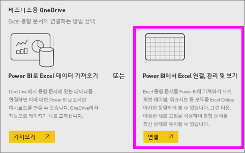
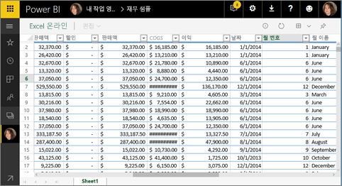
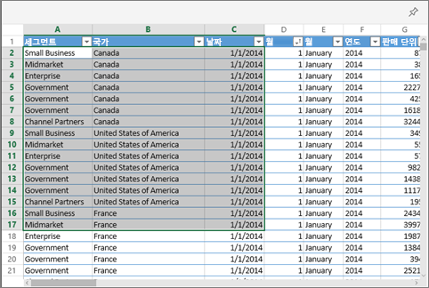
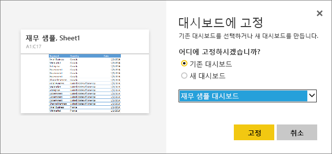
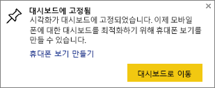

# Excel에서 Power BI 대시보드에 타일 고정
Excel 통합 문서에서 타일을 고정하려면 해당 통합 문서를 Power BI 서비스(app.powerbi.com)에 연결합니다. 통합 문서를 기본적으로 연결하면 해당 통합 문서의 연결된 읽기 전용 버전을 Power BI 서비스로 가져오고 범위를 대시보드에 고정할 수 있습니다. 전체 워크시트를 대시보드에 고정할 수도 있습니다.  
통합 문서를 사용자와 공유하는 경우 소유자에 의해 고정된 타일을 볼 수 있지만 모든 대시보드 타일을 직접 만들 수 없습니다. 

Excel과 Power BI를 함께 작동하는 방법에 대한 자세한 정보는 [Excel 통합 문서 파일에서 데이터 가져오기](https://go.microsoft.com/fwlink/?LinkID=521962)를 참조하세요.

Will이 Excel 통합 문서에서 데이터를 가져오고 통합 문서에 연결하는 몇 가지 방법을 시청합니다.

<iframe width="560" height="315" src="https://www.youtube.com/embed/l8JoB7w0zJA" frameborder="0" allowfullscreen></iframe>

## 비즈니스용 OneDrive에서 Power BI로 Excel 통합 문서 연결
**연결** 을 선택하면 통합 문서가 Excel Online에서와 같이 Power BI에 나타납니다. 하지만, Excel Online과는 달리 통합 문서의 요소를 대시보드에 고정하는 데 도움이 되는 몇 가지 훌륭한 기능이 제공됩니다.

Power BI에서는 통합 문서를 편집할 수 없습니다. 그러나 일부 내용을 변경해야 할 경우 작업 영역의 **통합 문서** 탭에서 연필을 선택한 다음 Excel Online에서 통합 문서를 편집하거나 컴퓨터의 Excel에서 열어볼 수 있습니다. 적용한 모든 변경 내용이 OneDrive의 통합 문서에 저장됩니다.

1. 비즈니스용 OneDrive에 통합 문서를 업로드합니다.

2. Power BI에서 **데이터 가져오기 > 파일 > OneDrive - Business** 를 선택하고 Excel 파일을 저장한 위치로 이동하여 [해당 통합 문서에 연결](../connect-data/service-excel-workbook-files.md)합니다. 파일을 선택하고 **연결 > 연결** 을 선택합니다.

    

3. Power BI에서는 통합 문서가 작업 영역의 **통합 문서** 탭에 추가됩니다.   아이콘은 Excel 통합 문서를 나타내고 노란색 별표는 새 문서를 나타냅니다.
    
    
4. 통합 문서 이름을 선택하여 Power BI에서 통합 문서를 엽니다.

    Power BI에서 통합 문서를 변경한 내용은 저장되지 않으며 비즈니스용 OneDrive에 있는 원래의 통합 문서에 영향을 주지 않습니다. Power BI에서 값을 정렬, 필터링 또는 변경하는 경우 해당 변경 내용을 저장하거나 고정할 수 없습니다. 저장할 변경을 수행해야 하는 경우 오른쪽 위 모서리에서 **편집** 을 선택하여 Excel Online 또는 Excel에서 편집용으로 엽니다. 이 방법으로 변경한 내용은 대시보드의 타일을 업데이트하는 데 몇 분 정도 걸릴 수 있습니다.
   
    

## 대시보드에 셀의 범위 고정
새 [대시보드 타일](../consumer/end-user-tiles.md)을 추가하는 한 가지 방법은 Power BI의 Excel 통합 문서 내에서 추가하는 것입니다. 비즈니스용 OneDrive 또는 다른 그룹 공유 문서 라이브러리에 저장된 Excel 통합 문서에서 범위를 고정할 수 있습니다. 범위에는 데이터, 차트, 테이블, 피벗 테이블, 피벗 차트 및 기타 Excel 부분이 포함될 수 있습니다.

1. 대시보드에 고정하려는 셀을 강조 표시합니다.
   
    
2. 고정 아이콘  아이콘. 
3. 기존 대시보드 또는 새 대시보드에 타일을 고정합니다. 
   
   * 기존 대시보드: 드롭다운에서 대시보드의 이름을 선택합니다.
   * 새 대시보드: 새 대시보드의 이름을 입력합니다.
   
     
4. **고정** 을 선택합니다. 오른쪽 위에 나타나는 성공 메시지를 통해 범위가 타일로 대시보드에 추가되었음을 알 수 있습니다. 
   
    
5. **대시보드로 이동** 을 선택합니다. 여기에서 고정된 시각화의 [이름을 바꾸거나 크기를 조정하거나 연결하고 이동](service-dashboard-edit-tile.md)할 수 있습니다. 기본적으로 고정된 타일을 선택하면 Power BI에서 통합 문서가 열립니다.

## 대시보드에 전체 표 또는 피벗 테이블 고정
셀의 범위를 선택하는 대신 위의 단계를 수행하여 전체 테이블 또는 피벗 테이블을 선택합니다.

테이블을 고정하려면 테이블의 전체 범위를 선택하고 헤더를 포함해야 합니다.  피벗 테이블을 고정하려면 필터(사용된 경우)를 포함하여 피벗 테이블의 보이는 모든 부분을 포함해야 합니다.

 

테이블 또는 피벗 테이블에서 만든 타일에는 전체 테이블이 표시됩니다.  원본 통합 문서에서 행 또는 열을 추가/제거/필터링할 경우 타일에서도 추가/제거/필터링됩니다.

## 타일에 연결된 통합 문서 보기
통합 문서 타일을 선택하면 Power BI에서 연결된 통합 문서가 열립니다. 통합 문서 파일은 소유자의 비즈니스용 OneDrive에 있으므로 통합 문서를 보려면 통합 문서에 대한 읽기 권한이 있어야 합니다. 권한이 없는 경우 오류 메시지가 수신됩니다.  

 

## 고려 사항 및 문제 해결
지원되지 않는 기능: Power BI는 Excel Services를 사용하여 통합 문서 타일을 검색합니다. 따라서 Excel의 일부 기능은 Excel Services REST API에서 지원되지 않으므로 Power BI의 타일에 표시되지 않습니다. 예를 들어 스파크라인, 아이콘 집합 조건부 서식 및 시간 슬라이서 등이 있습니다. 지원되지 않는 기능의 전체 목록은 [Excel Services REST API에서 지원되지 않는 기능](/sharepoint/dev/general-development/unsupported-features-in-excel-services-rest-api)을 참조하세요.

## 다음 단계
[Excel 통합 문서에 대한 링크가 있는 대시보드 공유](../collaborate-share/service-share-dashboard-that-links-to-excel-onedrive.md)

[Excel 통합 문서에서 데이터 가져오기](../connect-data/service-excel-workbook-files.md)

궁금한 점이 더 있나요? [Power BI 커뮤니티를 이용하세요.](https://community.powerbi.com/)
