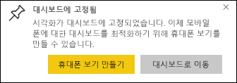

# 보고서에서 Power BI 대시보드에 타일 고정

[대시보드 타일](../consumer/end-user-tiles.md)을 추가하는 한 가지 방법은 [Power BI 보고서](../consumer/end-user-reports.md) 내에서 추가하는 것입니다. 해당 타일 중 하나를 선택하면 보고서에서 열립니다.

전체 보고서 페이지는 *라이브* 타일 고정이라는 대시보드에 고정할 수 있습니다. 대시보드의 타일과 상호 작용할 수 있기 때문에 라이브 타일이라고 합니다. 개별 시각화 개체 타일과 달리 보고서에서 변경한 내용은 자동으로 대시보드와 동기화됩니다. 자세한 내용은 [전체 보고서 페이지 고정](#pin-an-entire-report-page)을 참조하세요.

Power BI Desktop 또는 공유한 보고서에서는 타일을 고정할 수 없습니다. 

> [!TIP]
> 일부 시각화 개체에서는 배경 이미지를 사용하기 때문에 배경 이미지가 너무 클 경우 고정되지 않을 수 있습니다. 이미지 크기를 줄이거나 이미지 압축을 사용합니다.  
> 
> 

## 보고서에서 타일 고정
Amanda가 Power BI 보고서에서 시각적 개체 및 이미지를 고정하여 대시보드를 만드는 과정을 시청합니다.
    

<iframe width="560" height="315" src="https://www.youtube.com/embed/lJKgWnvl6bQ" frameborder="0" allowfullscreen></iframe>

이제 Power BI 샘플 보고서 중 하나를 사용하여 고유한 대시보드를 만듭니다.

1. 보고서에서 고정하려는 시각적 개체를 마우스로 가리키고 고정 아이콘 을 선택합니다. Power BI에서 **대시보드에 고정** 화면이 열립니다.
   
     
2. 기존 대시보드에 고정할지 또는 새 대시보드에 고정할지를 선택합니다.
   
   * **기존 대시보드**: 드롭다운에서 대시보드의 이름을 선택합니다. 사용자와 공유된 대시보드는 드롭다운에 나타나지 않습니다.
   * **새 대시보드**: 새 대시보드의 이름을 입력합니다.
3. 경우에 따라 고정하는 항목에 *테마* 가 이미 적용되어 있을 수 있습니다. 예를 들어 Excel 통합 문서에서 고정된 시각적 개체입니다. 이 경우 타일에 적용할 테마를 선택합니다.
4. **고정** 을 선택합니다.
   
   오른쪽 맨 위에 나타나는 성공 메시지를 보고 시각적 개체가 타일로 대시보드에 추가되었음을 알 수 있습니다.
   
   
5. 탐색 창에서 새 타일이 포함된 대시보드를 선택합니다. [타일 표시 및 동작을 편집](service-dashboard-edit-tile.md)하거나 타일을 선택하여 보고서로 돌아갑니다.

## 전체 보고서 페이지 고정
또 다른 옵션은 전체 보고서 페이지를 대시보드에 고정하는 것입니다. 이 방법을 사용하면 한 번에 두 개 이상의 시각적 개체를 쉽게 고정할 수 있습니다. 전체 페이지를 고정하면 타일은 *라이브* 입니다. 즉, 대시보드에서 해당 타일과 상호 작용할 수 있습니다. 필터를 추가하거나 차트에 사용된 필드를 변경하는 등 보고서 편집기에서 시각적 개체를 변경한 모든 내용은 대시보드 타일에도 반영됩니다.  

자세한 내용은 [전체 보고서 페이지 고정](service-dashboard-pin-live-tile-from-report.md)을 참조하세요.

> [!NOTE]
> 일부 서식 옵션은 대시보드에 고정된 경우 시각적 개체에 적용되지 않습니다. 고정된 타일에서 테두리, 그림자 및 배경 설정이 무시됩니다. 카드 시각적 개체의 경우 값에 사용되는 텍스트는 항상 'DIN' 글꼴 패밀리를 사용하여 대시보드에 표시됩니다. 
> 
>

## 다음 단계
- [Power BI 서비스 소비자에 대한 대시보드](../consumer/end-user-dashboards.md)
- [Power BI의 대시보드 타일](../consumer/end-user-tiles.md)
- [Power BI의 보고서](../consumer/end-user-reports.md)
- [Power BI에서 데이터 새로 고침](../connect-data/refresh-data.md)
- [Power BI 서비스의 디자이너를 위한 기본 개념](../fundamentals/service-basic-concepts.md)

궁금한 점이 더 있나요? [Power BI 커뮤니티를 이용하세요.](https://community.powerbi.com/)
