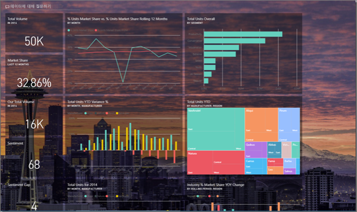
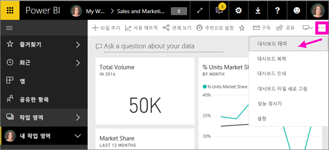
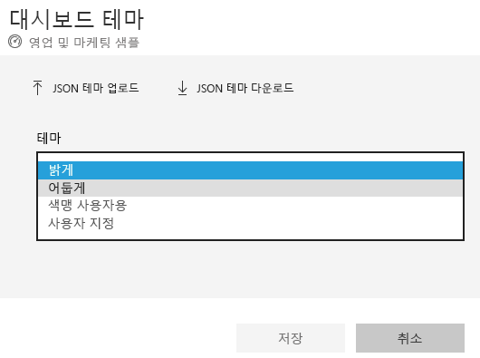
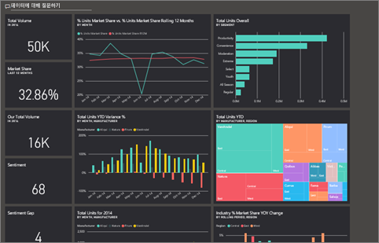
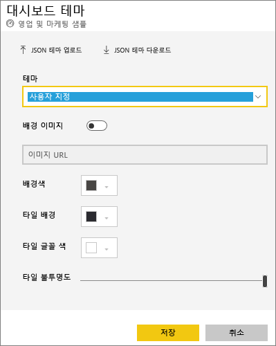
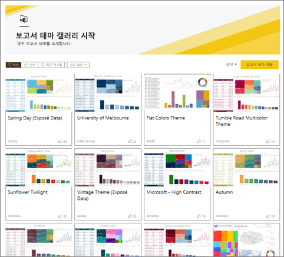
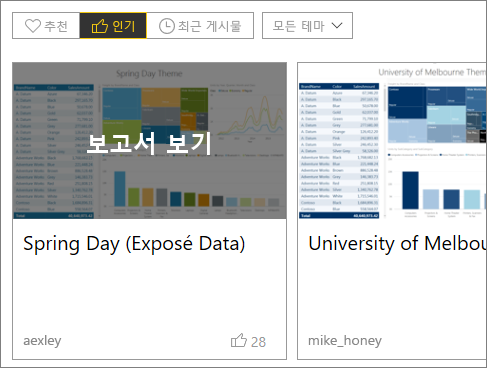
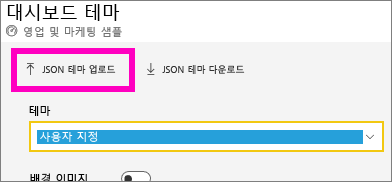
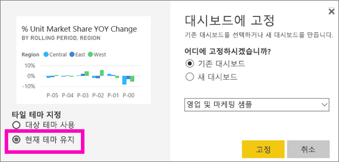
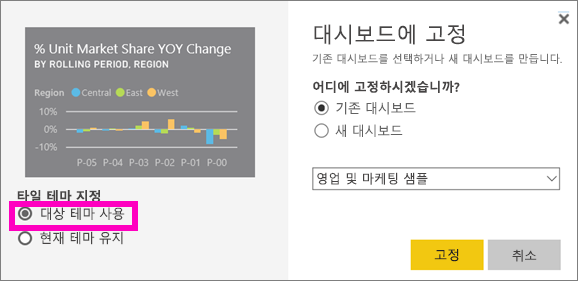

# <a name="use-dashboard-themes-in-the-power-bi-service"></a>Power BI 서비스에서 대시보드 테마 사용
**대시보드 테마** 를 사용하여 전체 대시보드에 회사 색, 계절 색 지정 또는 적용하려는 기타 색 테마 등의 색 테마를 적용할 수 있습니다. 대시보드 테마를 적용하면 대시보드의 모든 시각적 개체는 선택한 테마의 색을 사용합니다. 이 문서의 [고려 사항 및 제한 사항](#considerations-and-limitations) 섹션에 설명된 몇 가지 예외가 적용됩니다.



대시보드에서 보고서 시각적 개체의 색을 변경해도 관련 보고서의 시각적 개체에 영향을 주지 않습니다. 또한 이미 [보고서 테마가 적용](desktop-report-themes.md)된 보고서의 타일을 고정할 때 현재 테마를 유지하거나 대시보드 테마를 사용하도록 선택할 수 있습니다.


## <a name="prerequisites"></a>필수 구성 요소
* 이를 수행하려면 [영업 및 마케팅 샘플 대시보드](sample-datasets.md)를 엽니다.


## <a name="how-dashboard-themes-work"></a>대시보드 테마 작동 방식
시작하려면 만든 대시보드를 열거나 편집할 수 있습니다. **편집** > **대시보드 테마** 를 선택합니다. 



표시되는 대시보드 창에서 미리 작성된 테마 중 하나를 선택합니다.  아래 예제에서 **어둡게** 를 선택했습니다.





## <a name="create-a-custom-theme"></a>사용자 지정 테마 만들기

Power BI 대시보드의 기본 테마는 **밝게** 입니다. 색을 사용자 지정하거나 고유한 테마를 만들려면 드롭다운 목록에서 **사용자 지정** 을 선택합니다. 



사용자 지정 옵션을 사용하여 고유한 대시보드 테마를 만듭니다. 배경 이미지를 추가하는 경우 이미지는 적어도 1920x1080 해상도를 사용하는 것이 좋습니다. 이미지를 배경으로 사용하려면 이미지를 공개 웹 사이트에 업로드하고 URL을 복사한 이후 **이미지 URL** 필드에 붙여넣으세요. 

## <a name="use-a-json-theme"></a>JSON 테마 사용
사용자 지정 테마를 만드는 또 다른 방법은 대시보드에 사용하려는 모든 색에 대한 설정을 포함하는 JSON 파일을 업로드하는 것입니다. Power BI Desktop에서 보고서 작성자는 JSON 파일을 사용하여 [보고서의 테마를 만듭니다](desktop-report-themes.md). 대시보드에 대해 이러한 동일한 JSON 파일을 업로드할 수 있습니다. 또는 Power BI 커뮤니티의 [테마 갤러리 페이지](https://community.powerbi.com/t5/Themes-Gallery/bd-p/ThemesGallery)에서 JSON 파일을 찾아 업로드할 수 있습니다. 



JSON 파일로 사용자 지정 테마를 저장한 다음, 다른 대시보드 작성자와 공유할 수도 있습니다. 

### <a name="use-a-theme-from-the-theme-gallery"></a>테마 갤러리에서 테마 사용

기본 제공 옵션 및 사용자 지정 옵션과 마찬가지로 테마를 업로드하면 대시보드의 모든 타일에 색이 자동으로 적용됩니다. 

1. 테마 위로 마우스를 가져가고 **보고서 보기** 를 선택합니다.

    

2. 아래로 스크롤하여 JSON 파일에 대한 링크를 찾습니다.  다운로드 아이콘을 선택하고 파일을 저장합니다.

    

3. Power BI 서비스로 다시 돌아가서 사용자 지정 대시보드 테마 창에서 **JSON 테마 업로드** 를 선택합니다.

    

4. JSON 테마 파일을 저장한 위치로 이동하고 **열기** 를 선택합니다.

5. 대시보드 테마 페이지에서 **저장** 을 선택합니다. 새 테마가 대시보드에 적용됩니다.

    

## <a name="reports-and-dashboards-with-different-themes"></a>다른 테마를 사용하는 보고서 및 대시보드

보고서가 대시보드 테마의 다양한 테마를 사용할 때는 대부분의 경우 시각적 개체가 현재 테마를 유지할지 또는 대시보드 테마를 사용할지 여부를 제어할 수 있습니다. 그러나 대시보드의 카드 시각적 개체는 ‘DIN’ 글꼴 제품군 및 검정 텍스트를 사용합니다. 사용자 지정 대시보드 테마를 만들어 코드를 포함하여 대시보드에 있는 모든 타일의 텍스트 색을 변경할 수 있습니다.

- 타일을 대시보드에 고정하는 경우 보고서 테마를 유지하려면 **현재 테마 유지** 를 선택합니다. 대시보드의 시각적 개체는 투명도 설정을 포함하여 보고서 테마를 유지합니다.

    Power BI Desktop에서 보고서를 만들고, [보고서 테마를 추가](desktop-report-themes.md)한 다음, Power BI 서비스에 보고서를 게시한 경우에만 **타일 테마 지정** 옵션이 표시됩니다.

    

- 타일을 다시 고정하고 **대시보드 테마 사용** 을 선택하려고 합니다.

    

## <a name="dashboard-theme-json-file-format"></a>대시보드 테마 JSON 파일 형식

가장 기본적인 수준의 테마 JSON 파일에는 필수 줄인 **name** 만 있습니다.

```json
{
    "name": "Custom Theme"
}
```

**이름** 외에 다른 모든 요소는 선택 사항입니다. 특별히 서식을 지정하려는 속성을 테마 파일에 추가하고 나머지에 대해서는 Power BI의 기본값을 계속 사용할 수 있습니다.

대시보드 테마 지정을 위한 JSON 파일에는 다음이 포함됩니다.

- name: 테마 이름(유일한 필수 필드)입니다.
- foreground 및 background: 대시보드의 색입니다.
- dataColors: 차트의 데이터에 사용할 16진수의 목록입니다. 원하는 만큼 적거나 많은 색을 포함할 수 있습니다.
- tiles: 대시보드의 백그라운드 및 색 구성입니다.
- visualStyles: 시각적 개체에 대한 세부적인 서식 지정입니다.

기본 밝은 테마에 대한 샘플 테마 JSON은 다음과 같습니다.

```json
{

"name":"Light",

"foreground":"#000000",

"background":"#EAEAEA",

"dataColors":["#01B8AA","#374649","#FD625E","#F2C80F","#5F6B6D","#8AD4EB","#FE9666","#A66999"],

"tiles":{"background":"#FFFFFF","color":"#000000"},

"visualStyles":{"*":{"*":{"*":[{"color":{"solid":{"color":"#000000"}}}]}}}

}
```

## <a name="considerations-and-limitations"></a>고려 사항 및 제한 사항

* 고정된 라이브 보고서 페이지, iframe 타일, SSRS 타일, 통합 문서 타일 또는 이미지에 대시보드 테마를 적용할 수 없습니다.
* 모바일 디바이스에서 대시보드 테마가 표시되지만, Power BI 서비스에서만 대시보드 테마를 만들 수 있습니다.
* 대시보드 사용자 지정 테마는 보고서의 고정된 타일에서만 작동합니다.

## <a name="next-steps"></a>다음 단계

- [보고서에 테마 적용](desktop-report-themes.md)
