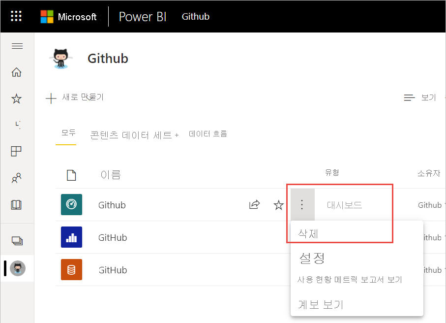
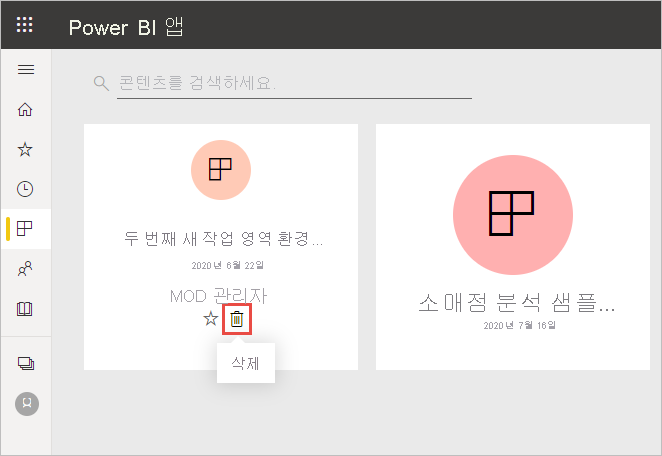
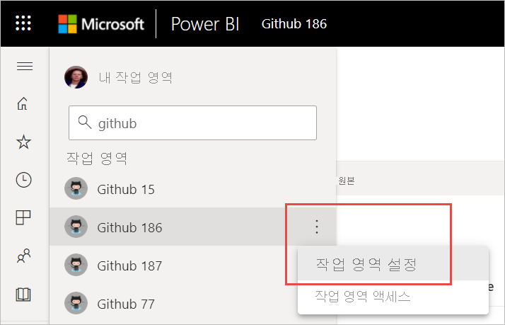
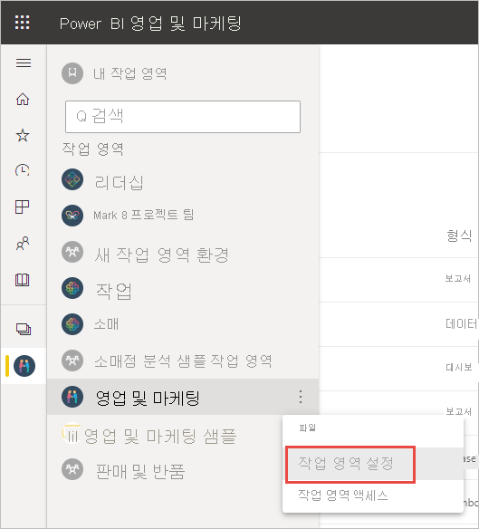

# Power BI 서비스에서 거의 모든 항목 삭제
이 문서에서는 Power BI 서비스에서 대시보드, 보고서, 통합 문서, 데이터 세트, 앱, 시각화 또는 작업 영역을 삭제하는 방법을 보여 줍니다. 몇 가지 예외가 있지만 Power BI 서비스에서 거의 모든 항목을 삭제할 수 있습니다. 

## 대시보드, 보고서, 데이터 세트 또는 통합 문서 삭제

1. 작업 영역에서 **모두** 탭을 선택합니다.
1. 삭제하려는 자산 옆에 있는 **추가 옵션(...)** 을 선택하고 **삭제** 를 선택합니다.

    

1. **삭제** 를 선택하여 삭제를 확인합니다.

## 앱 목록 페이지에서 앱 제거

앱 목록 페이지에서 앱을 쉽게 제거할 수 있습니다. 앱을 제거해도 다른 멤버의 앱은 삭제되지 않습니다. 관리자나 멤버 또는 작업 영역만 해당 작업 영역에서 앱을 영구적으로 삭제할 수 있습니다.

1. 탐색 창에서 **앱** 을 선택하여 앱 목록 페이지를 엽니다.
2. 삭제할 앱에 마우스를 올려 놓은 후 삭제 아이콘 :::image type="icon" source="media/service-delete/power-bi-delete-report2.png" border="false":::을 선택합니다.

   

   실수로 앱을 제거할 경우 복구할 수 있는 몇 가지 옵션이 있습니다.  앱 작성자에게 다시 보내달라고 요청하거나, 앱 링크가 포함된 메일 원본을 찾거나, [알림 센터](../consumer/end-user-notification-center.md)에서 해당 앱에 대한 알림이 목록에 남아 있는지 확인하거나, [조직의 AppSource](../consumer/end-user-apps.md)를 확인할 수 있습니다.

## 작업 영역 제거 또는 삭제

Power BI에는 원본 또는 ‘클래식’ 작업 영역과 새 작업 영역이라는 두 종류의 작업 영역이 있습니다. 이러한 작업 영역을 제거하거나 삭제하는 프로세스가 다릅니다. [새 작업 영역과 클래식 작업 영역](../collaborate-share/service-new-workspaces.md)에 대해 자세히 알아보세요.

### 새 작업 영역에서 멤버 제거

작업 영역 관리자만 새 작업 영역에서 사용자를 제거할 수 있습니다. 관리자인 경우 자신이나 다른 사용자를 제거할 수 있습니다. 그러나 Power BI에서는 작업 영역의 유일한 관리자가 자신을 제거할 수 없도록 합니다.

1. 작업 영역 목록 보기의 오른쪽 위 모서리에서 **액세스** 를 선택합니다.

    :::image type="content" source="media/service-delete/power-bi-select-access.png" alt-text="액세스 선택 스크린샷":::

1. **액세스** 창에서 제거하려는 사용자의 이름 옆에 있는 **추가 옵션(...)** 을 선택하고 **제거** 를 선택합니다.

    :::image type="content" source="media/service-delete/power-bi-access-remove.png" alt-text="액세스 창에서 제거 선택 스크린샷":::

### 새 작업 영역 삭제

‘새 작업 영역’ 중 하나를 만들면 연결된 Microsoft 365 그룹은 만들어지지 않습니다. 작업 영역 관리자인 경우 Microsoft 365 그룹에 영향을 주지 않고 새 작업 영역을 삭제할 수 있습니다. [새 작업 영역과 클래식 작업 영역](../collaborate-share/service-new-workspaces.md)에 대해 자세히 알아보세요.

작업 영역 관리자는 해당 작업 영역을 삭제하거나 다른 사용자의 작업 영역을 제거할 수 있습니다. 삭제하면 모든 그룹 멤버에 대해 연결된 앱도 삭제되며 AppSource에서 제거됩니다. 

1. 탐색 창에서 **작업 영역** 을 선택합니다.

2. 삭제할 작업 영역의 오른쪽에 있는 **추가 옵션**(...)을 선택하고 **작업 영역 설정** 을 선택합니다.

    

3. **작업 영역 설정** 창에서 **작업 영역 삭제** > **삭제** 를 선택합니다.

### 목록에서 클래식 작업 영역 제거

더 이상 클래식 작업 영역의 멤버가 되지 않으려는 경우 작업 영역에서 ‘나가면’ 해당 작업 영역이 목록에서 제거됩니다. 작업 영역에서 나가면 다른 모든 작업 영역 구성원은 그대로 유지됩니다.  

> [!NOTE]
> Power BI에서는 작업 영역의 유일한 관리자가 작업 영역에서 나가는 것을 허용하지 않습니다.
>

1. 제거하려는 작업 영역에서 시작합니다.

2. 오른쪽 위에 있는 ‘추가 옵션’(...)을 선택하고 **작업 영역 나가기** > **나가기** 를 선택합니다.

      :::image type="content" source="media/service-delete/power-bi-leave-workspace.png" alt-text="추가 옵션, 작업 영역 나가기 스크린샷":::

   > [!NOTE]
   > 드롭다운에 표시되는 옵션은 해당 작업 영역의 관리자인지 또는 구성원인지에 따라 달라집니다.
   >

### 클래식 작업 영역 삭제

> [!WARNING]
> ‘클래식’ 작업 영역을 만들면 Microsoft 365 그룹이 만들어집니다. 클래식 작업 영역을 삭제하면 해당 Microsoft 365 그룹도 삭제됩니다. SharePoint 및 Microsoft Teams 같은 다른 Microsoft 365 제품에서도 그룹이 삭제됩니다.
> 

작업 영역을 삭제하는 것은 작업 영역에서 나가는 것과 다릅니다. 작업 영역을 삭제하려면 작업 영역 관리자여야 합니다. 삭제하면 모든 그룹 멤버에 대해 연결된 앱도 삭제되며 AppSource에서 제거됩니다. 그러나 Power BI에서는 작업 영역의 유일한 관리자가 나갈 수 없도록 합니다.

1. 탐색 창에서 **작업 영역** 을 선택합니다.

2. 삭제할 작업 영역 옆에 있는 **추가 옵션(...)**  > **작업 영역 설정** 을 선택합니다.

    

3. **설정** 창에서 **작업 영역 삭제** 를 선택한 다음, **삭제** 를 확인합니다.

    

## 고려 사항 및 제한 사항

- ‘대시보드’를 제거해도 기본 데이터 세트 또는 해당 대시보드와 연결된 보고서가 삭제되지 않습니다.
- ‘대시보드 또는 보고서의 소유자’인 경우 해당 대시보드나 보고서를 제거할 수 있습니다. 대시보드나 보고서를 동료와 공유한 경우 Power BI 작업 영역에서 제거하면 동료의 Power BI 작업 영역에서도 제거됩니다.
- ‘대시보드 또는 보고서의 공유 사용자’인 경우 해당 대시보드나 보고서를 제거할 수 없습니다.
- 보고서를 삭제해도 보고서의 기반이 되는 데이터 세트는 삭제되지 않습니다.  보고서에서 대시보드에 고정한 모든 시각화도 안전합니다. 이러한 시각화는 개별적으로 삭제할 때까지 대시보드에 그대로 남아 있습니다.
- ‘데이터 세트’를 삭제할 수 있습니다. 그러나 데이터 세트를 삭제하면 해당 데이터 세트의 데이터가 포함된 모든 보고서와 대시보드 타일도 삭제됩니다.
- ‘통합 문서’를 제거할 수 있습니다. 그러나 통합 문서를 제거하면 이 통합 문서의 데이터가 포함된 모든 보고서와 대시보드 타일이 제거됩니다. 통합 문서가 비즈니스용 OneDrive에 저장된 경우에는 Power BI에서 삭제해도 OneDrive에서 삭제되지 않습니다.
- ‘대시보드 또는 보고서’가 [조직 콘텐츠 팩](../collaborate-share/service-organizational-content-pack-disconnect.md)의 일부인 경우에는 이 방법을 사용하여 삭제할 수 없습니다.  [조직 콘텐츠 팩에 대한 연결 제거](../collaborate-share/service-organizational-content-pack-disconnect.md)를 참조하세요.
- ‘데이터 세트’가 하나 이상의 조직 콘텐츠 팩에 속해 있는 경우 삭제하는 유일한 방법은 사용 중인 콘텐츠 팩에서 제거하고 처리될 때까지 기다린 후 다시 삭제를 시도하는 것입니다.

## 다음 단계

이 문서에서는 Power BI 서비스의 주요 구성 요소를 삭제하는 방법을 살펴보았습니다. 다음은 삭제할 수 있는 몇 가지 다른 항목입니다.  

- [주요 대시보드 제거](../consumer/end-user-featured.md)
- [대시보드 제거(즐겨찾기 해제)](../consumer/end-user-favorite.md)
- [대시보드 타일 삭제](service-dashboard-edit-tile.md)

궁금한 점이 더 있나요? [Power BI 커뮤니티를 이용하세요.](https://community.powerbi.com/)