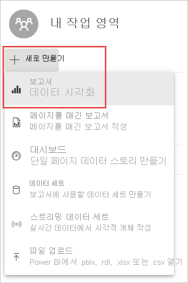
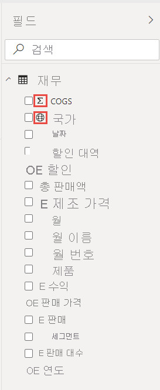
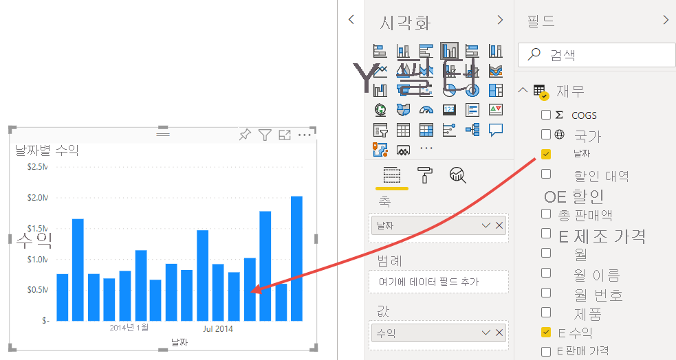
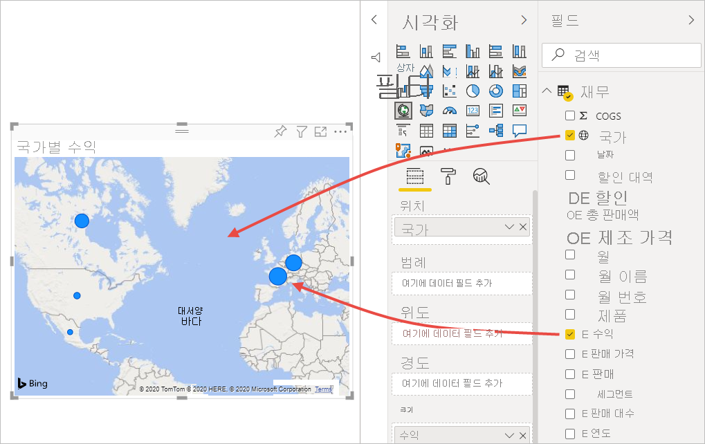
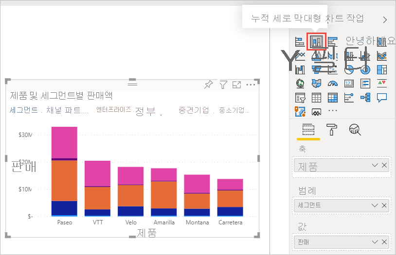
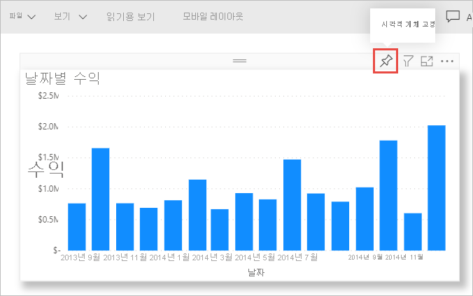
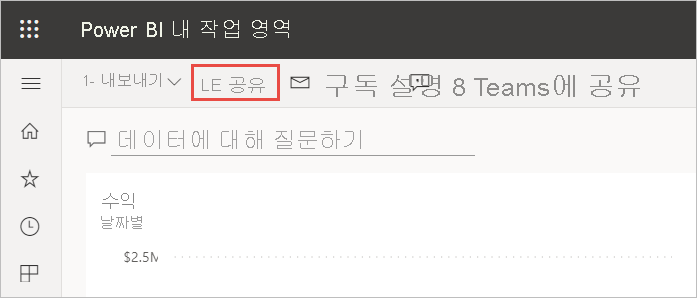
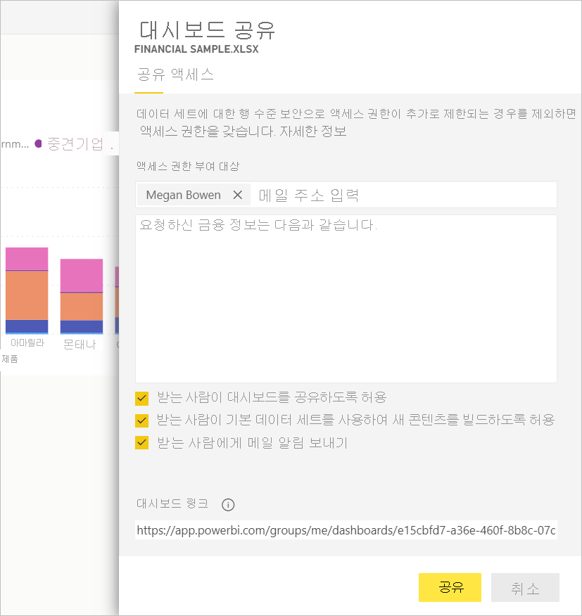
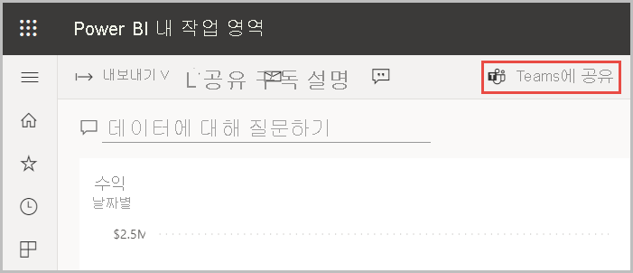

# 자습서:  Excel 통합 문서를 통해 Power BI 서비스에서 보고서 작성 및 Microsoft Teams에서 공유
오늘 업무가 끝나기 전에 최근 매출 및 이익 통계에 관한 보고서를 상사에게 제출해야 합니다. 하지만 최신 데이터는 다양한 타사 시스템과 노트북의 파일에 있습니다. 이전에는 시각적 개체를 만들고 보고서 서식을 지정하는 데 몇 시간이 걸렸으며, 걱정이 되기 시작합니다.

염려하지 마세요. Power BI를 사용하면 바로 깔끔하게 보고서를 작성하여 Microsoft Teams에서 공유할 수 있습니다.

:::image type="content" source="media/service-from-excel-to-stunning-report/power-bi-financial-report-service.png" alt-text="완료된 재무 샘플 보고서의 스크린샷":::

이 자습서에서는 Excel 파일을 업로드하고, 새 보고서를 만들고, Microsoft Teams에서 동료와 공유하는 작업을 모두 Power BI 내에서 수행합니다. 이 문서에서 배울 내용은 다음과 같습니다.

> [!div class="checklist"]
> * Excel에서 데이터를 준비합니다.
> * 샘플 데이터를 다운로드합니다.
> * Power BI 서비스에서 보고서를 작성합니다.
> * 보고서 시각적 개체를 대시보드에 고정합니다.
> * 대시보드에 링크를 공유합니다.
> * Microsoft Teams에서 대시보드 공유

## Excel에서 데이터 준비
예를 들어 간단한 Excel 파일을 살펴보겠습니다. 

1. Excel 파일을 Power BI에 로드하려면 먼저 2차원 표에 데이터를 구성해야 합니다. 2차원 표의 각 열에는 동일한 데이터 형식(예: 텍스트, 날짜, 숫자 또는 통화)이 포함됩니다. 표에 머리글 행이 있어야 하지만, 합계를 표시하는 열이나 행은 없어야 합니다.

   

2. 다음에는 데이터 형식을 표로 지정됩니다. Excel의 **홈** 탭, **스타일** 그룹에서 **표 서식**을 선택합니다. 

3. 워크시트에 적용할 표 스타일을 선택합니다. 

   이제 Excel 워크시트를 Power BI에 로드할 수 있습니다.

   

## Power BI 서비스에 Excel 파일 업로드
Power BI 서비스는 컴퓨터에 있는 Excel 파일을 포함하여 여러 데이터 원본에 연결합니다. 

 > [!NOTE] 
 > 이 자습서의 나머지 부분을 진행하려면 [재무 샘플 통합 문서](https://go.microsoft.com/fwlink/?LinkID=521962)를 다운로드합니다.

1. 먼저 Power BI 서비스에 로그인합니다. 아직 등록하지 않은 경우 [무료로 등록할 수 있습니다](https://powerbi.com).
1. **내 작업 영역**에서 **새로 만들기** > **파일 업로드**를 선택합니다.

    :::image type="content" source="media/service-from-excel-to-stunning-report/power-bi-new-upload.png" alt-text="파일 업로드 옵션의 스크린샷.":::

1. **로컬 파일**을 선택하고, 재무 샘플 Excel 파일을 저장한 위치로 이동한 다음, **열기**를 선택합니다.
7. **로컬 파일** 페이지에서 **가져오기**를 선택합니다.

    이제 재무 샘플 데이터 세트가 있습니다. Power BI에서 빈 대시보드가 자동으로 생성되었습니다. 대시보드가 표시되지 않으면 브라우저를 새로 고칩니다.

    :::image type="content" source="media/service-from-excel-to-stunning-report/power-bi-financial-dataset.png" alt-text="재무 샘플 데이터 세트가 있는 내 작업 영역의 스크린샷.":::

2. 보고서를 만들려고 합니다. 계속 **내 작업 영역**에서 **새로 만들기** > **보고서**를 선택합니다.

   

3. **보고서를 만들 데이터 세트 선택** 대화 상자에서 **재무 샘플** 데이터 세트 > **만들기**를 선택합니다.

   

## 보고서 작성
 
보고서가 편집용 보기에서 열리고 빈 보고서 캔버스를 표시합니다. 오른쪽에는 **시각화**, **필터** 및 **필드** 창이 있습니다. Excel 통합 문서 테이블 데이터가 **필드** 창에 나타납니다. 위쪽에는 테이블 이름 **financials**가 있습니다. 이름 아래에 열 머리글이 개별 필드로 나열됩니다.

필드 목록에 시그마 기호가 표시됩니까? Power BI는 해당 필드가 숫자임을 검색했습니다. 지구 기호가 있는 지리 필드도 표시됩니다.

1. 보고서 캔버스에 추가 공간을 포함하려면 **탐색 창 숨기기**를 선택하고 **필터** 창을 최소화합니다.

    :::image type="content" source="media/service-from-excel-to-stunning-report/power-bi-hide-nav-pane.png" alt-text="탐색 창을 최소화하는 스크린샷."::: 

1. 이제 시각화를 만들 수 있습니다. 상사가 시간별 수익을 보고 싶어 한다고 가정해 보겠습니다. **필드** 창에서 **Profit**을 보고서 캔버스로 끌어다 놓습니다. 

   기본적으로 Power BI는 하나의 열을 포함하는 세로 막대형 차트를 표시합니다. 

    :::image type="content" source="media/service-from-excel-to-stunning-report/power-bi-profit-column.png" alt-text="하나의 열이 포함된 세로 막대형 차트의 스크린샷.":::

3. **Date**를 보고서 캔버스로 끌어다 놓습니다. 

   Power BI는 세로 막대형 차트를 업데이트하여 날짜별 수익을 표시합니다.

   

    2014년 12월은 수익이 가장 높은 달이었습니다.
   
    > [!TIP]
    > 차트가 예상대로 표시되지 않으면 집계를 확인합니다. 예를 들어 **값** 웰에서 방금 추가한 **Profit** 필드를 선택하고 데이터가 원하는 방식으로 집계되고 있는지 확인합니다. 이 예에서는 **합계**를 사용합니다.
    > 

### 맵 만들기

상사가 수익성이 가장 높은 국가를 알고 싶어 하는 경우 지도 시각화를 활용해 보세요. 

1. 보고서 캔버스에서 빈 영역을 선택합니다. 

2. **필드** 창에서 **Country** 필드를 보고서 캔버스로 끌어서 놓은 다음, **Profit** 필드를 지도로 끌어서 놓습니다.

   Power BI가 각 위치의 상대 수익을 나타내는 거품이 포함된 맵 시각적 개체를 만듭니다.

   

    유럽 국가가 북아메리카 국가보다 성과가 좋은 것 같습니다.

### 매출을 표시하는 시각적 개체 만들기

제품 및 세분 시장별 매출을 보여 주는 시각적 개체를 표시하는 작업도 간단합니다. 

1. 빈 캔버스를 선택합니다.

1. **필드** 창에서 **Sales**, **Product**, **Segment** 필드를 선택합니다. 
   
   Power BI가 묶은 세로 막대형 차트를 만듭니다. 

2. **시각화** 메뉴에서 아이콘 중 하나를 선택하여 차트 종류를 변경합니다. 예를 들어 **누적 세로 막대형 차트**로 변경합니다. 

   

3. 차트를 정렬하려면 **추가 옵션**(...) > **정렬 기준**을 선택합니다.

### 시각적 개체 꾸미기

시각화 창의 **서식** 탭에서 다음과 같이 변경합니다.

:::image type="content" source="media/desktop-excel-stunning-report/power-bi-format-tab-visualizations.png" alt-text="시각화 창, 서식 탭의 스크린샷.":::

1. **Profit by Date** 세로 막대형 차트를 선택합니다. **제목** 섹션에서 **텍스트 크기**를 **16pt**로 변경합니다. **그림자**를 **켜기**로 전환합니다. 

1. **Sales by Product and Segment** 누적 세로 막대형 차트를 선택합니다. **제목** 섹션에서 제목 **텍스트 크기**를 **16pt**로 변경합니다. **그림자**를 **켜기**로 전환합니다.

1. **Profit by Country** 지도를 선택합니다. **지도 스타일** 섹션에서 **테마**를 **회색조**로 변경합니다. **제목** 섹션에서 제목 **텍스트 크기**를 **16pt**로 변경합니다. **그림자**를 **켜기**로 전환합니다.

## 대시보드에 고정

이제 Power BI가 기본적으로 만든 모든 시각적 개체를 빈 대시보드에 고정할 수 있습니다. 

1. 시각적 개체를 가리키고 **시각적 개체 고정**을 선택합니다.

   

1. 대시보드에 시각적 개체를 고정하려면 먼저 보고서를 저장해야 합니다. 보고서에 이름을 지정하고 **저장**을 선택합니다.
1. 각 시각적 개체(**Financial Sample.xlsx**)를 Power BI가 만든 대시보드에 고정합니다.
1. 마지막 시각적 개체를 고정하면 **대시보드로 이동**을 선택합니다.
1. Power BI가 자리 표시자 Financial Sample.xlsx 타일을 대시보드에 자동으로 추가했습니다. **추가 옵션(...)**  > **타일 삭제**를 선택합니다.

    :::image type="content" source="media/service-from-excel-to-stunning-report/power-bi-tile-more-options.png" alt-text="타일에 대한 추가 옵션의 스크린샷.":::

1. 원하는 방식으로 타일을 다시 정렬하고 크기를 조정합니다.

대시보드 및 보고서가 준비되었습니다.

## 대시보드에 링크 공유

이제 대시보드를 관리자와 공유할 수 있습니다. Power BI 계정을 가진 동료와 대시보드 및 기본 보고서를 공유할 수 있습니다. 동료는 보고서를 조작할 수 있지만, 변경 내용을 저장할 수는 없습니다. 변경 내용 저장을 허용하면 동료는 다른 사용자와 다시 공유하거나 기본 데이터 세트를 기반으로 새 보고서를 작성할 수 있습니다.

1. 보고서를 공유하려면 대시보드의 맨 위에서 **공유**를 선택합니다.

   

2. **대시보드 공유** 페이지에서 **메일 주소 입력** 상자에 받는 사람의 메일 주소를 입력하고 아래 상자에 메시지를 추가합니다. 

3. 다음 중에서 원하는 옵션을 결정합니다(있는 경우).

    - **받는 사람이 대시보드를 공유하도록 허용**. 
    - **받는 사람이 기본 데이터 세트를 사용하여 새 콘텐츠를 빌드하도록 허용**.
    - **받는 사람에게 메일 알림 보내기**.

   

1. **공유**를 선택합니다.

## Microsoft Teams에 공유

Microsoft Teams에서 동료에게 직접 보고서 및 대시보드를 공유할 수도 있습니다.

1. Teams에서 공유하려면 대시보드의 맨 위에서 **Teams에 공유**를 선택합니다.

   

2. Power BI가 **Teams에 공유** 대화 상자를 표시합니다. 개인, 그룹 또는 채널의 이름을 입력하고 **공유**를 선택합니다. 
   
    :::image type="content" source="media/service-from-excel-to-stunning-report/power-bi-share-teams-dialog.png" alt-text="Teams에 공유 대화 상자의 스크린샷":::

3. 해당 개인, 그룹 또는 채널의 **게시물**에 링크가 표시됩니다.

   

## 다음 단계

* [Power BI 서비스 시작](../fundamentals/service-get-started.md)
* [Power BI Desktop 시작](../fundamentals/desktop-getting-started.md)
* [Power BI 서비스의 디자이너를 위한 기본 개념](../fundamentals/service-basic-concepts.md)

궁금한 점이 더 있나요? [Power BI 커뮤니티를 이용](https://community.powerbi.com/)하세요.
