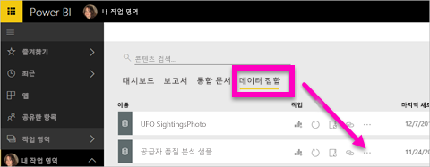
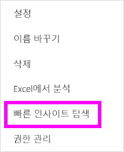
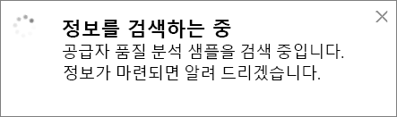
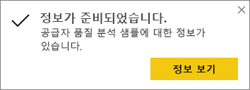
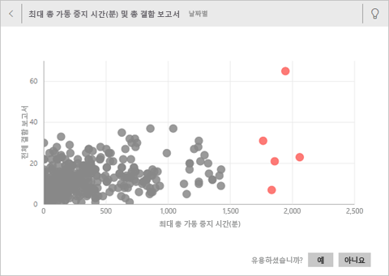
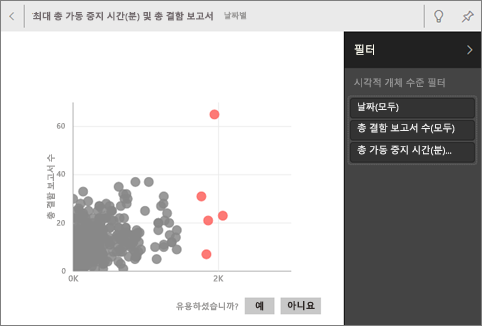
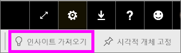
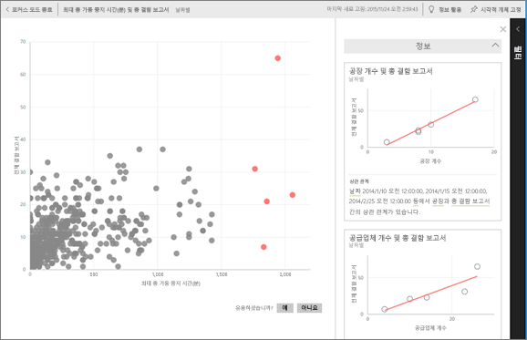

# Power BI를 통해 데이터 세트에 대한 데이터 인사이트를 자동으로 생성
새 데이터 세트가 있고 어디서 시작해야 할지가 확실하지 않은 경우  빠르게 대시보드를 만들어야 하는 경우  놓쳤을 수 있는 정보를 찾으려는 경우

빠른 인사이트를 실행하여 데이터를 기준으로 흥미로운 시각화를 생성합니다. 이 문서에서는 전체 데이터 세트에 대한 신속한 인사이트를 실행하는 방법을 설명합니다(신속한 인사이트). [특정 대시보드 타일에 대한 신속한 인사이트](../consumer/end-user-insights.md)(범위가 지정된 인사이트)를 실행할 수도 있습니다. 정보 활용에 대해서도 정보 활용을 실행할 수 있습니다.

> [!NOTE]
> 인사이트는 DirectQuery에서 작동하지 않고, Power BI에 업로드한 데이터에서만 작동합니다.
> 

Microsoft Research를 사용하여 개발한 [고급 분석 알고리즘 세트](../consumer/end-user-insight-types.md)에 대한 인사이트 기능을 빌드했습니다. 더 많은 사람들이 새롭고 직관적인 방법으로 데이터에서 인사이트를 찾을 수 있도록 이러한 알고리즘을 계속 사용하고 있습니다. [신속한 인사이트를 위해 데이터를 최적화](service-insights-optimize.md)하는 방법에 관심이 있을 수도 있습니다.

## 데이터 세트에서 신속한 정보 활용을 실행합니다.
Amanda가 데이터 세트에 대한 신속한 인사이트를 실행하고 Focus 모드에서 인사이트를 여는 것을 봅니다. Amanda는 대시보드의 타일로 인사이트를 고정한 다음, 대시보드 타일에 대한 인사이트를 가져옵니다.

<iframe width="560" height="315" src="https://www.youtube.com/embed/et_MLSL2sA8" frameborder="0" allowfullscreen></iframe>

이제 여러분 차례입니다. [공급업체 품질 분석 샘플](sample-supplier-quality.md)을 사용하여 인사이트를 살펴보세요.

1. **데이터 세트** 탭에서 **추가 옵션**(...)을 선택한 다음, **빠른 인사이트 탐색** 을 선택합니다.
   
    
   
    
2. Power BI는 [다양한 알고리즘](../consumer/end-user-insight-types.md)을 사용하여 데이터 세트의 추세를 검색합니다.
   
    
3. 몇 초 이내에 정보가 준비됩니다.  **인사이트 보기** 를 선택하여 시각화를 표시합니다.
   
    
   
    > [!NOTE]
    > 데이터가 통계적으로 중요하지 않기 때문에 일부 데이터 세트는 인사이트를 생성할 수 없습니다.  자세한 내용은 [정보 활용에 대한 데이터 최적화](service-insights-optimize.md)를 참조하세요.
    > 
    
4. 최대 32개의 개별 정보 카드가 있는 특수 **빠른 인사이트** 캔버스에 시각화가 표시됩니다. 각 카드에는 차트 또는 그래프와 간략한 설명이 있습니다.
   
    

## 인사이트 카드와 상호 작용

1. 시각화를 대시보드에 추가하려면 카드를 마우스로 가리키고 고정 아이콘을 선택합니다.

2. 카드를 마우스로 가리키고 **추가 옵션**(...)을 선택한 다음, **인사이트 보기** 를 선택합니다. 

    인사이트 화면이 포커스 모드로 열립니다.
   
    
3. 포커스 모드에서는 다음 작업을 수행할 수 있습니다.
   
   * 시각화를 필터링합니다. **필터** 창이 아직 열려 있지 않은 경우 창 오른쪽에 있는 화살표를 선택하여 확장합니다.

       
   * **시각적 개체 고정** 을 선택하여 인사이트 카드를 대시보드에 고정합니다.
   * 카드 자체에서 인사이트를 실행합니다. 이 작업을 ‘지정된 범위의 인사이트’라고도 합니다. 오른쪽 위에서 전구 모양 아이콘  또는 **인사이트 얻기** 를 선택합니다.
     
       
     
     인사이트는 왼쪽에 표시됩니다. 해당 단일 인사이트의 데이터만을 기반으로 하는 새 카드는 오른쪽에 표시됩니다.
     
       
4. 원래의 인사이트 캔버스로 돌아가려면 왼쪽 위 모서리에서 **포커스 모드 종료** 를 선택합니다.

## 다음 단계
- 데이터 세트의 소유자인 경우 [빠른 인사이트 활용을 위해 데이터 세트를 최적화](service-insights-optimize.md)합니다.
- [사용 가능한 빠른 인사이트 유형](../consumer/end-user-insight-types.md)에 대해 알아봅니다.

궁금한 점이 더 있나요? [Power BI 커뮤니티를 이용](https://community.powerbi.com/)하세요.
