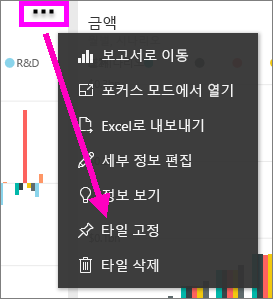
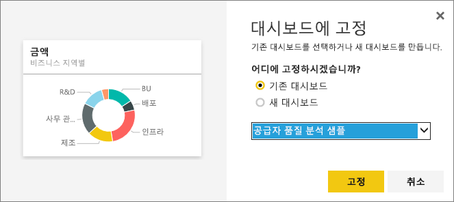

# 하나의 대시보드에서 다른 대시보드에 타일 고정
다른 대시보드에서 타일을 복사하는 것은 새 [대시보드 타일](../consumer/end-user-tiles.md)을 추가하는 방법 중 하나입니다. 이 각 타일을 클릭하면 질문 및 답변이나 보고서로 링크가 연결됩니다. 

> [!NOTE]
> 공유된 대시보드에서는 타일을 고정할 수 없습니다.

## 다른 대시보드에 타일 고정
1. [데이터를 가져옵니다](../connect-data/service-get-data.md). 이 예에서는 [IT 지출 분석 샘플](sample-it-spend.md)을 사용합니다.
2. [대시보드](../consumer/end-user-dashboards.md)를 엽니다.
3. 고정하려는 타일을 마우스로 가리키고, **추가 옵션**(...)을 선택한 다음, **타일 고정**을 선택합니다.  
   
   
4. 기존 대시보드 또는 새 대시보드에 타일을 고정합니다. 
   
   * **기존 대시보드**: 드롭다운에서 대시보드의 이름을 선택합니다.
   * **새 대시보드**: 새 대시보드의 이름을 입력합니다.
   
   
5. **고정**을 선택합니다.
   오른쪽 위에 나타나는 성공 메시지를 통해 시각화가 타일로 선택한 대시보드에 추가되었음을 알 수 있습니다.
   
   
6. **대시보드로 이동**을 선택하여 고정된 타일을 봅니다. 여기에서 고정된 시각화의 [이름을 바꾸거나 크기를 조정하거나 연결하고 이동](service-dashboard-edit-tile.md)할 수 있습니다.

## 다음 단계
[Power BI의 타일](../consumer/end-user-tiles.md)  
[Power BI의 대시보드](../consumer/end-user-dashboards.md)  
궁금한 점이 더 있나요? [Power BI 커뮤니티를 이용하세요.](https://community.powerbi.com/)
