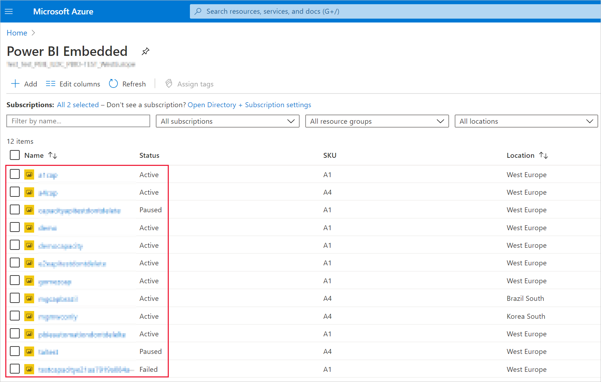

# <a name="create-power-bi-embedded-capacity-in-the-azure-portal"></a>Azure Portal에서 Power BI Embedded 용량 만들기

이 문서는 Microsoft Azure에서 [Power BI Embedded](azure-pbie-what-is-power-bi-embedded.md) 용량을 만드는 방법을 안내합니다. Power BI Embedded는 뛰어난 시각적 개체, 보고서 및 대시보드를 사용자의 앱에 빠르게 추가할 수 있도록 지원하여 Power BI 기능을 단순화합니다.

## <a name="before-you-begin"></a>시작하기 전에

이 빠른 시작을 완료하려면 다음이 필요합니다.

* **Azure 구독:** [Azure 평가판](https://azure.microsoft.com/free/)에 방문하여 계정을 만듭니다.

* **Azure Active Directory:** 구독은 Azure AD(Azure Active Directory) 테넌트와 연결되어 있어야 합니다. 또한 ***해당 테넌트에 계정이 있는 Azure에 로그인해야 합니다***. Microsoft 계정은 지원되지 않습니다. 자세한 내용은 [인증 및 사용자 권한](https://docs.microsoft.com/azure/analysis-services/analysis-services-manage-users)을 참조하세요.

* **Power BI 테넌트:** Azure AD 테넌트에서 하나 이상의 계정이 Power BI에 등록되어 있어야 합니다.

* **리소스 그룹:** 이미 있는 리소스 그룹을 사용하거나 [새로 만듭니다](https://docs.microsoft.com/azure/azure-resource-manager/resource-group-overview).

## <a name="create-a-capacity"></a>용량 만들기

Power BI Embedded 용량을 만들기 전에 최소 한 번 이상 Power BI 로그인했는지 확인합니다.

# <a name="portal"></a>[포털](#tab/portal)

1. [Azure Portal](https://portal.azure.com/)에 로그인합니다.

2. 검색 상자에서 *Power BI Embedded*를 검색합니다.

3. Power BI Embedded 내에서 **추가**를 선택합니다.

4. 필요한 정보를 입력하고 **검토 + 만들기**를 클릭합니다.

    

    * **구독** - 용량을 만들려는 구독입니다.

    * **리소스 그룹** - 이 새 용량을 포함하는 리소스 그룹입니다. 기존 리소스 그룹에서 선택하거나 새로 만듭니다. 자세한 내용은 [Azure Resource Manager 개요](https://docs.microsoft.com/azure/azure-resource-manager/resource-group-overview)를 참조하세요.

    * **리소스 이름** - 용량의 리소스 이름입니다.

    * **위치** - 테넌트에 대해 Power BI가 호스트되는 위치입니다. 기본 위치는 홈 지역이지만 [다중 지역 옵션](embedded-multi-geo.md)을 사용하여 위치를 변경할 수 있습니다.

    * **크기** - 필요한 [A SKU](../../admin/service-admin-premium-purchase.md#purchase-a-skus-for-testing-and-other-scenarios)입니다. 자세한 내용은 [SKU 메모리 및 컴퓨팅 성능](/embedded/embedded-capacity.md#sku-memory-and-computing-power)을 참조하세요.

    * **Power BI 용량 관리자** - 용량 관리자입니다.
        >[!NOTE]
        >* 기본적으로 용량 관리자는 용량을 만드는 사용자입니다.
        >* 다른 사용자 또는 서비스 주체를 용량 관리자로 선택할 수 있습니다.
        >* 용량 관리자는 용량이 프로비저닝된 테넌트에 속해야 합니다. B2B(Business to Business) 사용자는 용량 관리자가 될 수 없습니다.

# <a name="azure-cli"></a>[Azure CLI](#tab/CLI)

### <a name="use-azure-cloud-shell"></a>Azure Cloud Shell 사용

Azure는 브라우저를 통해 사용할 수 있는 대화형 셸 환경인 Azure Cloud Shell을 호스트합니다. Cloud Shell에서 Bash 또는 PowerShell을 사용하여 Azure 서비스 작업을 수행할 수 있습니다. 로컬 환경에 아무 것도 설치할 필요 없이 Azure Cloud Shell의 미리 설치된 명령을 사용하여 이 문서의 코드를 실행할 수 있습니다.

Azure Cloud Shell을 시작하려면 다음을 수행합니다.

| 옵션 | 예제/링크 |
|-----------------------------------------------|---|
| 코드 블록의 오른쪽 위 모서리에서 **사용**을 선택합니다. **사용해보기**를 선택하면 코드가 Cloud Shell에 자동으로 복사되지 않습니다. |  |
| [https://shell.azure.com](https://shell.azure.com)으로 이동하거나 **Cloud Shell 시작** 버튼을 선택하여 브라우저에서 Cloud Shell을 엽니다. | [](https://shell.azure.com) |
| [Azure Portal](https://portal.azure.com)의 오른쪽 위에 있는 메뉴 모음에서 **Cloud Shell** 단추를 선택합니다. |  |

이 문서의 코드를 Azure Cloud Shell에서 실행하려면 다음을 수행합니다.

1. Cloud Shell을 시작합니다.

2. 코드 블록의 **복사** 단추를 선택하여 코드를 복사합니다.

3. Windows 및 Linux에서 **Ctrl**+**Shift**+**V**를 선택하거나 macOS에서 **Cmd**+**Shift**+**V**를 선택하여 코드를 Cloud Shell 세션에 붙여넣습니다.

4. **Enter**를 선택하여 코드를 실행합니다.

## <a name="prepare-your-environment"></a>환경 준비

Power BI Embedded 용량 명령을 사용하려면 Azure CLI 버전 2.3.1 이상이 필요합니다. `az --version`을 실행하여 설치된 버전과 종속 라이브러리를 찾습니다. 설치하거나 업그레이드하려면 [Azure CLI 설치](/cli/azure/install-azure-cli)를 참조하세요.

1. 로그인합니다.

   로컬에 설치된 CLI를 사용하는 경우 [az login](/cli/azure/reference-index#az-login) 명령을 사용하여 로그인합니다.

    ```azurecli
    az login
    ```

    터미널에 표시된 단계에 따라 인증 프로세스를 완료합니다.

2. Azure CLI 확장을 설치합니다.

    Azure CLI에 대한 확장 참조를 사용하는 경우 먼저 확장을 설치해야 합니다.  Azure CLI 확장은 아직 핵심 CLI의 일부로 제공되지 않는 실험적 명령과 시험판 명령에 대한 액세스를 제공합니다.  확장 업데이트 및 제거를 포함하여 확장에 대해 자세한 내용을 보려면 [Azure CLI에서 확장 사용](/cli/azure/azure-cli-extensions-overview)을 참조하세요.

    다음 명령을 실행하여 Power BI Embedded 용량의 확장을 설치합니다.

    ```azurecli
    az extension add --name powerbidedicated
    ```

### <a name="create-a-capacity-with-azure-cli"></a>Azure CLI를 사용하여 용량 만들기

[az Power BI embedded-capacity create](https://docs.microsoft.com/cli/azure/ext/powerbidedicated/powerbi/embedded-capacity?view=azure-cli-latest#ext-powerbidedicated-az-powerbi-embedded-capacity-create) 명령을 사용하여 용량을 만듭니다.

```azurecli
az powerbi embedded-capacity create --location westeurope
                                    --name
                                    --resource-group
                                    --sku-name "A1"
                                    --sku-tier "PBIE_Azure"
```

### <a name="delete-a-capacity-with-azure-cli"></a>Azure CLI를 사용하여 용량 삭제

Azure CLI를 사용하여 용량을 삭제하려면 [az powerbi embedded-capacity delete](https://docs.microsoft.com/cli/azure/ext/powerbidedicated/powerbi/embedded-capacity?view=azure-cli-latest#ext-powerbidedicated-az-powerbi-embedded-capacity-delete) 명령을 사용합니다.

```azurecli
az powerbi embedded-capacity delete --name
                                    --resource-group
```

### <a name="manage-your-capacity-with-azure-cli"></a>Azure CLI를 사용하여 용량 관리

[az powerbi](https://docs.microsoft.com/cli/azure/ext/powerbidedicated/powerbi?view=azure-cli-latest)에서 모든 Power BI Embedded Azure CLI 명령을 볼 수 있습니다.

# <a name="arm-template"></a>[ARM 템플릿](#tab/ARM-template)

### <a name="use-resource-manager-template"></a>Resource Manager 템플릿 사용

[Resource Manager 템플릿](https://docs.microsoft.com/azure/azure-resource-manager/templates/overview)은 프로젝트에 대한 인프라 및 구성을 정의하는 JSON(JavaScript Object Notation) 파일입니다. 이 템플릿은 대상을 만들기 위한 프로그래밍 명령 시퀀스를 작성하지 않고도 배포하려는 대상을 설명할 수 있는 선언적 구문입니다. Resource Manager 템플릿 개발에 대한 자세한 내용은 [Resource Manager 설명서](https://docs.microsoft.com/azure/azure-resource-manager/) 및 [템플릿 참조](https://docs.microsoft.com/azure/templates/)에서 확인할 수 있습니다.

Azure 구독이 아직 없는 경우 시작하기 전에 [체험](https://azure.microsoft.com/free/) 계정을 만듭니다.

### <a name="review-the-template"></a>템플릿 검토

이 빠른 시작에서 사용되는 템플릿은 [Azure 빠른 시작 템플릿](https://azure.microsoft.com/resources/templates/101-power-bi-embedded)에서 나온 것입니다.

```json
{
    "$schema": "https://schema.management.azure.com/schemas/2019-04-01/deploymentTemplate.json#",
    "contentVersion": "1.0.0.0",
    "parameters": {
        "name": {
            "type": "string",
            "metadata": {
              "description": "The capacity name, which is displayed in the Azure portal and the Power BI admin portal"
            }
        },
        "location": {
            "type": "string",
            "defaultValue": "[resourceGroup().location]",
            "metadata": {
              "description": "The location where Power BI is hosted for your tenant"
            }
        },
        "sku": {
            "type": "string",
            "allowedValues": [
                "A1",
                "A2",
                "A3",
                "A4",
                "A5",
                "A6"
            ],
            "metadata": {
              "description": "The pricing tier, which determines the v-core count and memory size for the capacity"
            }
        },
        "admin": {
            "type": "string",
            "metadata": {
              "description": "A user within your Power BI tenant, who will serve as an admin for this capacity"
            }
        }
    },
    "resources": [
        {
            "type": "Microsoft.PowerBIDedicated/capacities",
            "apiVersion": "2017-10-01",
            "name": "[parameters('name')]",
            "location": "[parameters('location')]",
            "sku": {
                "name": "[parameters('sku')]"
            },
            "properties": {
                "administration": {
                    "members": [
                        "[parameters('admin')]"
                    ]
                }
            }
        }
    ]
}
```

템플릿 [Microsoft.PowerBIDedicated/capacities Az](https://docs.microsoft.com/azure/templates/microsoft.powerbidedicated/allversions) - Power BI Embedded 용량 만들기에 하나의 Azure 리소스가 정의되어 있습니다.

### <a name="deploy-the-template"></a>템플릿 배포

1. 다음 링크를 선택하여 Azure에 로그인하고 템플릿을 엽니다. 템플릿은 Power BI Embedded 용량을 만듭니다.

    [](https://portal.azure.com/#create/Microsoft.Template/uri/https%3a%2f%2fraw.githubusercontent.com%2fAzure%2fazure-quickstart-templates%2fmaster%2f101-power-bi-embedded%2fazuredeploy.json)

2. 필요한 정보를 입력하고 **검토 + 만들기**를 클릭합니다.

    

    * **구독** - 용량을 만들려는 구독입니다.

    * **리소스 그룹** - 이 새 용량을 포함하는 리소스 그룹입니다. 기존 리소스 그룹에서 선택하거나 새로 만듭니다. 자세한 내용은 [Azure Resource Manager 개요](https://docs.microsoft.com/azure/azure-resource-manager/resource-group-overview)를 참조하세요.

    * **지역** - 용량이 속하게 될 지역입니다.

    * **이름** - 용량 이름입니다.

    * **위치** - 테넌트에 대해 Power BI가 호스트되는 위치입니다. 기본 위치는 홈 지역이지만 [다중 지역 옵션](/embedded/embedded-multi-geo.md)을 사용하여 위치를 변경할 수 있습니다.

    * **SKU** - 필요한 [A SKU](../../admin/service-admin-premium-purchase.md#purchase-a-skus-for-testing-and-other-scenarios)입니다. 자세한 내용은 [SKU 메모리 및 컴퓨팅 성능](/embedded/embedded-capacity.md#sku-memory-and-computing-power)을 참조하세요.

    * **관리자** - 용량 관리자입니다.
        >[!NOTE]
        >* 기본적으로 용량 관리자는 용량을 만드는 사용자입니다.
        >* 다른 사용자 또는 서비스 주체를 용량 관리자로 선택할 수 있습니다.
        >* 용량 관리자는 용량이 프로비저닝된 테넌트에 속해야 합니다. B2B(Business to Business) 사용자는 용량 관리자가 될 수 없습니다.

### <a name="validate-the-deployment"></a>배포 유효성 검사

배포의 유효성을 검사하려면 다음을 수행합니다.

1. [Azure Portal](https://portal.azure.com/)에 로그인합니다.

2. 검색 상자에서 *Power BI Embedded*를 검색합니다.

3. Power BI Embedded 용량 목록을 검토하여 새로 만든 용량이 나열되어 있는지 확인합니다.

    

### <a name="clean-up-resources"></a>리소스 정리

만든 용량을 삭제하려면 다음 단계를 수행합니다.

1. [Azure Portal](https://portal.azure.com/)에 로그인합니다.

2. 검색 상자에서 *Power BI Embedded*를 검색합니다.

3. 만든 용량의 상황에 맞는 메뉴를 열고 **삭제**를 클릭합니다.

    

4. 확인 페이지에서 용량 이름을 입력하고 **삭제**를 클릭합니다.

    

---

## <a name="next-steps"></a>다음 단계

>[!div class="nextstepaction"]
>[용량 관리](../../admin/service-admin-premium-manage.md)

>[!div class="nextstepaction"]
>[Azure Portal에서 Power BI Embedded 용량 일시 중지 및 시작](azure-pbie-pause-start.md)

>[!div class="nextstepaction"]
>[고객의 애플리케이션에 Power BI 콘텐츠 포함](embed-sample-for-customers.md)

>[!div class="nextstepaction"]
>[궁금한 점이 더 있나요? Power BI 커뮤니티에 질문하세요.](https://community.powerbi.com/)