# <a name="tutorial-embed-power-bi-paginated-reports-into-an-application-for-your-organization"></a>자습서:  조직의 애플리케이션에 페이지를 매긴 Power BI 보고서 포함

**Power BI**에서 사용자 소유 데이터 시나리오를 사용하여 페이지를 매긴 보고서를 조직의 애플리케이션에 포함할 수 있습니다.

페이지를 매긴 보고서는 고품질 인쇄를 위해 디자인된 보고서입니다. 일반적으로 이러한 보고서는 많은 데이터를 포함하며, 인쇄된 페이지에 맞게 렌더링됩니다.
Power BI가 페이지를 매긴 보고서를 어떻게 지원하는지 이해하려면 [Power BI Premium의 페이지를 매긴 보고서란?](https://docs.microsoft.com/power-bi/paginated-reports-report-builder-power-bi)을 참조하세요.

**사용자 소유 데이터**를 사용하면 애플리케이션에서 Power BI 서비스를 확장할 수 있으므로 임베디드 분석을 사용할 수 있습니다. 이 자습서는 페이지를 매긴 보고서를 애플리케이션에 통합하는 방법을 보여 줍니다.

Power BI .NET SDK를 Power BI JavaScript API와 함께 사용하여 Power BI를 조직의 애플리케이션에 포함합니다.

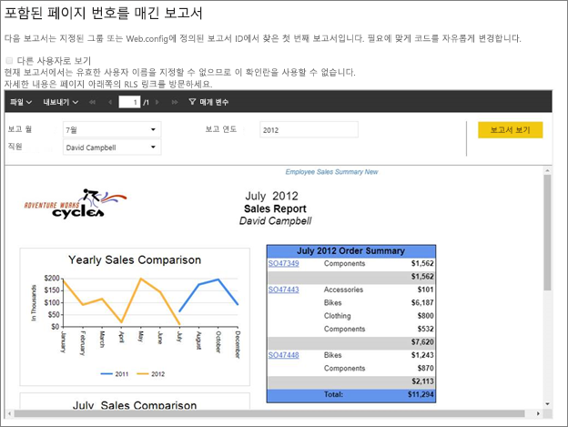

이 자습서에서는 다음 작업에 대해 학습합니다.
> [!div class="checklist"]
> * Azure에서 애플리케이션을 등록합니다.
> * Power BI 테넌트를 사용하여 애플리케이션에 페이지를 매긴 Power BI 보고서를 포함합니다.

## <a name="prerequisites"></a>필수 조건
시작하려면 다음이 필요합니다.

* [Power BI Pro 계정](../../admin/service-admin-purchasing-power-bi-pro.md).

* 고유한 [Azure Active Directory 테넌트 ](create-an-azure-active-directory-tenant.md) 설정이 필요합니다.

* P1 용량 이상이 필요합니다. [페이지를 매긴 보고서에는 어떤 크기의 프리미엄 용량이 필요한가요?](../../paginated-reports/paginated-reports-faq.md#what-size-premium-capacity-do-i-need-for-paginated-reports)를 참조하세요.

아직 **Power BI Pro**에 등록하지 않은 경우 시작하기 전에 [평가판에 등록](https://powerbi.microsoft.com/pricing/)합니다.

## <a name="set-up-your-power-bi-environment"></a>Power BI 환경 설정

이 섹션의 지침에 따라 페이지를 매긴 보고서를 포함하도록 Power BI를 설정합니다.

### <a name="register-a-server-side-web-application-app"></a>서버 쪽 웹 애플리케이션 앱 등록

[Power BI와 함께 사용할 Azure AD 애플리케이션 등록](register-app.md)의 지침에 따라 서버 쪽 웹 애플리케이션 앱을 등록합니다.

>[!NOTE]
>앱을 등록할 때 다음을 수행해야 합니다.
>* 애플리케이션 비밀 가져오기
>* 앱에 **Report.ReadAll** 권한(범위)을 적용합니다.

### <a name="create-a-dedicated-capacity"></a>전용 용량 만들기

전용 용량을 만들면 앱 작업 영역의 콘텐츠 전용 리소스의 혜택을 활용할 수 있습니다. 페이지를 매긴 보고서의 경우 최소 P1 용량을 사용하여 앱 작업 영역을 백업해야 합니다. [Power BI Premium](../../admin/service-premium-what-is.md)을 사용하여 전용 용량을 만들 수 있습니다.

다음 표는 [Microsoft Office 365](../../admin/service-admin-premium-purchase.md)에서 페이지를 매긴 보고서의 전용 용량을 만드는 데 사용할 수 있는 Power BI Premium SKU를 보여 줍니다.

| 용량 노드 | 총 vCore<br/>(백 엔드 + 프런트 엔드) | 백 엔드 vCore | 프런트 엔드 vCore | DirectQuery/라이브 연결 제한 |
| --- | --- | --- | --- | --- | --- |
| P1 |vCore 8개 |vCore 4개, 25GB RAM |vCore 4개 |초당 30 |
| P2 |vCore 16개 |vCore 8개, 50GB의 RAM |vCore 8개 |초당 60 |
| P3 |vCore 32개 |vCore 16개, 100GB의 RAM |vCore 16개 |초당 120 |
| P4 |vCore 64개 |vCore 32개, 200GB RAM |vCore 32개 |초당 240 |
| P5 |vCore 128개 |vCore 64개, 400GB RAM |vCore 64개 |초당 480 |
|||||

### <a name="enable-paginated-reports-workload"></a>페이지를 매긴 보고서 워크로드 사용

전용 용량에서 페이지를 매긴 보고서 워크로드를 사용하도록 설정해야 합니다.

1. [Power BI > 관리 포털 > 용량 설정](https://app.powerbi.com/admin-portal/capacities)에 로그인합니다.

2. 페이지를 매긴 보고서를 업로드할 작업 영역이 있는 용량을 선택합니다.

    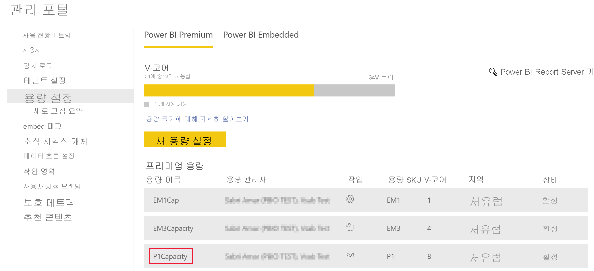

3. **워크로드**를 확장합니다.

    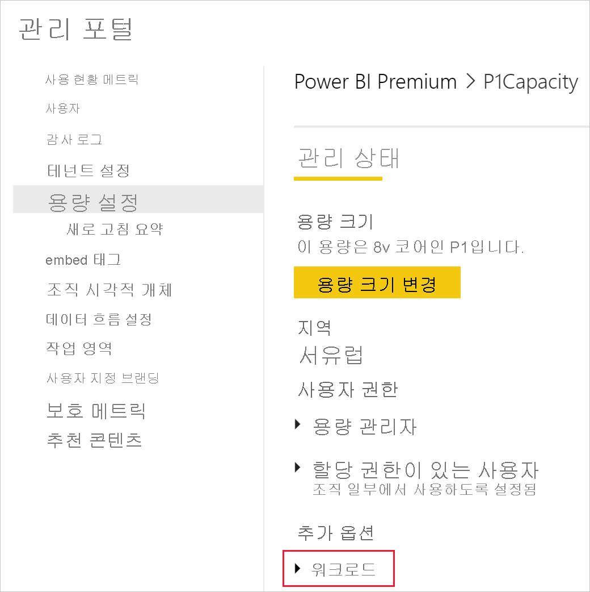

4. 페이지를 매긴 보고서 워크로드를 활성화합니다.

    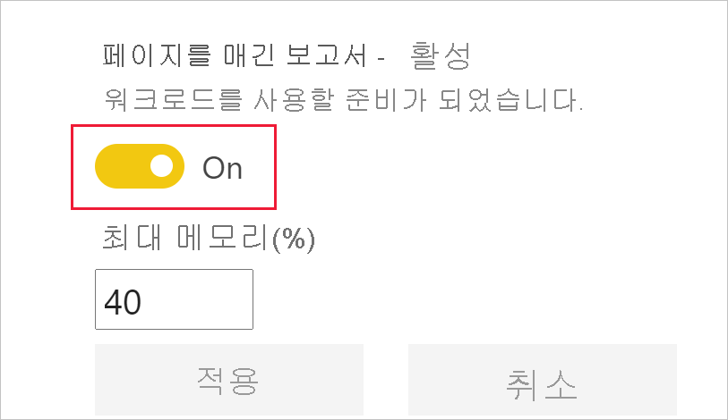

### <a name="assign-an-app-workspace-to-a-dedicated-capacity"></a>전용 용량에 앱 작업 영역 할당

전용 용량을 만들면 해당 전용 용량에 앱 작업 영역을 할당할 수 있습니다. 이 프로세스를 완료하려면 다음 단계를 수행합니다.

1. Power BI 서비스 내에서 작업 영역을 확장하고, 콘텐츠를 포함하는 데 사용하는 작업 영역에 대한 **더 보기**를 선택합니다. 그런 다음 **작업 영역 설정**을 선택합니다.

    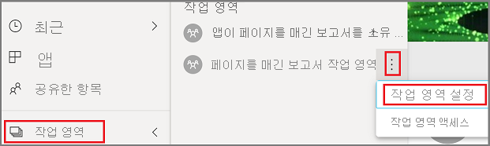

2. **프리미엄**을 선택하고 **전용 용량**을 사용하도록 설정합니다. 만든 전용 용량을 선택합니다. 그런 다음, **저장**을 선택합니다.

    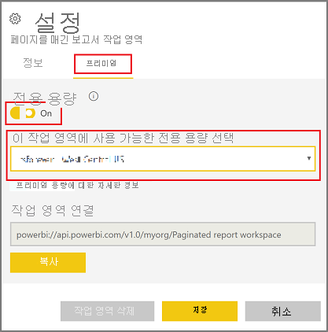

3. **저장**을 선택하면 앱 작업 영역 이름 옆에 다이아몬드가 표시됩니다.

    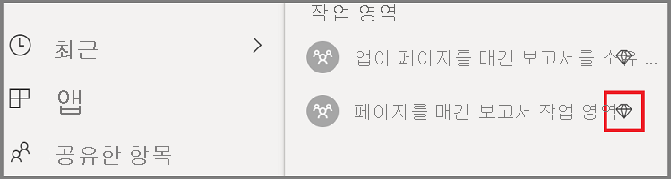

### <a name="create-and-publish-your-power-bi-paginated-reports"></a>페이지를 매긴 Power BI 보고서 만들기 및 게시

페이지를 매긴 보고서는 [Power BI Report Builder](../../paginated-reports/paginated-reports-report-builder-power-bi.md#create-reports-in-power-bi-report-builder)를 사용하여 만들 수 있습니다. 그런 다음 P1 이상의 용량에 할당된 앱 작업 영역에 [보고서를 업로드](../../paginated-reports/paginated-reports-quickstart-aw.md#upload-the-report-to-the-service)하고 [페이지를 매긴 보고서 워크로드](#enable-paginated-reports-workload)를 활성화할 수 있습니다. 보고서를 업로드하는 최종 사용자에게는 앱 작업 영역에 게시할 수 있는 Power BI Pro 라이선스가 있어야 합니다.
   
## <a name="embed-your-content-by-using-the-sample-application"></a>샘플 애플리케이션을 사용하여 콘텐츠 포함

이 샘플은 간단한 데모용으로 의도적으로 유지됩니다.

샘플 애플리케이션을 사용하여 콘텐츠 포함을 시작하려면 다음 단계를 수행합니다.

1. [Visual Studio](https://www.visualstudio.com/)(버전 2013 이상)를 다운로드합니다. 최신 [NuGet 패키지](https://www.nuget.org/profiles/powerbi)를 다운로드해야 합니다.

2. [PowerBI-Developer-Samples](https://github.com/Microsoft/PowerBI-Developer-Samples)를 다운로드하고 .NET Framework > 조직을 위해 포함 > integrate-web-app > **PBIWebApp**을 엽니다.

    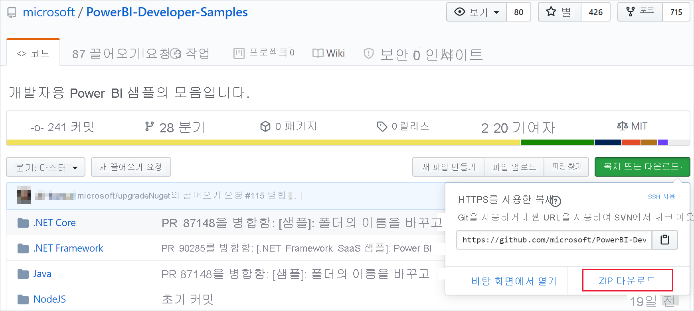

3. 샘플 애플리케이션에서 **Cloud.config** 파일을 열고, 다음 필드를 입력하여 애플리케이션을 실행합니다.
    * [애플리케이션 ID](#application-id)
    * [작업 영역 ID](#workspace-id)
    * [보고서 ID](#report-id)
    * [AADAuthorityUrl](#aadauthorityurl)

    

### <a name="application-id"></a>애플리케이션 ID

**Azure**의 **애플리케이션 ID**를 사용하여 **applicationId** 정보를 입력합니다. **applicationId**는 응용 프로그램에서 권한을 요청 중인 사용자에게 응용 프로그램을 인식시키는 데 사용됩니다.

**applicationId**를 가져오려면 다음 단계를 수행합니다.

1. [Azure Portal](https://portal.azure.com)에 로그인합니다.

2. 왼쪽 탐색 창에서 **모든 서비스**를 선택하고 **앱 등록**을 선택합니다.

3. **applicationId**가 필요한 응용 프로그램을 선택합니다.

    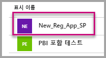

4. GUID로 나열된 **애플리케이션 ID**가 있습니다. 이 **응용 프로그램 ID**를 애플리케이션의 **applicationId**로 사용합니다.

    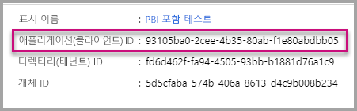

### <a name="workspace-id"></a>작업 영역 ID

Power BI의 앱 작업 영역(그룹) GUID를 사용하여 **workspaceId** 정보를 입력합니다. Power BI 서비스에 로그인하거나 PowerShell을 사용할 때 URL에서 이 정보를 가져올 수 있습니다.

URL <br>


PowerShell <br>

```powershell
Get-PowerBIworkspace -name "User Owns Embed Test"
```

   

### <a name="report-id"></a>보고서 ID

Power BI의 보고서 GUID를 사용하여 **reportId** 정보를 입력합니다. Power BI 서비스에 로그인하거나 PowerShell을 사용할 때 URL에서 이 정보를 가져올 수 있습니다.


PowerShell <br>

```powershell
Get-PowerBIworkspace -name "User Owns Embed Test" | Get-PowerBIReport -Name "Sales Paginated Report"
```


### <a name="aadauthorityurl"></a>AADAuthorityUrl

조직 테넌트 내에 포함하거나 게스트 사용자와 함께 포함할 수 있는 URL을 사용하여 **AADAuthorityUrl** 정보를 입력합니다.

조직 테넌트에 포함된 경우 URL( *https://login.microsoftonline.com/common/oauth2/authorize* )을 사용하세요.

게스트에 포함된 경우 *report-owner-tenant-id*를 대체하여 보고서 소유자의 테넌트 ID를 추가하는 URL( *https://login.microsoftonline.com/report-owner-tenant-id* )을 사용하세요.

### <a name="run-the-application"></a>애플리케이션 실행

1. **Visual Studio**에서 **실행**을 선택합니다.

    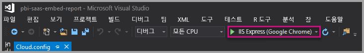

2. 그런 다음, **보고서 포함**을 선택합니다. 테스트하기 위해 선택한 콘텐츠(보고서, 대시보드 또는 타일)에 따라 애플리케이션에서 해당 옵션을 선택합니다.

    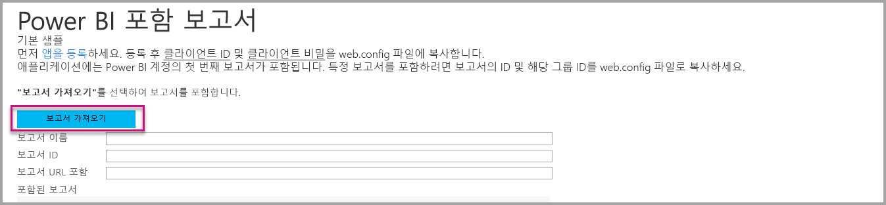

3. 이제 애플리케이션 예제에서 보고서를 볼 수 있습니다.

    

## <a name="next-steps"></a>다음 단계

이 자습서에서는 Power BI 조직 계정을 사용하여 애플리케이션에 페이지를 매긴 Power BI 보고서를 포함하는 방법을 배웠습니다. 

> [!div class="nextstepaction"]
> [앱에서 포함](embed-from-apps.md)

> [!div class="nextstepaction"]
>[고객용 Power BI 콘텐츠 포함](embed-sample-for-customers.md)

> [!div class="nextstepaction"]
>[고객을 위해 페이지를 매긴 Power BI 보고서 포함](embed-paginated-reports-customers.md)

추가 질문이 있는 경우 [Power BI 커뮤니티에 질문합니다](http://community.powerbi.com/).