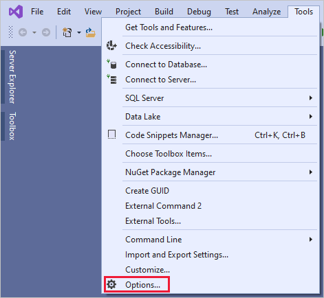

# <a name="embed-power-bi-content-with-service-principal-and-a-certificate"></a>서비스 주체 및 인증서를 사용하여 Power BI 콘텐츠 포함

인증서 기반 인증을 사용하면 Windows, Android 또는 iOS 디바이스의 클라이언트 인증서를 사용하여 Azure AD(Azure Active Directory)에서 인증을 받거나 [Azure Key Vault](https://docs.microsoft.com/azure/key-vault/basic-concepts)에 보관할 수 있습니다.

이 인증 방법을 사용하면 중앙에서 CA를 사용하여 순환 또는 해지를 위해 인증서를 관리할 수 있습니다.

Azure AD의 인증서에 대한 자세한 내용은 [클라이언트 자격 증명 흐름](https://github.com/AzureAD/microsoft-authentication-library-for-dotnet/wiki/Client-credential-flows) GitHub 페이지에서 확인할 수 있습니다.

## <a name="method"></a>메서드

1. [서비스 주체를 사용하여 콘텐츠를 포함](embed-service-principal.md)합니다.

2. [인증서를 만듭니다](embed-service-principal-certificate.md#step-2---create-a-certificate).

3. [인증서 인증을 설정](embed-service-principal-certificate.md#step-3---set-up-certificate-authentication)합니다.

4. [Azure Key Vault에서 인증서를 가져옵니다](embed-service-principal-certificate.md#step-4---get-the-certificate-from-azure-key-vault).

5. [서비스 주체 및 인증서를 사용하여 인증](embed-service-principal-certificate.md#step-5---authenticate-using-service-principal-and-a-certificate)합니다.

## <a name="step-1---embed-your-content-with-service-principal"></a>1단계 - 서비스 주체를 사용하여 콘텐츠 포함

서비스 주체를 사용하여 콘텐츠를 포함하려면 [서비스 주체 및 애플리케이션 암호를 사용하여 Power BI 콘텐츠 포함](embed-service-principal.md)의 지침을 따르세요.

>[!NOTE]
>서비스 주체를 사용하여 포함된 콘텐츠가 이미 있는 경우 이 단계를 건너뛰고 [2단계](embed-service-principal-certificate.md#step-2---create-a-certificate)로 진행합니다.

## <a name="step-2---create-a-certificate"></a>2단계 - 인증서 만들기

신뢰할 수 있는 ‘인증 기관’에서 인증서를 구하거나 인증서를 직접 생성할 수 있습니다.

이 섹션에서는 [Azure Key Vault](/azure/key-vault/create-certificate)를 사용하여 인증서를 만들고 공개 키가 포함된 *.cer* 파일을 다운로드하는 방법을 설명합니다.

1. [Microsoft Azure](https://ms.portal.azure.com/#allservices)에 로그인합니다.

2. **Key Vaults** 를 검색하고 **Key Vaults** 링크를 클릭합니다.

    

3. 인증서를 추가하려는 키 자격 증명 모음을 클릭합니다.

    

4. **인증서** 를 클릭합니다.

    

5. **생성/가져오기** 를 클릭합니다.

    

6. 다음과 같이 **인증서 만들기** 필드를 구성합니다.

    * **인증서를 만드는 방법** - 일반

    * **인증서 이름** - 인증서의 이름을 입력합니다.

    * **CA(인증 기관)의 유형** - 자체 서명된 인증서

    * **주체** - An [X.500](https://wikipedia.org/wiki/X.500) 고유 이름

    * **DNS 이름** - 0개의 DNS 이름

    * **유효 기간(개월)** - 인증서의 유효 기간 입력

    * **콘텐츠 형식** - PKCS #12

    * **수명 동작 유형** - 지정된 백분율 수명에 자동으로 갱신

    * **백분율 수명** - 80

    * **고급 정책 구성** - 구성되지 않음

7. **만들기** 를 클릭합니다. 새로 만든 인증서는 기본적으로 사용되지 않도록 설정되어 있습니다. 사용하도록 설정하는 데 최대 5분이 걸릴 수 있습니다.

8. 만든 인증서를 선택합니다.

9. **CER 형식으로 다운로드** 를 클릭합니다. 다운로드한 파일에는 공개 키가 들어 있습니다.

    

## <a name="step-3---set-up-certificate-authentication"></a>3단계 - 인증서 인증 설정

1. Azure AD 애플리케이션에서 **인증서 및 암호** 탭을 클릭합니다.

     

2. **인증서 업로드** 를 클릭하고 이 자습서의 [2단계](#step-2---create-a-certificate)에서 만들고 다운로드한 *.cer* 파일을 업로드합니다. *.cer* 파일에는 공개 키가 들어 있습니다.

## <a name="step-4---get-the-certificate-from-azure-key-vault"></a>4단계 - Azure Key Vault에서 인증서 가져오기

MSI(관리 서비스 ID)를 사용하여 Azure Key Vault에서 인증서를 가져옵니다. 이 프로세스에는 퍼블릭 키와 프라이빗 키가 둘 다 들어 있는 *.pfx* 인증서를 가져오는 과정이 포함됩니다.

Azure Key Vault에서 인증서를 읽는 방법에 대한 코드 예제를 참조하세요. Visual Studio를 사용하려면 [MSI를 사용하도록 Visual Studio 구성](#configure-visual-studio-to-use-msi)을 참조하세요.

```csharp
private X509Certificate2 ReadCertificateFromVault(string certName)
{
    var serviceTokenProvider = new AzureServiceTokenProvider();
    var keyVaultClient = new KeyVaultClient(new KeyVaultClient.AuthenticationCallback(serviceTokenProvider.KeyVaultTokenCallback));
    CertificateBundle certificate = null;
    SecretBundle secret = null;
    try
    {
        certificate = keyVaultClient.GetCertificateAsync($"https://{KeyVaultName}.vault.azure.net/", certName).Result;
        secret = keyVaultClient.GetSecretAsync(certificate.SecretIdentifier.Identifier).Result;
    }
    catch (Exception)
    {
        return null;
    }

    return new X509Certificate2(Convert.FromBase64String(secret.Value));
}
```

## <a name="step-5---authenticate-using-service-principal-and-a-certificate"></a>5단계 - 서비스 주체 및 인증서를 사용하여 인증

Azure Key Vault에 연결하여 Azure Key Vault에 저장된 인증서 및 서비스 주체를 사용하여 앱을 인증할 수 있습니다.

Azure Key Vault에서 인증서를 연결하고 읽으려면 아래 코드를 참조하세요.

>[!NOTE]
>조직에서 만든 인증서가 이미 있는 경우 Azure Key Vault에 *.pfx* 파일을 업로드합니다.

```csharp
// Preparing needed variables
var Scope = "https://analysis.windows.net/powerbi/api/.default"
var ApplicationId = "{YourApplicationId}"
var tenantSpecificURL = "https://login.microsoftonline.com/{YourTenantId}/"
X509Certificate2 certificate = ReadCertificateFromVault(CertificateName);

// Authenticating with a SP and a certificate
public async Task<AuthenticationResult> DoAuthentication(){
    IConfidentialClientApplication clientApp = null;
    clientApp = ConfidentialClientApplicationBuilder.Create(ApplicationId)
                                                    .WithCertificate(certificate)
                                                    .WithAuthority(tenantSpecificURL)
                                                    .Build();
    try
    {
        authenticationResult = await clientApp.AcquireTokenForClient(Scope).ExecuteAsync();
    }
    catch (MsalException)
    {
        throw;
    }
    return authenticationResult
}
```

## <a name="configure-visual-studio-to-use-msi"></a>MSI를 사용하도록 Visual Studio 구성

포함된 솔루션을 만들 때 MSI(관리 서비스 ID)를 사용하도록 Visual Studio를 구성하는 것이 유용할 수 있습니다. [MSI](/azure/active-directory/managed-identities-azure-resources/overview)는 Azure AD ID를 관리할 수 있는 기능입니다. 구성된 후에는 Visual Studio가 Azure Key Vault에 대해 인증을 수행하도록 합니다.

1. Visual Studio에서 새 프로젝트를 엽니다.

2. **도구** > **옵션** 을 클릭합니다.

     

3. **계정 선택** 를 검색하고 **계정 선택** 을 클릭합니다.

    

4. Azure Key Vault에 대한 액세스 권한이 있는 계정을 추가합니다.

## <a name="next-steps"></a>다음 단계

>[!div class="nextstepaction"]
>[앱 등록](register-app.md)

> [!div class="nextstepaction"]
>[고객을 위한 Power BI Embedded](embed-sample-for-customers.md)

>[!div class="nextstepaction"]
>[Azure Active Directory의 애플리케이션 및 서비스 주체 개체](/azure/active-directory/develop/app-objects-and-service-principals)

>[!div class="nextstepaction"]
>[서비스 주체가 있는 온-프레미스 데이터 게이트웨이를 사용하는 행 수준 보안](embedded-row-level-security.md#on-premises-data-gateway-with-service-principal)