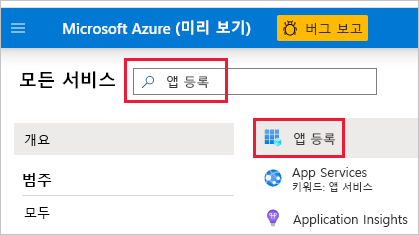
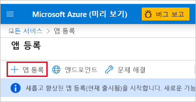
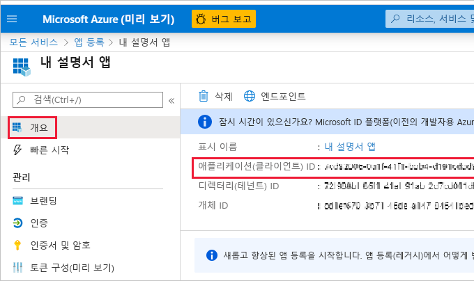
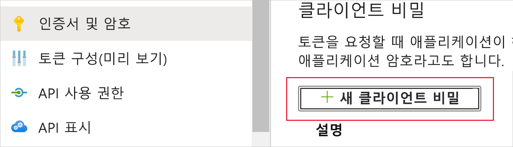
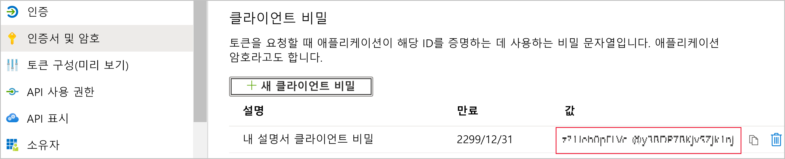

# <a name="embed-power-bi-content-with-service-principal-and-an-application-secret"></a>서비스 주체 및 애플리케이션 암호를 사용하여 Power BI 콘텐츠 포함

서비스 주체는 Azure AD 애플리케이션이 콘텐츠 및 API Power BI 서비스에 액세스하도록 하는 데 사용할 수 있는 인증 방법입니다.

Azure AD(Azure Active Directory) 앱을 만들 때 [서비스 주체 개체](/azure/active-directory/develop/app-objects-and-service-principals#service-principal-object)가 만들어집니다. 서비스 주체 개체(*서비스 주체* 라고도 함)는 Azure AD가 앱을 인증하도록 합니다. 인증된 앱은 Azure AD 테넌트 리소스에 액세스할 수 있습니다.

인증을 위해 서비스 주체는 Azure AD 앱의 *애플리케이션 ID* 와 다음 중 하나를 사용합니다.

* 인증서
* 애플리케이션 암호

이 문서에서는 *애플리케이션 ID* 및 *애플리케이션 암호* 를 사용한 서비스 주체 인증에 대해 설명합니다.

>[!NOTE]
>Azure AD에서는 비밀 키가 아닌 인증서를 사용하여 백 엔드 서비스를 보호하는 것이 좋습니다.
>* [비밀 키 또는 인증서를 사용하여 Azure AD에서 액세스 토큰을 가져오는 방법에 대해 자세히 알아보세요.](/azure/architecture/multitenant-identity/client-assertion)
>* 인증서를 사용하여 솔루션을 보호하려면 이 문서의 지침을 완료한 후 [서비스 주체 및 인증서를 사용하여 Power BI 콘텐츠 포함](embed-service-principal-certificate.md)에 설명된 단계를 따르세요.

## <a name="method"></a>메서드

서비스 주체 및 애플리케이션 ID 임베디드 분석을 사용하려면 다음 단계를 수행합니다.

1. [Azure AD 앱](/azure/active-directory/manage-apps/what-is-application-management)을 만듭니다.

    1. Azure AD 앱의 암호를 만듭니다.
    
    2. 앱의 *애플리케이션 ID* 및 *애플리케이션 암호* 를 가져옵니다.

    >[!NOTE]
    >이들 단계는 **1단계** 에 설명되어 있습니다. Azure AD 앱을 만드는 방법에 대한 자세한 내용은 [Azure AD 앱 만들기](/azure/active-directory/develop/howto-create-service-principal-portal) 문서를 참조하세요.

2. Azure AD 보안 그룹을 만듭니다.

3. Power BI 서비스 관리자 설정을 사용하도록 설정합니다.

4. 작업 영역에 서비스 주체를 추가합니다.

5. 콘텐츠를 포함합니다.

> [!IMPORTANT]
> 서비스 주체를 Power BI와 함께 사용하도록 설정하면 애플리케이션의 AD 사용 권한이 더 이상 적용되지 않습니다. 애플리케이션 사용 권한은 Power BI 관리 포털을 통해 관리됩니다.

## <a name="step-1---create-an-azure-ad-app"></a>1단계 - Azure AD 앱 만들기

다음 방법 중 하나를 사용하여 Azure AD 앱을 만듭니다.

* [Microsoft Azure Portal에서 앱 만들기](embed-service-principal.md#creating-an-azure-ad-app-in-the-microsoft-azure-portal)

* [PowerShell을 사용하여 앱 만들기](embed-service-principal.md#creating-an-azure-ad-app-using-powershell)

### <a name="creating-an-azure-ad-app-in-the-microsoft-azure-portal"></a>Microsoft Azure Portal에서 Azure AD 앱 만들기

1. [Microsoft Azure](https://ms.portal.azure.com/#allservices)에 로그인합니다.

2. **앱 등록** 을 검색하고 **앱 등록** 링크를 클릭합니다.

    

3. **새 등록** 을 클릭합니다.

    

4. 필수 정보를 입력합니다.
    * **이름** - 애플리케이션의 이름을 입력합니다.
    * **지원되는 계정 유형** - 지원되는 계정 유형을 선택합니다.
    * (선택 사항) **리디렉션 URI** - 필요한 경우 URI를 입력합니다.

5. **등록** 을 클릭합니다.

6. 등록한 후에는 **개요** 탭에서 *애플리케이션 ID* 를 확인할 수 있습니다. 나중에 사용할 수 있도록 *애플리케이션 ID* 를 복사하여 저장합니다.

    

7. **인증서 및 암호** 탭을 클릭합니다.

     

8. **새 클라이언트 암호** 를 클릭합니다.

    

9. *클라이언트 암호 추가* 창에서 설명을 입력하고, 클라이언트 암호의 만료 시기를 지정하고, **추가** 를 클릭합니다.

10. *클라이언트 암호* 값을 복사하여 저장합니다.

    

    >[!NOTE]
    >이 창을 벗어나면 클라이언트 암호 값이 숨겨져 다시 보거나 복사할 수 없게 됩니다.

### <a name="creating-an-azure-ad-app-using-powershell"></a>PowerShell을 사용하여 Azure AD 앱 만들기

이 섹션에는 [PowerShell](/powershell/azure/create-azure-service-principal-azureps)을 사용하여 새 Azure AD 앱을 만드는 샘플 스크립트가 포함되어 있습니다.

```powershell
# The app ID - $app.appid
# The service principal object ID - $sp.objectId
# The app key - $key.value

# Sign in as a user that's allowed to create an app
Connect-AzureAD

# Create a new Azure AD web application
$app = New-AzureADApplication -DisplayName "testApp1" -Homepage "https://localhost:44322" -ReplyUrls "https://localhost:44322"

# Creates a service principal
$sp = New-AzureADServicePrincipal -AppId $app.AppId

# Get the service principal key
$key = New-AzureADServicePrincipalPasswordCredential -ObjectId $sp.ObjectId
```

## <a name="step-2---create-an-azure-ad-security-group"></a>2단계 - Azure AD 보안 그룹 만들기

현재 서비스 주체에는 Power BI 콘텐츠 및 API에 대한 액세스 권한이 없습니다. 서비스 주체에 액세스 권한을 부여하려면 Azure AD에서 보안 그룹을 만들고 사용자가 만든 서비스 주체를 해당 보안 그룹에 추가합니다.

Azure AD 보안 그룹을 만드는 방법에는 두 가지가 있습니다.
* [수동으로(Azure에서)](embed-service-principal.md#create-a-security-group-manually)
* [PowerShell 사용](embed-service-principal.md#create-a-security-group-using-powershell)

### <a name="create-a-security-group-manually"></a>수동으로 보안 그룹 만들기

수동으로 Azure 보안 그룹을 만들려면 [Azure Active Directory를 사용하여 기본 그룹 만들기 및 멤버 추가](/azure/active-directory/fundamentals/active-directory-groups-create-azure-portal) 문서에 있는 지침을 따르세요. 

### <a name="create-a-security-group-using-powershell"></a>PowerShell을 사용하여 보안 그룹 만들기

다음은 새 보안 그룹을 만들고 이 보안 그룹에 앱을 추가하는 샘플 스크립트입니다.

>[!NOTE]
>전체 조직에 대해 서비스 주체 액세스를 사용하도록 설정하려면 이 단계를 건너뜁니다.

```powershell
# Required to sign in as admin
Connect-AzureAD

# Create an Azure AD security group
$group = New-AzureADGroup -DisplayName <Group display name> -SecurityEnabled $true -MailEnabled $false -MailNickName notSet

# Add the service principal to the group
Add-AzureADGroupMember -ObjectId $($group.ObjectId) -RefObjectId $($sp.ObjectId)
```

## <a name="step-3---enable-the-power-bi-service-admin-settings"></a>3단계 - Power BI 서비스 관리자 설정 사용

Azure AD 앱이 Power BI 콘텐츠 및 API에 액세스할 수 있도록 Power BI 관리자는 Power BI 관리 포털에서 서비스 사용자 액세스를 사용하도록 설정해야 합니다.

Azure AD에서 만든 보안 그룹을 **개발자 설정** 의 특정 보안 그룹 섹션에 추가합니다.

>[!IMPORTANT]
>서비스 주체는 사용하도록 설정된 모든 테넌트 설정에 액세스할 수 있습니다. 관리자 설정에 따라 여기에는 특정 보안 그룹 또는 전체 구성이 포함됩니다.
>
>특정 테넌트 설정에 대한 서비스 주체 액세스를 제한하려면 특정 보안 그룹에만 액세스를 허용합니다. 또는 서비스 주체에 대한 전용 보안 그룹을 만들고 원하는 테넌트 설정에서 제외할 수 있습니다.

>[!div class="mx-imgBorder"]
>:::image type="content" source="media/embed-service-principal/admin-portal.png" alt-text="Power BI 서비스의 관리 옵션에서 개발자 설정을 보여 주는 스크린샷":::

## <a name="step-4---add-the-service-principal-to-your-workspace"></a>4단계 - 작업 영역에 서비스 주체 추가

Azure AD 앱이 Power BI 서비스의 보고서, 대시보드, 데이터 세트와 같은 아티팩트에 액세스할 수 있도록 하려면 서비스 주체 엔터티 또는 서비스 주체를 포함하는 보안 그룹을 작업 영역에 멤버 또는 관리자로 추가합니다.

>[!NOTE]
>이 섹션에서는 UI 지침을 제공합니다. [그룹 - 그룹 사용자 추가 API](/rest/api/power-bi/groups/addgroupuser)를 사용하여 작업 영역에 서비스 주체 또는 보안 그룹을 추가할 수도 있습니다.

1. 액세스를 사용하도록 설정할 작업 영역으로 스크롤한 다음 **자세히** 메뉴에서 **작업 영역 액세스** 를 선택합니다.

    :::image type="content" source="media/embed-service-principal/workspace-access.png" alt-text="Power BI 작업 영역의 추가 메뉴에 있는 작업 영역 액세스 단추를 보여주는 스크린샷.":::

2. **액세스** 창에서 텍스트 상자에 다음 중 하나를 추가합니다.

    * **서비스 주체** 서비스 주체의 이름은 Azure AD 앱의 개요 탭에 표시되는 Azure AD 앱의 *표시 이름* 입니다.

    * 서비스 주체를 포함하는 **보안 그룹**

3. 드롭다운 메뉴에서 **멤버** 또는 **관리자** 를 선택합니다.

4. **추가** 를 선택합니다.

## <a name="step-5---embed-your-content"></a>5단계: 콘텐츠 포함

자체 애플리케이션 또는 [애플리케이션 예제 내에 콘텐츠를 포함](embed-sample-for-customers.md)할 수 있습니다.

콘텐츠가 포함되면 [프로덕션으로 이동](move-to-production.md)할 준비가 된 것입니다.

>[!NOTE]
>인증서를 사용하여 콘텐츠를 보호하려면 [서비스 주체 및 인증서를 사용하여 Power BI 콘텐츠 포함](embed-service-principal-certificate.md)에 설명된 단계를 따르세요.

## <a name="considerations-and-limitations"></a>고려 사항 및 제한 사항

* 서비스 주체는 [새 작업 영역](../../collaborate-share/service-create-the-new-workspaces.md)에서만 작동합니다.
* 서비스 주체 사용 시 **내 작업 영역** 이 지원되지 않습니다.
* 프로덕션으로 이동 시 용량이 필요합니다.
* 서비스 주체를 사용하여 Power BI 포털에 로그인할 수 없습니다.
* Power BI 관리자 권한은 Power BI 관리 포털의 개발자 설정에서 서비스 주체를 활성화하는 데 필요합니다.
* [조직에 대해 포함](embed-sample-for-your-organization.md) 애플리케이션은 서비스 주체를 사용할 수 없습니다.
* [데이터 흐름](../../transform-model/dataflows/dataflows-introduction-self-service.md) 관리는 지원되지 않습니다.
* 서비스 주체는 현재 모든 관리 API를 지원하지 않습니다.
* [Azure Analysis Services](/azure/analysis-services/analysis-services-overview) 데이터 원본과 함께 서비스 주체를 사용하는 경우 서비스 주체 자체에 Azure Analysis Services 인스턴스 권한이 있어야 합니다. 서비스 주체가 포함된 보안 그룹을 이 목적으로 사용할 수는 없습니다.

## <a name="next-steps"></a>다음 단계

>[!div class="nextstepaction"]
>[앱 등록](register-app.md)

> [!div class="nextstepaction"]
>[고객을 위한 Power BI Embedded](embed-sample-for-customers.md)

>[!div class="nextstepaction"]
>[서비스 주체와 인증서를 사용하여 포함](embed-service-principal-certificate.md)

>[!div class="nextstepaction"]
>[Azure Active Directory의 애플리케이션 및 서비스 주체 개체](/azure/active-directory/develop/app-objects-and-service-principals)

>[!div class="nextstepaction"]
>[서비스 주체가 있는 온-프레미스 데이터 게이트웨이를 사용하는 행 수준 보안](embedded-row-level-security.md#on-premises-data-gateway-with-service-principal)