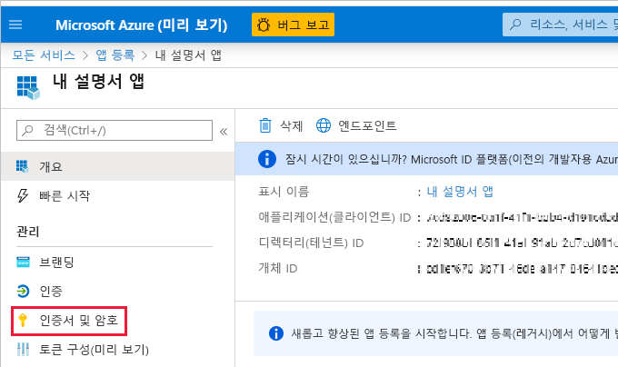

# <a name="embed-power-bi-content-with-service-principal-and-an-application-secret"></a>서비스 주체 및 애플리케이션 암호를 사용하여 Power BI 콘텐츠 포함

[!INCLUDE[service principal overview](../../includes/service-principal-overview.md)]

이 문서에서는 *애플리케이션 ID* 및 *애플리케이션 암호* 를 사용한 서비스 주체 인증에 대해 설명합니다.

>[!NOTE]
>비밀 키가 아닌 인증서를 사용하여 백 엔드 서비스를 보호하는 것이 좋습니다.
>* [비밀 키 또는 인증서를 사용하여 Azure AD에서 액세스 토큰을 가져오는 방법에 대해 자세히 알아보세요.](/azure/architecture/multitenant-identity/client-assertion)
>* [서비스 주체 및 인증서를 사용하여 Power BI 콘텐츠 포함](embed-service-principal-certificate.md)

## <a name="method"></a>메서드

서비스 주체 및 애플리케이션 ID를 포함된 분석과 함께 사용하려면 다음 단계를 수행합니다.

1. [Azure AD 앱](/azure/active-directory/manage-apps/what-is-application-management)을 만듭니다.

    1. Azure AD 앱의 암호를 만듭니다.
    
    2. 앱의 *애플리케이션 ID* 및 *애플리케이션 암호* 를 가져옵니다.

    >[!NOTE]
    >이들 단계는 **1단계** 에 설명되어 있습니다. Azure AD 앱을 만드는 방법에 대한 자세한 내용은 [Azure AD 앱 만들기](/azure/active-directory/develop/howto-create-service-principal-portal) 문서를 참조하세요.

2. Azure AD 보안 그룹을 만듭니다.

3. Power BI 서비스 관리자 설정을 사용하도록 설정합니다.

4. 작업 영역에 서비스 주체를 추가합니다.

5. 콘텐츠를 포함합니다.

> [!IMPORTANT]
> 서비스 주체를 Power BI와 함께 사용하도록 설정하면 애플리케이션의 AD 사용 권한이 더 이상 적용되지 않습니다. 애플리케이션 사용 권한은 Power BI 관리 포털을 통해 관리됩니다.

## <a name="step-1---create-an-azure-ad-app"></a>1단계 - Azure AD 앱 만들기

다음 방법 중 하나를 사용하여 Azure AD 앱을 만듭니다.

* [Microsoft Azure Portal](https://portal.azure.com/#allservices)에서 앱 만들기

* [PowerShell](/powershell/azure/create-azure-service-principal-azureps)을 사용하여 앱을 만듭니다.

### <a name="creating-an-azure-ad-app-in-the-microsoft-azure-portal"></a>Microsoft Azure Portal에서 Azure AD 앱 만들기

[!INCLUDE[service create app](../../includes/service-principal-create-app.md)]

7. **인증서 및 암호** 탭을 클릭합니다.

     


8. **새 클라이언트 암호** 를 클릭합니다.

    

9. *클라이언트 암호 추가* 창에서 설명을 입력하고, 클라이언트 암호의 만료 시기를 지정하고, **추가** 를 클릭합니다.

10. *클라이언트 암호* 값을 복사하여 저장합니다.

    

    >[!NOTE]
    >이 창을 벗어나면 클라이언트 암호 값이 숨겨져 다시 보거나 복사할 수 없게 됩니다.

### <a name="creating-an-azure-ad-app-using-powershell"></a>PowerShell을 사용하여 Azure AD 앱 만들기

이 섹션에는 [PowerShell](/powershell/azure/create-azure-service-principal-azureps)을 사용하여 새 Azure AD 앱을 만드는 샘플 스크립트가 포함되어 있습니다.

```powershell
# The app ID - $app.appid
# The service principal object ID - $sp.objectId
# The app key - $key.value

# Sign in as a user that's allowed to create an app
Connect-AzureAD

# Create a new Azure AD web application
$app = New-AzureADApplication -DisplayName "testApp1" -Homepage "https://localhost:44322" -ReplyUrls "https://localhost:44322"

# Creates a service principal
$sp = New-AzureADServicePrincipal -AppId $app.AppId

# Get the service principal key
$key = New-AzureADServicePrincipalPasswordCredential -ObjectId $sp.ObjectId
```
[!INCLUDE[service create steps two, three and four](../../includes/service-principal-create-steps.md)]

## <a name="step-5---embed-your-content"></a>5단계: 콘텐츠 포함

샘플 애플리케이션 또는 자체 애플리케이션 내에 콘텐츠를 포함할 수 있습니다.

* [샘플 애플리케이션을 사용하여 콘텐츠 포함](embed-sample-for-customers.md#embed-content-using-the-sample-application)
* [애플리케이션 내에서 콘텐츠 포함](embed-sample-for-customers.md#embed-content-within-your-application)

콘텐츠가 포함되면 [프로덕션으로 이동](embed-sample-for-customers.md#move-to-production)할 준비가 된 것입니다.

[!INCLUDE[service principal limitations](../../includes/service-principal-limitations.md)]

## <a name="next-steps"></a>다음 단계

>[!div class="nextstepaction"]
>[앱 등록](register-app.md)

> [!div class="nextstepaction"]
>[고객을 위한 Power BI Embedded](embed-sample-for-customers.md)

>[!div class="nextstepaction"]
>[Azure Active Directory의 애플리케이션 및 서비스 주체 개체](/azure/active-directory/develop/app-objects-and-service-principals)

>[!div class="nextstepaction"]
>[서비스 주체가 있는 온-프레미스 데이터 게이트웨이를 사용하는 행 수준 보안](embedded-row-level-security.md#on-premises-data-gateway-with-service-principal)

>[!div class="nextstepaction"]
>[서비스 주체 및 인증서를 사용하여 Power BI 콘텐츠 포함](embed-service-principal-certificate.md)