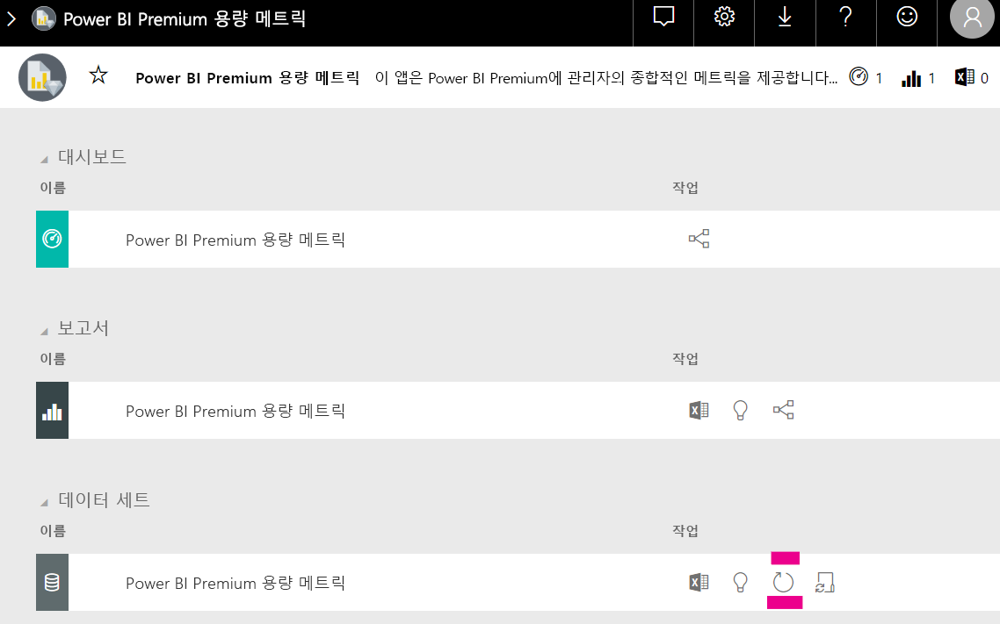

# Power BI Embedded 분석의 용량 계획

Power BI Embedded 분석 배포에 필요한 용량의 유형을 계산하는 작업은 복잡할 수 있습니다. 이 계산이 일부는 예측이 어려운 여러 매개 변수를 기준으로 하기 때문입니다.

용량을 계획할 때 고려해야 할 몇 가지 사항은 다음과 같습니다.

* 사용 중인 데이터 모델
* 필요한 쿼리의 수 및 복잡성
* 애플리케이션 사용량의 시간별 분포
* 데이터 새로 고침 속도
* 예측하기 어려운 추가 사용 패턴입니다.

이 문서는 Power BI Embedded 분석 용량(*A*, *EM* 또는 *P* SKU)에 대한 부하 테스트를 자동화하기 위해 만들어진 [Power BI 용량 부하 평가 도구](https://github.com/microsoft/PowerBI-Tools-For-Capacities/tree/master/LoadTestingPowerShellTool/)를 도입하여 Power BI Embedded 분석을 위한 용량 계획을 보다 쉽게 수행하도록 하기 위해 작성되었습니다.

## 계획 도구

 [Power BI 용량 부하 평가 도구](https://github.com/microsoft/PowerBI-Tools-For-Capacities/tree/master/LoadTestingPowerShellTool/)는 용량이 처리할 수 있는 사용자 부하의 양을 이해하는 데 유용합니다. PowerShell을 사용하여 용량에 대해 자동화된 부하 테스트를 만들고 테스트할 보고서와 시뮬레이트할 동시 사용자 수를 선택할 수 있습니다.

이 도구는 서비스에 대해 도구를 인증하는 데 필요한 토큰이 만료될 때까지 새 필터 값을 사용하여 각 보고서를 지속적으로 렌더링함으로써 용량에 부하를 생성합니다. 이를 통해 보고서 캐싱으로 인한 비현실적으로 성능 증가를 방지합니다.

### 계획 도구 사용

이 도구를 실행하는 경우 용량에 대한 기존 부하를 염두에 두어야 하며, 상위 사용 시간 동안 부하 테스트를 실행하지 않도록 해야 합니다.

다음은 계획 도구를 사용하는 방법에 대한 몇 가지 예입니다.

* 용량 관리자는 지정된 시간 프레임 내에 용량이 처리할 수 있는 사용자 수를 보다 잘 이해할 수 있습니다.
* 보고서 작성자는 Power BI 데스크톱의 [성능 분석기](../../create-reports/desktop-performance-analyzer.md)를 통해 측정한 사용자 부하 효과를 이해할 수 있습니다.
* 브라우저에서 실시간으로 렌더링이 발생하는 것을 볼 수 있습니다.
* SQL Server Profiler를 사용하여 측정된 용량의 [XMLA 엔드포인트에 연결](https://powerbi.microsoft.com/blog/power-bi-open-platform-connectivity-with-xmla-endpoints-public-preview/)하여 실행되는 쿼리를 볼 수 있습니다.
* 부하 테스트 효과는 Premium 용량 메트릭 앱의 데이터 세트 페이지에 표시됩니다. 용량 관리자는 이 도구를 사용하여 부하를 생성하고 해당 로드가 어떻게 표시되는지 확인할 수 있습니다.

### 테스트 결과 검토

테스트를 실행한 후 메트릭 앱에서 부하 테스트의 효과를 확인하려면 아래 지침을 따르세요. 테스트가 부하를 생성하기 시작할 때부터 부하가 메트릭에 표시될 때까지 최대 15분 정도 지연될 수 있습니다.

1. [메트릭 앱](../../admin/service-admin-premium-monitor-capacity.md) 방문 페이지의 **데이터 세트** 탭을 확장합니다.
2. **지금 새로 고침** 을 클릭하여 요청 시 새로 고침을 시작합니다. 관리자가 이 작업을 수행해야 합니다.

    

## Power BI 용량 도구 GitHub 리포지토리

용량 계획 도구 및 기타 향후 도구와 유틸리티를 호스트하도록 [Power BI 용량 도구 GitHub 리포지토리](https://github.com/microsoft/PowerBI-Tools-For-Capacities)를 만들었습니다.

리포지토리는 오픈 소스이며 사용자는 참여하고, Power BI Premium 및 Embedded 용량과 관련된 추가 도구를 추가하고, 기존 항목을 개선하는 것이 좋습니다.

## 다음 단계

> [!div class="nextstepaction"]
>[Power BI Embedded 분석의 용량 및 SKU](embedded-capacity.md)

> [!div class="nextstepaction"]
>[Power BI Embedded 성능 모범 사례](embedded-performance-best-practices.md)