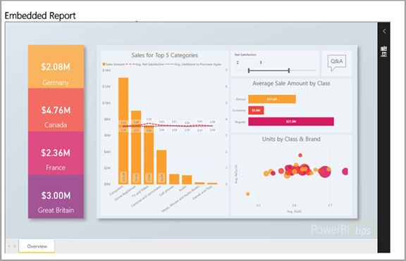

# Power BI를 사용한 임베디드 분석

Power BI 서비스(SaaS) 및 Azure의 Power BI Embedded(PaaS)에는 대시보드 및 보고서 포함을 위한 API가 있습니다. 콘텐츠 포함 시 이 API를 사용하여 대시보드, 게이트웨이, 작업 영역 등의 최신 Power BI 기능에 액세스할 수 있습니다.

[포함 설정 도구](https://aka.ms/embedsetup)를 통해 신속하게 시작하고 샘플 애플리케이션을 다운로드할 수 있습니다.

사용자에게 적합한 솔루션을 선택합니다.

* [조직에 대한 콘텐츠를 포함하면](embedding.md#embedding-for-your-organization) Power BI 서비스를 확장할 수 있습니다. 이렇게 하려면 [조직에 대한 콘텐츠 포함](https://aka.ms/embedsetup/UserOwnsData) 솔루션을 구현합니다.
* [고객에 대한 콘텐츠 포함](embedding.md#embedding-for-your-customers)을 통해 Power BI 계정이 없는 사용자에게 대시보드 및 보고서를 포함할 수 있습니다. 이렇게 하려면 [고객에 대한 콘텐츠 포함](https://aka.ms/embedsetup/AppOwnsData) 솔루션을 구현합니다.

## API 사용

Power BI 콘텐츠를 포함하는 두 가지 주요 시나리오가 있습니다.
- 조직의 사용자(Power BI 라이선스가)를 위한 포함. 
 
- Power BI 라이선스 없이 사용자 및 고객을 위한 포함. 

두 시나리오 모두에 [Power BI REST API](/rest/api/power-bi/)를 사용할 수 있습니다.

Power BI 라이선스가 없는 고객 및 사용자의 경우 조직 또는 고객에게 서비스를 제공할 때 사용하는 것과 동일한 API를 사용하여 대시보드 및 보고서를 사용자 지정 애플리케이션에 포함할 수 있습니다. 고객은 애플리케이션 관리 데이터를 볼 수 있습니다. 또한 조직의 Power BI 사용자는 Power BI에서 직접 또는 포함된 애플리케이션의 컨텍스트에서 *해당 데이터* 를 볼 수 있는 추가 옵션을 가지고 있습니다. 포함 필요에 따라 JavaScript 및 REST API를 완벽하게 활용할 수 있습니다.

포함 작동 방식을 이해하려면 [JavaScript 포함 샘플](https://microsoft.github.io/PowerBI-JavaScript/demo/)을 참조하세요.

## 조직에 대한 콘텐츠 포함

**조직에 대한 콘텐츠를 포함하면** Power BI 서비스를 확장할 수 있습니다. 이 유형의 임베딩은 애플리케이션의 사용자가 콘텐츠를 보기 위해 Power BI 서비스에 로그인해야 합니다. 조직 내 사용자가 로그인하면 본인이 소유하거나 Power BI 서비스에서 사용자가 공유한 대시보드 및 보고서에만 액세스할 수 있습니다.

조직 포함 예제에는 [SharePoint Online](https://powerbi.microsoft.com/blog/integrate-power-bi-reports-in-sharepoint-online/), [Microsoft Teams 통합(관리자 권한 필요)](https://powerbi.microsoft.com/blog/power-bi-teams-up-with-microsoft-teams/) 및 [Microsoft Dynamics](/dynamics365/customer-engagement/basics/add-edit-power-bi-visualizations-dashboard)와 같은 내부 애플리케이션이 포함됩니다.

조직에 대한 콘텐츠를 포함하려면 [자습서: 조직의 애플리케이션에 Power BI 콘텐츠 포함](embed-sample-for-your-organization.md)을 참조하세요.

편집, 저장 등과 같은 셀프 서비스 기능은 Power BI 사용자에 대해 포함하는 경우 [JavaScript API](https://github.com/Microsoft/PowerBI-JavaScript)를 통해 사용할 수 있습니다.

[포함 설정 도구](https://aka.ms/embedsetup/UserOwnsData)를 통해 조직에 대한 보고서를 통합하는 방법을 설명하는 샘플 애플리케이션을 시작 및 다운로드할 수 있습니다.

## 고객에 대한 콘텐츠 포함

**고객에 대한 콘텐츠 포함** 을 통해 Power BI 계정이 없는 사용자에게 대시보드 및 보고서를 포함할 수 있습니다. 이 유형의 포함은 *Power BI Embedded* 라고도 합니다.

[Power BI Embedded](azure-pbie-what-is-power-bi-embedded.md)는 ISV(독립 소프트웨어 공급 업체) 및 개발자가 애플리케이션에 시각적 개체, 보고서 및 대시보드를 신속하게 추가하는 **Microsoft Azure** 서비스입니다. 이 포함은 용량 기반 시간별 미러링 모델을 통해 수행됩니다.

Power BI Embedded에는 ISV, 해당 개발자 및 고객에 대한 혜택이 있습니다. 예를 들어 ISV는 Power BI Desktop을 사용하여 시각적 개체를 무료로 만들 수 있습니다. 시각적 개체 분석 개발 노력을 최소화함으로써 ISV는 시장 출시 시간을 단축하고 차별화된 데이터 환경을 통해 경쟁사와 차별화할 수 있습니다. ISV는 임베디드 분석을 사용하여 만든 추가 값에 대해 프리미엄 요금을 청구하는 것을 선택할 수도 있습니다.

Power BI Embedded에서 고객은 Power BI에 대해 알 필요가 없습니다. 두 가지 방법을 사용하여 포함된 애플리케이션을 만들 수 있습니다.
- Power BI Pro 계정 
- 서비스 사용자 

Power BI Pro 계정은 애플리케이션의 마스터 계정으로 작동합니다(프록시 계정으로 간주). 이 계정을 사용하면 애플리케이션의 Power BI 대시보드 및 보고서에 대한 액세스를 제공하는 포함 토큰을 생성할 수 있습니다.

[서비스 주체](embed-service-principal.md)는 **앱 전용** 토큰을 사용하여 Power BI 콘텐츠를 애플리케이션에 포함할 수 있습니다. 또한 애플리케이션의 Power BI 대시보드 및 보고서에 대한 액세스를 제공하는 포함 토큰을 생성할 수 있습니다.

Power BI Embedded를 사용하는 개발자는 시각적 개체 및 분석 개발에 시간을 소비하는 대신 애플리케이션의 핵심 기능을 빌드하는 데 시간을 할애할 수 있습니다. 고객 보고서 및 대시보드 요구 사항을 신속하게 충족하고 완전히 문서화된 API 및 SDK를 사용하여 쉽게 포함할 수 있습니다. 앱에서 탐색하기 쉬운 데이터 탐색을 설정하여 ISV를 사용하면 고객이 모든 디바이스에서 상황에 맞는 신속한 데이터 기반 결정을 내릴 수 있습니다.

> [!IMPORTANT]
> 포함에는 Power BI 서비스가 필요하지만 고객은 애플리케이션의 포함된 콘텐츠를 보기 위해 Power BI 계정이 필요하지 않습니다.

프로덕션으로 이동할 준비가 되면 용량에 작업 영역을 할당해야 합니다. Microsoft Azure에서 애플리케이션에 사용할 [Power BI Embedded 용량을 만듭니다](azure-pbie-create-capacity.md).

포함 세부 정보는 [Power BI 콘텐츠를 포함하는 방법](embed-sample-for-customers.md)을 참조하세요.

## 다음 단계

이제 Power BI 콘텐츠를 애플리케이션에 포함하거나 고객에 대한 Power BI 콘텐츠를 포함할 수 있습니다.

> [!div class="nextstepaction"]
> [조직에 포함](embed-sample-for-your-organization.md)

> [!div class="nextstepaction"]
> [Power BI Embedded란?](azure-pbie-what-is-power-bi-embedded.md)

> [!div class="nextstepaction"]
>[고객에 대한 콘텐츠 포함](embed-sample-for-customers.md)

궁금한 점이 더 있나요? [Power BI 커뮤니티에 질문합니다.](https://community.powerbi.com/)