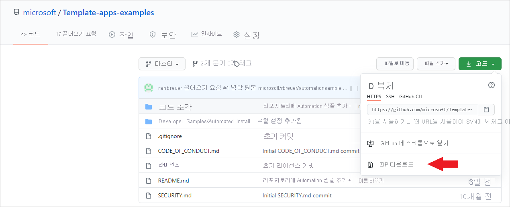
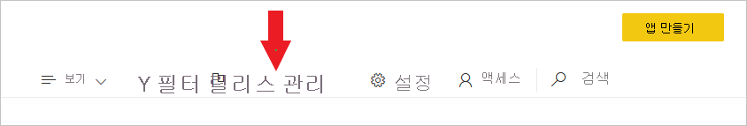
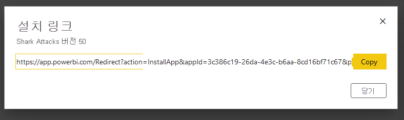
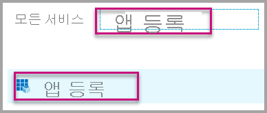
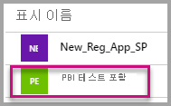
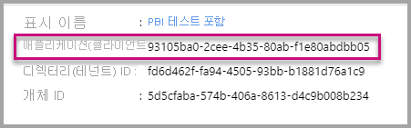
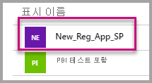
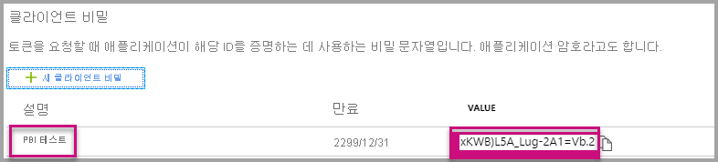

# <a name="tutorial-automate-configuration-of-template-app-installation-using-an-azure-function"></a>자습서:  Azure 함수를 사용한 템플릿 앱 설치 구성 자동화

템플릿 앱은 고객이 데이터에서 인사이트를 얻기 시작할 수 있는 좋은 방법입니다. 템플릿 앱을 사용하면 고객은 신속하게 시작 및 실행하여 데이터에 연결하고 미리 빌드된 보고서를 획득한 후 원하는 경우 사용자 지정할 수 있습니다.

고객은 데이터에 연결하는 방법에 대한 세부 정보를 항상 잘 아는 것은 아니며 템플릿 앱을 설치할 때 이러한 세부 정보를 제공하는 것이 어려울 수 있습니다.

고객이 서비스에서 데이터를 시작하는데 도움을 주는 템플릿 앱을 만든 데이터 서비스 공급자는 템플릿 앱의 매개 변수 구성을 자동화하여 고객이 템플릿 앱을 더 쉽게 설치하도록 만들 수 있습니다. 고객은 포털에 로그인하면 준비된 특수 링크를 클릭합니다. 그러면 자동화가 시작되어 필요한 정보를 수집하고, 템플릿 앱 매개 변수를 미리 구성하고, 앱을 설치할 수 있는 Power BI 계정으로 고객을 리디렉션합니다. 설치를 클릭하고 해당 데이터 원본에 대해 인증하면 됩니다. 

이 사용자 환경은 아래에 나와 있습니다.


이 자습서에서는 Microsoft가 만든 Azure 함수 샘플을 사용하여 템플릿 앱을 미리 구성하고 설치해 봅니다. 이 샘플은 데모를 위해 의도적으로 간단히 유지됩니다. Power BI API를 활용하여 템플릿 앱을 설치하고 사용자를 위해 자동으로 구성하도록 Azure 함수의 설정을 캡슐화했습니다.

일반 자동화 흐름 및 사용되는 API에 대한 자세한 내용은 [템플릿 앱 설치의 자동화된 구성](template-apps-auto-install.md)을 참조하세요.

간단한 이 애플리케이션은 Azure 함수를 사용합니다. Azure Functions에 대한 자세한 내용은 [Azure 함수 설명서](https://docs.microsoft.com/azure/azure-functions/)를 참조하세요.

## <a name="basic-flow"></a>기본 흐름

다음은 고객이 포털의 링크를 클릭하여 애플리케이션을 시작할 때 애플리케이션에서 수행하는 작업의 기본 흐름입니다.

1. 사용자가 ISV 포털에 로그인하여 제공된 링크를 클릭합니다. 흐름이 시작됩니다. ISV 포털은 이 단계에서 사용자 관련 구성을 준비합니다.

2. ISV는 ISV의 테넌트에 등록된 [서비스 주체(앱 전용 토큰)](../embedded/embed-service-principal.md)를 기반으로 **App-only** 토큰을 가져옵니다.

3. ISV는 [Power BI REST API](https://docs.microsoft.com/rest/api/power-bi/)를 사용하여 ISV에서 준비한 사용자 특정 매개 변수 구성이 포함된 **설치 티켓** 을 만듭니다.

4. ISV는 설치 티켓을 포함하는 ```POST``` 리디렉션 메서드를 사용하여 사용자를 Power BI로 리디렉션합니다.

5. 사용자는 설치 티켓을 사용하여 Power BI 계정으로 리디렉션되고 템플릿 앱을 설치하라는 메시지가 표시됩니다. 사용자가 설치를 클릭하면 템플릿 앱이 설치됩니다.

>[!Note]
>설치 티켓을 만들 때 ISV에서 매개 변수 값이 구성되며, 데이터 원본 관련 자격 증명은 설치의 최종 단계에서 사용자에 의해서만 제공됩니다. 이렇게 하면 자격 증명이 제3자에게 노출되지 않으므로 사용자와 템플릿 앱 데이터 원본 간에 보안 연결이 보장됩니다.

## <a name="prerequisites"></a>필수 조건

시작하기 전에 다음이 있어야 합니다.

* 고유한 Azure Active Directory 테넌트 설정 설정하는 방법에 대한 지침은 [Azure Active Directory 테넌트 만들기](https://docs.microsoft.com/power-bi/developer/embedded/create-an-azure-active-directory-tenant)를 참조하세요.

* 위의 테넌트에 등록된 [서비스 주체(앱 전용 토큰)](https://docs.microsoft.com/power-bi/developer/embedded/embed-service-principal)

* 설치할 수 있는 매개 변수가 있는 [템플릿 앱](https://docs.microsoft.com/power-bi/connect-data/service-template-apps-overview) Azure AD(Azure Active Directory)에서 애플리케이션을 등록한 것과 동일한 테넌트에서 템플릿 앱을 만들어야 합니다. 자세한 내용은 [템플릿 앱 팁](https://docs.microsoft.com/power-bi/connect-data/service-template-apps-tips.md) 또는 [Power BI에서 템플릿 앱 만들기](https://docs.microsoft.com/power-bi/connect-data/service-template-apps-create)를 참조하세요.

* **Power BI Pro 라이선스** Power BI Pro에 등록하지 않은 경우 시작하기 전에 [평가판에 등록](https://powerbi.microsoft.com/pricing/)합니다.

## <a name="set-up-your-template-apps-automation-development-environment"></a>템플릿 앱 자동화 개발 환경 설정

애플리케이션 설정을 계속하기 전에 [빠른 시작: Create an Azure Functions app with Azure App Configuration](https://docs.microsoft.com/azure/azure-app-configuration/quickstart-azure-functions-csharp)(Azure App Configuration과 함께 Azure Functions 앱 만들기)의 지침을 따라 Azure App Configuration과 함께 Azure 함수를 개발하세요. 문서의 설명대로 App Configuration을 만드세요.

### <a name="register-an-application-in-azure-active-directory-azure-ad"></a>Azure AD(Azure Active Directory)에서 애플리케이션 등록

[서비스 주체 및 애플리케이션 암호를 사용하여 Power BI 콘텐츠 포함](https://docs.microsoft.com/power-bi/developer/embedded/embed-service-principal)의 설명대로 서비스 주체를 만듭니다.

애플리케이션을 **서버 쪽 웹 애플리케이션** 앱으로 등록해야 합니다. 서버 사이드 웹 애플리케이션을 등록하여 응용 프로그램 암호를 만듭니다.

이후 단계를 위해 ‘애플리케이션 ID’(클라이언트 ID) 및 ‘애플리케이션 암호’(클라이언트 암호)를 저장합니다. 

[포함 설정 도구](https://aka.ms/embedsetup/AppOwnsData)를 통해 신속하게 앱 등록을 생성하기 시작할 수 있습니다. [Power BI 앱 등록 도구](https://app.powerbi.com/embedsetup)를 사용하는 *고객에 대한 콘텐츠 포함* 옵션을 선택합니다.

## <a name="template-app-preparation"></a>템플릿 앱 준비

템플릿 앱을 만든 후 설치할 준비가 되면 다음 단계를 위해 아래의 정보를 저장합니다.

* 앱을 만들 때 [템플릿 앱의 속성 정의](../../connect-data/service-template-apps-create.md#define-the-properties-of-the-template-app) 프로세스 끝에 설치 URL에 표시된 ‘앱 ID’, ‘패키지 키’, ‘소유자 ID’  

    템플릿 앱의 [Release Management](../../connect-data/service-template-apps-create.md#manage-the-template-app-release)에서 **링크 가져오기** 를 클릭하여 동일한 링크를 가져올 수도 있습니다.

* 템플릿 앱의 데이터 세트에 정의된 ‘매개 변수 이름’ 매개 변수 이름은 대/소문자를 구분하며 [템플릿 앱의 속성 정의](../../connect-data/service-template-apps-create.md#define-the-properties-of-the-template-app)하는 동안 **매개 변수 설정** 탭에서 또는 Power BI의 데이터 세트 설정에서 검색할 수도 있습니다.

>[!NOTE]
>템플릿 앱을 설치할 준비가 되면 아직 AppSource에서 공개적으로 사용할 수 없는 경우에도 템플릿 앱에서 미리 구성된 설치 애플리케이션을 테스트할 수 있습니다. 그러나 테넌트 외부의 사용자가 자동화된 설치 애플리케이션을 사용하여 템플릿 앱을 설치할 수 있으려면 템플릿 앱을 [Power BI Apps 마켓플레이스](https://app.powerbi.com/getdata/services)에서 공개적으로 사용할 수 있어야 합니다. 따라서 작성 중인 자동화된 설치 애플리케이션을 사용하여 템플릿 앱을 배포하기 전에 [파트너 센터](https://docs.microsoft.com/azure/marketplace/partner-center-portal/create-power-bi-app-offer)에 게시해야 합니다.


## <a name="install-and-configure-your-template-app-using-our-azure-function-sample"></a>Azure 함수 샘플을 사용하여 템플릿 앱 설치 및 구성

이 섹션에서는 Microsoft가 만든 Azure 함수 샘플을 사용하여 템플릿 앱을 미리 구성하고 설치해 봅니다. 이 샘플은 데모를 위해 의도적으로 간단히 유지됩니다. [Azure 함수](https://docs.microsoft.com/azure/azure-functions/functions-overview) 및 [Azure App Configuration](https://docs.microsoft.com/azure/azure-app-configuration/overview)을 활용하여 템플릿 앱에 대한 자동화된 설치 API를 쉽게 배포하고 사용할 수 있습니다.

### <a name="download-visual-studio-version-2017-or-later"></a>[Visual Studio](https://www.visualstudio.com/)(버전 2017 이상) 다운로드

[Visual Studio](https://www.visualstudio.com/)(버전 2017 이상)를 다운로드합니다. 최신 [NuGet 패키지](https://www.nuget.org/profiles/powerbi)를 다운로드해야 합니다.

### <a name="download-the-automated-install-azure-function-sample"></a>자동 설치 Azure 함수 샘플 다운로드

GitHub에서 [자동 설치 Azure 함수 샘플](https://github.com/microsoft/Template-apps-examples/tree/master/Developer%20Samples/Automated%20Install%20Azure%20Function)을 다운로드하여 시작합니다.



### <a name="setup-your-azure-app-configuration"></a>Azure App Configuration 설정

이 샘플을 실행하려면 아래에 설명된 대로 값과 키를 사용하여 Azure App Configuration을 설정해야 합니다. 키는 **애플리케이션 ID**, **애플리케이션 암호** 및 템플릿 앱의 **AppId**, **PackageKey**, **OwnerId** 입니다. 이러한 값을 가져오는 방법에 대한 자세한 내용은 아래 섹션을 참조하세요. 

키는 **Constants.cs** 파일에도 정의되어 있습니다.

| 구성 키 | 의미           |
|---------------    |-------------------|
| TemplateAppInstall:Application:AppId | [설치 URL](#getting-the-template-app-properties)의 *AppId* |
| TemplateAppInstall:Application:PackageKey | [설치 URL](#getting-the-template-app-properties)의 *PackageKey* |
| TemplateAppInstall:Application:OwnerId | [설치 URL](#getting-the-template-app-properties) *OwnerId* |
| TemplateAppInstall:ServicePrincipal:ClientId | 서비스 주체 [애플리케이션 ID](#getting-the-application-id) |
| TemplateAppInstall:ServicePrincipal:ClientSecret | 서비스 주체 [애플리케이션 암호](#getting-the-application-secret) |
|||


**Constants.cs** 파일:


#### <a name="getting-the-template-app-properties"></a>템플릿 앱 속성 가져오기
모든 관련 템플릿 앱 속성을 앱을 만들 때 정의된 대로 입력합니다. 이러한 속성은 템플릿 앱의 **AppId**, **PakcageKey**, **OwnerId** 입니다.

위의 값을 가져오려면 다음 단계를 따릅니다.

1. [Power BI](https://app.powerbi.com)에 로그인합니다.

2. 애플리케이션의 원본 작업 영역으로 이동합니다.

3. Release Management 창을 엽니다.

    

4. 앱 버전을 선택하고 설치 링크를 가져옵니다.

    

5. 클립보드에 링크를 복사합니다.

    

6. 이 설치 URL에는 필요한 값을 포함하는 3개의 url 매개 변수가 있습니다. 애플리케이션에 대한 **appId**, **packageKey**, **ownerId** 값을 사용합니다. 샘플 URL은 아래에 표시된 것과 비슷합니다.

    ```html
    https://app.powerbi.com/Redirect?action=InstallApp&appId=3c386...16bf71c67&packageKey=b2df4b...dLpHIUnum2pr6k&ownerId=72f9...1db47&buildVersion=5
    ```

#### <a name="getting-the-application-id"></a>애플리케이션 ID 가져오기

**Azure** 의 **애플리케이션 ID** 를 사용하여 **applicationId** 정보를 입력합니다. **applicationId** 는 응용 프로그램에서 권한을 요청 중인 사용자에게 응용 프로그램을 인식시키는 데 사용됩니다.

**applicationId** 를 가져오려면 다음 단계를 수행합니다.

1. [Azure Portal](https://portal.azure.com)에 로그인합니다.

2. 왼쪽 탐색 창에서 **모든 서비스** 를 선택하고 **앱 등록** 을 선택합니다.

    

3. **applicationId** 가 필요한 응용 프로그램을 선택합니다.

    

4. GUID로 나열된 **애플리케이션 ID** 가 있습니다. 이 **응용 프로그램 ID** 를 애플리케이션의 **applicationId** 로 사용합니다.

    

#### <a name="getting-the-application-secret"></a>애플리케이션 암호 가져오기

**Azure** 의 **앱 등록** 섹션에 있는 **키** 섹션에서 **ApplicationSecret** 정보를 입력합니다.  이 특성은 [서비스 주체](../embedded/embed-service-principal.md)를 사용할 때 작동합니다.

**ApplicationSecret** 을 가져오려면 다음 단계를 수행합니다.

 1. [Azure Portal](https://portal.azure.com)에 로그인합니다.

 2. 왼쪽 탐색 창에서 **모든 서비스** 를 선택하고 **앱 등록** 을 선택합니다.

    

3. **ApplicationSecret** 을 사용해야 하는 응용 프로그램을 선택합니다.

    

4. **관리** 아래의 **인증서 및 비밀** 을 선택합니다.

5. **새 클라이언트 비밀** 을 선택합니다.

6. **설명** 상자에 이름을 입력하고 지속 기간을 선택합니다. 그런 다음, **저장** 을 선택하여 애플리케이션의 **값** 을 가져옵니다. 키 값을 저장한 후 **키** 창을 닫으면 값 필드가 숨김으로만 표시됩니다. 이때는 키 값을 검색할 수 없습니다. 키 값을 분실한 경우 Azure Portal에서 새 키 값을 만듭니다.

    

## <a name="test-your-function-locally"></a>로컬에서 함수 테스트

[Run the function locally](https://docs.microsoft.com/azure/azure-functions/functions-create-your-first-function-visual-studio#run-the-function-locally)(로컬에서 함수 실행)에 설명된 단계에 따라 함수를 실행합니다.

함수 url(예: ```POST http://localhost:7071/api/install```)에 대한 ```POST``` 요청을 실행하도록 포털을 구성합니다. 요청 본문은 키-값 쌍을 설명하는 JSON 개체여야 합니다. 여기서 키는 ‘매개 변수 이름’(Power BI Desktop에 정의됨)이고 값은 템플릿 앱의 각 매개 변수에 대해 설정하려는 값입니다.

>[!Note]
> 프로덕션에서 매개 변수 값은 포털의 의도된 논리에 따라 각 사용자에 대해 추론됩니다.

필요한 흐름은 다음과 같습니다.

1. 포털이 세션별 사용자당 요청을 준비합니다.
2. ```POST /api/install``` 요청이 Azure 함수에 실행됩니다. 요청 본문은 키-값 쌍으로 구성됩니다. 여기서 키는 매개 변수 이름이고 값은 설정하려는 값입니다. 
3. 모두 제대로 구성되면 브라우저가 자동으로 고객의 Power BI 계정으로 리디렉션하고 자동화된 설치 흐름이 표시됩니다.
4. 설치 시 매개 변수 값은 1, 2단계에서 구성한 대로 설정됩니다.
 
## <a name="next-steps"></a>다음 단계

### <a name="publish-your-project-to-azure"></a>Azure에 프로젝트 게시

템플릿 앱 자동 설치 API를 제품에 통합하고 프로덕션 환경에서 테스트를 시작할 수 있도록 Azure에 프로젝트를 게시하는 방법에 대한 지침은 [Azure 함수 설명서](https://docs.microsoft.com/azure/azure-functions/functions-create-your-first-function-visual-studio#publish-the-project-to-azure)를 참조하세요.
