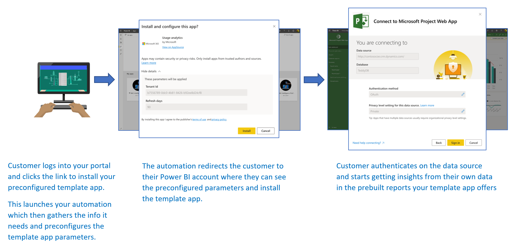

# <a name="automated-configuration-of-a-template-app-installation"></a>템플릿 앱 설치의 자동화된 구성

템플릿 앱은 고객이 데이터에서 인사이트를 얻기 시작할 수 있는 좋은 방법입니다. 템플릿 앱을 사용하면 고객은 신속하게 시작 및 실행하여 데이터에 연결하고 미리 빌드된 보고서를 획득한 후 원하는 경우 사용자 지정할 수 있습니다.

고객은 데이터에 연결하는 방법에 대한 세부 정보를 항상 잘 아는 것은 아니며 템플릿 앱을 설치할 때 이러한 세부 정보를 제공하는 것이 어려울 수 있습니다.

고객이 서비스에서 데이터를 시작하는데 도움을 주는 템플릿 앱을 만든 데이터 서비스 공급자는 템플릿 앱의 매개 변수 구성을 자동화하여 고객이 템플릿 앱을 더 쉽게 설치하도록 만들 수 있습니다. 고객은 포털에 로그인하면 준비된 특수 링크를 클릭합니다. 그러면 자동화가 시작되어 필요한 정보를 수집하고, 템플릿 앱 매개 변수를 미리 구성하고, 앱을 설치할 수 있는 Power BI 계정으로 고객을 리디렉션합니다. 설치를 클릭하고 해당 데이터 원본에 대해 인증하면 됩니다. 

이 사용자 환경은 아래에 나와 있습니다.



이 문서에서는 템플릿 앱 설치의 구성을 자동화하는 데 필요한 기본 흐름, 필수 조건 및 주요 단계와 API를 설명합니다. 그러나 곧바로 시작하는 것을 선호하는 경우 Azure 함수를 사용하는 간단한 애플리케이션 예제를 사용하여 템플릿 앱 설치의 구성을 자동화할 수 있는 [자습서](template-apps-auto-install-tutorial.md)로 건너뛸 수 있습니다.

## <a name="basic-flow"></a>기본 흐름

템플릿 앱 설치의 구성을 자동화하는 기본 흐름은 다음과 같습니다.

1. 사용자가 ISV 포털에 로그인하여 제공된 링크를 클릭합니다. 그러면 자동화된 흐름이 시작됩니다. ISV 포털은 이 단계에서 사용자 관련 구성을 준비합니다.

2. ISV는 ISV의 테넌트에 등록된 [서비스 주체(앱 전용 토큰)](../embedded/embed-service-principal.md)를 기반으로 **App-only** 토큰을 가져옵니다.

3. ISV는 [Power BI REST API](https://docs.microsoft.com/rest/api/power-bi/)를 사용하여 ISV에서 준비한 사용자 특정 매개 변수 구성이 포함된 **설치 티켓** 을 만듭니다.

4. ISV는 설치 티켓을 포함하는 ```POST``` 리디렉션 메서드를 사용하여 사용자를 Power BI로 리디렉션합니다.

5. 사용자는 설치 티켓을 사용하여 Power BI 계정으로 리디렉션되고 템플릿 앱을 설치하라는 메시지가 표시됩니다. 사용자가 설치를 클릭하면 템플릿 앱이 설치됩니다.

>[!Note]
>설치 티켓을 만들 때 ISV에서 매개 변수 값이 구성되며, 데이터 원본 관련 자격 증명은 설치의 최종 단계에서 사용자에 의해서만 제공됩니다. 이렇게 하면 자격 증명이 제3자에게 노출되지 않으므로 사용자와 템플릿 앱 데이터 원본 간에 보안 연결이 보장됩니다.

## <a name="prerequisites"></a>필수 조건

템플릿 앱에 미리 구성된 설치 환경을 제공하려면 다음 필수 조건이 필요합니다.

* **Power BI Pro 라이선스** Power BI Pro에 등록하지 않은 경우 시작하기 전에 [평가판에 등록](https://powerbi.microsoft.com/pricing/)합니다.

* 고유한 **Azure Active Directory 테넌트 설정** 설정하는 방법에 대한 지침은 [Azure Active Directory 테넌트 만들기](https://docs.microsoft.com/power-bi/developer/embedded/create-an-azure-active-directory-tenant)를 참조하세요.

* 위의 테넌트에 등록된 **서비스 주체(앱 전용 토큰)** 자세한 정보는 [서비스 주체 및 애플리케이션 암호를 사용하여 Power BI 콘텐츠 포함](https://docs.microsoft.com/power-bi/developer/embedded/embed-service-principal)을 참조하세요. 애플리케이션을 **서버 쪽 웹 애플리케이션** 앱으로 등록해야 합니다. 서버 사이드 웹 애플리케이션을 등록하여 응용 프로그램 암호를 만듭니다. 이 프로세스에서 이후 단계를 위해 ‘애플리케이션 ID’(클라이언트 ID) 및 ‘애플리케이션 암호’(클라이언트 암호)를 저장해야 합니다. 

* 설치할 수 있는 **매개 변수가 있는 템플릿 앱** Azure AD(Azure Active Directory)에서 애플리케이션을 등록한 것과 동일한 테넌트에서 템플릿 앱을 만들어야 합니다. 자세한 내용은 [템플릿 앱 팁](https://docs.microsoft.com/power-bi/connect-data/service-template-apps-tips) 또는 [Power BI에서 템플릿 앱 만들기](https://docs.microsoft.com/power-bi/connect-data/service-template-apps-create)를 참조하세요. 다음 단계를 위해 템플릿 앱에서 다음 정보를 확인해야 합니다.
     * 앱을 만들 때 [템플릿 앱의 속성 정의](../../connect-data/service-template-apps-create.md#define-the-properties-of-the-template-app) 프로세스 끝에 설치 URL에 표시된 ‘앱 ID’, ‘패키지 키’, ‘소유자 ID’.   템플릿 앱의 [Release Management](../../connect-data/service-template-apps-create.md#manage-the-template-app-release)에서 **링크 가져오기** 를 클릭하여 동일한 링크를 가져올 수도 있습니다.

    * 템플릿 앱의 데이터 세트에 정의된 ‘매개 변수 이름’ 매개 변수 이름은 대/소문자를 구분하며 [템플릿 앱의 속성 정의](../../connect-data/service-template-apps-create.md#define-the-properties-of-the-template-app)하는 동안 **매개 변수 설정** 탭에서 또는 Power BI의 데이터 세트 설정에서 검색할 수도 있습니다.

    >[!NOTE]
    >템플릿 앱을 설치할 준비가 되면 아직 AppSource에서 공개적으로 사용할 수 없는 경우에도 템플릿 앱에서 미리 구성된 설치 애플리케이션을 테스트할 수 있습니다. 그러나 테넌트 외부의 사용자가 자동화된 설치 애플리케이션을 사용하여 템플릿 앱을 설치할 수 있으려면 템플릿 앱을 [Power BI Apps 마켓플레이스](https://app.powerbi.com/getdata/services)에서 공개적으로 사용할 수 있어야 합니다. 따라서 작성 중인 자동화된 설치 애플리케이션을 사용하여 템플릿 앱을 배포하기 전에 [파트너 센터](https://docs.microsoft.com/azure/marketplace/partner-center-portal/create-power-bi-app-offer)에 게시해야 합니다.

## <a name="main-steps-and-apis"></a>주요 단계와 API

템플릿 앱 설치의 구성을 자동화하는 주요 단계 및 필요한 API는 아래 섹션에 설명되어 있습니다. [Power BI REST API](https://docs.microsoft.com/rest/api/power-bi/)를 사용하여 대부분의 단계를 수행하지만, 아래에 설명된 코드 예제는 **.NET SDK** 를 통해 실행합니다.

## <a name="step-1-create-a-power-bi-client-object"></a>1단계: Power BI 클라이언트 개체 만들기 

Power BI REST API를 사용하려면 **Azure AD** 에서 [서비스 주체](../embedded/embed-service-principal.md)에 대한 **액세스 토큰** 을 받아야 합니다. [Power BI REST API](https://docs.microsoft.com/rest/api/power-bi/)를 호출하기 전에 Power BI 애플리케이션에 대한 [Azure AD 액세스 토큰](../embedded/get-azuread-access-token.md#access-token-for-non-power-bi-users-app-owns-data)을 가져와야 합니다.
**액세스 토큰** 을 사용하여 Power BI 클라이언트를 만들려면 [Power BI REST API](https://docs.microsoft.com/rest/api/power-bi/)와 상호 작용할 수 있는 Power BI 클라이언트 개체를 만들어야 합니다. **_Microsoft.Rest.TokenCredentials_* _ 개체로 **AccessToken** 을 래핑하여 Power BI 클라이언트 개체를 만듭니다.

```csharp
using Microsoft.IdentityModel.Clients.ActiveDirectory;
using Microsoft.Rest;
using Microsoft.PowerBI.Api.V2;

var tokenCredentials = new TokenCredentials(authenticationResult.AccessToken, "Bearer");

// Create a Power BI Client object. it's used to call Power BI APIs.
using (var client = new PowerBIClient(new Uri(ApiUrl), tokenCredentials))
{
    // Your code to goes here.
}
```

## <a name="step-2-create-an-install-ticket"></a>2단계: 설치 티켓 만들기

사용자를 Power BI로 리디렉션할 때 사용되는 설치 티켓을 만듭니다. 이 작업에 사용되는 API는 _ *CreateInstallTicket** API입니다.
* [템플릿 앱 CreateInstallTicket](https://docs.microsoft.com/rest/api/power-bi/templateapps/createinstallticket)

템플릿 앱 설치 및 구성을 위한 설치 티켓을 만드는 샘플은 [애플리케이션 예제](https://github.com/microsoft/Template-apps-examples/tree/master/Developer%20Samples/Automated%20Install%20Azure%20Function/InstallTemplateAppSample)의 [InstallTemplateApp/InstallAppFunction.cs](https://github.com/microsoft/Template-apps-examples/blob/master/Developer%20Samples/Automated%20Install%20Azure%20Function/InstallTemplateAppSample/InstallTemplateApp/InstallAppFunction.cs) 파일에서 사용할 수 있습니다.


다음은 템플릿 앱 *CreateInstallTicket* REST API를 사용하는 코드 예제입니다.
```csharp
using Microsoft.PowerBI.Api.V2;
using Microsoft.PowerBI.Api.V2.Models;

// Create Install Ticket Request.
InstallTicket ticketResponse = null;
var request = new CreateInstallTicketRequest()
{
    InstallDetails = new List<TemplateAppInstallDetails>()
    {
        new TemplateAppInstallDetails()
        {
            AppId = Guid.Parse(AppId),
            PackageKey = PackageKey,
            OwnerTenantId = Guid.Parse(OwnerId),
            Config = new TemplateAppConfigurationRequest()
            {
                Configuration = Parameters
                                    .GroupBy(p => p.Name)
                                    .ToDictionary(k => k.Key, k => k.Select(p => p.Value).Single())
            }
        }
    }
};

// Issue the request to the REST API using .NET SDK
InstallTicket ticketResponse = await client.TemplateApps.CreateInstallTicketAsync(request);
```

## <a name="step-3-redirect-users-to-power-bi-with-the-ticket"></a>3단계: 티켓을 사용하여 사용자를 Power BI로 리디렉션

설치 티켓을 만든 후에는 설치 티켓을 사용해 사용자를 Power BI로 리디렉션하여 템플릿 앱 설치 및 구성을 계속 진행하게 합니다. 이 작업은 요청 본문에 설치 티켓을 포함하여 템플릿 앱의 설치 URL에 대한 ```POST``` 리디렉션 메서드를 사용하여 수행합니다.

```POST``` 요청을 사용하여 리디렉션을 실행하는 방법에 대한 다양한 메서드가 있습니다. 선택은 시나리오 및 사용자가 포털이나 서비스와 상호 작용하는 방법에 따라 다릅니다.

일반적으로 테스트 목적으로 사용되는 간단한 예는 로드 시 자동으로 제출되는, 숨겨진 필드가 있는 양식을 활용하는 것입니다.

```javascript
<html>
    <body onload='document.forms["form"].submit()'>
        <!-- form method is POST and action is the app install URL -->
        <form name='form' action='https://app.powerbi.com/....' method='post' enctype='application/json'>
            <!-- value should be the new install ticket -->
            <input type='hidden' name='ticket' value='H4sI....AAA='>
        </form>
    </body>
</html>
```

다음은 [애플리케이션 예제](https://github.com/microsoft/Template-apps-examples/tree/master/Developer%20Samples/Automated%20Install%20Azure%20Function/InstallTemplateAppSample)의 응답 예제로, 설치 티켓을 보유하며 자동으로 사용자를 Power BI로 리디렉션합니다. 이 Azure 함수에 대한 응답은 실제로 위의 html 예에서 볼 수 있는 것과 동일한 자동 제출되는 양식입니다.

```csharp
...
    return new ContentResult() { Content = RedirectWithData(redirectUrl, ticket.Ticket), ContentType = "text/html" };
}

...

public static string RedirectWithData(string url, string ticket)
{
    StringBuilder s = new StringBuilder();
    s.Append("<html>");
    s.AppendFormat("<body onload='document.forms[\"form\"].submit()'>");
    s.AppendFormat("<form name='form' action='{0}' method='post' enctype='application/json'>", url);
    s.AppendFormat("<input type='hidden' name='ticket' value='{0}' />", ticket);
    s.Append("</form></body></html>");
    return s.ToString();
}
```

>[!Note]
>```POST``` 브라우저 리디렉션의 다양한 방법이 있지만, 서비스 요구 및 제한 사항에 따라 항상 가장 안전한 방법을 사용해야 합니다. 일부 형태의 안전하지 않은 리디렉션을 사용하면 사용자나 서비스가 보안 문제에 노출될 수 있습니다.

## <a name="step-4-move-your-automation-to-production"></a>4단계: 자동화를 프로덕션으로 이동

설계한 자동화가 준비되면 자동화를 프로덕션으로 이동해야 합니다.

## <a name="next-steps"></a>다음 단계

* 간단한 Azure 함수를 사용하여 템플릿 앱 설치의 구성을 자동화하는 [자습서](template-apps-auto-install-tutorial.md)를 사용해 보세요.

* 궁금한 점이 더 있나요? [Power BI 커뮤니티에 질문합니다.](https://community.powerbi.com/)
