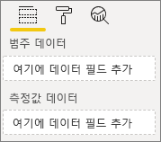
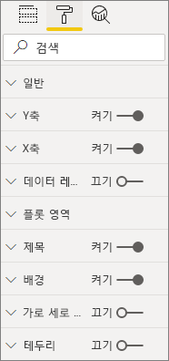
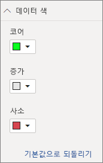

# <a name="build-a-bar-chart"></a>가로 막대형 차트 빌드

이 문서는 코드를 사용하여 샘플 Power BI 가로 막대형 차트 시각적 개체를 빌드하기 위한 단계별 가이드입니다. [https://github.com/Microsoft/PowerBI-visuals-sampleBarChart](https://github.com/Microsoft/PowerBI-visuals-sampleBarChart)에서 전체 코드 예제를 가져올 수 있습니다.

## <a name="view-model"></a>모델 보기
먼저 가로 막대형 차트 뷰 모델을 정의하고, 시각적 개체를 빌드할 때 시각적 개체에 노출되는 항목을 반복하는 것이 중요합니다.

```typescript
/**
 * Interface for BarCharts viewmodel.
 *
 * @interface
 * @property {BarChartDataPoint[]} dataPoints - Set of data points the visual will render.
 * @property {number} dataMax                 - Maximum data value in the set of data points.
 */
interface BarChartViewModel {
    dataPoints: BarChartDataPoint[];
    dataMax: number;
};

/**
 * Interface for BarChart data points.
 *
 * @interface
 * @property {number} value    - Data value for the point.
 * @property {string} category - Corresponding category of the data value.
 */
interface BarChartDataPoint {
    value: number;
    category: string;
};
```

### <a name="use-static-data"></a>정적 데이터 사용

정적 데이터를 사용하는 것은 데이터 바인딩을 사용하지 않고 시각적 개체를 테스트하는 좋은 방법입니다. 이후 단계에서 데이터 바인딩을 추가한 후에도 뷰 모델이 변경되지 않습니다.

```typescript
let testData: BarChartDataPoint[] = [
    {
        value: 10,
        category: 'a'
    },
    {
        value: 20,
        category: 'b'
    },
    {
        value: 1,
        category: 'c'
    },
    {
        value: 100,
        category: 'd'
    },
    {
        value: 500,
        category: 'e'
    }];

let viewModel: BarChartViewModel = {
    dataPoints: testData,
    dataMax: d3.max(testData.map((dataPoint) => dataPoint.value))
};
```

## <a name="data-binding"></a>데이터 바인딩 
*capabilities.json*에서 시각적 개체 기능을 정의하여 데이터 바인딩을 추가합니다. 샘플 코드에는 사용할 스키마가 이미 있습니다.

데이터 바인딩은 Power BI의 **필드** 웰에 잘 작동합니다.



### <a name="add-data-roles"></a>데이터 역할 추가
샘플 코드에는 이미 데이터 역할이 있지만 역할을 사용자 지정할 수 있습니다.

- `displayName`은 **필드** 웰에 표시되는 이름입니다.
- `name`은 데이터 역할을 참조하는 데 사용되는 내부 이름입니다.
- `kind`는 필드 종류입니다. ‘그룹화’ 필드(0)에는 불연속 값이 있습니다. ‘측정값’ 필드(1)에는 숫자 데이터 값이 있습니다.

```json
"dataRoles": [
    {
        "displayName": "Category Data",
        "name": "category",
        "kind": 0
    },
    {
        "displayName": "Measure Data",
        "name": "measure",
        "kind": 1
    }
],
```

자세한 내용은 [데이터 역할](./capabilities.md#define-the-data-fields-that-your-visual-expects-dataroles)을 참조하세요.

### <a name="add-conditions-to-dataviewmapping"></a>DataViewMapping에 조건 추가
각 필드에서 바인딩할 수 있는 필드 수를 설정하려면 `dataViewMappings`에서 조건을 정의합니다. 각 필드를 참조하려면 데이터 역할의 내부 `name`을 사용합니다.

```json
    "dataViewMappings": [
        {
            "conditions": [
                {
                    "category": {
                        "max": 1
                    },
                    "measure": {
                        "max": 1
                    }
                }
            ],
        }
    ]
```

자세한 내용은 [데이터 뷰 매핑](./dataview-mappings.md)을 참조하세요.

### <a name="define-and-use-visualtransform"></a>visualTransform 정의 및 사용
`DataView`는 Power BI가 시각적 개체에 제공하는 구조로, 시각화될 쿼리된 데이터가 포함됩니다. 그러나 `DataView`는 범주 및 테이블 등 다양한 형식으로 데이터를 제공할 수 있습니다. 가로 막대형 차트와 같은 범주 시각적 개체를 빌드하려면 `DataView`의 범주 속성만 사용하면 됩니다. `visualTransform`을 정의하면 `DataView`를 시각적 개체에서 사용할 뷰 모델로 변환할 수 있습니다.

개별 데이터 요소를 정의할 때 색을 할당하고 선택하려면 `IVisualHost`를 사용합니다. 

```typescript
/**
 * Function that converts queried data into a view model that will be used by the visual
 *
 * @function
 * @param {VisualUpdateOptions} options - Contains references to the size of the container
 *                                        and the dataView which contains all the data
 *                                        the visual had queried.
 * @param {IVisualHost} host            - Contains references to the host which contains services
 */
function visualTransform(options: VisualUpdateOptions, host: IVisualHost): BarChartViewModel {
    /*Convert dataView to your viewModel*/
}

```

## <a name="color"></a>색 
색은 `IVisualHost`에서 사용할 수 있는 서비스 중 하나로 노출됩니다.

### <a name="add-color-to-data-points"></a>데이터 요소에 색 추가
각 데이터 요소는 서로 다른 색으로 표시됩니다. `BarChartDataPoint` 인터페이스에 색을 추가합니다.

```typescript
/**
 * Interface for BarChart data points.
 *
 * @interface
 * @property {number} value    - Data value for the point.
 * @property {string} category - Corresponding category of the data value.
 * @property {string} color    - Color corresponding to the data point.
 */
interface BarChartDataPoint {
    value: number;
    category: string;
    color: string;
};
```

### <a name="the-colorpalette-service"></a>ColorPalette 서비스
`colorPalette` 서비스는 시각적 개체에 사용되는 색을 관리합니다. 해당 인스턴스는 `IVisualHost`에 사용할 수 있습니다.

### <a name="assign-color-to-data-points"></a>데이터 요소에 색 할당
`dataView`를 가로 막대형 차트에서 사용할 수 있는 뷰 모델로 변환하기 위해 `visualTransform`을 정의했습니다. `visualTransform`에서 데이터 요소를 반복하므로 색을 할당하는 데도 적합합니다.

```typescript
let colorPalette: IColorPalette = host.colorPalette; // host: IVisualHost
for (let i = 0, len = Math.max(category.values.length, dataValue.values.length); i < len; i++) {
    barChartDataPoints.push({
        category: category.values[i],
        value: dataValue.values[i],
        color: colorPalette.getColor(category.values[i]).value,
    });
}
```

## <a name="selection-and-interactions"></a>선택 및 상호 작용
선택을 통해 사용자가 자신의 시각적 개체 및 다른 시각적 개체와 상호 작용할 수 있습니다. 

### <a name="add-selection-to-each-data-point"></a>각 데이터 요소에 선택 항목 추가
각 데이터 요소는 고유하기 때문에 각 데이터 요소에 선택 항목을 추가합니다. `BarChartDataPoint` 인터페이스에 대한 선택 속성을 추가합니다.

```typescript
/**
 * Interface for BarChart data points.
 *
 * @interface
 * @property {number} value             - Data value for the point.
 * @property {string} category          - Corresponding category of data value.
 * @property {string} color             - Color corresponding to data point.
 * @property {ISelectionId} selectionId - Id assigned to data point for cross filtering
 *                                        and visual interaction.
 */
interface BarChartDataPoint {
    value: number;
    category: string;
    color: string;
    selectionId: ISelectionId;
};
```

### <a name="assign-selection-ids-to-each-data-point"></a>각 데이터 요소에 선택 ID 할당
`visualTransform`에서 데이터 요소를 반복하므로 선택 ID를 만드는 데도 적합합니다. 호스트 변수는 `IVisualHost`로, 색 및 선택 작성기와 같이 시각적 개체에서 사용할 수 있는 서비스를 포함합니다. 

`IVisualHost`에서 `createSelectionIdBuilder` 팩터리 메서드를 사용하여 새 선택 ID를 만듭니다. 각 데이터 요소에 대해 새 선택 작성기를 만듭니다.

범주만을 기준으로 선택 항목을 만드는 것이므로 선택 항목 `withCategory`를 정의하기만 하면 됩니다.

```typescript
for (let i = 0, len = Math.max(category.values.length, dataValue.values.length); i < len; i++) {
    barChartDataPoints.push({
        category: category.values[i],
        value: dataValue.values[i],
        color: colorPalette.getColor(category.values[i]).value,
        selectionId: host.createSelectionIdBuilder()
            .withCategory(category, i)
            .createSelectionId()
    });
}
```

자세한 내용은 [선택 작성기 인스턴스 만들기](./selection-api.md#create-an-instance-of-the-selection-builder)를 참조하세요.

### <a name="interact-with-data-points"></a>데이터 요소와 상호 작용
선택 ID가 데이터 요소에 할당되면 가로 막대형 차트의 각 막대와 상호 작용할 수 있습니다. 가로 막대형 차트는 `click` 이벤트를 수신 대기합니다.

`IVisualHost`에 대한 `selectionManager` 팩터리 메서드를 사용하여 교차 필터링 및 선택 취소를 위한 선택 관리자를 만듭니다.

```typescript
let selectionManager = this.selectionManager;

//This must be an anonymous function instead of a lambda because
//d3 uses 'this' as the reference to the element that was clicked.
bars.on('click', function(d) {
    selectionManager.select(d.selectionId).then((ids: ISelectionId[]) => {
        bars.attr({
            'fill-opacity': ids.length > 0 ? BarChart.Config.transparentOpacity : BarChart.Config.solidOpacity
        });

        d3.select(this).attr({
            'fill-opacity': BarChart.Config.solidOpacity
        });
    });

    (<Event>d3.event).stopPropagation();
});
```

자세한 내용은 [SelectionManager를 사용하는 방법](./selection-api.md#how-to-use-selectionmanager-to-select-data-points)을 참조하세요.

## <a name="static-objects"></a>정적 개체

개체를 **속성** 창에 추가하여 시각적 개체를 추가로 사용자 지정할 수 있습니다. 이러한 사용자 지정은 사용자 인터페이스 변경 또는 쿼리된 데이터와 관련된 변경일 수 있습니다. 이 샘플에서는 정적 개체를 사용하여 가로 막대형 차트의 X축을 렌더링합니다.

**속성** 창에서 개체를 설정 또는 해제할 수 있습니다.



### <a name="define-objects-in-capabilities"></a>기능에서 개체 정의
**속성** 창에 표시할 개체에 대한 *capabilities.json* 파일 내에서 `objects` 속성을 정의합니다.
- `enableAxis`는 `dataView`에서 참조하는 내부 이름입니다. 
- `displayName`은 **속성** 창에 표시되는 이름입니다.
- `bool`은 일반적으로 텍스트 상자 또는 스위치와 같은 정적 개체와 함께 사용되는 기본 값입니다.
- `show`는 개체에서 `show` 스위치를 사용하도록 설정하는 `properties`에 대한 특수 속성입니다. `show`는 스위치이므로 `bool`로 형식화됩니다.


```typescript
"objects": {
    "enableAxis": {
        "displayName": "Enable Axis",
        "properties": {
            "show": {
                "displayName": "Enable Axis",
                "type": { "bool": true }
            }
        }
    }
}
```

자세한 내용은 [개체](./objects-properties.md)를 참조하세요.

### <a name="define-property-settings"></a>속성 설정 정의

다음 섹션에서는 속성 설정을 정의하는 기본 원칙에 대해 설명합니다. 속성 설정을 정의하기 위해 `powerbi-visuals-utils-dataviewutils` 패키지에 정의된 유틸리티 클래스를 사용할 수도 있습니다. 자세한 내용은 [DataViewObjectsParser](https://github.com/Microsoft/powerbi-visuals-utils-dataviewutils/blob/master/docs/api/data-view-objects-parser.md) 클래스에 대한 설명서 및 샘플을 참조하세요.


선택 사항이지만 쉽게 참조할 수 있도록 대부분의 설정을 단일 개체로 지역화하는 것이 가장 좋습니다.

```typescript
/**
 * Interface for BarCharts viewmodel.
 *
 * @interface
 * @property {BarChartDataPoint[]} dataPoints - Set of data points the visual will render.
 * @property {number} dataMax                 - Maximum data value in the set of data points.
 * @property {BarChartSettings} settings      - Object property settings
 */
interface BarChartViewModel {
    dataPoints: BarChartDataPoint[];
    dataMax: number;
    settings: BarChartSettings;
};

/**
 * Interface for BarChart settings.
 *
 * @interface
 * @property "show" enableAxis - Object property that allows axis to be enabled.
 */
interface BarChartSettings {
    enableAxis: {
        show: boolean;
    };
}
```

### <a name="define-and-use-objectenumerationutility"></a>ObjectEnumerationUtility 정의 및 사용
개체 속성 값은 `dataView`에서 메타데이터로 사용할 수 있지만 이러한 속성을 검색하는 데 도움이 되는 서비스는 없습니다. `ObjectEnumerationUtility`는 `dataView`에서 개체 값을 검색하는 데 사용할 수 있고 다른 시각적 개체 프로젝트에도 사용할 수 있는 정적 함수 집합입니다. `ObjectEnumerationUtility`는 선택 사항이지만 `dataView`를 반복하여 개체 속성을 검색하는 데 유용합니다.

```typescript
/**
 * Gets property value for a particular object.
 *
 * @function
 * @param {DataViewObjects} objects - Map of defined objects.
 * @param {string} objectName       - Name of desired object.
 * @param {string} propertyName     - Name of desired property.
 * @param {T} defaultValue          - Default value of desired property.
 */
export function getValue<T>(objects: DataViewObjects, objectName: string, propertyName: string, defaultValue: T ): T {
    if(objects) {
        let object = objects[objectName];
        if(object) {
            let property: T = object[propertyName];
            if(property !== undefined) {
                return property;
            }
        }
    }
    return defaultValue;
}
```

소스 코드는 [objectEnumerationUtility.ts](https://github.com/Microsoft/PowerBI-visuals-sampleBarChart/blob/master/src/objectEnumerationUtility.ts)를 참조하세요.

### <a name="retrieve-property-values-from-dataview"></a>dataView에서 속성 값 검색
`visualTransform`은 시각적 개체의 뷰 모델을 조작하는 데 적합한 장소입니다. 이 패턴을 계속하려면 `dataView`에서 개체 속성을 검색합니다.

속성의 기본 상태를 정의하고 `getValue`를 사용하여 `dataView`에서 속성을 검색합니다.

```typescript
let defaultSettings: BarChartSettings = {
    enableAxis: {
        show: false,
    }
};

let barChartSettings: BarChartSettings = {
    enableAxis: {
        show: getValue<boolean>(objects, 'enableAxis', 'show', defaultSettings.enableAxis.show),
    }
}
```

### <a name="populate-property-pane-with-enumerateobjectinstances"></a>enumerateObjectInstances를 사용하여 속성 창 채우기
`IVisual`에 대한 `enumerateObjectInstances` 메서드(선택 사항)는 모든 개체를 열거하고 **속성** 창에 배치합니다. 각 개체는 `enumerateObjectInstances`를 사용하여 호출됩니다. 개체의 이름은 `EnumerateVisualObjectInstancesOptions`에서 사용할 수 있습니다.

각 개체에 대해 현재 상태를 사용하여 속성을 정의합니다.

```typescript
/**
 * Enumerates through the objects defined in the capabilities and adds the properties to the format pane
 *
 * @function
 * @param {EnumerateVisualObjectInstancesOptions} options - Map of defined objects
 */
public enumerateObjectInstances(options: EnumerateVisualObjectInstancesOptions): VisualObjectInstanceEnumeration {
    let objectName = options.objectName;
    let objectEnumeration: VisualObjectInstance[] = [];

    switch(objectName) {
        case 'enableAxis':
            objectEnumeration.push({
                objectName: objectName,
                properties: {
                    show: this.barChartSettings.enableAxis.show,
                },
                selector: null
            });
    };

    return objectEnumeration;
}
```

### <a name="control-property-update-logic"></a>속성 업데이트 논리 제어
개체가 **속성** 창에 추가되면 각 설정/해제마다 업데이트가 트리거됩니다. `if` 블록에 특정 개체 논리를 추가합니다.

```typescript
if(settings.enableAxis.show) {
    let margins = BarChart.Config.margins;
    height -= margins.bottom;
}
```

## <a name="databound-objects"></a>데이터 바인딩된 개체
데이터 바인딩된 개체는 정적 개체와 비슷하지만 일반적으로 데이터 선택을 처리합니다. 예를 들어 데이터 요소와 연결된 색을 변경할 수 있습니다.



### <a name="define-object-in-capabilities"></a>기능에서 개체 정의
정적 개체와 마찬가지로 *capabilities.json*에서 다른 개체를 정의합니다. 
- `colorSelector`는 `dataView`에서 참조하는 내부 이름입니다.
- `displayName`은 **속성** 창에 표시되는 이름입니다.
- `fill`은 기본 형식과 연결되지 않은 구조적 개체 값입니다.

```typescript
"colorSelector": {
    "displayName": "Data Colors",
    "properties": {
        "fill": {
            "displayName": "Color",
            "type": {
                "fill": {
                    "solid": {
                        "color": true
                    }
                }
            }
        }
    }
}
```

자세한 내용은 [개체](./objects-properties.md)를 참조하세요.

### <a name="use-objectenumerationutility"></a>ObjectEnumerationUtility 사용
정적 개체와 마찬가지로 `dataView`에서 개체 세부 정보를 검색해야 합니다. 하지만 개체 값이 메타데이터 내에 있는 것이 아니라 개체 값이 각 범주에 연결됩니다.

```typescript
/**
 * Gets property value for a particular object in a category.
 *
 * @function
 * @param {DataViewCategoryColumn} category - List of category objects.
 * @param {number} index                    - Index of category object.
 * @param {string} objectName               - Name of desired object.
 * @param {string} propertyName             - Name of desired property.
 * @param {T} defaultValue                  - Default value of desired property.
 */
export function getCategoricalObjectValue<T>(category: DataViewCategoryColumn, index: number, objectName: string, propertyName: string, defaultValue: T): T {
    let categoryObjects = category.objects;

    if(categoryObjects) {
        let categoryObject: DataViewObject = categoryObjects[index];
        if(categoryObject) {
            let object = categoryObject[objectName];
            if(object) {
                let property: T = object[propertyName];
                if(property !== undefined) {
                    return property;
                }
            }
        }
    }
    return defaultValue;
}
```

소스 코드는 [objectEnumerationUtility.ts](https://github.com/Microsoft/PowerBI-visuals-sampleBarChart/blob/master/src/objectEnumerationUtility.ts)를 참조하세요.

### <a name="define-default-color-and-retrieve-categorical-object-from-dataview"></a>기본 색 정의 및 dataView에서 범주 개체 검색
이제 각 색은 `dataView` 내의 각 범주와 연결됩니다. 각 데이터 요소를 해당 색으로 설정할 수 있습니다.

```typescript
for (let i = 0, len = Math.max(category.values.length, dataValue.values.length); i < len; i++) {
    let defaultColor: Fill = {
        solid: {
            color: colorPalette.getColor(category.values[i]).value
        }
    }

    barChartDataPoints.push({
        category: category.values[i],
        value: dataValue.values[i],
        color: getCategoricalObjectValue<Fill>(category, i, 'colorSelector', 'fill', defaultColor).solid.color,
        selectionId: host.createSelectionIdBuilder()
            .withCategory(category, i)
            .createSelectionId()
    });
}
```

### <a name="populate-property-pane-with-enumerateobjectinstances"></a>enumerateObjectInstances를 사용하여 속성 창 채우기
`enumerateObjectInstances`를 사용하여 **속성** 창에 개체를 채웁니다. 

이 인스턴스의 경우 **속성** 창에서 각 범주를 렌더링하기 위한 색 선택기를 추가합니다. 이렇게 하려면 `colorSelector`에 대한 `switch` 문에 추가 사례를 추가하고 관련된 색으로 각 데이터 요소를 반복합니다. 

데이터 요소에 색을 연결하려면 선택 항목이 필요합니다.

```typescript
/**
 * Enumerates through the objects defined in the capabilities and adds the properties to the format pane
 *
 * @function
 * @param {EnumerateVisualObjectInstancesOptions} options - Map of defined objects
 */
public enumerateObjectInstances(options: EnumerateVisualObjectInstancesOptions): VisualObjectInstanceEnumeration {
    let objectName = options.objectName;
    let objectEnumeration: VisualObjectInstance[] = [];

    switch(objectName) {
        case 'enableAxis':
            objectEnumeration.push({
                objectName: objectName,
                properties: {
                    show: this.barChartSettings.enableAxis.show,
                },
                selector: null
            });
            break;
        case 'colorSelector':
            for(let barDataPoint of this.barDataPoints) {
                objectEnumeration.push({
                    objectName: objectName,
                    displayName: barDataPoint.category,
                    properties: {
                        fill: {
                            solid: {
                                color: barDataPoint.color
                            }
                        }
                    },
                    selector: barDataPoint.selectionId.getSelector()
                });
            }
            break;
    };

    return objectEnumeration;
}
```

각 속성에 선택기를 제공한 후에는 다음 `dataView` 개체 배열을 가져옵니다.


배열 `dataViews[0].categorical.categories[0].objects`의 각 항목은 데이터 세트의 구체적인 범주에 해당합니다.

함수 `getCategoricalObjectValue`는 범주 인덱스를 통해 속성에 액세스하는 편리한 방법을 제공합니다. *capabilities.json*의 개체 및 속성과 일치하는 `objectName` 및 `propertyName`을 제공해야 합니다.

## <a name="other-features"></a>기타 기능 
가로 막대형 차트에 슬라이더 컨트롤 또는 도구 설명을 추가할 수 있습니다. 코드를 추가하려면 [불투명도를 제어하는 속성 창 슬라이더 추가](https://github.com/Microsoft/PowerBI-visuals-sampleBarChart/commit/e2e0bc5888d9a3ca305a7a7af5046068645c8b30) 및 [도구 설명에 대한 지원 추가](https://github.com/Microsoft/PowerBI-visuals-sampleBarChart/commit/981b021612d7b333adffe9f723ab27783c76fb14)에서 커밋을 참조하세요. 도구 설명에 대한 자세한 내용은 [Power BI 시각적 개체의 도구 설명](./add-tooltips.md)을 참조하세요.

## <a name="packaging"></a>패키징

시각적 개체를 [Power BI Desktop](https://powerbi.microsoft.com/desktop/)에 로드하거나 [Power BI 시각적 개체 갤러리](https://visuals.powerbi.com/)에서 커뮤니티와 공유하려면 먼저 패키지해야 합니다. *pbiviz.json* 파일이 있는 시각적 개체 프로젝트의 루트 폴더로 이동하고 다음 명령을 사용하여 *pbiviz* 파일을 생성합니다.

```bash
pbiviz package
```
이 명령은 시각적 개체 프로젝트의 *dist/* 디렉터리에 *.pbiviz* 파일을 만들고 이전 패키지 작업의 *.pbiviz* 파일을 덮어씁니다.

## <a name="next-steps"></a>다음 단계
시각적 개체에 다음과 같은 기능을 추가할 수 있습니다.
* [시각적 개체에 바로 가기 메뉴 추가](./context-menu.md)
* [방문 페이지](./landing-page.md)
* [시작 URL](./launch-url.md)
* [로캘 지원](./localization.md)