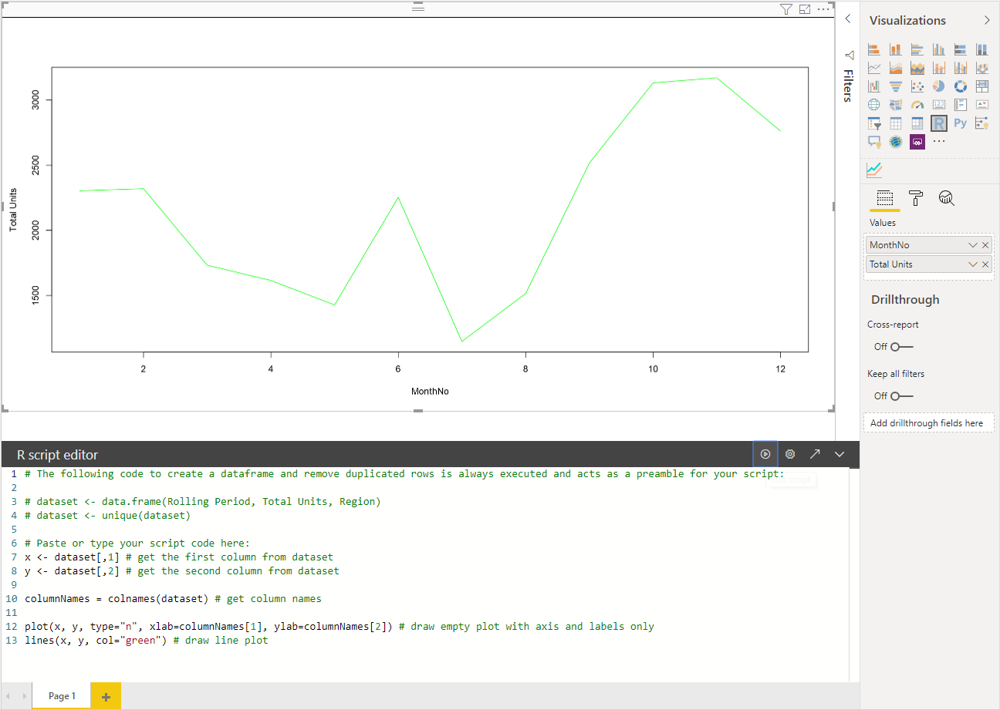
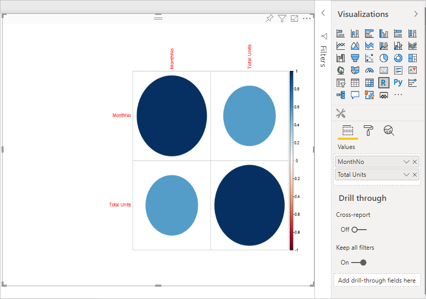

# <a name="tutorial-create-an-r-powered-power-bi-visual"></a>자습서:  R 지원 Power BI 시각적 개체 만들기

이 자습서에서는 Power BI용 R 지원 시각적 개체를 만드는 방법을 설명합니다.

이 자습서에서는 다음 작업을 수행하는 방법을 알아봅니다.

> [!div class="checklist"]
>
> * R 지원 시각적 개체 만들기
> * Power BI Desktop에서 R 스크립트 편집
> * 시각적 개체에 라이브러리 추가
> * 정적 속성 추가

## <a name="prerequisites"></a>필수 조건

* **Power BI Pro** 계정. 시작하기 전에 [무료 평가판에 등록](https://powerbi.microsoft.com/pricing/)하세요.
* R 엔진. [Revolution Open 다운로드 페이지](https://mran.revolutionanalytics.com/download/) 및 [CRAN 리포지토리](https://cran.r-project.org/bin/windows/base/)를 포함한 여러 위치에서 무료로 다운로드할 수 있습니다. 자세한 내용은 [R을 사용하여 Power BI 시각적 개체 만들기](../../desktop-r-visuals.md)를 참조하세요.
* [Power BI Desktop](../../fundamentals/desktop-get-the-desktop.md).
* Windows 사용자의 경우 [Windows PowerShell](https://docs.microsoft.com/powershell/scripting/install/installing-windows-powershell?view=powershell-6) 버전 4 이상, OSX 사용자의 경우 [터미널](https://macpaw.com/how-to/use-terminal-on-mac)

## <a name="getting-started"></a>시작

1. 시각적 개체용 샘플 데이터를 준비합니다. 이러한 값을 Excel 데이터베이스 또는 *.csv* 파일에 저장하고 Power BI Desktop으로 가져올 수 있습니다.

    | MonthNo | 전체 단위 |
    |-----|-----|
    | 1 | 2303 |
    | 2 | 2319 |
    | 3 | 1732 |
    | 4 | 1615 |
    | 5 | 1427 |
    | 6 | 2253 |
    | 7 | 1147 |
    | 8 | 1515 |
    | 9 | 2516 |
    | 10 | 3131 |
    | 11 | 3170 |
    | 12 | 2762 |

1. 시각적 개체를 만들려면 PowerShell 또는 터미널을 열고 다음 명령을 실행합니다.

   ```cmd
   pbiviz new rVisualSample -t rvisual
   ```

   이 명령은 `rvisual` 템플릿을 기반으로 새 폴더 구조를 만듭니다. 이 템플릿에는 다음 R 스크립트를 실행하는 즉시 실행 가능한 기본 R 기반 시각적 개체가 포함되어 있습니다.

   ```r
   plot(Values)
   ```

   `Values` 데이터 프레임에는 `Values` 데이터 역할의 열이 포함됩니다.

1. 시각적 개체의 **Values**에 **MonthNo** 및 **Total units**를 추가하여 데이터를 개발자 시각적 개체에 할당합니다.

   

## <a name="editing-the-r-script"></a>R 스크립트 편집

`pbiviz`를 사용하여 `rvisual` 템플릿을 기반으로 하는 R 지원 시각적 개체를 만드는 경우 시각적 개체의 루트 폴더에 *script.r*이라는 파일이 만들어집니다. 이 파일에는 사용자 대신 이미지를 생성하는 R 스크립트가 들어 있습니다. Power BI Desktop에서 R 스크립트를 만들 수 있습니다.

1. Power BI Desktop에서 **R 스크립트 시각적 개체**를 선택합니다.

   

1. 이 R 코드를 **R 스크립트 편집기**에 붙여넣습니다.

    ```r
    x <- dataset[,1] # get the first column from dataset
    y <- dataset[,2] # get the second column from dataset

    columnNames = colnames(dataset) # get column names

    plot(x, y, type="n", xlab=columnNames[1], ylab=columnNames[2]) # draw empty plot with axis and labels only
    lines(x, y, col="green") # draw line plot
    ```

1. **스크립트 실행** 아이콘을 선택하여 결과를 확인합니다.

    

1. R 스크립트가 준비되면 이전 단계 중 하나에서 만든 시각적 개체 프로젝트의 `script.r` 파일에 복사합니다.

1. *capabilities.json*에서 `dataRoles`의 `name`을 `dataRoles`로 변경합니다. Power BI는 데이터를 R 스크립트 시각적 개체용 `dataset` 데이터 프레임 개체로 전달하지만 R 시각적 개체는 `dataRoles` 이름에 따라 데이터 프레임 이름을 가져옵니다.

    ```json
    {
      "dataRoles": [
        {
          "displayName": "Values",
          "kind": "GroupingOrMeasure",
          "name": "dataRoles"
        }
      ],
      "dataViewMappings": [
        {
          "scriptResult": {
            "dataInput": {
              "table": {
                "rows": {
                  "select": [
                    {
                      "for": {
                        "in": "dataset"
                      }
                    }
                  ],
                  "dataReductionAlgorithm": {
                    "top": {}
                  }
                }
              }
            },
            ...
          }
        }
      ],
    }
    ```

1. *src/visual.ts* 파일에서 이미지 크기 조정을 지원하기 위한 다음 코드를 추가합니다.

    ```typescript
      public onResizing(finalViewport: IViewport): void {
          this.imageDiv.style.height = finalViewport.height + "px";
          this.imageDiv.style.width = finalViewport.width + "px";
          this.imageElement.style.height = finalViewport.height + "px";
          this.imageElement.style.width = finalViewport.width + "px";
      }
    ```

## <a name="add-libraries-to-visual-package"></a>시각적 개체 패키지에 라이브러리 추가

이 절차를 통해 시각적 개체가 `corrplot` 패키지를 사용할 수 있습니다.

1. 시각적 개체에 대한 라이브러리 종속성을 `dependencies.json`에 추가합니다. 파일 내용의 예는 다음과 같습니다.

    ```json
    {
      "cranPackages": [
        {
          "name": "corrplot",
          "displayName": "corrplot",
          "url": "https://cran.r-project.org/web/packages/corrplot/"
        }
      ]
    }
    ```

    `corrplot` 패키지는 상관 관계 행렬의 그래픽 표시입니다. `corrplot`에 대한 자세한 내용은 [corrplot 패키지 소개](https://cran.r-project.org/web/packages/corrplot/vignettes/corrplot-intro.html)를 참조하세요.

1. 이렇게 변경한 후 `script.r` 파일에서 패키지를 사용하기 시작합니다.

    ```r
    library(corrplot)
    corr <- cor(dataset)
    corrplot(corr, method="circle", order = "hclust")
    ```

`corrplot` 패키지를 사용한 결과는 다음 예제와 같습니다.



## <a name="adding-a-static-property-to-the-property-pane"></a>속성 창에 정적 속성 추가

사용자가 UI 설정을 변경할 수 있도록 합니다. 이렇게 하려면 R 스크립트의 사용자 입력 기반 동작을 변경하는 속성을 속성 창에 추가합니다.

`corrplot` 함수의 `method` 인수를 사용하여 `corrplot`를 구성할 수 있습니다. 기본 스크립트는 원을 사용합니다. 사용자가 여러 옵션 중에서 선택할 수 있도록 시각적 개체를 수정합니다.

1. *capabilities.json* 파일에서 개체 및 속성을 정의합니다. 그런 다음 열거형 메서드에 이 개체 이름을 사용하여 속성 창에서 해당 값을 가져옵니다.

    ```json
    {
      "settings": {
      "displayName": "Visual Settings",
      "description": "Settings to control the look and feel of the visual",
      "properties": {
        "method": {
          "displayName": "Data Look",
          "description": "Control the look and feel of the data points in the visual",
          "type": {
            "enumeration": [
              {
                "displayName": "Circle",
                "value": "circle"
              },
              {
                "displayName": "Square",
                "value": "square"
              },
              {
                "displayName": "Ellipse",
                "value": "ellipse"
              },
              {
                "displayName": "Number",
                "value": "number"
              },
              {
                "displayName": "Shade",
                "value": "shade"
              },
              {
                "displayName": "Color",
                "value": "color"
              },
              {
                "displayName": "Pie",
                "value": "pie"
              }
            ]
          }
        }
      }
    }
    ```

1. *src/settings.ts* 파일을 엽니다. 공용 속성 `method`를 사용하여 `CorrPlotSettings` 클래스를 만듭니다. 형식은 `string`이며 기본값은 `circle`입니다. 기본값을 사용하여 `settings` 속성을 `VisualSettings` 클래스에 추가합니다.

    ```typescript
    "use strict";

    import { dataViewObjectsParser } from "powerbi-visuals-utils-dataviewutils";
    import DataViewObjectsParser = dataViewObjectsParser.DataViewObjectsParser;

    export class VisualSettings extends DataViewObjectsParser {
      public rcv_script: rcv_scriptSettings = new rcv_scriptSettings();
      public settings: CorrPlotSettings = new CorrPlotSettings();
    }

    export class CorrPlotSettings {
      public method: string = "circle";
    }

    export class rcv_scriptSettings {
      public provider;
      public source;
    }
    ```

    이러한 단계를 수행한 후에는 시각적 개체의 속성을 변경할 수 있습니다.

   

    마지막으로 R 스크립트는 반드시 속성으로 시작해야 합니다. 사용자가 속성을 변경하지 않는 경우 시각적 개체는 이 속성의 값을 가져오지 않습니다.

    속성에 대한 R 런타임 변수의 경우 명명 규칙은 `<objectname>_<propertyname>`입니다(이 경우 `settings_method`).

1. 다음 코드와 일치하도록 시각적 개체의 R 스크립트를 변경합니다.

    ```r
    library(corrplot)
    corr <- cor(dataset)

    if (!exists("settings_method"))
    {
        settings_method = "circle";
    }

    corrplot(corr, method=settings_method, order = "hclust")
    ```

최종 시각적 개체는 다음 예제와 같습니다.


## <a name="next-steps"></a>다음 단계

R 지원 시각적 개체에 대해 자세히 알아보려면 [Power BI에서 R 지원 Power BI 시각적 개체 사용](../../desktop-r-powered-custom-visuals.md)을 참조하세요.

Power BI Desktop의 R 지원 시각적 개체에 대한 자세한 내용은 [R을 사용하여 Power BI 시각적 개체 만들기](../../desktop-r-visuals.md)를 참조하세요.
